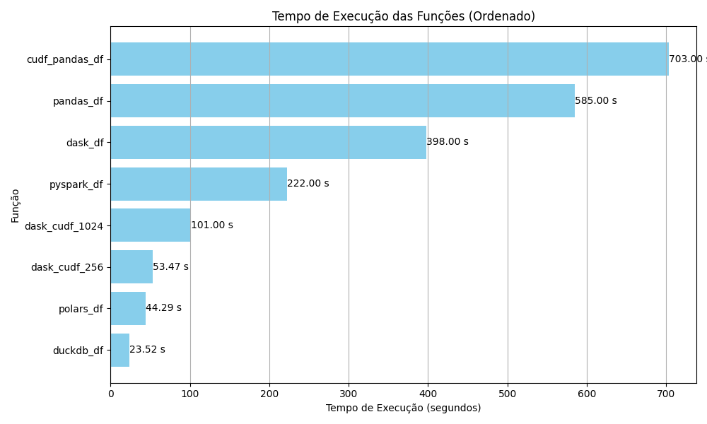

# Projeto 01 - Um Bilhão de Linhas: Desafio de Processamento de Dados com Python



## Introdução

O objetivo deste projeto é demonstrar como processar eficientemente um arquivo de dados massivo contendo 1 bilhão de linhas (~14GB), especificamente para calcular estatísticas (Incluindo agregação e ordenação que são operações pesadas) utilizando Python. 

Este desafio foi inspirado no [The One Billion Row Challenge](https://github.com/gunnarmorling/1brc), originalmente proposto para Java, foi adaptado para o [bootcamp da jornada de dados 2024](https://www.jornadadedados2024.com.br/workshops)

O arquivo de dados consiste em medições de temperatura de várias cidades(dados ficticios). Cada registro segue o formato `<string: nome da cidade>;<double: temperatura>`, com a temperatura sendo apresentada com precisão de uma casa decimal.

Aqui estão dez linhas de exemplo do arquivo:

```
Hamburg;12.0
Bulawayo;8.9
Palembang;38.8
St. Johns;15.2
Cracow;12.6
Bridgetown;26.9
Istanbul;6.2
Roseau;34.4
Conakry;31.2
Istanbul;23.0
```

O desafio é desenvolver um programa Python capaz de ler esse arquivo e calcular a temperatura mínima, média e máxima para cada cidade, exibindo os resultados em uma tabela ordenada por nome da Cidade.

| city      | min_temperature | mean_temperature | max_temperature |
|--------------|-----------------|------------------|-----------------|
| Abha         | -31.1           | 18.0             | 66.5            |
| Abidjan      | -25.9           | 26.0             | 74.6            |
| Abéché       | -19.8           | 29.4             | 79.9            |
| Accra        | -24.8           | 26.4             | 76.3            |
| Addis Ababa  | -31.8           | 16.0             | 63.9            |
| ...          | ...             | ...              | ...             |
| Zagreb       | -39.2           | 10.7             | 58.1            |
| Zanzibar City| -26.5           | 26.0             | 75.2            |
| Zürich       | -42.0           | 9.3              | 63.6            |
| Ürümqi       | -42.1           | 7.4              | 56.7            |
| İzmir        | -34.4           | 17.9             | 67.9            |


## Sobre:

Abaixo um índice como todas as etapas para resolução do projeto, desde informações sobre as configurações desktop, sobre a memória, ssd, como gerar os dados, dependências e o resultado do tempo de execução de cada script utilizados.

## índice

<a id="voltar"></a>

**[Como Replicar esse projeto](#ancora13)**
1.  **[Decoradores](#ancora01)**
2.  **[Scripts para gerar os dados.](#ancora02)**
3.  **[Pandas  - min, max e mean em 1 bilhão de linhas](#ancora03)**
4.  **[Polars  - min, max e mean em 1 bilhão de linhas](#ancora04)**
5.  **[Duckdb  - min, max e mean em 1 bilhão de linhas](#ancora05)**
6.  **[Dask    - min, max e mean em 1 bilhão de linhas](#ancora06)**
7.  **[Pyspark - min, max e mean em 1 bilhão de linhas](#ancora07)**
8.  **[Vaex    - min, max e mean em 1 bilhão de linhas](#ancora08)**
9.  **[Cudf com pandas via GPU - min, max e mean em 1 bilhão de linhas](#ancora09)**
10. **[Dask_cudf com GPU - min, max e mean em 1 bilhão de linhas](#ancora10)**
11. **[Gerando um Gráfico dos Resultados](#ancora11)**
12. **[Conclusão](#ancora12)**


<a id="ancora13"></a>
## Como Replicar:

#### Pré-requisitos:

* **Pyenv**: É usado para gerenciar versões do Python. [Instruções de instalação do Pyenv](https://github.com/pyenv/pyenv#installation).

* **Poetry**: Este projeto utiliza Poetry para gerenciamento de dependências. [Instruções de instalação do Poetry](https://python-poetry.org/docs/#installation).


#### Siga os passos abaixo:

- Crie uma pasta:

```bash
$ mkir meus_projetos
```

- Acesse a pasta criada:

```bash
$ cd meus_projetos
```

- Clone o repositório

```bash
$ git clone https://github.com/Jcnok/bootcamp-jornada-de-dados_2024.git
```

- Acesse a pasta do repositório que foi clonado:

```bash
$ cd bootcamp-jornada-de-dados_2024/
```

- Verifique e se necessário configure a versão do python 3.10.13 para esta pasta:

```bash
$ pyenv local # para conferir
$ pyenv local 3.10.3 #para configurar se preciso.
```

- Instale todas as dependências com poetry:

```bash
$ poetry install
```

- Acesse a pasta aula_05:

```bash
$ cd aula_05
```

- delete o arquivo ‘/data/tempos_execucao.csv’ para que possa ser criado um novo arquivo de tempo de execução:

```bash
$ rm data/tempos_execucao.csv
```

- Ative o ambiente virtual que foi criado com o poetry:

```bash
$ poetry shell
```

- Crie o arquivo com 1 bilhão de linhas:

obs: o arquivo será criado na pasta `data\measurements.txt` vai ser necessário 15gb de espaço e dependendo da máquina pode demorar, na minha máquina foram cerca de 15 minutos.

```bash
$ python src/data_generate.py
```

- Agora basta executar os scripts conforme abaixo:

```bash
$ python src/polars_df.py      # +- 40 segundos
$ python src/pandas_df.py      # +- 10 minutos
$ python src/vaex_df.py        # o script não suportou 1 bilhão
$ python src/pyspark_df.py     # +- 4 minutos
$ python src/duckdb_df.py      # +- 35 segundos**
$ python src/dask_df.py        # +- 7 minutos
```

#### Caso possua uma GPU compatível siga os passos abaixo:

* **[Cudf com pandas via GPU](#ancora09)**

* **[Dask_cudf com GPU](#ancora10)**

#### Após as devidas verificações/instalações:

```bash
$ python src/cudf_pandas_df.py # +- 14 minutos
$ python src/dask_cudf_1024.py # +- 2 minutos
$ python src/dask_cudf_256.py  # +- 1 minuto
```

#### Você ainda pode executar todo o passo a passo utilizando o jupyter notebook:
```bash
$ cd notebooks/
$ jupyter lab
```

* **Com o jupyter lab aberto abra a 'aula_05.ipynb' e execute as celulas na sequência...**


```python
import os
```

* **Selecionando a pasta Aula_05 para iniciar e criar os scritps.**


```python
# Conferir e selecionar a pasta raiz do projeto.
os.getcwd()
os.chdir('/home/jcnok/bootcamps/mytests/meus_projetos/bootcamp-jornada-de-dados_2024/aula_05')
os.getcwd()
```


    '/home/jcnok/bootcamps/mytests/meus_projetos/bootcamp-jornada-de-dados_2024/aula_05'


[voltar](#voltar)

<a id="ancora01"></a>
## Decoradores

**O decorator timer serve para medir o tempo de execução de uma função e registrar o resultado em um arquivo CSV. Ele também imprime o tempo de execução no console.**

**Porquê usar decorators?**
* Nesse exemplo precisamos medir o tempo de cada uma das funções que serão criadas para determinar a melhor performance, dessa forma podemos criar uma função mais limpa e organizada onde iremos chamar o decorator para exibir e registrar as informações do tempo de execução da cada uma das funções, isso evita a duplicidade de código.

* Funcionalidades:

    - Mede o tempo de execução da função decorada.
    - Formata o tempo em horas, minutos e segundos.
    - Registra o nome da função e o tempo de execução em um arquivo CSV chamado tempos_execucao.csv.
    - Imprime o nome da função e o tempo de execução no console.
* Vantagens de usar decorators:

    - Códigos mais concisos e reutilizáveis.
    - Evita a duplicação de código para medição de tempo.
    - Facilita a comparação do tempo de execução de diferentes funções.
    - Permite a criação de logs de performance.

* **Decorator para salvar os resultado em um csv**.


```python
# %%writefile src/utils/decorators.py 
#decorator para registrar o tempo de execução da função em um .csv
import time
import csv
import threading


def timer_to_csv(func):
    def format_time(segundos: int):
        """
        Formata os milisegundos em hora:minuto:segundo
        """
        if segundos < 60:
            return f"{segundos:.3f} segundos"
        elif segundos < 3600:
            minutos, segundos = divmod(segundos, 60)
            return f"{int(minutos)} minutos {int(segundos)} segundos"
        else:
            horas, remainder = divmod(segundos, 3600)
            minutos, segundos = divmod(remainder, 60)
            if minutos == 0:
                return f"{int(horas)} horas {int(segundos)} segundos"
            else:
                return f"{int(horas)} horas {int(minutos)} minutos {int(segundos)} segundos"

    def print_elapsed_time(start_time, finished_flag):
        while not finished_flag.is_set():
            elapsed_time = time.time() - start_time
            print(f"Tempo decorrido: {format_time(elapsed_time)}", end="\r")
            time.sleep(1)  # Atualiza a cada segundo

    def wrapper(*args, **kwargs):
        start_time = time.time()

        # Inicializa um sinalizador booleano para indicar se a função terminou
        finished_flag = threading.Event()

        # Iniciar uma thread para imprimir o tempo decorrido em tempo real
        thread = threading.Thread(target=print_elapsed_time, args=(start_time, finished_flag))
        thread.start()

        result = func(*args, **kwargs)
        elapsed_time = time.time() - start_time
        print(f"Tempo total de execução: {format_time(elapsed_time)}")

        # Sinaliza que a função terminou
        finished_flag.set()

        # Salvando o nome da função e o tempo de execução em um arquivo CSV
        with open('data/tempos_execucao.csv', 'a', newline='') as csvfile:
            writer = csv.writer(csvfile)
            writer.writerow([func.__name__, format_time(elapsed_time)])

        return result

    return wrapper


```

[voltar](#voltar)

<a id="ancora02"></a>
## Scripts para gerar os dados.

### Script utilizando Pandas - not suport 1billion rows


```python
# Instalação da lib Pandas;
!poetry add pandas -q
```


```python
%%time
import pandas as pd
import random


def generate_data(num_rows):
    """
    Gera dados aleatórios de temperatura para cidades e salva em um arquivo CSV.

    Args:
        num_rows (int): Número de linhas desejadas para o DataFrame.

    Returns:
        None
    """
    # Amostrar aleatoriamente os nomes das cidades existentes
    city_names = pd.read_csv('data/weather_stations.csv', sep=';', header=None,
                             skiprows=2, usecols=[0]).sample(num_rows, replace=True).iloc[:, 0].tolist()

    # Gerar temperaturas aleatórias
    temperatures = [round(random.uniform(-89.2, 56.7), 1) for _ in range(num_rows)]

    # Criar um DataFrame pandas com os dados gerados
    df = pd.DataFrame({'city': city_names, 'temperature': temperatures})

    # Salvar o DataFrame em um arquivo CSV
    df.to_csv('data/measurements_pandas.txt', sep=';', header=False, index=False)

    # salvar o valor da quantidade de linhas solicitada
    with open('data/num_rows.txt', 'w') as file:
        # Escrever o valor no arquivo
        file.write(str(num_rows))


if __name__ == "__main__":
    num_rows = int(input("Digite a quantidade de linhas desejadas: "))
    generate_data(num_rows)

```

    Digite a quantidade de linhas desejadas:  10000000


    CPU times: user 27 s, sys: 1.83 s, total: 28.8 s
    Wall time: 33.2 s


* **Obs:**
* Foram gerados 10 milhões de linhas para nossos primeiros testes.

[voltar](#voltar)

### Scrip python para gerar dados aleatórios
* **O script foi retirado do desafio [The One Billion Row Challenge](https://github.com/gunnarmorling/1brc), originalmente proposto para Java.**
* **Algumas alterações foram realizadas, como por exemplo a temp máxima e mínima foram alterados para valores históricos reais.**


```python
%%writefile src/utils/data_generate.py
# Script para gerar 1 bilhão de linhas com dados aleatórios.
# Based on https://github.com/gunnarmorling/1brc/blob/main/src/main/java/dev/morling/onebrc/Createtempments.java

import os
import sys
import random
import time


def check_args(file_args):
    """
    Sanity checks out input and prints out usage if input is not na positive integer
    """
    try:
        if len(file_args) != 2 or int(file_args[1]) <= 0:
            raise Exception()
    except:
        print("Usage:  create_tempments.sh <positive integer number of records to create>")
        print("        You can use underscore notation for large number of records.")
        print("        For example:  1_000_000_000 for one billion")
        exit()


def build_weather_city_name_list():
    """
    Grabs the weather city names from example data provided in repo and dedups
    """    
    city_names = []
    with open('../data/weather_stations.csv', 'r') as file: 

        file_contents = file.read()
    for city in file_contents.splitlines():
        if "#" in city:
            next
        else:
            city_names.append(city.split(';')[0])
    return list(set(city_names))


def convert_bytes(num):
    """
    Convert bytes to a human-readable format (e.g., KiB, MiB, GiB)
    """
    for x in ['bytes', 'KiB', 'MiB', 'GiB']:
        if num < 1024.0:
            return "%3.1f %s" % (num, x)
        num /= 1024.0


def format_elapsed_time(seconds):
    """
    Format elapsed time in a human-readable format
    """
    if seconds < 60:
        return f"{seconds:.3f} seconds"
    elif seconds < 3600:
        minutes, seconds = divmod(seconds, 60)
        return f"{int(minutes)} minutes {int(seconds)} seconds"
    else:
        hours, remainder = divmod(seconds, 3600)
        minutes, seconds = divmod(remainder, 60)
        if minutes == 0:
            return f"{int(hours)} hours {int(seconds)} seconds"
        else:
            return f"{int(hours)} hours {int(minutes)} minutes {int(seconds)} seconds"


def estimate_file_size(weather_city_names, num_rows_to_create):
    """
    Tries to estimate how large a file the test data will be
    """
    total_name_bytes = sum(len(s.encode("utf-8")) for s in weather_city_names)
    avg_name_bytes = total_name_bytes / float(len(weather_city_names))

    # avg_temp_bytes = sum(len(str(n / 10.0)) for n in range(-999, 1000)) / 1999
    avg_temp_bytes = 4.400200100050025

    # add 2 for separator and newline
    avg_line_length = avg_name_bytes + avg_temp_bytes + 2

    human_file_size = convert_bytes(num_rows_to_create * avg_line_length)

    return f"Estimated max file size is:  {human_file_size}."


def build_test_data(weather_city_names, num_rows_to_create):
    """
    Generates and writes to file the requested length of test data
    """
    start_time = time.time()
    coldest_temp = -89.2
    hottest_temp = 56.7
    city_names_10k_max = random.choices(weather_city_names, k=10_000)
    batch_size = 10000 # instead of writing line by line to file, process a batch of citys and put it to disk
    chunks = num_rows_to_create // batch_size
    print('Building test data...')

    try:
        with open("../data/measurements.txt", 'w') as file:
            progress = 0
            for chunk in range(chunks):
                
                batch = random.choices(city_names_10k_max, k=batch_size)
                prepped_deviated_batch = '\n'.join([f"{city};{random.uniform(coldest_temp, hottest_temp):.1f}" for city in batch]) # :.1f should quicker than round on a large scale, because round utilizes mathematical operation
                file.write(prepped_deviated_batch + '\n')

                
                # Update progress bar every 1%
                if (chunk + 1) * 100 // chunks != progress:
                    progress = (chunk + 1) * 100 // chunks
                    bars = '=' * (progress // 2)
                    sys.stdout.write(f"\r[{bars:<50}] {progress}%")
                    sys.stdout.flush()
        sys.stdout.write('\n')
    except Exception as e:
        print("Something went wrong. Printing error info and exiting...")
        print(e)
        exit()
    
    end_time = time.time()
    elapsed_time = end_time - start_time
    file_size = os.path.getsize("../data/measurements.txt")
    human_file_size = convert_bytes(file_size)
 
    print("Test data successfully written to data/measurements.txt")
    print(f"Actual file size:  {human_file_size}")
    print(f"Elapsed time: {format_elapsed_time(elapsed_time)}")


def main():
    """
    main program function
    """
    num_rows_to_create = 1_000_000_000
    weather_city_names = []
    weather_city_names = build_weather_city_name_list()
    print(estimate_file_size(weather_city_names, num_rows_to_create))
    build_test_data(weather_city_names, num_rows_to_create)
    print("Test data build complete.")


if __name__ == "__main__":
    main()
exit()

```

    Writing src/utils/data_generate.py


#### Como executar o script pelo terminal:
 

$`python src/utils/data_generate.py`#para criar os dados na pasta 'data/mesurements.txt'

* **obs**: O script depende do arquivo 'data/weather_stations.csv' para gerar os dados das cidades.


* **Agora com os dados de 1 bilhao gerados vamos ver quem se sai melhor para as configuracoes da minha maquina**.

[voltar](#voltar)

<a id="ancora03"></a>
## Pandas - min, max e mean em 1 bilhão de linhas


```python
# Instalando a lib pandas.
!poetry add pandas tabulate -q
```

### Documentação do Script Python: Calculando Mínimo, Máximo e Média para um Bilhão de Linhas

Este script calcula a temperatura mínima, máxima e média para cada cidade em um grande conjunto de dados contendo um bilhão de linhas. Ele utiliza as bibliotecas Pandas, multiprocessing e tqdm.

**Funcionalidade:**

1. **Leitura de dados:** 
    * Lê dados de um arquivo CSV (`data/measurements.txt`) com colunas nomeadas `cidade` e `temp`.
    * Emprega fragmentação para processar os dados em partes menores e gerenciáveis.

2. **Processamento paralelo:**
    * Aproveita o multiprocessing para distribuir a carga de trabalho entre os núcleos de CPU disponíveis.
    * Cada fragmento é processado independentemente pela função `process_chunk`.

3. **Agregação:**
    * Dentro de cada fragmento, a função `process_chunk` usa Pandas para:
        * Agrupar dados por `cidade`.
        * Calcular o `max`, `min` e `mean` da coluna `temp`.
        * Redefinir o índice para obter um DataFrame limpo.

4. **Agregação de resultados:**
    * Resultados de fragmentos individuais são concatenados em um único DataFrame.
    * Uma agregação final é realizada para calcular o `max`, `min` e `mean` geral para cada cidade.
    * O DataFrame final é classificado por `cidade`.

5. **Visualização do progresso:**
    * A biblioteca tqdm fornece uma barra de progresso para visualizar o processamento dos fragmentos.

**Principais características:**

* **Processamento eficiente de grandes conjuntos de dados:** A fragmentação e o multiprocessing permitem lidar com dados massivos com eficiência.
* **Desempenho otimizado:** A utilização de vários núcleos reduz significativamente o tempo de processamento.

**Observações:**

* Certifique-se de que a variável `filename` aponte para o local correto do arquivo de dados `data/measurements.txt`.
* Ajuste `chunksize` dependendo da memória do seu sistema e dos recursos de processamento.

**Documentação**: [Pandas](https://pandas.pydata.org/docs/)

**Como executar o script:**

1. **Terminal Bash digite:** `cd aula_05`
2. **Execute o script:** Digite o seguinte comando e pressione Enter: 
```bash
python src/pandas_df.py


```python
!python src/pandas_df.py
```

    Iniciando o processamento do arquivo.
    Tempo total de execução: 9 minutos 45 segundos
                   city   max   min   mean
    0          A Coruña  56.7 -89.2 -16.32
    1          Aabenraa  56.7 -89.2 -16.47
    2             Aalen  56.7 -89.2 -16.37
    3          Aarschot  56.7 -89.2 -16.03
    4        Aartselaar  56.7 -89.2 -16.34
    ...             ...   ...   ...    ...
    8898         ‘Aqrah  56.7 -89.2 -16.31
    8899  ‘Ayn al ‘Arab  56.7 -89.2 -16.09
    8900          ‘Ibrī  56.7 -89.2 -16.42
    8901     ’Aïn Arnat  56.7 -89.2 -16.31
    8902      ’Aïn Roua  56.7 -89.2 -16.15
    
    [8903 rows x 4 columns]


### Script Pandas_df:


```python
%%writefile src/pandas_df.py
#pandas => script para caluclar min, max e mean em um bilhão de linhas.
import pandas as pd 
from multiprocessing import Pool, cpu_count
from utils.config import PATH, NUM_ROWS
from utils.decorators import timer_to_csv  

CONCURRENCY = cpu_count()

def get_total_lines(num_rows_path):
    with open(num_rows_path, 'r') as f:
        total_lines = f.read()
    return int(total_lines)

def process_chunk(chunk):
    # Agrega os dados dentro do chunk usando Pandas
    aggregated = chunk.groupby('city')['temp'].agg(['max','min','mean']).reset_index()
    return aggregated

@timer_to_csv  # Aplica o decorador
def pandas_df(filename, num_rows_path):
    total_linhas = get_total_lines(num_rows_path)
    chunksize = total_linhas // 200 + (1 if total_linhas % 10 else 0)  # Define o tamanho do chunk
    with pd.read_csv(filename, sep=';', header=None, names=['city', 'temp'], chunksize=chunksize) as reader:
        with Pool(CONCURRENCY) as pool:
            results = []
            for result in pool.imap(process_chunk, reader):
                results.append(result)

    final_df = pd.concat(results, ignore_index=True)

    final_aggregated_df = final_df.groupby('city').agg({
        'max': 'max',
        'min': 'min',
        'mean': 'mean'
        
    }).reset_index().round(2).sort_values('city')

    return final_aggregated_df

if __name__ == "__main__":    
    print("Iniciando o processamento do arquivo.")
    num_rows_path= NUM_ROWS
    filename = PATH     
    df = pandas_df(filename, num_rows_path)
    #print(tabulate(df, headers='keys', tablefmt='pretty'))
    print(df)    
```

    Overwriting src/pandas_df.py


[voltar](#voltar)

<a id="ancora04"></a>
## Polars - min, max e mean em 1 bilhão de linhas


```python
# Instalando a lib polars
!poetry add polars -q
```

### Documentação do Script `polars_df.py`

Este script Python utiliza a biblioteca Polars para calcular de forma eficiente a temperatura mínima, máxima e média para cada cidade em um conjunto de dados grande (por exemplo, um bilhão de linhas). 

**Funcionalidade:**

1. **Importações:**
    * Importa a função `timer_to_csv` do módulo `utils.decorators`. 
    * Importa a biblioteca `polars` como `pl`.

2. **Configuração do Polars:**
    * Define o tamanho do chunk para processamento de streaming como 100.000 linhas usando `pl.Config.set_streaming_chunk_size(100000)`. Isso otimiza o uso de memória ao lidar com grandes conjuntos de dados.

3. **Função `polars_df()`:**
    * Esta função é decorada com `@timer_to_csv`, que mede o tempo de execução e salva os resultados em um arquivo CSV.
    * Lê o arquivo CSV `data/measurements.txt` com as seguintes características:
        * Separador: `;`
        * Sem cabeçalho (`has_header=False`)
        * Esquema de colunas: `{"city": pl.String, "temp": pl.Float64}`
    * Agrupa os dados por `city`.
    * Calcula as seguintes estatísticas para cada cidade:
        * Temperatura máxima (`max_temp`)
        * Temperatura mínima (`min_temp`)
        * Temperatura média (`mean_temp`)
    * Ordena os resultados por `city`.
    * Coleta os resultados em um DataFrame Polars usando `collect(streaming=True)` para processamento eficiente de grandes conjuntos de dados.
    * Retorna o DataFrame Polars resultante.

4. **Execução principal:**
    * Se o script for executado diretamente (e não importado como um módulo), a função `polars_df()` é chamada e o DataFrame resultante é impresso no console.

**Principais características:**

* **Processamento eficiente de grandes conjuntos de dados:** O Polars é otimizado para lidar com grandes conjuntos de dados, utilizando processamento em chunks e técnicas eficientes de gerenciamento de memória.
* **Sintaxe expressiva:** A API do Polars permite realizar a análise de dados de forma concisa e legível.
* **Desempenho:** O Polars é frequentemente mais rápido que o Pandas, especialmente em grandes conjuntos de dados.

**Documentação:** [Polars](https://docs.pola.rs/#philosophy)

Este script demonstra como o Polars pode ser usado para processar grandes conjuntos de dados de forma eficiente e calcular estatísticas básicas. 

**Como executar o script:**

1. **Terminal Bash digite:** `cd aula_05`
2. **Execute o script:** Digite o seguinte comando e pressione Enter: 
```bash
python src/polars_df.py


```python
!python src/polars_df.py
```

    Tempo total de execução: 44.287 segundos
    shape: (8_903, 4)
    ┌───────────────┬──────────┬──────────┬────────────┐
    │ city          ┆ max_temp ┆ min_temp ┆ mean_temp  │
    │ ---           ┆ ---      ┆ ---      ┆ ---        │
    │ str           ┆ f64      ┆ f64      ┆ f64        │
    ╞═══════════════╪══════════╪══════════╪════════════╡
    │ A Coruña      ┆ 56.7     ┆ -89.2    ┆ -16.32501  │
    │ Aabenraa      ┆ 56.7     ┆ -89.2    ┆ -16.461449 │
    │ Aalen         ┆ 56.7     ┆ -89.2    ┆ -16.367746 │
    │ Aarschot      ┆ 56.7     ┆ -89.2    ┆ -16.028291 │
    │ Aartselaar    ┆ 56.7     ┆ -89.2    ┆ -16.336842 │
    │ …             ┆ …        ┆ …        ┆ …          │
    │ ‘Aqrah        ┆ 56.7     ┆ -89.2    ┆ -16.31633  │
    │ ‘Ayn al ‘Arab ┆ 56.7     ┆ -89.2    ┆ -16.092674 │
    │ ‘Ibrī         ┆ 56.7     ┆ -89.2    ┆ -16.423088 │
    │ ’Aïn Arnat    ┆ 56.7     ┆ -89.2    ┆ -16.309803 │
    │ ’Aïn Roua     ┆ 56.7     ┆ -89.2    ┆ -16.148495 │
    └───────────────┴──────────┴──────────┴────────────┘


### Script Polars_df.py


```python
%%writefile src/polars_df.py
# Polars => script para caluclar min, max e mean em um bilhão de linhas.
from utils.decorators import timer_to_csv
from utils.config import PATH, NUM_ROWS
import polars as pl

def get_total_lines(num_rows_path):
    with open(num_rows_path, 'r') as f:
        total_lines = f.read()
    return int(total_lines)

@timer_to_csv
def polars_df(filename, num_rows_path):
    total_linhas = get_total_lines(num_rows_path)
    chunksize = total_linhas // 200 + (1 if total_linhas % 10 else 0)  # Define o tamanho do chunk

    pl.Config.set_streaming_chunk_size(chunksize)

    # Leitura do arquivo CSV e definição do schema
    return (pl.scan_csv(filename, separator=";", has_header=False,
                        schema={"city": pl.String, "temp": pl.Float64})
                        .group_by("city").agg(
                                                 max_temp=pl.col("temp").max(),
                                                 min_temp=pl.col("temp").min(),
                                                 mean_temp=pl.col("temp").mean()
                                                ).sort("city").collect(streaming=True)
           )

if __name__ == "__main__":  
    num_rows_path= NUM_ROWS
    filename = PATH 
    df = polars_df(filename, num_rows_path)
    print(df)
```

    Overwriting src/polars_df.py


[voltar](#voltar)

<a id="ancora05"></a>
## Duckdb - min, max e mean em 1 bilhão de linhas


```python
!poetry add duckdb -q
```

### Documentação do Script `duckdb_df.py`

Este script Python utiliza a biblioteca DuckDB para calcular de forma eficiente a temperatura mínima, máxima e média para cada cidade em um conjunto de dados grande (por exemplo, um bilhão de linhas). 

**Funcionalidade:**

1. **Importações:**
    * Importa a função `timer_to_csv` do módulo `utils.decorators`. 
    * Importa a biblioteca `duckdb`.

2. **Função `duckdb_df()`:**
    * Esta função é decorada com `@timer_to_csv`, que mede o tempo de execução e salva os resultados em um arquivo CSV.
    * Executa uma consulta SQL no DuckDB para:
        * Ler o arquivo CSV `data/measurements.txt` com as seguintes características:
            * Detecção automática de tipo de dados desativada (`AUTO_DETECT=FALSE`)
            * Separador: `;`
            * Colunas: `city` (VARCHAR) e `temp` (DECIMAL)
        * Agrupar os dados por `city`.
        * Calcular as seguintes estatísticas para cada cidade:
            * Temperatura máxima (`max_temp`)
            * Temperatura mínima (`min_temp`)
            * Temperatura média (`mean_temp`) - convertida para DECIMAL
        * Ordenar os resultados por `city`.
    * Exibe os resultados da consulta no console.

3. **Execução principal:**
    * Se o script for executado diretamente (e não importado como um módulo), a função `duckdb_df()` é chamada.

**Documentação:** [Duckdb](https://duckdb.org/docs/)

**Como executar o script:**

1. **Terminal Bash digite:** `cd aula_05`
2. **Execute o script:** Digite o seguinte comando e pressione Enter: 
```bash
python src/duckdb_df.py


```python
!python src/duckdb_df.py
```

                   city  max_temp  min_temp  mean_temp
    0          A Coruña      56.7     -89.2    -16.325
    1          Aabenraa      56.7     -89.2    -16.461
    2             Aalen      56.7     -89.2    -16.368
    3          Aarschot      56.7     -89.2    -16.028
    4        Aartselaar      56.7     -89.2    -16.337
    ...             ...       ...       ...        ...
    8898         ‘Aqrah      56.7     -89.2    -16.316
    8899  ‘Ayn al ‘Arab      56.7     -89.2    -16.093
    8900          ‘Ibrī      56.7     -89.2    -16.423
    8901     ’Aïn Arnat      56.7     -89.2    -16.310
    8902      ’Aïn Roua      56.7     -89.2    -16.148
    
    [8903 rows x 4 columns]
    Tempo total de execução: 23.520 segundos


### Script Duck_db:


```python
%%writefile src/duckdb_df.py
# Duckdb => script para caluclar min, max e mean.
from utils.decorators import timer_to_csv
from utils.config import PATH
import duckdb

@timer_to_csv
def duckdb_df(filename):
    conn = duckdb.connect(':memory:')
    query = f"""
            SELECT city,
                MAX(temp) AS max_temp,
                MIN(temp) AS min_temp,
                CAST(AVG(temp) AS DECIMAL()) AS mean_temp                
            FROM read_csv("{filename}", AUTO_DETECT=FALSE, sep=';', columns={{'city':VARCHAR, 'temp': 'DECIMAL'}})
            GROUP BY city
            ORDER BY city
        """
    print(conn.execute(query).df())

if __name__ == "__main__":
    filename = PATH 
    duckdb_df(filename) 

```

    Overwriting src/duckdb_df.py


[voltar](#voltar)

<a id="ancora06"></a>
## Dask - min, max e mean em 1 bilhão de linhas


```python
#necessário Instalar.
!poetry add dask-expr -q
```

### Documentação do Script Dask:

**Descrição:**

Este script demonstra como calcular a temperatura mínima, máxima e média para cada cidade em um conjunto de dados massivo contendo um bilhão de linhas. Ele utiliza as bibliotecas Dask para otimizar o processamento e fornecer uma experiência interativa.

**Funcionalidade:**

**1. Leitura de dados:**

* Lê dados de um arquivo CSV (`data/measurements.txt`) com colunas nomeadas `city` e `temp`.
* Emprega a biblioteca Dask para ler o arquivo em um DataFrame particionado, permitindo processamento eficiente em grandes conjuntos de dados.

**2. Processamento paralelo:**

* O Dask gerencia o particionamento e o processamento paralelo do DataFrame em diferentes threads ou processos.
* Cada partição é processada independentemente pela função `process_chunk`.

**3. Agregação:**

* Dentro de cada partição, a função `process_chunk` usa Pandas para:
    * Agrupar dados por `city`.
    * Calcular o `max`, `min` e `mean` da coluna `temp`.
    * Redefinir o índice para obter um DataFrame limpo.

**4. Agregação de resultados:**

* Os resultados de cada partição são combinados em um único DataFrame.
* Uma agregação final é realizada para calcular o `max`, `min` e `mean` geral para cada cidade.
* O DataFrame final é ordenado por `city`.

**Características:**

* **Processamento eficiente de grandes conjuntos de dados:** O Dask permite lidar com dados massivos de forma eficiente e escalável.
* **Desempenho otimizado:** O processamento paralelo em partições reduz significativamente o tempo de processamento.

**Observações:**

* Certifique-se de que a variável `filename` aponte para o local correto do arquivo de dados `data/measurements.txt`.
* Ajuste o tamanho da partição (`chunksize`) de acordo com a memória do seu sistema e os recursos de processamento.
* Se necessário, configure o Dask para usar um cluster de computação para aumentar ainda mais o desempenho.

**Documentação:** [Dask](https://docs.dask.org/en/stable/)

**Execução:**

1. **Navegue até o diretório do script:** `cd aula_05`
2. **Execute o script:** `python src/dask_df.py`


```python
!python src/dask_df.py
```

    Traceback (most recent call last):
      File "/home/jcnok/bootcamps/mytests/meus_projetos/bootcamp-jornada-de-dados_2024/.venv/lib/python3.10/site-packages/dask/dataframe/__init__.py", line 10, in _dask_expr_enabled
        import dask_expr  # noqa: F401
      File "/home/jcnok/bootcamps/mytests/meus_projetos/bootcamp-jornada-de-dados_2024/.venv/lib/python3.10/site-packages/dask_expr/__init__.py", line 3, in <module>
        from dask_expr import _version, datasets
      File "/home/jcnok/bootcamps/mytests/meus_projetos/bootcamp-jornada-de-dados_2024/.venv/lib/python3.10/site-packages/dask_expr/datasets.py", line 6, in <module>
        from dask.dataframe.utils import pyarrow_strings_enabled
      File "/home/jcnok/bootcamps/mytests/meus_projetos/bootcamp-jornada-de-dados_2024/.venv/lib/python3.10/site-packages/dask/dataframe/utils.py", line 20, in <module>
        from dask.dataframe import (  # noqa: F401 register pandas extension types
      File "/home/jcnok/bootcamps/mytests/meus_projetos/bootcamp-jornada-de-dados_2024/.venv/lib/python3.10/site-packages/dask/dataframe/methods.py", line 34, in <module>
        from dask.dataframe.utils import is_dataframe_like, is_index_like, is_series_like
    ImportError: cannot import name 'is_dataframe_like' from partially initialized module 'dask.dataframe.utils' (most likely due to a circular import) (/home/jcnok/bootcamps/mytests/meus_projetos/bootcamp-jornada-de-dados_2024/.venv/lib/python3.10/site-packages/dask/dataframe/utils.py)
    
    During handling of the above exception, another exception occurred:
    
    Traceback (most recent call last):
      File "/home/jcnok/bootcamps/mytests/meus_projetos/bootcamp-jornada-de-dados_2024/aula_05/src/dask_df.py", line 6, in <module>
        import dask.dataframe as dd
      File "/home/jcnok/bootcamps/mytests/meus_projetos/bootcamp-jornada-de-dados_2024/.venv/lib/python3.10/site-packages/dask/dataframe/__init__.py", line 16, in <module>
        if _dask_expr_enabled():
      File "/home/jcnok/bootcamps/mytests/meus_projetos/bootcamp-jornada-de-dados_2024/.venv/lib/python3.10/site-packages/dask/dataframe/__init__.py", line 12, in _dask_expr_enabled
        raise ValueError("Must install dask-expr to activate query planning.")
    ValueError: Must install dask-expr to activate query planning.


### Script Dask_df:


```python
%%writefile src/dask_df.py
# Dask => script para caluclar min, max e mean em um bilhão de linhas.
from utils.decorators import timer_to_csv
from utils.config import PATH
import dask
dask.config.set({'dataframe.query-planning': True})
import dask.dataframe as dd
@timer_to_csv
def dask_df(filename):    
    # Ler o arquivo txt diretamente em um DataFrame Dask
    df = dd.read_csv(filename, delimiter=';', 
                     header=None, names=['city', 'temp'])
    # min, max, e mean pela cidade ordenado pelo index
    return print(df.groupby('city').
                   agg({'temp': ['max','min','mean']}).
                   compute().round(2).sort_index())

if __name__ == "__main__":
    filename = PATH
    dask_df(filename)

```

    Writing src/dask_df.py


[voltar](#voltar)

<a id="ancora07"></a>
## Pyspark - min, max e mean em 1 bilhão de linhas.


```python
#instalação da lib
!poetry add pyspark -q
```

### Documentação do Script PySpark:

**Descrição:**

Este script demonstra como calcular a temperatura mínima, máxima e média para cada cidade em um conjunto de dados massivo contendo um bilhão de linhas utilizando a biblioteca PySpark.

**Funcionalidade:**

**1. Inicialização da sessão Spark:**

* Cria um objeto `SparkSession` para interagir com o cluster Spark.
* Define o nome da aplicação como "Temperature Analysis".

**2. Leitura de dados:**

* Lê o arquivo CSV `data/measurements.txt` diretamente em um DataFrame Spark.
* Especifica que o arquivo não possui cabeçalho e usa ponto-e-vírgula como delimitador.
* Define os nomes das colunas como "City" e "Temperature".

**3. Conversão de tipo:**

* Converte a coluna "Temperature" para o tipo numérico `float` para possibilitar cálculos.

**4. Cálculo de estatísticas:**

* Agrupa o DataFrame por "City".
* Calcula o máximo, mínimo e média da temperatura para cada cidade utilizando funções Spark SQL.
* Arredonda o valor médio da temperatura para duas casas decimais.

**5. Ordenação:**

* Ordena as estatísticas pela coluna "City".

**6. Exibição de resultados:**

* Imprime o DataFrame com as estatísticas na tela.

**7. Encerramento da sessão Spark:**

* Libera recursos utilizados pelo Spark.

**Características:**

* **Processamento distribuído:** PySpark distribui o processamento por múltiplos nós em um cluster, permitindo lidar com conjuntos de dados massivos de maneira eficiente.
* **Otimização para grandes dados:** PySpark oferece otimizações específicas para manipular grandes volumes de dados.
* **Linguagem SQL familiar:** Usa Spark SQL para realizar consultas e transformações nos dados, facilitando a utilização para quem conhece SQL.

**Observações:**

* Certifique-se de ter o PySpark instalado e configurado corretamente.
* O arquivo `data/measurements.txt` deve existir no caminho especificado.
* A função `timer_to_csv` salva o tempo de execução em um arquivo CSV.

**Documentação:** [pyspark](https://spark.apache.org/docs/latest/api/python/index.html)

**Execução:**

1. **Navegue até o diretório do script:** `cd aula_05`
2. **Execute o script:** `python src/pyspark_df.py`


```python
!python src/pyspark_df.py
```

    24/03/29 02:50:19 WARN Utils: Your hostname, DESKTOP-AN64GAS resolves to a loopback address: 127.0.1.1; using 172.25.237.139 instead (on interface eth0)
    24/03/29 02:50:19 WARN Utils: Set SPARK_LOCAL_IP if you need to bind to another address
    Setting default log level to "WARN".
    To adjust logging level use sc.setLogLevel(newLevel). For SparkR, use setLogLevel(newLevel).
    24/03/29 02:50:21 WARN NativeCodeLoader: Unable to load native-hadoop library for your platform... using builtin-java classes where applicable
    +-----------+---------------+---------------+---------------+                   
    |       City|Max Temperature|Min Temperature|Avg Temperature|
    +-----------+---------------+---------------+---------------+
    |   A Coruña|           56.7|          -89.2|         -16.33|
    |   Aabenraa|           56.7|          -89.2|         -16.46|
    |      Aalen|           56.7|          -89.2|         -16.37|
    |   Aarschot|           56.7|          -89.2|         -16.03|
    | Aartselaar|           56.7|          -89.2|         -16.34|
    |    Aasiaat|           56.7|          -89.2|         -16.16|
    |     Abadan|           56.7|          -89.2|         -16.25|
    |     Abadou|           56.7|          -89.2|         -16.21|
    |     Abaeté|           56.7|          -89.2|          -16.2|
    |    Abarkūh|           56.7|          -89.2|         -16.12|
    |    Abasolo|           56.7|          -89.2|         -16.36|
    |  Abejorral|           56.7|          -89.2|         -16.14|
    |  Abensberg|           56.7|          -89.2|         -16.11|
    |   Abeokuta|           56.7|          -89.2|         -16.39|
    | Abhayāpuri|           56.7|          -89.2|         -16.43|
    |      Abhia|           56.7|          -89.2|         -16.24|
    |      Abiko|           56.7|          -89.2|         -16.26|
    |       Abim|           56.7|          -89.2|         -16.39|
    |   Abingdon|           56.7|          -89.2|         -16.29|
    |Abong Mbang|           56.7|          -89.2|         -16.27|
    +-----------+---------------+---------------+---------------+
    only showing top 20 rows
    
    Tempo total de execução: 3 minutos 42 segundos


### Script pyspark_df:


```python
%%writefile src/pyspark_df.py
# Pyspark => script para caluclar min, max e mean em um bilhão de linhas.
from utils.decorators import timer_to_csv
from pyspark.sql import SparkSession
from utils.config import PATH
from pyspark.sql.functions import col, min as spark_min, max as spark_max, avg as spark_avg, round as spark_round

@timer_to_csv
def pyspark_df(filename):     
    # Inicializar uma sessão Spark
    spark = SparkSession.builder \
        .appName("Temperature Analysis") \
        .getOrCreate()
    
    # Ler o arquivo CSV diretamente em um DataFrame Spark
    df = spark.read.option("header", "false").option("delimiter", ";").csv(filename) \
        .toDF("City", "Temperature")
    
    # Converter a coluna 'Temperature' para tipo numérico
    df = df.withColumn("Temperature", col("Temperature").cast("float"))
    
    # Calcular estatísticas usando Spark SQL
    statistics = df.groupBy("City") \
        .agg(spark_max("Temperature").alias("Max Temperature"),
             spark_min("Temperature").alias("Min Temperature"),             
             spark_round(spark_avg("Temperature"),2).alias("Avg Temperature"))
    
    # Ordenar as estatísticas pela cidade
    statistics_sorted = statistics.orderBy("City")
    
    # Mostrar as estatísticas
    return statistics_sorted.show()
    
    # Encerrar a sessão Spark
    spark.stop()

if __name__ == "__main__":
    filename = PATH
    pyspark_df(filename)  
```

    Writing src/pyspark_df.py


[voltar](#voltar)

<a id="ancora08"></a>
## Vaex - min, max e mean em 1 bilhão de linhas.


```python
!poetry add vaex -q
```

### Documentação do Script Vaex:

**Descrição:**

Este script demonstra como calcular a temperatura mínima, máxima e média para cada cidade em um grande conjunto de dados, possivelmente contendo um bilhão de linhas, utilizando a biblioteca Vaex. O Vaex é uma biblioteca Python especializada no processamento eficiente de grandes tabelas de dados.

**Funcionalidade:**

**1. Leitura de dados:**

* Lê o arquivo CSV `data/measurements_pandas.txt` utilizando a função `vaex.from_csv`.
* Define os nomes das colunas como "city" e "temp" e o separador como ponto-e-vírgula (;).

**2. Cálculo de estatísticas:**

* Agrupa o DataFrame por "city" usando `df.groupby(df['city'])`.
* Calcula o máximo, mínimo e média da temperatura para cada cidade utilizando a função `agg` com uma lista de funções de agregação.
* Arredonda o valor médio da temperatura para duas casas decimais usando o método `round(2)`.

**3. Exibição de resultados:**

* A função `print` exibe o DataFrame final contendo as estatísticas na tela.

**Características:**

* **Processamento eficiente de grandes dados:** O Vaex é otimizado para lidar com grandes volumes de dados na memória, permitindo cálculos rápidos em tabelas com bilhões de linhas.
* **Operações em memória:** Realiza a maioria das operações na memória principal, evitando acesso frequente ao disco e melhorando a performance.
* **Uso intuitivo:** Oferece uma interface similar ao Pandas, facilitando a migração de scripts existentes.

* **Documentação:** [vaex](https://vaex.io/docs/index.html)

**Execução:**

1. **Navegue até o diretório do script:** `cd src`
2. **Execute o script:** `python vaex_df.py`


```python
!python src/vaex_df.py
```

    Tempo decorrido: 7 minutos 38 segundos

### Script vaex_df:


```python
%%writefile src/vaex_df.py
# Vaex => script para caluclar min, max e mean.
from utils.decorators import timer_to_csv
from utils.config import PATH
import vaex
@timer_to_csv
def vaex_df(filename):
    # Leitura do arquivo CSV utilizando Vaex
    df = vaex.from_csv(filename, sep=';', header=None, names=['city', 'temp'])

    # Cálculo das estatísticas
    combined_results = df.groupby(df['city']).agg({'temp': ['max', 'min', 'mean']})

    # Ordenar por 'city'
    combined_results = combined_results.sort(by='city')
    
    # Exibição dos resultados
    return print(combined_results)
   
if __name__ == "__main__":
    filename = PATH
    vaex_df(filename)
```

    Writing src/vaex_df.py


[voltar](#voltar)

<a id="ancora09"></a>
## Cudf com pandas via GPU - min, max e mean

### Para utilizar precisa ter uma GPU compatível e o DriveToolKit instalado conforme o link da [Nvidia](https://developer.nvidia.com/cuda-gpus#compute).

* **Confira a versão cuda instalado com o comando abaixo:**


```python
!nvidia-smi
```

    Fri Mar 29 03:02:33 2024       
    +-----------------------------------------------------------------------------------------+
    | NVIDIA-SMI 550.40.06              Driver Version: 551.23         CUDA Version: 12.4     |
    |-----------------------------------------+------------------------+----------------------+
    | GPU  Name                 Persistence-M | Bus-Id          Disp.A | Volatile Uncorr. ECC |
    | Fan  Temp   Perf          Pwr:Usage/Cap |           Memory-Usage | GPU-Util  Compute M. |
    |                                         |                        |               MIG M. |
    |=========================================+========================+======================|
    |   0  NVIDIA GeForce RTX 3060 Ti     On  |   00000000:03:00.0  On |                  N/A |
    |  0%   50C    P8             15W /  200W |     635MiB /   8192MiB |      0%      Default |
    |                                         |                        |                  N/A |
    +-----------------------------------------+------------------------+----------------------+
                                                                                             
    +-----------------------------------------------------------------------------------------+
    | Processes:                                                                              |
    |  GPU   GI   CI        PID   Type   Process name                              GPU Memory |
    |        ID   ID                                                               Usage      |
    |=========================================================================================|
    |    0   N/A  N/A        36      G   /Xwayland                                   N/A      |
    +-----------------------------------------------------------------------------------------+


* **No meu caso estou com a versão 12+ com essa informação acesse o site para escolher a versão correta no site:**
[RAPIDS-Nvidi](https://docs.rapids.ai/install)


```python
#verificando a versão do python para esse estudo.
!python --version
```

    Python 3.10.13


* **Verificando se o kernel está setado no ambiente virtual.**


```python
from site import getsitepackages
```


```python
print(getsitepackages())
```

    ['/home/jcnok/bootcamps/mytests/meus_projetos/bootcamp-jornada-de-dados_2024/.venv/lib/python3.10/site-packages']


```python
#Necessário fazer upgrade do pip
!pip install -U pip
```

    Requirement already satisfied: pip in /home/jcnok/bootcamps/mytests/meus_projetos/bootcamp-jornada-de-dados_2024/.venv/lib/python3.10/site-packages (24.0)


```python
# Instalação somente pelo pip. não funciona com poetry add.
!pip install --no-cache-dir --extra-index-url https://pypi.nvidia.com cudf-cu12 -q
```

    ERROR: pip's dependency resolver does not currently take into account all the packages that are installed. This behaviour is the source of the following dependency conflicts.
    dask-expr 1.0.5 requires pandas>=2, but you have pandas 1.5.3 which is incompatible.
    

#### Após a instalação é necessário reiniciar o kernel do jupyter:


```python
#Reinicia o kernel jupyter
get_ipython().kernel.do_shutdown(restart=True)
```


    {'status': 'ok', 'restart': True}


```python
import os
# Conferir e selecionar a pasta raiz do projeto.
os.getcwd()
os.chdir('/home/jcnok/bootcamps/mytests/meus_projetos/bootcamp-jornada-de-dados_2024/aula_05')
os.getcwd()
```


    '/home/jcnok/bootcamps/mytests/meus_projetos/bootcamp-jornada-de-dados_2024/aula_05'


```python
#%%writefile src/cudf_pandas_df.py
# CuDF_Pandas=> script para caluclar min, max e mean em um bilhão de linhas na GPU rtx 3060ti.
# Necessário possuir uma GPU compativel e instalar o pacote RAPIDS da Nvidia.
%load_ext cudf.pandas
import pandas as pd
from src.utils.decorators import timer_to_csv
@timer_to_csv
def cudf_pandas_df(file_path, chunk_size):              
    # Inicialize um DataFrame vazio para armazenar os resultados
    results_df = pd.DataFrame()
    
    # Loop através do arquivo em chunks e calcule as estatísticas
    for chunk in pd.read_csv(file_path,sep=';', header=None, names=['city', 'temp'], chunksize=chunk_size):
        # Calcular as estatísticas por grupo
        grouped_stats = chunk.groupby('city').agg({'temp': ['max','min','mean']}).reset_index()
        # Concatenar os resultados ao DataFrame principal
        results_df = pd.concat([results_df, grouped_stats], ignore_index=True)
    # Removendo o level city    
    results_df = results_df.droplevel(0,axis=1)
    # Renomeando o level 0 para city
    results_df.rename(columns={'':'city'}, inplace=True)
    # Fazendo o groupby geral.
    results_df.groupby('city').agg({ 'max':'max', 'min':'min', 'mean':'mean'}).round(2).sort_values('city')    
    # Resultados finais
    return print(results_df)

if __name__== "__main__":
    # Defina o caminho para o seu arquivo CSV
    file_path = 'data/measurements.txt'
    # Tamanho do chunk (você pode ajustar conforme necessário)
    chunk_size = 100_000_000  # por exemplo, 1 milhão de linhas por chunk
    cudf_pandas_df(file_path,chunk_size)
    
```

                    city   max   min       mean
    0           A Coruña  56.7 -89.2 -15.912123
    1           Aabenraa  56.7 -89.1 -16.448598
    2              Aalen  56.7 -89.2 -16.864149
    3           Aarschot  56.7 -89.2 -15.868667
    4         Aartselaar  56.7 -89.2 -16.101908
    ...              ...   ...   ...        ...
    89025         ‘Aqrah  56.7 -89.2 -15.888105
    89026  ‘Ayn al ‘Arab  56.7 -89.2 -15.478279
    89027          ‘Ibrī  56.7 -89.2 -16.310798
    89028     ’Aïn Arnat  56.7 -89.2 -16.459072
    89029      ’Aïn Roua  56.7 -89.2 -15.758870
    
    [89030 rows x 4 columns]
    Tempo total de execução: 11 minutos 43 segundos


### Documentação do Script cudf_pandas 

* **Para a leitura para 10 milhões de linha foi extremamente rápido, porém para 1 bilhão a memória não suportou.**

**Descrição:**

Este script demonstra como calcular a temperatura mínima, máxima e média para cada cidade em um conjunto de dados utilizando a biblioteca CuDF. O CuDF é uma biblioteca similar ao Pandas, porém otimizada para processamento em GPUs, possibilitando um desempenho significativamente superior.

**Importante:**

Este script **não é recomendado** para processar um bilhão de linhas, pois a memória da GPU pode ser insuficiente. Para conjuntos de dados massivos, utilize a versão do script CuDF otimizada para Dask.

**Funcionalidade:**

**1. Leitura de dados:**

* Lê o arquivo CSV `data/measurements_pandas.txt` usando `cudf.read_csv`.
* Define `header=None` pois o arquivo não possui cabeçalho e `sep=;` como separador.
* Cria as colunas "city" e "temp".

**2. Cálculo de estatísticas:**

* Agrupa o DataFrame por "city" com `df.groupby('city')`.
* Calcula o mínimo, máximo e média da temperatura para cada cidade usando `agg` com uma lista de funções de agregação.

**3. Ordenação:**

* Ordena o DataFrame pelo índice (cidade) usando `sort_index()`.

**4. Exibição de resultados:**

* Imprime o DataFrame final com as estatísticas na tela.

**Características:**

* **Processamento em GPU:** O CuDF utiliza a GPU para realizar cálculos, proporcionando um aumento significativo de performance em comparação ao Pandas em CPUs.
* **Interface familiar:** A API do CuDF é similar ao Pandas, facilitando a migração de scripts existentes.

**Observações:**

* Certifique-se de ter o CuDF instalado e drivers Nvidia atualizados.
* O arquivo `data/measurements_pandas.txt` deve existir no caminho especificado.
* A memória da GPU pode ser insuficiente para processar grandes conjuntos de dados.

**Execução:**

1. **Navegue até o diretório do script:** `cd src`
2. **Execute o script:** `python cudf_pandas_df.py`


```python
!python src/cudf_pandas_df.py
```

                      temp                 
                       min   max       mean
    city                                   
    A Coruña         -87.5  56.7 -17.676995
    A Yun Pa         -88.8  54.7 -18.562727
    Aabenraa         -89.1  56.4 -15.115238
    Aachen           -88.1  56.6 -15.190476
    Aadorf           -87.9  56.1 -18.672059
    ...                ...   ...        ...
    ’Tlat Bni Oukil  -89.2  56.6 -17.527602
    ’s-Gravendeel    -88.5  56.5 -13.676190
    ’s-Gravenzande   -88.9  56.7 -13.000493
    ’s-Heerenberg    -87.8  56.2 -18.259174
    ’s-Hertogenbosch -86.6  55.4 -12.958454
    
    [41343 rows x 3 columns]
    Tempo total de execução: 0.820 segundos


### Script cudf_pandas_df:


```python
%%writefile src/cudf_pandas_df.py
# Script usando cudf == pandas mas rápido pq usa a GPU, porém a mem não suport procesar 1bilhão.
import cudf
from utils.decorators import timer_to_csv
from utils.config import PATH
@timer_to_csv
def cudf_pandas(filename):
    
    # Carregar o arquivo CSV e criar os cabeçalhos 'city' e 'temp'
    df = cudf.read_csv(filename, header=None, sep=';', names=['city', 'temp'])
    
    # Agrupar por 'city' e calcular o 'min', 'max' e 'mean' da coluna 'temp'
    grouped_df = df.groupby('city').agg({'temp': ['min', 'max', 'mean']})
    
    # Ordenar o DataFrame pelo índice (city)
    result = grouped_df.sort_index()     
    
    # retorna o resultado
    return print(result)

if __name__ == "__main__":
    filename = PATH
    cudf_pandas(filename)
```

    Overwriting src/cudf_pandas_df.py


[voltar](#voltar)

<a id="ancora10"></a>
## Dask_cudf com GPU

#### Para utilização do dasck_cudf será necessária a instalação via pip conforme abaixo.


```python
# Instalação da lib via pip, via poetry apresentou erros.
!pip install --no-cache-dir --extra-index-url=https://pypi.nvidia.com dask-cudf-cu12 -q
```

    ERROR: pip's dependency resolver does not currently take into account all the packages that are installed. This behaviour is the source of the following dependency conflicts.
    dask-expr 1.0.5 requires dask==2024.3.1, but you have dask 2024.1.1 which is incompatible.
    dask-expr 1.0.5 requires pandas>=2, but you have pandas 1.5.3 which is incompatible.
    


```python
# Instalação da lib dask_cuda
!pip install dask-cuda -q
```


```python
#Reinicia o kernel jupyter
get_ipython().kernel.do_shutdown(restart=True)
```


    {'status': 'ok', 'restart': True}


```python
import os
# Conferir e selecionar a pasta raiz do projeto.
os.getcwd()
os.chdir('/home/jcnok/bootcamps/mytests/meus_projetos/bootcamp-jornada-de-dados_2024/aula_05')
os.getcwd()
```


    '/home/jcnok/bootcamps/mytests/meus_projetos/bootcamp-jornada-de-dados_2024/aula_05'


### Documentação do Script Dask-CuDF com Blocksize 1024

**Descrição:**

Este script demonstra como calcular a temperatura mínima, máxima e média para cada cidade em um conjunto de dados de um bilhão de linhas utilizando Dask-CuDF, combinando o poder do processamento paralelo do Dask com a aceleração por GPU do CuDF.

**Funcionalidade:**

**1. Configuração do Cluster GPU:**

* Cria um cluster local com um único nó utilizando a GPU disponível (`LocalCUDACluster`).
* Inicia um cliente Dask conectado ao cluster para distribuir o processamento.

**2. Leitura dos Dados:**

* Lê o arquivo CSV `data/measurements_pandas.txt` usando `dc.read_csv`.
* Define as seguintes opções:
    - `sep=';'` para indicar o separador de colunas.
    - `header=None` pois o arquivo não possui cabeçalho.
    - `names=['city', 'temp']` para nomear as colunas.
    - `dtype={'city': 'str', 'temp': 'float32'}` para especificar os tipos de dados.
    - `blocksize='1024 MiB'` para dividir o arquivo em partições de 1024 MiB para processamento paralelo.

**3. Cálculo de Estatísticas:**

* Agrupa o DataFrame por "city" usando `df.groupby('city')`.
* Calcula o máximo, mínimo e média da temperatura para cada cidade usando `agg` com uma lista de funções de agregação.
* Computa os resultados finais com `compute()`.
* Ordena o DataFrame pelo índice (cidade) usando `sort_index()`.

**4. Exibição de Resultados:**

* Imprime o DataFrame final contendo as estatísticas na tela.

**Características:**

* **Processamento em GPU Distribuído:** Combina Dask para paralelismo com CuDF para aceleração por GPU.
* **Blocksize para Particionamento:** Divide o arquivo em partições para melhor processamento paralelo.
* **Interface Familiar:** API similar ao Pandas, facilitando a adaptação.

**Observações:**

* Certifique-se de ter Dask, Dask-CUDA e CuDF instalados.
* A GPU deve ter memória suficiente para processar as partições de 1024 MiB.
* O arquivo `data/measurements_pandas.txt` deve existir no caminho especificado.

**Execução:**

1. **Navegue até o diretório do script:** `cd src`
2. **Execute o script:** `python dask_cudf_1024.py`


```python
!python src/dask_cudf_1024.py
```

    /home/jcnok/bootcamps/mytests/meus_projetos/bootcamp-jornada-de-dados_2024/.venv/lib/python3.10/site-packages/dask_cuda/utils.py:170: UserWarning: Cannot get CPU affinity for device with index 0, setting default affinity
      warnings.warn(
                        temp                      
                         max        min       mean
    city                                          
    A Coruña       56.700001 -89.199997 -16.325014
    Aabenraa       56.700001 -89.199997 -16.461449
    Aalen          56.700001 -89.199997 -16.367747
    Aarschot       56.700001 -89.199997 -16.028289
    Aartselaar     56.700001 -89.199997 -16.336841
    ...                  ...        ...        ...
    ‘Aqrah         56.700001 -89.199997 -16.316323
    ‘Ayn al ‘Arab  56.700001 -89.199997 -16.092673
    ‘Ibrī          56.700001 -89.199997 -16.423083
    ’Aïn Arnat     56.700001 -89.199997 -16.309802
    ’Aïn Roua      56.700001 -89.199997 -16.148490
    
    [8903 rows x 3 columns]
    Tempo total de execução: 1 minutos 41 segundos


### Script Dasck_cudf_1024:


```python
%%writefile src/dask_cudf_1024.py
# dask_cudf com blocksize 1024 => script para calcular min, max e mean em um bilhão de linhas usando a gpu rtx 3060ti.
from dask.distributed import Client
from dask_cuda import LocalCUDACluster
from utils.decorators import timer_to_csv
from utils.config import PATH
import dask_cudf as dc

@timer_to_csv
def dask_cudf_1024(filename):
    # Definindo o cluster para usar gpu
    with LocalCUDACluster() as cluster, Client(cluster) as client:
        # Carregar o arquivo csv em um dataframe dask_cudf
        df = dc.read_csv(filename,
                         sep=';', header=None,
                         names=['city', 'temp'], 
                         dtype={'city': 'str', 'temp': 'float32'},
                         blocksize='1024 MiB')
        
        # Agrupar pela coluna 'city' e calcular min, max e mean da coluna 'temp'
        result = df.groupby('city').agg({'temp': ['max','min','mean']}).compute().sort_index()
        print(result)
if __name__ == "__main__":
    filename= PATH
    dask_cudf_1024(filename)

```

    Writing src/dask_cudf_1024.py


### Script Dask_cudf_256:


```python
%%writefile src/dask_cudf_256.py
# dask_cudf com blocksize 256mb => script para caluclar min, max e mean em um bilhão de linhas usando a gpu rtx 3060ti.
from dask.distributed import Client
from dask_cuda import LocalCUDACluster
from utils.decorators import timer_to_csv
from utils.config import PATH
import dask_cudf as dc

@timer_to_csv
def dask_cudf_256(filename):
    # Definindo o cluster para usar gpu
    with LocalCUDACluster() as cluster, Client(cluster) as client:
        # Carregar o arquivo csv em um dataframe dask_cudf
        df = dc.read_csv(filename,
                         sep=';', header=None,
                         names=['city', 'temp'], 
                         dtype={'city': 'str', 'temp': 'float32'},
                         blocksize='256 MiB')
        
        # Agrupar pela coluna 'city' e calcular min, max e mean da coluna 'temp'
        result = df.groupby('city').agg({'temp': ['max','min','mean']}).compute().sort_index()
        print(result)
if __name__ == "__main__":
    filename= PATH
    dask_cudf_256(filename)

```

    Overwriting src/dask_cudf_256.py


```python
!python src/dask_cudf_256.py
```

    /home/jcnok/bootcamps/mytests/meus_projetos/bootcamp-jornada-de-dados_2024/.venv/lib/python3.10/site-packages/dask_cuda/utils.py:170: UserWarning: Cannot get CPU affinity for device with index 0, setting default affinity
      warnings.warn(
                        temp                      
                         max        min       mean
    city                                          
    A Coruña       56.700001 -89.199997 -16.325012
    Aabenraa       56.700001 -89.199997 -16.461450
    Aalen          56.700001 -89.199997 -16.367746
    Aarschot       56.700001 -89.199997 -16.028291
    Aartselaar     56.700001 -89.199997 -16.336843
    ...                  ...        ...        ...
    ‘Aqrah         56.700001 -89.199997 -16.316331
    ‘Ayn al ‘Arab  56.700001 -89.199997 -16.092675
    ‘Ibrī          56.700001 -89.199997 -16.423089
    ’Aïn Arnat     56.700001 -89.199997 -16.309804
    ’Aïn Roua      56.700001 -89.199997 -16.148494
    
    [8903 rows x 3 columns]
    Tempo total de execução: 53.465 segundos


* **Alterando para 256 MiB a performance melhorou, mas ainda assim bem longe de superar o DuckDB.**
* **Conforme o benchmarch da documentação ele tem capacidade de superar o sgdb. Talvez alguma configuração pois ainda não li toda a documentação.**

[voltar](#voltar)

<a id="ancora11"></a>
## Gerando um Gráfico dos Resultados:

#### Segue abaixo o resultado do ranking geral de todos os testes realizados para calcular o min, max e média ordenado pela cidade em um bilhão de linhas.

### Resultado realizado para calcular o min, max e média ordenado pela cidade em 10 Milhões de linhas.


* **obs:** Vale ressaltar que esse resultado só serve de parâmetro para minha máquina, com base nos scripts gerados aqui, certamente cabem espaços para otimização e em outros cenários os resultados podem ser bem divergentes.
* segue as configurações da minha máquina abaixo:

#### Memória:
Memory block size:       128M
Total online memory:      12G
Total offline memory:      0B

#### CPU:
Architecture:            x86_64
  CPU op-mode(s):        32-bit, 64-bit
  Address sizes:         46 bits physical, 48 bits virtual
  Byte Order:            Little Endian
CPU(s):                  24
  On-line CPU(s) list:   0-23
Vendor ID:               GenuineIntel
  Model name:            Intel(R) Xeon(R) CPU E5-2670 v3 @ 2.30GHz
    CPU family:          6
    Model:               63
    Thread(s) per core:  2
    Core(s) per socket:  12
    Socket(s):           1

#### GPU:
RTX 3060ti 8Gbs


```python
# Instalação da lib para plotar o grafico.
!poetry add matplotlib
```

    The following packages are already present in the pyproject.toml and will be skipped:
    
      - matplotlib
    
    If you want to update it to the latest compatible version, you can use `poetry update package`.
    If you prefer to upgrade it to the latest available version, you can use `poetry add package@latest`.
    
    Nothing to add.


### Documentação do Script: Plotando Ranking de Tempo de Execução

**Descrição:**

Este script Python gera um gráfico de barras que mostra o ranking das funções em relação ao tempo de execução, ordenando-as do menor para o maior tempo.

**Funcionalidade:**

**1. Leitura dos Dados:**

* Lê o arquivo CSV `data/tempos_execucao.csv` que contém o nome da função e o tempo de execução (em segundos).
* Cada linha do arquivo CSV deve conter:
    - Nome da função (string).
    - Tempo de execução no formato `X segundos` ou `Y minutos e Z segundos`.

**2. Extração e Conversão:**

* Extrai o nome da função e o tempo de execução de cada linha.
* Converte o tempo de execução para segundos, considerando minutos e segundos.
* Armazena os dados em uma lista de tuplas (`(nome_funcao, tempo_total)`).

**3. Ordenação:**

* Ordena a lista de tuplas pelo tempo de execução (tempo_total) em ordem crescente.

**4. Plotagem do Gráfico:**

* Cria um gráfico de barras com a biblioteca `matplotlib`.
* As funções (ordenadas) são dispostas no eixo Y e o tempo de execução (em segundos) no eixo X.
* As barras são coloridas em azul celeste.
* O título do gráfico indica "Tempo de Execução das Funções (Ordenado)".
* O eixo X é rotulado como "Tempo de Execução (segundos)" e o eixo Y como "Função".
* Uma grade é adicionada ao eixo X para facilitar a leitura.
* O tempo de execução de cada função é exibido acima da barra respectiva.

**5. Salva o Gráfico:**

* Salva o gráfico para visualização dos resultados na pasta img/ranking.png.

**Observações:**

* O arquivo `data/tempos_execucao.csv` deve existir no caminho especificado.
 
**Exemplo de Uso:**

1. **Navegue até o diretório do script:** `cd src`
2. **Execute o script:** `python plot_ranking.py`


```python
!python src/plot_ranking.py
```

    Gráfico salvo com sucesso na pasta:img/ranking.png


### Script para plotar os resultados:


```python
%%writefile src/utils/plot_ranking.py
import csv
import matplotlib.pyplot as plt

def plot_ranking_tempo_execucao(arquivo_csv):
    # Leitura dos dados do arquivo CSV
    dados = []

    with open(arquivo_csv, 'r') as csvfile:
        reader = csv.reader(csvfile)
        for row in reader:
            nome_funcao = row[0]
            tempo = row[1].split()  # Separa minutos e segundos
            if len(tempo) == 2 and tempo[1] == 'segundos':  # Se houver apenas segundos
                tempo_total = float(tempo[0])
            elif len(tempo) == 4:  # Se houver minutos e segundos
                minutos = float(tempo[0])
                segundos = float(tempo[2])
                tempo_total = minutos * 60 + segundos  # Converte minutos para segundos
            else:
                raise ValueError(f'Formato de tempo inválido: {row[1]}')
            dados.append((nome_funcao, tempo_total))

    # Ordena os dados pelo tempo de execução
    dados_ordenados = sorted(dados, key=lambda x: x[1])

    # Extrai os nomes das funções e os tempos de execução ordenados
    nomes_funcoes_ordenados = [item[0] for item in dados_ordenados]
    tempos_execucao_ordenados = [item[1] for item in dados_ordenados]

    # Plotagem do gráfico
    plt.figure(figsize=(10, 6))
    plt.barh(nomes_funcoes_ordenados, tempos_execucao_ordenados, color='skyblue')
    plt.xlabel('Tempo de Execução (segundos)')
    plt.ylabel('Função')
    plt.title('Tempo de Execução das Funções (Ordenado)')
    plt.grid(axis='x')
    plt.tight_layout()

    # Adicionando os valores nas barras
    for i, valor in enumerate(tempos_execucao_ordenados):
        plt.text(valor, i, f'{valor:.2f} s', va='center')

    # Exibindo o gráfico
    # plt.show()
    plt.savefig('./img/ranking.png')
    print('Gráfico salvo com sucesso na pasta:img/ranking.png')

# Exemplo de uso da função
if __name__ == "__main__":
    arquivo_csv = './data/tempos_execucao.csv'
    plot_ranking_tempo_execucao(arquivo_csv)

```

    Overwriting src/utils/plot_ranking.py


```python
!python src/utils/plot_ranking.py
```

    Gráfico salvo com sucesso na pasta:img/ranking.png


[voltar](#voltar)

<a id="ancora12"></a>
## Conclusão:


#### O projeto em questão consistiu em um estudo comparativo de desempenho entre diferentes bibliotecas de processamento de dados em Python, utilizando uma máquina com configurações específicas. As bibliotecas testadas foram o pandas, dask, pyspark, polars, duckdb, cudf (cuDF), dask_cudf (Dask cuDF), e vaex. 
#### Este estudo teve como objetivo avaliar a eficiência de cada biblioteca em um cenário de processamento de dados, considerando a utilização de uma única CPU Intel E5-2670 v3 com 12Gb de memória e uma GPU NVIDIA RTX 3060 Ti com 8Gb.

#### Os resultados obtidos foram variados, com o duckdb se destacando com o melhor desempenho, completando o script em aproximadamente 23,52 segundos. 
#### O polars, outra biblioteca de processamento de dados, executou o script em 44,29 segundos, seguido pelo dask_cudf, que, apesar de exigir pelo menos uma GPU compatível, demonstrou potencial para processamento em paralelo e distribuído, terminando o script em 53,47 segundos com partições de 256MB. 
#### O pyspark, que também se beneficia do processamento distribuído, ficou em quarto lugar, e o dask, que é uma biblioteca de paralelismo e distribuição genérica para Python, ficou em quinto.

#### O pandas e o cuDF, versões do pandas otimizadas para GPUs, tiveram um desempenho que variou de acordo com a quantidade de dados, não conseguindo processar todos os dados na memória e, por isso, foram divididos em partes (chunks). O vaex, outra biblioteca para trabalhar com grandes volumes de dados não suportou processar a quantidade de dados, certamente por eu não ter me aprofundado mais em sua documentação, porém mostraram-se muito eficientes com conjuntos de dados menores.

#### Com base nesses resultados, é possível concluir que a escolha da biblioteca de processamento de dados ideal depende muito do caso específico e das condições de hardware disponíveis. Por exemplo, o duckdb pode ser a melhor opção para processamento em uma única máquina, enquanto o pyspark pode ser mais adequado para cenários de processamento distribuído em várias máquinas. O dask_cudf, por sua vez, pode ser uma escolha poderosa se houver mais de uma GPU disponível.


#### Portanto, é crucial estar atento às novas ferramentas e tecnologias, já que o desempenho e a adequação de cada biblioteca podem variar significativamente de acordo com as necessidades do projeto e os recursos computacionais disponíveis. Este estudo destaca a importância de realizar testes de desempenho com as bibliotecas específicas para o caso em questão, a fim de tomar a melhor decisão para o projeto.

[voltar](#voltar)


```python

```
