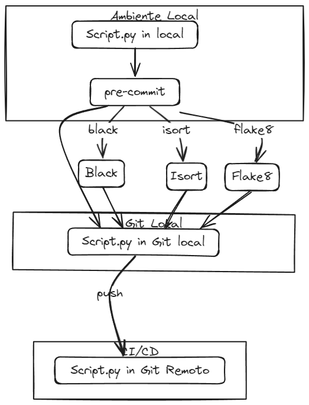

# Aula 06 - Revisão e Guia de Boas Práticas



## Conclusão:

Durante este processo de aprendizado, exploramos diversas ferramentas e bibliotecas que são fundamentais para garantir a qualidade durante o desenvolvimento de um projeto.

Aqui estão os principais pontos que foram abordados:

- **Black**: Uma poderosa ferramenta de formatação de código Python que automatiza a tarefa de garantir a conformidade com as diretrizes de estilo da PEP 8. Com o Black, podemos manter a consistência no estilo do código Python em nosso projeto, facilitando a leitura e a manutenção do código.
---
- **isort**: Uma biblioteca para organizar os imports de módulos em arquivos Python. O isort facilita a organização dos imports de acordo com as convenções de importação do Python, garantindo que nosso código seja mais legível e fácil de entender.
---
- **Flake8**: Uma ferramenta de verificação de código Python que ajuda a garantir a conformidade com as diretrizes de estilo do PEP 8 e identifica possíveis problemas no código-fonte. O Flake8 nos ajuda a manter a qualidade do nosso código Python, identificando erros de sintaxe, problemas de estilo e outras questões que podem afetar a legibilidade e a manutenção do código.
---
- **taskipy**: Uma biblioteca que facilita a criação e execução de tarefas comuns em projetos Python usando scripts Python. Com o taskipy, podemos automatizar tarefas repetitivas, como execução de testes, formatação de código, execução de linting e muito mais, tornando nosso processo de desenvolvimento mais eficiente e organizado.
---
- **pre-commit**: Uma ferramenta para automatizar a execução de verificações de código antes de cada commit em um repositório Git. Com o pre-commit, podemos garantir que nosso código Python atenda aos padrões de qualidade e estilo definidos, evitando problemas comuns antes mesmo de enviarmos nossas alterações para revisão.
---
Em resumo, ao incorporar essas ferramentas e bibliotecas em nosso fluxo de trabalho de desenvolvimento de software em Python, podemos melhorar a qualidade do nosso código, aumentar a produtividade da equipe e criar projetos mais robustos e fáceis de manter no longo prazo.


## Configuração para execução dos estudos no Jupyter


```python
# verifica a versão do python
!python --version
```

    Python 3.10.13


```python
from site import getsitepackages
```


```python
# Verificando se o path está no .venv
print(getsitepackages())
```

    ['/home/jcnok/bootcamps/bootcamp-jornada-de-dados_2024/.venv/lib/python3.10/site-packages']


```python
import os
```


```python
# Verifia a raiz do projeto atual
os.getcwd()
```


    '/home/jcnok/bootcamps/bootcamp-jornada-de-dados_2024/aula_06/notebook'


```python
# Altera o projeto para raiz da aula_06
os.chdir('/home/jcnok/bootcamps/bootcamp-jornada-de-dados_2024/aula_06')
os.getcwd()
```


    '/home/jcnok/bootcamps/bootcamp-jornada-de-dados_2024/aula_06'


## Guia de boas práticas:

A [PEP 8](https://peps.python.org/pep-0008/) é uma das PEPs (Python Enhancement Proposals) mais importantes da comunidade Python. Ela estabelece diretrizes para a formatação do código Python, incluindo convenções de estilo, espaçamento, nomes de variáveis e outros aspectos importantes da escrita de código Python legível e consistente.

A PEP 8 foi criada para promover uma base de código Python que seja fácil de ler e entender para os desenvolvedores, independentemente de quem tenha escrito o código originalmente. Isso é crucial para facilitar a manutenção do código, colaboração entre equipes de desenvolvimento e garantir a qualidade do código em projetos Python de todos os tamanhos.

Ao seguir as diretrizes da PEP 8, os desenvolvedores podem garantir que seu código Python seja coeso, consistente e legível, o que contribui para a sua usabilidade, manutenção e escalabilidade ao longo do tempo.

Em resumo, a [PEP 8](https://peps.python.org/pep-0008/) é uma referência essencial para qualquer desenvolvedor Python que queira escrever código claro, organizado e de fácil manutenção, promovendo as melhores práticas de desenvolvimento na comunidade Python.

### A seguir algumas bibliotecas que nos ajudam a automatizar essas boas práticas de maneira a manter nosso código coeso, consitente e legível:

[**Black:**](https://pypi.org/project/black/)

* O Black é uma ferramenta de formatação de código Python. Ele foi projetado para automatizar a formatação do código Python de acordo com as diretrizes da PEP 8, garantindo assim que o código seja formatado de maneira consistente e legível. Black é conhecido por ser muito rígido em sua formatação e, portanto, é considerado como uma "opinião" sobre como o código Python deve ser formatado.
Além de seguir as diretrizes da PEP 8, o Black também se esforça para produzir um código Python mais conciso e legível, removendo a necessidade de discussões sobre estilos de codificação em equipes de desenvolvimento.

[**isort:**](https://pypi.org/project/isort/)

* O isort é uma ferramenta para ordenar os imports de módulos em arquivos Python. Ele reorganiza automaticamente as declarações de importação em ordem alfabética e agrupa-as de acordo com as convenções de importação específicas. Isso ajuda a manter a organização e a legibilidade dos imports em arquivos Python.
Além de ordenar os imports, o isort também pode corrigir importações erradas e remover imports não utilizados, ajudando a manter o código Python limpo e livre de importações desnecessárias.

[**flake8:**](https://pypi.org/project/flake8/)

* O flake8 é uma ferramenta de verificação de código Python que ajuda a garantir a conformidade com as diretrizes de estilo do PEP 8 e identifica possíveis problemas no código-fonte. Ele verifica o código em busca de erros de sintaxe, problemas de estilo, variáveis não utilizadas e outros problemas potenciais.
O flake8 é altamente configurável e pode ser estendido com plugins para fornecer verificações adicionais específicas ao projeto. É frequentemente usado como parte de pipelines de integração contínua (CI) para garantir a qualidade do código Python em projetos de software.

Em resumo, "black" é uma ferramenta de formatação de código Python, "isort" é uma ferramenta para organizar e ordenar imports, e "flake8" é uma ferramenta de verificação de código que ajuda a manter o código Python consistente, limpo e livre de problemas. Juntas, essas ferramentas são amplamente utilizadas na comunidade Python para promover boas práticas de desenvolvimento e garantir a qualidade do código.

**Conforme a aula vamos executar alguns exemplos para entender o funcionamento de cada lib.**

#### Primeiro vamos instalar o flake8:


```python
#instala a lib flake8 em modo silencioso no ambiente .venv.
!poetry add flake8 -q
```

* Criando uma função simples e salvar o código em src/exemplo1.py:


```python
%%writefile src/exemplo01.py
def minha_funcao ():
    resultado = 2 + 2
    print("O resultado é:", resultado)
if __name__ == "__main__":
    minha_funcao()

```

    Overwriting src/exemplo01.py


* Agora vamos executar o código para garantir que o mesmo esteja funcionando:


```python
!python src/exemplo01.py
```

    O resultado é: 4


* Veja que a função funcionou perfeitamente, porém será que o código está de acordo com a PEP8?
* Podemos usar o flake8 para identificar possíveis erros de padronização conforme abaixo:


```python
!flake8 src/exemplo01.py
```
```HTML
    src/exemplo01.py:1:17: E211 whitespace before '('
    src/exemplo01.py:4:1: E305 expected 2 blank lines after class or function definition, found 0
```

* Veja que interessante o flake8 já notificou 2 erros, vamos corrigir:
    * Ele informa que na linha 1  e caracter 17 existe um espaço antes do '(' -> será corrigido
    * Informa que na linha 4 logo no primeiro caracter já solicita que precisa de 2 espaços depois de uma classe ou função. -> corrigido abaixo.
    * Importante notar que informa até mesmo o código "E211 e E305" do erro se precisar podem pesquisar o erro [aqui.](https://www.flake8rules.com/)


```python
%%writefile src/exemplo01.py
def minha_funcao():
    resultado = 2 + 2
    print("O resultado é:", resultado)


if __name__ == "__main__":
    minha_funcao()
```

    Overwriting src/exemplo01.py


* O código foi corrigido agora vamos executar o flake8 novamente:


```python
!flake8 src/exemplo01.py
```

* Veja que ele não trouxe nenhum erro agora, ou seja, dentro dos padrões pré-estabelecidos pelo flake8, o código está legivel.
* O flake8 é muito bom para corrigirmos esses problemas de espaçamentos, excesso de caracteres em uma linha, linhas em branco etc...
* Ele não faz nada no código, apenas informa onde corrigir.

#### Agora vamos instalar o Black:


```python
# instalando a lib black no ambiente virtual.
!poetry add black -q
```

* Agora vamos criar a mesma função porém vamos salvar como src/exemplo02.py


```python
%%writefile src/exemplo02.py
def minha_funcao ():
    resultado = 2 + 2
    print("O resultado é:", resultado)
if __name__ == "__main__":
    minha_funcao()

```

    Writing src/exemplo02.py


* Vamos rodar o black agora:


```python
!black src/exemplo02.py
```
<span>
    reformatted src/exemplo02.py

    All done! ✨ 🍰 ✨
    1 file reformatted.
</span>

* Vamos abrir o arquivo e verificar o que ele formatou:


```python
# %load src/exemplo02.py
def minha_funcao():
    resultado = 2 + 2
    print("O resultado é:", resultado)


if __name__ == "__main__":
    minha_funcao()

```

* Veja que o black corrigiu automáticamente os erros de código: "E211 e E305" que o flake8 havia identificado.
* Vamos rodar o flake8 no exemplo02.py para conferir.


```python
!flake8 src/exemplo02.py
```

* O Flake8 executou a verificação sem erros, pois o black já havia realizado as devidas correções.
* Essa é a vantagem com black, pois ele identifica e já corrige o erro de forma autônoma.

* Então quer dizer que podemos unir o melhor dos dois mundos e usar ambas libs para sempre mantermos um código dentro dos padrões?
  * Nem tudo é perfeito, existe um pequeno conflito entre ambas e vou demonstrar aqui para uma melhor compreensão.
  * O Flake8 utiliza por adoção 79 caracteres máximo por linha e o black 88, isso pode gerar um problema.
  * Veja o exemplo abaixo: irei salvar o arquivo em src/conflito_entre_black_e_flake8.py


```python
%%writefile src/conflito_entre_black_e_flake8.py
def exemplo_de_conflito_entre_black_e_flake8():
    variavel_com_nome_muito_longo_para_testar_um_conflito_entre_black_e_flake8 = "conflito"

    if variavel_com_nome_muito_longo_para_testar_um_conflito_entre_black_e_flake8 == "confito":
        print("Conflito entre o Black e o Flake8!")
    else:
        print("Sem conflito entre o Black e o Flake8!")

    return variavel_com_nome_muito_longo_para_testar_um_conflito_entre_black_e_flake8

if __name__=="__main__":
    exemplo_de_conflito_entre_black_e_flake8()

```

    Overwriting src/conflito_entre_black_e_flake8.py


* Vou executar o black para corrigir possíveis erros de formatação automaticamente:


```python
!black src/conflito_entre_black_e_flake8.py
```

    reformatted src/conflito_entre_black_e_flake8.py

    All done! ✨ 🍰 ✨
    1 file reformatted.


```python
# %load src/conflito_entre_black_e_flake8.py
def exemplo_de_conflito_entre_black_e_flake8():
    variavel_com_nome_muito_longo_para_testar_um_conflito_entre_black_e_flake8 = (
        "conflito"
    )

    if (
        variavel_com_nome_muito_longo_para_testar_um_conflito_entre_black_e_flake8
        == "confito"
    ):
        print("Conflito entre o Black e o Flake8!")
    else:
        print("Sem conflito entre o Black e o Flake8!")

    return variavel_com_nome_muito_longo_para_testar_um_conflito_entre_black_e_flake8


if __name__ == "__main__":
    exemplo_de_conflito_entre_black_e_flake8()

```

* Agora irei executar o flake8 para confirmação:


```python
!flake8 src/conflito_entre_black_e_flake8.py
```

    src/conflito_entre_black_e_flake8.py:2:80: E501 line too long (82 > 79 characters)
    src/conflito_entre_black_e_flake8.py:7:80: E501 line too long (82 > 79 characters)
    src/conflito_entre_black_e_flake8.py:14:80: E501 line too long (85 > 79 characters)


* Ué mas o black não realizou as correções e nos informou que já estava tudo certo?
    * Como o black aceita até 88 caracteres ele entendeu que estava tudo certo, veja uma breve explicação e como corrigir isso.


O Black, por padrão, formata o código Python utilizando linhas com até 88 caracteres de comprimento. Ele adota esse limite para facilitar a leitura do código em telas de tamanho padrão e para permitir que as linhas sejam divididas com um nível adequado de aninhamento sem prejudicar a legibilidade.

Por outro lado, o Flake8, por padrão, verifica se as linhas de código Python têm até 79 caracteres de comprimento. Esse limite é baseado nas diretrizes da PEP 8, que recomenda linhas de até 79 caracteres para facilitar a leitura em ambientes com terminais de 80 colunas.

Esses valores padrão diferentes podem causar conflitos entre o Black e o Flake8, já que um pode formatar o código além do limite recomendado pelo outro.

Para resolver esse conflito e usar o Black e o Flake8 juntos, existem algumas abordagens:

Ajustar as Configurações Padrão: Você pode ajustar as configurações padrão do Black e do Flake8 para usar o mesmo limite de comprimento de linha. Isso pode ser feito configurando explicitamente os parâmetros --line-length para o Black e max-line-length para o Flake8 com o mesmo valor (por exemplo, 79 caracteres).

Ignorar Verificações de Comprimento de Linha do Flake8: Você pode configurar o Flake8 para ignorar verificações de comprimento de linha, permitindo que o Black formate o código como desejar. Isso pode ser feito configurando max-line-length para um valor alto ou desativando a verificação de comprimento de linha completamente no arquivo de configuração do Flake8 (setup.cfg ou .flake8).

Ignorar Formatação de Código do Black: Você também pode configurar o Black para ignorar a formatação do código e focar apenas na verificação de erros de estilo usando o Flake8. Isso pode ser feito desativando a formatação automática do Black ou configurando-o para não modificar o comprimento das linhas.

##### Neste exemplo irei configurar o flake8 para aceitar o maximo de 88 caracteres em cada linha e ignorar alguns erros para evitar futuros conflitos, atribuindo a configuração em um arquivo .flake8 conforme abaixo:


```python
%%writefile .flake8
[flake8]
max-line-length = 88
extend-ignore = E203,E701
```

    Overwriting .flake8


* Agora vamos executar o flake8 novamente no nosso arquivo de exemplo:


```python
!flake8 src/conflito_entre_black_e_flake8.py
```

* Agora sim o conflito foi corrigido pois o flake8 agora aceita com maximo 88 caracteres em cada linha.

#### Agora vamos instalar o isort para cuidar da ordem dos imports:


```python
# instala a lib isort no ambiente virtual.
!poetry add isort -q
```

* Agora vou criar uma função de exemplo e salvar como src/exemplo_isort.py


```python
%%writefile src/exemplo_isort.py
# Exemplo de arquivo desorganizado com imports
import os
import math
import site

def calcular_area_circulo(raio):
    """
    Função para calcular a área de um círculo.
    """
    return math.pi * raio ** 2

def diretorio_atual():
    """
    Função para informar o diretório atual.
    """
    return os.getcwd()

def ambiente_atual():
    """
    Informa o ambiente de desenvolvimento atual.
    """
    return site.getsitepackages()
if __name__ == "__main__":
    diretorio_atual()

```

    Overwriting src/exemplo_isort.py


* Executando o isort para organizar a ordem das importações:


```python
!isort src/exemplo_isort.py
```

    Fixing /home/jcnok/bootcamps/bootcamp-jornada-de-dados_2024/aula_06/src/exemplo_isort.py


* Verificando as alterações:


```python
# %load src/exemplo_isort.py
# Exemplo de arquivo desorganizado com imports
import math
import os
import site


def calcular_area_circulo(raio):
    """
    Função para calcular a área de um círculo.
    """
    return math.pi * raio ** 2

def diretorio_atual():
    """
    Função para informar o diretório atual.
    """
    return os.getcwd()

def ambiente_atual():
    """
    Informa o ambiente de desenvolvimento atual.
    """
    return site.getsitepackages()
if __name__ == "__main__":
    diretorio_atual()

```

* Veja que o isort, segue as diretrizes da PEP 8 e organiza os imports em ordem alfabética.

* Agora vamos garantir um código legível com as 3 libs:


```python
!isort src/exemplo_isort.py
```


```python
!black src/exemplo_isort.py
```

    reformatted src/exemplo_isort.py

    All done! ✨ 🍰 ✨
    1 file reformatted.


```python
!flake8 src/exemplo_isort.py
```

* Analisando o código já com as 3 verificações:


```python
# %load src/exemplo_isort.py
# Exemplo de arquivo desorganizado com imports
import math
import os
import site


def calcular_area_circulo(raio):
    """
    Função para calcular a área de um círculo.
    """
    return math.pi * raio**2


def diretorio_atual():
    """
    Função para informar o diretório atual.
    """
    return os.getcwd()


def ambiente_atual():
    """
    Informa o ambiente de desenvolvimento atual.
    """
    return site.getsitepackages()


if __name__ == "__main__":
    diretorio_atual()

```

* Hoje, aprendemos como usar essas bibliotecas para melhorar nossos processos de desenvolvimento de software. Aprendemos como formatar o código automaticamente com o Black, organizar os imports com o isort e verificar a qualidade do código com o Flake8. Ao dominar essas ferramentas, podemos nos tornar desenvolvedores mais eficientes e produzir código Python de alta qualidade.

#### Para evitar futuros conflitos, é necessário realizar algumas alterações no arquivo pyproject.toml, praticamente precisamos informar qual será a lib preferencial

* **Carregando o arquivo pyproject.toml**.


```python
# %load ../pyproject.toml
[tool.poetry]
name = "bootcamp-2024"
version = "0.1.0"
description = ""
authors = ["Julio Okuda <julio.okuda@gmail.com>"]
license = "MIT"
readme = "README.md"

[tool.poetry.dependencies]
python = "3.10.13"
ipykernel = "^6.29.3"
jupyter = "^1.0.0"
lab = "^8.1"
pandas = "^2.2.1"
polars = "^0.20.16"
duckdb = "^0.10.1"
pyspark = "^3.5.1"
vaex = "^4.17.0"
matplotlib = "^3.8.3"
dask-expr = "^1.0.5"
flake8 = "^7.0.0"
black = "^24.3.0"
isort = "^5.13.2"


[build-system]
requires = ["poetry-core"]
build-backend = "poetry.core.masonry.api"

```

* **Adicionando as configurações para evitar conflitos entre o black e o isort**.


```python
%%writefile -a ../pyproject.toml
# Adicionando a configuração ao pyproject.toml para evitar conflitos
[tool.isort]
profile = "black"

```

    Appending to ../pyproject.toml


* **Carregando o arquivo novamente para conferir as alterações.**


```python
# %load ../pyproject.toml
[tool.poetry]
name = "bootcamp-2024"
version = "0.1.0"
description = ""
authors = ["Julio Okuda <julio.okuda@gmail.com>"]
license = "MIT"
readme = "README.md"

[tool.poetry.dependencies]
python = "3.10.13"
ipykernel = "^6.29.3"
jupyter = "^1.0.0"
lab = "^8.1"
pandas = "^2.2.1"
polars = "^0.20.16"
duckdb = "^0.10.1"
pyspark = "^3.5.1"
vaex = "^4.17.0"
matplotlib = "^3.8.3"
dask-expr = "^1.0.5"
flake8 = "^7.0.0"
black = "^24.3.0"
isort = "^5.13.2"


[build-system]
requires = ["poetry-core"]
build-backend = "poetry.core.masonry.api"
# Adicionando a configuração ao pyproject.toml para evitar conflitos
[tool.isort]
profile = "black"

```

### Agora vamos automatizar essas 3 libs para que sejam executadas em um único comando com o [TASKIPY](https://pypi.org/project/taskipy/):


```python
# instalando a lib taskipy no ambiente virtual
!poetry add taskipy -q
```

A biblioteca "taskipy" é uma ferramenta que facilita a criação e execução de tarefas (ou "tasks") comuns em projetos Python usando o Python scripts. Ela é inspirada na funcionalidade de scripts do Node.js.

Com o "taskipy", você pode definir facilmente tarefas personalizadas em um arquivo tasks.py no seu projeto Python e executá-las usando o comando taskipy no terminal. Isso é útil para automatizar tarefas repetitivas, como executar testes, iniciar o servidor de desenvolvimento, executar linting, entre outros.

Além disso, o "taskipy" facilita a execução de tarefas específicas do projeto, garantindo que as dependências necessárias estejam instaladas e que as tarefas sejam executadas no contexto correto do projeto.

Em resumo, o "taskipy" é uma ferramenta útil para automatizar tarefas em projetos Python, tornando o desenvolvimento mais eficiente e organizado.

Link do projeto:[taskipy](https://pypi.org/project/taskipy/)

* **Agora precisamos adicionar nossa tarefa no arquivo pyproject.toml conforme o exemplo abaixo:**


```python
%%writefile -a ../pyproject.toml
# lib para automatizar tarefas
[tool.taskipy.tasks]
format = "isort .&&black .&&flake8" #verifica a formatação do código na sequência.
```

    Appending to ../pyproject.toml


* **Apenas para conferir as alterações:**


```python
# %load ../pyproject.toml
[tool.poetry]
name = "bootcamp-2024"
version = "0.1.0"
description = ""
authors = ["Julio Okuda <julio.okuda@gmail.com>"]
license = "MIT"
readme = "README.md"

[tool.poetry.dependencies]
python = "3.10.13"
ipykernel = "^6.29.3"
jupyter = "^1.0.0"
lab = "^8.1"
pandas = "^2.2.1"
polars = "^0.20.16"
duckdb = "^0.10.1"
pyspark = "^3.5.1"
vaex = "^4.17.0"
matplotlib = "^3.8.3"
dask-expr = "^1.0.5"
flake8 = "^7.0.0"
black = "^24.3.0"
isort = "^5.13.2"
taskipy = "^1.12.2"


[build-system]
requires = ["poetry-core"]
build-backend = "poetry.core.masonry.api"
# Adicionando a configuração ao pyproject.toml para evitar conflitos
[tool.isort]
profile = "black"
# lib para automatizar tarefas
[tool.taskipy.tasks]
format = "isort .&&black .&&flake8" #verifica a formatação do código na sequência.

```

* **Bom agora, vou criar uma função simples e testar para conferir se a task está de fato funcional**.


```python
%%writefile src/exemplo_com_tasks.py
#Exemplo de arquivo desorganizado com imports, função sem espaços adequados.
import site
import math
import os
def calcular_area_circulo(raio):
    """
    Função para calcular a área de um círculo.
    """
    return math.pi * raio**2
def diretorio_atual():
    """
    Função para informar o diretório atual.
    """
    return os.getcwd()
def ambiente_atual():
    """
    Informa o ambiente de desenvolvimento atual.
    """
    return site.getsitepackages()
if __name__ == "__main__":
    diretorio_atual()
```

    Overwriting src/exemplo_com_tasks.py


* **Vamos testar a task:**


```python
!task format src/exemplo_com_tasks.py
```

    Fixing /home/jcnok/bootcamps/bootcamp-jornada-de-dados_2024/aula_06/src/exemplo_com_tasks.py
    Skipping .ipynb files as Jupyter dependencies are not installed.
    You can fix this by running ``pip install "black[jupyter]"``
    reformatted /home/jcnok/bootcamps/bootcamp-jornada-de-dados_2024/aula_06/src/exemplo_com_tasks.py

    All done! ✨ 🍰 ✨
    1 file reformatted, 4 files left unchanged.


* **Conferindo como ficou:**


```python
# %load src/exemplo_com_tasks.py
# Exemplo de arquivo desorganizado com imports, função sem espaços adequados.
import math
import os
import site


def calcular_area_circulo(raio):
    """
    Função para calcular a área de um círculo.
    """
    return math.pi * raio**2


def diretorio_atual():
    """
    Função para informar o diretório atual.
    """
    return os.getcwd()


def ambiente_atual():
    """
    Informa o ambiente de desenvolvimento atual.
    """
    return site.getsitepackages()


if __name__ == "__main__":
    diretorio_atual()

```

* **Agora sim podemos garantir que nosso código fique organizado de forma legível, concisa e coesa?**
  * Ainda não pois, imagine que esteja trabalhando em uma squad, e alguém simplesmente não execute a task, de nada adiantaria essas configurações.

* **Para resolver esse problema vamos utilizar uma outra lib para travar/bloquear todos os commits que não atenderem os requisitos mínimos necessários.**

#### Biblioteca pre-commit

A biblioteca "pre-commit" é uma ferramenta para automatizar a execução de verificações de código antes de cada commit em um repositório de controle de versão, como o Git.

Principais características:
- **Verificações Automáticas**: Executa verificações automáticas, como formatação de código, verificação de estilo e análise estática.
- **Configuração Flexível**: Personalização fácil por meio do arquivo de configuração `.pre-commit-config.yaml`.
- **Integração com Diversas Ferramentas**: Suporta uma ampla variedade de ferramentas de verificação de código.
- **Execução Local**: As verificações são executadas localmente em seu ambiente de desenvolvimento.
- **Integração com Git Hooks**: Integrado aos hooks do Git para acionamento automático antes de cada commit.

Link do projeto: [pre-commit](https://pypi.org/project/pre-commit/)


```python
# instalando a lib pre-commit no ambiente virtual com poetry
!poetry add pre-commit -q
```

* **Após a instalação é necessário criar um novo arquivo '.pre-commit-config.yaml' na raiz do projeto, é nele que iremos realizar as devidas configurações.**

* **Algumas configurações básicas serão aplicadas agora conforme o exemplo abaixo:**


```python
%%writefile ../.pre-commit-config.yaml
# Salvando as configurações na raiz do projeto
repos:
  - repo: https://github.com/pre-commit/pre-commit-hooks
    rev: v4.5.0
    hooks:
      - id: trailing-whitespace
        args: [--markdown-linebreak-ext=md]
      - id: end-of-file-fixer
      - id: check-yaml
      - id: check-toml
      - id: detect-private-key
      - id: check-added-large-files
  - repo: https://github.com/psf/black-pre-commit-mirror
    rev: 24.3.0
    hooks:
      - id: black
        language_version: python3.10
  - repo: https://github.com/pycqa/isort
    rev: 5.13.2
    hooks:
      - id: isort
        name: isort (python)
  - repo: https://github.com/pycqa/flake8
    rev: 7.0.0
    hooks:
      - id: flake8
```

    Writing ../.pre-commit-config.yaml


#### Configuração do pre-commit

O arquivo `.pre-commit-config.yaml` contém a configuração do pre-commit para automatizar verificações e correções de código antes de cada commit em um repositório Git. Aqui está um resumo das configurações:

- **pre-commit/pre-commit-hooks**: Este repositório contém uma coleção de hooks do pre-commit para realizar várias verificações no código, como remoção de espaços em branco, adição de nova linha no final do arquivo, verificação de sintaxe YAML e TOML, detecção de chaves privadas e verificação de arquivos grandes adicionados.

- **psf/black-pre-commit-mirror**: Este repositório contém o hook do Black, uma ferramenta de formatação de código Python que formata automaticamente o código de acordo com as diretrizes do PEP 8.

- **pycqa/isort**: Este repositório contém o hook do isort, uma ferramenta para organizar os imports de módulos em arquivos Python de acordo com as convenções de importação do Python.

- **pycqa/flake8**: Este repositório contém o hook do Flake8, uma ferramenta de verificação de código Python que verifica a conformidade com as diretrizes de estilo do PEP 8 e identifica possíveis problemas no código-fonte.
```

Em resumo vamos usar essas ferramentas e verificações configuradas no arquivo `.pre-commit-config.yaml` para garantir a qualidade do código em um projeto Python.

* **Com o arquivo .pre-commit-config.yaml criada, é necessário executar as instalações com o código abaixo:**


```python
!pre-commit install
```

    pre-commit installed at .git/hooks/pre-commit


* **Irei criar uma função e realizar um teste e ver se está tudo funcioando ao realizar um commit:**


```python
%%writefile src/exemplo_com_pre-commit.py
#Criando uma função para testar o pre-commit

#Exemplo de arquivo desorganizado com imports, função sem espaços adequados.
import site
import math
import os
def calcular_area_circulo(raio):
    """
    Função para calcular a área de um círculo.
    """
    return math.pi * raio**2
def diretorio_atual():
    """
    Função para informar o diretório atual.
    """
    return os.getcwd()
def ambiente_atual():
    """
    Informa o ambiente de desenvolvimento atual.
    """
    return site.getsitepackages()
if __name__ == "__main__":
    diretorio_atual()
```

    Writing src/exemplo_com_pre-commit.py


* **Veja que o script acima não está com as devidas formatações básicas da PEP8**.
* **Vamos ver se o pre-commit consegue resolver isso.**


```python
!git status
```

    On branch main
    Your branch is up to date with 'origin/main'.

    Changes not staged for commit:
      (use "git add <file>..." to update what will be committed)
      (use "git restore <file>..." to discard changes in working directory)
    	modified:   notebook/aula_06.ipynb
    	modified:   ../poetry.lock
    	modified:   ../pyproject.toml

    Untracked files:
      (use "git add <file>..." to include in what will be committed)
    	src/exemplo_com_pre-commit.py
    	src/exemplo_com_tasks.py

    no changes added to commit (use "git add" and/or "git commit -a")


```python
#Adicionando ao stage
!git add src/exemplo_com_pre-commit.py
```


```python
#conferindo se foi adicionado.
!git status
```

    On branch main
    Your branch is up to date with 'origin/main'.

    Changes to be committed:
      (use "git restore --staged <file>..." to unstage)
    	new file:   src/exemplo_com_pre-commit.py

    Changes not staged for commit:
      (use "git add <file>..." to update what will be committed)
      (use "git restore <file>..." to discard changes in working directory)
    	modified:   notebook/aula_06.ipynb
    	modified:   ../poetry.lock
    	modified:   ../pyproject.toml

    Untracked files:
      (use "git add <file>..." to include in what will be committed)
    	src/exemplo_com_tasks.py


```python
#Commitando o arquivo
!git commit -m "add:exemplo de pre-commit simples"
```

    [WARNING] Unstaged files detected.
    [INFO] Stashing unstaged files to /home/jcnok/.cache/pre-commit/patch1712286549-259038.
    trim trailing whitespace.................................................Passed
    fix end of files.........................................................Passed
    check yaml...........................................(no files to check)Skipped
    check toml...........................................(no files to check)Skipped
    detect private key.......................................................Passed
    check for added large files..............................................Passed
    black....................................................................Failed
    - hook id: black
    - files were modified by this hook

    reformatted aula_06/src/exemplo_com_pre-commit.py

    All done! ✨ 🍰 ✨
    1 file reformatted.

    isort (python)...........................................................Failed
    - hook id: isort
    - files were modified by this hook

    Fixing /home/jcnok/bootcamps/bootcamp-jornada-de-dados_2024/aula_06/src/exemplo_com_pre-commit.py

    flake8...................................................................Passed
    [INFO] Restored changes from /home/jcnok/.cache/pre-commit/patch1712286549-259038.


* **Observe que o black encontrou divergências e não aprovou o commit, porém ele próprio se encarregou de corrigir agora irei realizar um novo commit e garantir a aprovação:**


```python
!git status
```

    On branch main
    Your branch is up to date with 'origin/main'.

    Changes to be committed:
      (use "git restore --staged <file>..." to unstage)
    	new file:   src/exemplo_com_pre-commit.py

    Changes not staged for commit:
      (use "git add <file>..." to update what will be committed)
      (use "git restore <file>..." to discard changes in working directory)
    	modified:   notebook/aula_06.ipynb
    	modified:   src/exemplo_com_pre-commit.py
    	modified:   ../poetry.lock
    	modified:   ../pyproject.toml

    Untracked files:
      (use "git add <file>..." to include in what will be committed)
    	src/exemplo_com_tasks.py


```python
!git add src/exemplo_com_pre-commit.py
```


```python
!git commit -m "update:exemplo corrigido pelo pre-commit"
```

    [WARNING] Unstaged files detected.
    [INFO] Stashing unstaged files to /home/jcnok/.cache/pre-commit/patch1712286803-259694.
    trim trailing whitespace.................................................Passed
    fix end of files.........................................................Passed
    check yaml...........................................(no files to check)Skipped
    check toml...........................................(no files to check)Skipped
    detect private key.......................................................Passed
    check for added large files..............................................Passed
    black....................................................................Passed
    isort (python)...........................................................Passed
    flake8...................................................................Passed
    [INFO] Restored changes from /home/jcnok/.cache/pre-commit/patch1712286803-259694.
    [main e9a5bd2] update:exemplo corrigido pelo pre-commit
     1 file changed, 31 insertions(+)
     create mode 100644 aula_06/src/exemplo_com_pre-commit.py


* **Desta forma conseguimos garantir que a squad irá manter a qualidade no desenvolvimento de todo o projeto, garantindo as boas práticas que foi definido com o time.**
* **O pre-commit pode ser utilizado para padronizar o formato dos commits, para verificação de segurança, padronização e qualidade de código entre outras, vale muito estudar toda a documentação.**
