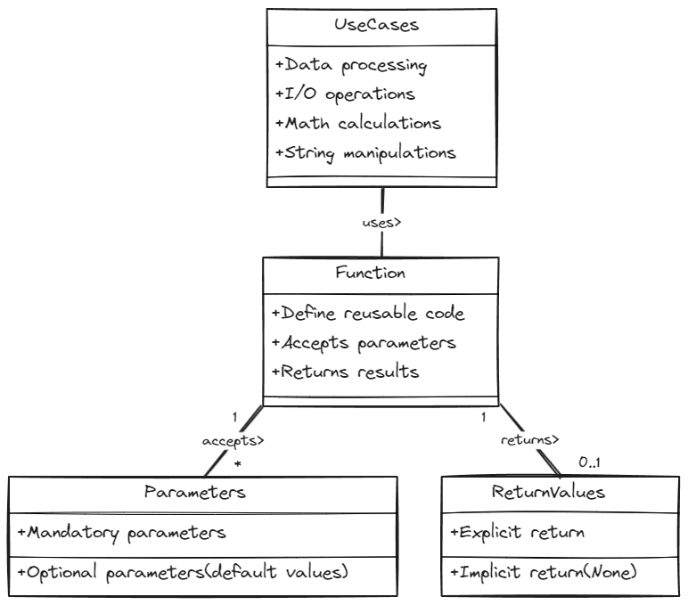
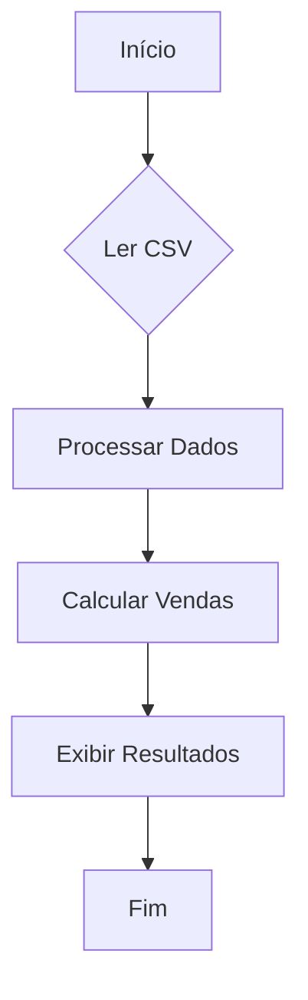

# Funções:



## Funções em Python

As funções em Python são blocos de código reutilizáveis que realizam tarefas específicas. Elas desempenham um papel fundamental no desenvolvimento de software, proporcionando modularidade, legibilidade e reutilização de código. Abaixo estão as principais funcionalidades, casos de uso e a importância de utilizar funções em Python:

### Funcionalidades Principais

1. **Define código reutilizável**:
   - As funções permitem definir blocos de código que realizam uma tarefa específica. Isso promove a reutilização do código em diferentes partes do programa, evitando a duplicação e facilitando a manutenção.

2. **Aceita parâmetros**:
   - As funções podem receber parâmetros como entrada, permitindo que dados sejam passados para dentro da função. Isso torna as funções mais flexíveis e genéricas, podendo ser aplicadas a diferentes conjuntos de dados.

3. **Retorna resultados**:
   - As funções podem retornar valores como resultado da execução. Isso permite que o resultado do processamento seja utilizado posteriormente em outras partes do programa.

### Casos de Uso

1. **Processamento de dados**:
   - As funções são amplamente utilizadas para processar dados, realizar operações matemáticas, manipular strings e realizar outras transformações nos dados.

2. **Operações de E/S (Entrada/Saída)**:
   - As funções são usadas para realizar operações de entrada e saída, como ler dados de arquivos, interagir com bancos de dados, chamar APIs externas, entre outros.

3. **Cálculos matemáticos**:
   - As funções são úteis para realizar cálculos matemáticos complexos ou repetitivos, encapsulando a lógica de cálculo em uma função reutilizável.

4. **Manipulações de strings**:
   - As funções são empregadas para manipular e processar strings, como formatação, substituição, divisão, entre outras operações.

### Importância

- As funções são essenciais para organizar e estruturar o código, tornando-o mais modular, legível e fácil de manter.
- Promovem a reutilização do código, evitando a duplicação e melhorando a eficiência do desenvolvimento.
- Facilitam a depuração e teste do código, permitindo isolar e testar partes específicas do programa de forma independente.


## Setando o ambiente para o jupyter


```python
import os
os.getcwd()
os.chdir("/home/jcnok/bootcamps/bootcamp-jornada-de-dados_2024/aula_07")
os.getcwd()
```


    '/home/jcnok/bootcamps/bootcamp-jornada-de-dados_2024/aula_07'


## Exercícios

1. **Calcular a média de valores em uma lista:**


```python
# %%writefile src/exercicio_01.py
# Calcular a média de valores em uma lista:
from typing import List

def calcular_media(valores: List[float]) -> float:
    """
    Função para calcular a média de uma lista de valores.

    Args:
        valores (List[float]): Uma lista de valores numéricos.

    Returns:
        float: A média dos valores na lista.
    """
    # Soma todos os valores na lista
    soma = sum(valores)
    # Calcula a média dividindo a soma pelo número de valores na lista
    media = soma / len(valores)
    return round(media,2)

```

    Writing src/exercicio_01.py


* **Testando a função**:


```python
lista_notas = [5.0, 6.5, 8.0, 9.0]
calcular_media(lista_notas)
```


    7.12


2. **Filtrar dados acima de um limite:**


```python
# %%writefile src/exercicio_02.py
# 2.Filtrar dados acima de um limite:
from typing import List

def filtrar_dados_limite(valores: List[float], limite: float) -> List[float]:
    """
    Função para filtrar valores em uma lista que estão acima de um determinado limite.

    Args:
        valores (List[float]): Uma lista de valores numéricos.
        limite (float): O limite para filtrar os valores.

    Returns:
        List[float]: Uma lista contendo apenas os valores acima do limite.
    """
    # Inicializa uma lista vazia para armazenar os valores filtrados
    resultado = []
    # Itera sobre cada valor na lista de entrada
    for valor in valores:
        # Verifica se o valor atual é maior que o limite
        if valor > limite:
            # Se for, adiciona o valor à lista de resultados
            resultado.append(valor)
    # Retorna a lista de valores filtrados
    return resultado

```

    Writing src/exercicio_02.py


* **Testando o código:**


```python
lista_notas = [5.0, 6.5, 8.0, 9.0]
filtrar_dados_limite(lista_notas,6.5)
```


    [8.0, 9.0]


3. **Contar valores únicos em uma lista:**


```python
# %%writefile src/exercicio_03.py
# 3. Contar valores únicos em uma lista:
from typing import List

def contar_valores_unicos(lista: List[int]) -> int:
    """
    Função para contar o número de valores únicos em uma lista.

    Args:
        lista (List[int]): Uma lista de valores inteiros.

    Returns:
        int: O número de valores únicos na lista.
    """
    # Converte a lista para um conjunto (set) para eliminar valores duplicados
    valores_unicos = set(lista)
    # Retorna o número de elementos no conjunto, que corresponde ao número de valores únicos
    return len(valores_unicos)

```

    Writing src/exercicio_03.py


* **Testando o código:**


```python
lista = [1.0, 2.0, 2.0, 4.0, 1.0, 5.0, 7.0, 8.0]
contar_valores_unicos(lista)
```


    6


4. **Converter celsius para Fahrenheit em uma lista:**


```python
# %%writefile src/exercicio_04.py
# 4.Converter celsius para Fahrenheit em uma lista:
from typing import List

def celsius_para_fahrenheit(temperaturas_celsius: List[float]) -> List[float]:
    """
    Função para converter uma lista de temperaturas de Celsius para Fahrenheit.

    Args:
        temperaturas_celsius (List[float]): Uma lista de temperaturas em graus Celsius.

    Returns:
        List[float]: Uma lista de temperaturas convertidas para Fahrenheit.
    """
    # Utiliza uma list comprehension para converter cada temperatura de Celsius para Fahrenheit
    temperaturas_fahrenheit = [(9/5) * temp + 32 for temp in temperaturas_celsius]
    return temperaturas_fahrenheit

```

    Writing src/exercicio_04.py


* **Testando o código**:


```python
lista_celsius = [20, 30, 40, -10, 0]
celsius_para_fahrenheit(lista_celsius)
```


    [68.0, 86.0, 104.0, 14.0, 32.0]


5. **Calcular desvio padrão de uma lista:**


```python
# %%writefile src/exercicio_05.py
# 5. Calcular desvio padrão de uma lista:
from typing import List

def calcular_desvio_padrao(valores: List[float]) -> float:
    """
    Função para calcular o desvio padrão de uma lista de valores.

    Args:
        valores (List[float]): Uma lista de valores numéricos.

    Returns:
        float: O desvio padrão dos valores na lista.
    """
    # Calcula a média dos valores na lista
    media = sum(valores) / len(valores)
    # Calcula a variância dos valores na lista
    variancia = sum((x - media) ** 2 for x in valores) / len(valores)
    # Retorna a raiz quadrada da variância, que é o desvio padrão
    return variancia ** 0.5

```

    Writing src/exercicio_05.py


* **Testando a função:**


```python
lista = [1.0, 2.0, 2.0, 4.0, 1.0, 5.0, 7.0, 8.0]
calcular_desvio_padrao(lista)
```


    2.537222891273055


```python
# conferindo com a lib numpy
import numpy as np
np.std(lista)
```


    2.537222891273055


6. **Encontrar Valores Ausentes em uma Sequência**:


```python
# %%writefile src/exercicio_06.py
# 6. Encontrar Valores Ausentes em uma Sequência:
from typing import List

def encontrar_valores_ausentes(sequencia: List[int]) -> List[int]:
    """
    Função para encontrar valores ausentes em uma sequência de números inteiros.

    Args:
        sequencia (List[int]): Uma sequência de números inteiros.

    Returns:
        List[int]: Uma lista contendo os valores ausentes na sequência.
    """
    # Cria um conjunto completo contendo todos os números no intervalo da sequência
    completo = set(range(min(sequencia), max(sequencia) + 1))
    # Retorna os valores ausentes encontrando a diferença entre o conjunto completo e o conjunto da sequência
    return list(completo - set(sequencia))

```

    Writing src/exercicio_06.py


* **testando a função:**


```python
sequencia_list = [1,2,4,5,7,8,10]
encontrar_valores_ausentes(sequencia_list)
```


    [9, 3, 6]


## Projeto

#### Desafio - Análise de Vendas de Produtos Objetivo:
* **Dado um arquivo CSV contendo dados de vendas de produtos, o desafio consiste em ler os dados, processá-los em um dicionário para análise e, por fim, calcular e reportar as vendas totais por categoria de produto.**

**Fluxo**:



**Tarefas**:

1. Ler o arquivo CSV e carregar os dados.
2. Processar os dados em um dicionário, onde a chave é a categoria, e o valor é uma lista de dicionários, cada um contendo informações do produto (`Produto`, `Quantidade`, `Venda`).
3. Calcular o total de vendas (`Quantidade` * `Venda`) por categoria.

### Funções

1. **Ler CSV**:

    * Função: `ler_csv`
    * Entrada: Nome do arquivo CSV
    * Saída: Lista de dicionários com dados lidos
2. **Processar Dados**:

    * Função: `processar_dados`
    * Entrada: Lista de dicionários
    * Saída: Dicionário processado conforme descrito
3. **Calcular Vendas por Categoria**:

    * Função: `calcular_vendas_categoria`
    * Entrada: Dicionário processado
    * Saída: Dicionário com total de vendas por categoria

* **Resolução do projeto**:


```python
# %%writefile src/desafio.py
# desafio - Análise de Vendas de Produtos
import csv
from typing import List, Dict

# Função para ler o arquivo CSV e carregar os dados
def ler_csv(nome_arquivo: str) -> List[Dict[str, str]]:
    with open(nome_arquivo, newline='') as arquivo:
        leitor = csv.DictReader(arquivo)
        dados = [linha for linha in leitor]
    return dados

# Função para processar os dados em um dicionário por categoria
def processar_dados(dados: List[Dict[str, str]]) -> Dict[str, List[Dict[str, str]]]:
    categorias = {}
    for linha in dados:
        categoria = linha['Categoria']
        if categoria not in categorias:
            categorias[categoria] = []
        categorias[categoria].append({
            'Produto': linha['Produto'],
            'Quantidade': int(linha['Quantidade']),
            'Venda': float(linha['Venda'])
        })
    return categorias

# Função para calcular o total de vendas por categoria
def calcular_vendas_categoria(categorias: Dict[str, List[Dict[str, str]]]) -> Dict[str, float]:
    total_vendas = {}
    for categoria, produtos in categorias.items():
        total_vendas[categoria] = sum(produto['Quantidade'] * produto['Venda'] for produto in produtos)
    return total_vendas

# Função principal
def main():
    # Ler o arquivo CSV
    dados = ler_csv('data/vendas.csv')

    # Processar os dados
    categorias = processar_dados(dados)

    # Calcular as vendas por categoria
    vendas_por_categoria = calcular_vendas_categoria(categorias)

    # Exibir os resultados
    for categoria, total_vendas in vendas_por_categoria.items():
        print(f'Total de vendas na categoria "{categoria}": R${total_vendas:.2f}')

if __name__ == "__main__":
    main()

```

    Total de vendas na categoria "Electronics": R$23000.00
    Total de vendas na categoria "Apparel": R$900.00
    Total de vendas na categoria "Kitchen": R$300.00


```python

```
