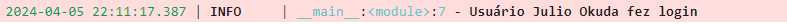
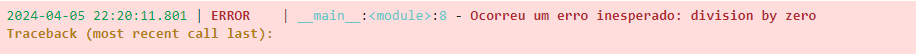
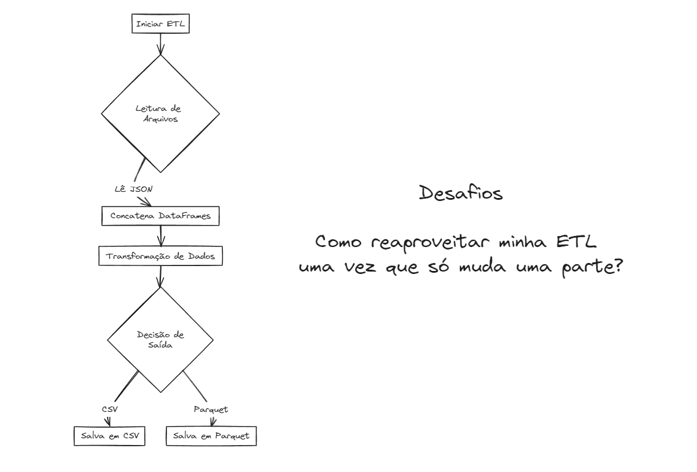

# Funções em Python - ETL com Pandas, JSON e Parquet

Para realizar uma ETL (Extract, Transform, Load) simples utilizando Python e a biblioteca Pandas, vamos seguir os seguintes passos:

Extract: Ler os dados de um arquivo JSON.

Transform: Concatenar os dados extraídos em um único DataFrame e aplicar uma transformação. A transformação específica dependerá dos dados, mas vamos assumir uma operação simples como um exemplo.

Load: Salvar o DataFrame resultante em um arquivo CSV ou PARQUET.

## Selecionando a raiz do projeto:


```python
import os
os.getcwd()
os.chdir('/home/jcnok/bootcamps/bootcamp-jornada-de-dados_2024/aula_08')
os.getcwd()
```


    '/home/jcnok/bootcamps/bootcamp-jornada-de-dados_2024/aula_08'


## Loguru: Simplificando o Registro em Python


O Loguru é uma biblioteca de registro (logging) para Python que simplifica bastante o processo de registro de mensagens de registro (logs) em aplicativos Python. Ele oferece uma API fácil de usar e poderosa para configurar e gerenciar logs em seus projetos.

### Principais Características

1. **API Simples**: O Loguru oferece uma API muito simples e intuitiva para registro de mensagens. Você pode facilmente configurar o registro com apenas algumas linhas de código.

2. **Níveis de Log Personalizáveis**: Ele fornece vários níveis de log predefinidos (por exemplo, DEBUG, INFO, WARNING, ERROR, etc.) e também permite a definição de níveis de log personalizados conforme necessário.

3. **Formatação Flexível**: Você pode personalizar facilmente o formato das mensagens de log de acordo com suas necessidades. O Loguru oferece suporte a formatação de mensagem flexível e extensível.

4. **Suporte a Threads e Processos**: Loguru lida automaticamente com problemas de concorrência em aplicativos que usam várias threads ou processos, garantindo que as mensagens de log sejam registradas corretamente e sem conflitos.

5. **Integração com Outras Ferramentas**: Ele se integra facilmente com outras ferramentas e bibliotecas, como Flask, Django, e outras ferramentas populares de registro em Python.

### Conclusão

O Loguru simplifica o processo de registro de mensagens de log em aplicativos Python, oferecendo uma API fácil de usar, flexibilidade na formatação de mensagens e uma série de recursos úteis para gerenciamento eficaz de logs. É uma escolha popular entre os desenvolvedores Python devido à sua simplicidade e poder.


### O que é Logging?

Logging é o processo de gravar mensagens que documentam os eventos que ocorrem durante a execução de um software. Essas mensagens podem indicar progresso da execução, falhas, erros, ou outras informações úteis. O logging é crucial para desenvolvimento e manutenção de software, pois permite aos desenvolvedores e administradores de sistema entender o que o aplicativo está fazendo, diagnosticar problemas e monitorar o desempenho em produção.


### Instalação:


```python
!poetry add loguru -q
```

### Como usar:

* **Configuração Básica e Registro de Mensagens Simples:**


```python
from loguru import logger

# Configuração básica
logger.add("log/app.log", rotation="5 MB", level="WARNING")

# Exemplos de registro de mensagens
logger.debug("Esta é uma mensagem de depuração")
logger.info("Esta é uma mensagem informativa")
logger.warning("Esta é uma mensagem de aviso")
logger.error("Esta é uma mensagem de erro")
logger.critical("Esta é uma mensagem crítica")

```


* **Agora vamos acessar o arquivo app.log e conferir que ele só salvou os logs de level "WARNING".**


```python
# %load log/app.log
2024-04-09 01:16:32.796 | WARNING  | __main__:<module>:9 - Esta é uma mensagem de aviso
2024-04-09 01:16:32.801 | ERROR    | __main__:<module>:10 - Esta é uma mensagem de erro
2024-04-09 01:16:32.805 | CRITICAL | __main__:<module>:11 - Esta é uma mensagem crítica

```

* **Veja que o level "WARNING" não salva os logs do tipo 'INFO' e 'DEBUB'.**
* **Assim podemos configurar os níveis de logs conforme a necessidade.**

### Personalização dos logs.

* **Personalizando o formato das mensagens:**


```python
from loguru import logger

# Configuração com formato personalizado
logger.add("log/app.log", format="{time} - {level} - {message}", level="INFO")

# Exemplo de registro de mensagem com contexto
logger.info("Usuário {user} fez login", user="Julio Okuda")
```



* **Acessando o conteúdo do arquivo app.log:**


```python
# %load log/app.log
2024-04-09 01:16:32.796 | WARNING  | __main__:<module>:9 - Esta é uma mensagem de aviso
2024-04-09 01:16:32.801 | ERROR    | __main__:<module>:10 - Esta é uma mensagem de erro
2024-04-09 01:16:32.805 | CRITICAL | __main__:<module>:11 - Esta é uma mensagem crítica
2024-04-09T01:20:43.014364-0300 - INFO - Usuário Julio Okuda fez login

```

* **Tratamento de exceções**


```python
from loguru import logger

try:
    # Algum código que pode gerar uma exceção
    resultado = 1 / 0
except Exception as e:
    # Registro da exceção com o método exception()
    logger.exception("Ocorreu um erro inesperado: {exception}", exception=str(e))

```



Usando logger.exception(), Loguru automaticamente captura e loga o traceback da exceção, o que é extremamente útil para diagnóstico de erros.

* **Vamos criar um decorador utilizando o Loguru para adicionar automaticamente logs a qualquer função Python. Isso nos permite registrar automaticamente quando uma função é chamada e quando ela termina, junto com qualquer informação relevante, como argumentos da função e o resultado retornado (ou exceção lançada).**

* **Agora, vamos ao código do decorador:**


```python
%%writefile src/utils/log_decorator.py
# decorator para registro de logs
from loguru import logger

def log_decorator(func):
    """
    Decorador para registro de chamadas de função com o Loguru.

    Args:
        func (callable): Função a ser decorada.

    Returns:
        callable: Função decorada.
    """
    def wrapper(*args, **kwargs):
        """
        Função interna que envolve a função original e realiza o registro.

        Args:
            *args: Argumentos posicionais passados para a função.
            **kwargs: Argumentos de palavras-chave passados para a função.

        Returns:
            Qualquer: Resultado da função original.

        Raises:
            Exception: Se a função original lançar uma exceção.
        """
        # Registra a chamada da função com os argumentos e palavras-chave
        logger.info(f"Chamando '{func.__name__}' com {args} e {kwargs}")

        try:
            # Chama a função original e captura o resultado
            result = func(*args, **kwargs)
            # Registra o retorno da função
            logger.info(f"'{func.__name__}' retornou {result}")
            return result
        except Exception as e:
            # Registra a exceção se a função original lançar uma exceção
            logger.exception(f"'{func.__name__}' lançou uma exceção: {e}")
            # Propaga a exceção para cima na cadeia de chamadas
            raise

    return wrapper

```

    Writing src/utils/log_decorator.py


### Uso e Execução do Decorador de Registro com Loguru

O decorador `log_decorator` é uma ferramenta útil para registrar chamadas de função em aplicativos Python usando a biblioteca Loguru. Este decorador pode ser aplicado a qualquer função para automatizar o registro de suas chamadas e resultados.

#### Como Usar o Decorador

Para usar o decorador `log_decorator`, siga estas etapas:

1. **Importe o Decorador**: Importe o decorador `log_decorator` de onde ele estiver definido no seu código.

2. **Aplique o Decorador**: Aplique o decorador `log_decorator` à função que deseja registrar. Por exemplo:

    ```python
    @log_decorator
    def minha_funcao(parametro):
        # Corpo da função
        pass
    ```

    Isso irá decorar a função `minha_funcao` com o decorador de registro, permitindo que todas as suas chamadas sejam registradas automaticamente.

#### Execução do Decorador

Quando uma função decorada com `log_decorator` é chamada, o decorador entra em ação:

1. **Registro de Chamada**: O decorador registra a chamada da função, incluindo os argumentos passados.

2. **Execução da Função Original**: O decorador chama a função original com os argumentos fornecidos.

3. **Registro de Resultado**: Se a função for executada com sucesso, o decorador registra o resultado retornado.

4. **Gestão de Exceções**: Se a função lançar uma exceção durante a execução, o decorador registra a exceção e a propaga para cima na cadeia de chamadas.


### Como Utilizar o Decorador

Agora, veja como aplicar o `log_decorator` a uma função:


```python
#primeir devemos imporar o decorador
from src.utils.log_decorator import log_decorator
@log_decorator
def soma(a, b):
    return a + b
```

* **Veja um exemplo de uma função bem simples usando o decorador que acabamos de criar**:


```python
# Execução da função soma
soma(5,3)
```


* **O decorator encapsulou a função e já imprimiu os logs do tipo INFO.**
* **Será que o log foi registrado no app.log?**
  * Como havia configurado o level para "INFO" esse log, deve estar registrado no arquivo vamos conferir.


```python
# %load log/app.log
2024-04-09 01:16:32.796 | WARNING  | __main__:<module>:9 - Esta é uma mensagem de aviso
2024-04-09 01:16:32.801 | ERROR    | __main__:<module>:10 - Esta é uma mensagem de erro
2024-04-09 01:16:32.805 | CRITICAL | __main__:<module>:11 - Esta é uma mensagem crítica
2024-04-09T01:20:43.014364-0300 - INFO - Usuário Julio Okuda fez login
2024-04-09T01:54:01.939913-0300 - INFO - Chamando 'soma' com (5, 3) e {}
2024-04-09T01:54:01.946493-0300 - INFO - 'soma' retornou 8

```

* **Realizando um teste de falha**:


```python
# realizando uma soma que irá falhar
soma(3, "3")
```

* **Vamos acessar o arquivo de log**:


```python
# %load log/app.log
2024-04-09 01:16:32.796 | WARNING  | __main__:<module>:9 - Esta é uma mensagem de aviso
2024-04-09 01:16:32.801 | ERROR    | __main__:<module>:10 - Esta é uma mensagem de erro
2024-04-09 01:16:32.805 | CRITICAL | __main__:<module>:11 - Esta é uma mensagem crítica
2024-04-09T01:20:43.014364-0300 - INFO - Usuário Julio Okuda fez login
2024-04-09T01:54:01.939913-0300 - INFO - Chamando 'soma' com (5, 3) e {}
2024-04-09T01:54:01.946493-0300 - INFO - 'soma' retornou 8
2024-04-09T02:04:21.395570-0300 - INFO - Chamando 'soma' com (3, '3') e {}
2024-04-09 02:04:21.402 | ERROR    | src.utils.log_decorator:wrapper:39 - 'soma' lançou uma exceção: unsupported operand type(s) for +: 'int' and 'str'
Traceback (most recent call last):

  File "/home/jcnok/.pyenv/versions/3.10.13/lib/python3.10/runpy.py", line 196, in _run_module_as_main
    return _run_code(code, main_globals, None,
           │         │     └ {'__name__': '__main__', '__doc__': 'Entry point for launching an IPython kernel.\n\nThis is separate from the ipykernel pack...
           │         └ <code object <module> at 0x7f795a3533c0, file "/home/jcnok/bootcamps/bootcamp-jornada-de-dados_2024/.venv/lib/python3.10/site...
           └ <function _run_code at 0x7f795a35fac0>
  File "/home/jcnok/.pyenv/versions/3.10.13/lib/python3.10/runpy.py", line 86, in _run_code
    exec(code, run_globals)
         │     └ {'__name__': '__main__', '__doc__': 'Entry point for launching an IPython kernel.\n\nThis is separate from the ipykernel pack...
         └ <code object <module> at 0x7f795a3533c0, file "/home/jcnok/bootcamps/bootcamp-jornada-de-dados_2024/.venv/lib/python3.10/site...
  File "/home/jcnok/bootcamps/bootcamp-jornada-de-dados_2024/.venv/lib/python3.10/site-packages/ipykernel_launcher.py", line 18, in <module>
    app.launch_new_instance()
    │   └ <bound method Application.launch_instance of <class 'ipykernel.kernelapp.IPKernelApp'>>
    └ <module 'ipykernel.kernelapp' from '/home/jcnok/bootcamps/bootcamp-jornada-de-dados_2024/.venv/lib/python3.10/site-packages/i...
  File "/home/jcnok/bootcamps/bootcamp-jornada-de-dados_2024/.venv/lib/python3.10/site-packages/traitlets/config/application.py", line 1075, in launch_instance
    app.start()
    │   └ <function IPKernelApp.start at 0x7f79576943a0>
    └ <ipykernel.kernelapp.IPKernelApp object at 0x7f795a2f9030>
  File "/home/jcnok/bootcamps/bootcamp-jornada-de-dados_2024/.venv/lib/python3.10/site-packages/ipykernel/kernelapp.py", line 739, in start
    self.io_loop.start()
    │    │       └ <function BaseAsyncIOLoop.start at 0x7f7957694ee0>
    │    └ <tornado.platform.asyncio.AsyncIOMainLoop object at 0x7f79574f4220>
    └ <ipykernel.kernelapp.IPKernelApp object at 0x7f795a2f9030>
  File "/home/jcnok/bootcamps/bootcamp-jornada-de-dados_2024/.venv/lib/python3.10/site-packages/tornado/platform/asyncio.py", line 205, in start
    self.asyncio_loop.run_forever()
    │    │            └ <function BaseEventLoop.run_forever at 0x7f7959232f80>
    │    └ <_UnixSelectorEventLoop running=True closed=False debug=False>
    └ <tornado.platform.asyncio.AsyncIOMainLoop object at 0x7f79574f4220>
  File "/home/jcnok/.pyenv/versions/3.10.13/lib/python3.10/asyncio/base_events.py", line 603, in run_forever
    self._run_once()
    │    └ <function BaseEventLoop._run_once at 0x7f7959234af0>
    └ <_UnixSelectorEventLoop running=True closed=False debug=False>
  File "/home/jcnok/.pyenv/versions/3.10.13/lib/python3.10/asyncio/base_events.py", line 1909, in _run_once
    handle._run()
    │      └ <function Handle._run at 0x7f795994c160>
    └ <Handle Task.task_wakeup(<Future finis...950>, ...],))>)>
  File "/home/jcnok/.pyenv/versions/3.10.13/lib/python3.10/asyncio/events.py", line 80, in _run
    self._context.run(self._callback, *self._args)
    │    │            │    │           │    └ <member '_args' of 'Handle' objects>
    │    │            │    │           └ <Handle Task.task_wakeup(<Future finis...950>, ...],))>)>
    │    │            │    └ <member '_callback' of 'Handle' objects>
    │    │            └ <Handle Task.task_wakeup(<Future finis...950>, ...],))>)>
    │    └ <member '_context' of 'Handle' objects>
    └ <Handle Task.task_wakeup(<Future finis...950>, ...],))>)>
  File "/home/jcnok/bootcamps/bootcamp-jornada-de-dados_2024/.venv/lib/python3.10/site-packages/ipykernel/kernelbase.py", line 545, in dispatch_queue
    await self.process_one()
          │    └ <function Kernel.process_one at 0x7f7957ab2320>
          └ <ipykernel.ipkernel.IPythonKernel object at 0x7f79574f4820>
  File "/home/jcnok/bootcamps/bootcamp-jornada-de-dados_2024/.venv/lib/python3.10/site-packages/ipykernel/kernelbase.py", line 534, in process_one
    await dispatch(*args)
          │         └ ([<zmq.sugar.frame.Frame object at 0x7f79444b6fb0>, <zmq.sugar.frame.Frame object at 0x7f7944451430>, <zmq.sugar.frame.Frame ...
          └ <bound method Kernel.dispatch_shell of <ipykernel.ipkernel.IPythonKernel object at 0x7f79574f4820>>
  File "/home/jcnok/bootcamps/bootcamp-jornada-de-dados_2024/.venv/lib/python3.10/site-packages/ipykernel/kernelbase.py", line 437, in dispatch_shell
    await result
          └ <coroutine object IPythonKernel.execute_request at 0x7f7944407220>
  File "/home/jcnok/bootcamps/bootcamp-jornada-de-dados_2024/.venv/lib/python3.10/site-packages/ipykernel/ipkernel.py", line 359, in execute_request
    await super().execute_request(stream, ident, parent)
                                  │       │      └ {'header': {'date': datetime.datetime(2024, 4, 9, 5, 4, 21, 389000, tzinfo=tzutc()), 'msg_id': '08c451f7-fbb9-4ff8-979a-5a9b4...
                                  │       └ [b'4455ded5-0c77-428d-affa-44648e506000']
                                  └ <zmq.eventloop.zmqstream.ZMQStream object at 0x7f795768ff70>
  File "/home/jcnok/bootcamps/bootcamp-jornada-de-dados_2024/.venv/lib/python3.10/site-packages/ipykernel/kernelbase.py", line 778, in execute_request
    reply_content = await reply_content
                          └ <coroutine object IPythonKernel.do_execute at 0x7f7944405fc0>
  File "/home/jcnok/bootcamps/bootcamp-jornada-de-dados_2024/.venv/lib/python3.10/site-packages/ipykernel/ipkernel.py", line 446, in do_execute
    res = shell.run_cell(
          │     └ <function ZMQInteractiveShell.run_cell at 0x7f7957675a20>
          └ <ipykernel.zmqshell.ZMQInteractiveShell object at 0x7f79574f4d00>
  File "/home/jcnok/bootcamps/bootcamp-jornada-de-dados_2024/.venv/lib/python3.10/site-packages/ipykernel/zmqshell.py", line 549, in run_cell
    return super().run_cell(*args, **kwargs)
                             │       └ {'store_history': True, 'silent': False, 'cell_id': '07b7bc1a-fc26-49aa-adf6-59049db07319'}
                             └ ('# realizando uma soma que irá falhar \nsoma(3, "3")',)
  File "/home/jcnok/bootcamps/bootcamp-jornada-de-dados_2024/.venv/lib/python3.10/site-packages/IPython/core/interactiveshell.py", line 3075, in run_cell
    result = self._run_cell(
             │    └ <function InteractiveShell._run_cell at 0x7f795861e560>
             └ <ipykernel.zmqshell.ZMQInteractiveShell object at 0x7f79574f4d00>
  File "/home/jcnok/bootcamps/bootcamp-jornada-de-dados_2024/.venv/lib/python3.10/site-packages/IPython/core/interactiveshell.py", line 3130, in _run_cell
    result = runner(coro)
             │      └ <coroutine object InteractiveShell.run_cell_async at 0x7f7944407840>
             └ <function _pseudo_sync_runner at 0x7f795860dea0>
  File "/home/jcnok/bootcamps/bootcamp-jornada-de-dados_2024/.venv/lib/python3.10/site-packages/IPython/core/async_helpers.py", line 129, in _pseudo_sync_runner
    coro.send(None)
    │    └ <method 'send' of 'coroutine' objects>
    └ <coroutine object InteractiveShell.run_cell_async at 0x7f7944407840>
  File "/home/jcnok/bootcamps/bootcamp-jornada-de-dados_2024/.venv/lib/python3.10/site-packages/IPython/core/interactiveshell.py", line 3334, in run_cell_async
    has_raised = await self.run_ast_nodes(code_ast.body, cell_name,
                       │    │             │        │     └ '/tmp/ipykernel_15051/3086203311.py'
                       │    │             │        └ [<ast.Expr object at 0x7f7944244dc0>]
                       │    │             └ <ast.Module object at 0x7f7944245db0>
                       │    └ <function InteractiveShell.run_ast_nodes at 0x7f795861e830>
                       └ <ipykernel.zmqshell.ZMQInteractiveShell object at 0x7f79574f4d00>
  File "/home/jcnok/bootcamps/bootcamp-jornada-de-dados_2024/.venv/lib/python3.10/site-packages/IPython/core/interactiveshell.py", line 3517, in run_ast_nodes
    if await self.run_code(code, result, async_=asy):
             │    │        │     │              └ False
             │    │        │     └ <ExecutionResult object at 7f79442447f0, execution_count=21 error_before_exec=None error_in_exec=None info=<ExecutionInfo obj...
             │    │        └ <code object <module> at 0x7f79442ccc90, file "/tmp/ipykernel_15051/3086203311.py", line 1>
             │    └ <function InteractiveShell.run_code at 0x7f795861e8c0>
             └ <ipykernel.zmqshell.ZMQInteractiveShell object at 0x7f79574f4d00>
  File "/home/jcnok/bootcamps/bootcamp-jornada-de-dados_2024/.venv/lib/python3.10/site-packages/IPython/core/interactiveshell.py", line 3577, in run_code
    exec(code_obj, self.user_global_ns, self.user_ns)
         │         │    │               │    └ {'__name__': '__main__', '__doc__': 'Automatically created module for IPython interactive environment', '__package__': None, ...
         │         │    │               └ <ipykernel.zmqshell.ZMQInteractiveShell object at 0x7f79574f4d00>
         │         │    └ <property object at 0x7f7958603b00>
         │         └ <ipykernel.zmqshell.ZMQInteractiveShell object at 0x7f79574f4d00>
         └ <code object <module> at 0x7f79442ccc90, file "/tmp/ipykernel_15051/3086203311.py", line 1>

  File "/tmp/ipykernel_15051/3086203311.py", line 2, in <module>
    soma(3, "3")
    └ <function log_decorator.<locals>.wrapper at 0x7f7944922830>

> File "/home/jcnok/bootcamps/bootcamp-jornada-de-dados_2024/aula_08/src/utils/log_decorator.py", line 33, in wrapper
    result = func(*args, **kwargs)
             │     │       └ {}
             │     └ (3, '3')
             └ <function soma at 0x7f7944921750>

  File "/tmp/ipykernel_15051/1321141747.py", line 5, in soma
    return a + b
           │   └ '3'
           └ 3

TypeError: unsupported operand type(s) for +: 'int' and 'str'
2024-04-09T02:04:21.402181-0300 - ERROR - 'soma' lançou uma exceção: unsupported operand type(s) for +: 'int' and 'str'
Traceback (most recent call last):

  File "/home/jcnok/.pyenv/versions/3.10.13/lib/python3.10/runpy.py", line 196, in _run_module_as_main
    return _run_code(code, main_globals, None,
           │         │     └ {'__name__': '__main__', '__doc__': 'Entry point for launching an IPython kernel.\n\nThis is separate from the ipykernel pack...
           │         └ <code object <module> at 0x7f795a3533c0, file "/home/jcnok/bootcamps/bootcamp-jornada-de-dados_2024/.venv/lib/python3.10/site...
           └ <function _run_code at 0x7f795a35fac0>
  File "/home/jcnok/.pyenv/versions/3.10.13/lib/python3.10/runpy.py", line 86, in _run_code
    exec(code, run_globals)
         │     └ {'__name__': '__main__', '__doc__': 'Entry point for launching an IPython kernel.\n\nThis is separate from the ipykernel pack...
         └ <code object <module> at 0x7f795a3533c0, file "/home/jcnok/bootcamps/bootcamp-jornada-de-dados_2024/.venv/lib/python3.10/site...
  File "/home/jcnok/bootcamps/bootcamp-jornada-de-dados_2024/.venv/lib/python3.10/site-packages/ipykernel_launcher.py", line 18, in <module>
    app.launch_new_instance()
    │   └ <bound method Application.launch_instance of <class 'ipykernel.kernelapp.IPKernelApp'>>
    └ <module 'ipykernel.kernelapp' from '/home/jcnok/bootcamps/bootcamp-jornada-de-dados_2024/.venv/lib/python3.10/site-packages/i...
  File "/home/jcnok/bootcamps/bootcamp-jornada-de-dados_2024/.venv/lib/python3.10/site-packages/traitlets/config/application.py", line 1075, in launch_instance
    app.start()
    │   └ <function IPKernelApp.start at 0x7f79576943a0>
    └ <ipykernel.kernelapp.IPKernelApp object at 0x7f795a2f9030>
  File "/home/jcnok/bootcamps/bootcamp-jornada-de-dados_2024/.venv/lib/python3.10/site-packages/ipykernel/kernelapp.py", line 739, in start
    self.io_loop.start()
    │    │       └ <function BaseAsyncIOLoop.start at 0x7f7957694ee0>
    │    └ <tornado.platform.asyncio.AsyncIOMainLoop object at 0x7f79574f4220>
    └ <ipykernel.kernelapp.IPKernelApp object at 0x7f795a2f9030>
  File "/home/jcnok/bootcamps/bootcamp-jornada-de-dados_2024/.venv/lib/python3.10/site-packages/tornado/platform/asyncio.py", line 205, in start
    self.asyncio_loop.run_forever()
    │    │            └ <function BaseEventLoop.run_forever at 0x7f7959232f80>
    │    └ <_UnixSelectorEventLoop running=True closed=False debug=False>
    └ <tornado.platform.asyncio.AsyncIOMainLoop object at 0x7f79574f4220>
  File "/home/jcnok/.pyenv/versions/3.10.13/lib/python3.10/asyncio/base_events.py", line 603, in run_forever
    self._run_once()
    │    └ <function BaseEventLoop._run_once at 0x7f7959234af0>
    └ <_UnixSelectorEventLoop running=True closed=False debug=False>
  File "/home/jcnok/.pyenv/versions/3.10.13/lib/python3.10/asyncio/base_events.py", line 1909, in _run_once
    handle._run()
    │      └ <function Handle._run at 0x7f795994c160>
    └ <Handle Task.task_wakeup(<Future finis...950>, ...],))>)>
  File "/home/jcnok/.pyenv/versions/3.10.13/lib/python3.10/asyncio/events.py", line 80, in _run
    self._context.run(self._callback, *self._args)
    │    │            │    │           │    └ <member '_args' of 'Handle' objects>
    │    │            │    │           └ <Handle Task.task_wakeup(<Future finis...950>, ...],))>)>
    │    │            │    └ <member '_callback' of 'Handle' objects>
    │    │            └ <Handle Task.task_wakeup(<Future finis...950>, ...],))>)>
    │    └ <member '_context' of 'Handle' objects>
    └ <Handle Task.task_wakeup(<Future finis...950>, ...],))>)>
  File "/home/jcnok/bootcamps/bootcamp-jornada-de-dados_2024/.venv/lib/python3.10/site-packages/ipykernel/kernelbase.py", line 545, in dispatch_queue
    await self.process_one()
          │    └ <function Kernel.process_one at 0x7f7957ab2320>
          └ <ipykernel.ipkernel.IPythonKernel object at 0x7f79574f4820>
  File "/home/jcnok/bootcamps/bootcamp-jornada-de-dados_2024/.venv/lib/python3.10/site-packages/ipykernel/kernelbase.py", line 534, in process_one
    await dispatch(*args)
          │         └ ([<zmq.sugar.frame.Frame object at 0x7f79444b6fb0>, <zmq.sugar.frame.Frame object at 0x7f7944451430>, <zmq.sugar.frame.Frame ...
          └ <bound method Kernel.dispatch_shell of <ipykernel.ipkernel.IPythonKernel object at 0x7f79574f4820>>
  File "/home/jcnok/bootcamps/bootcamp-jornada-de-dados_2024/.venv/lib/python3.10/site-packages/ipykernel/kernelbase.py", line 437, in dispatch_shell
    await result
          └ <coroutine object IPythonKernel.execute_request at 0x7f7944407220>
  File "/home/jcnok/bootcamps/bootcamp-jornada-de-dados_2024/.venv/lib/python3.10/site-packages/ipykernel/ipkernel.py", line 359, in execute_request
    await super().execute_request(stream, ident, parent)
                                  │       │      └ {'header': {'date': datetime.datetime(2024, 4, 9, 5, 4, 21, 389000, tzinfo=tzutc()), 'msg_id': '08c451f7-fbb9-4ff8-979a-5a9b4...
                                  │       └ [b'4455ded5-0c77-428d-affa-44648e506000']
                                  └ <zmq.eventloop.zmqstream.ZMQStream object at 0x7f795768ff70>
  File "/home/jcnok/bootcamps/bootcamp-jornada-de-dados_2024/.venv/lib/python3.10/site-packages/ipykernel/kernelbase.py", line 778, in execute_request
    reply_content = await reply_content
                          └ <coroutine object IPythonKernel.do_execute at 0x7f7944405fc0>
  File "/home/jcnok/bootcamps/bootcamp-jornada-de-dados_2024/.venv/lib/python3.10/site-packages/ipykernel/ipkernel.py", line 446, in do_execute
    res = shell.run_cell(
          │     └ <function ZMQInteractiveShell.run_cell at 0x7f7957675a20>
          └ <ipykernel.zmqshell.ZMQInteractiveShell object at 0x7f79574f4d00>
  File "/home/jcnok/bootcamps/bootcamp-jornada-de-dados_2024/.venv/lib/python3.10/site-packages/ipykernel/zmqshell.py", line 549, in run_cell
    return super().run_cell(*args, **kwargs)
                             │       └ {'store_history': True, 'silent': False, 'cell_id': '07b7bc1a-fc26-49aa-adf6-59049db07319'}
                             └ ('# realizando uma soma que irá falhar \nsoma(3, "3")',)
  File "/home/jcnok/bootcamps/bootcamp-jornada-de-dados_2024/.venv/lib/python3.10/site-packages/IPython/core/interactiveshell.py", line 3075, in run_cell
    result = self._run_cell(
             │    └ <function InteractiveShell._run_cell at 0x7f795861e560>
             └ <ipykernel.zmqshell.ZMQInteractiveShell object at 0x7f79574f4d00>
  File "/home/jcnok/bootcamps/bootcamp-jornada-de-dados_2024/.venv/lib/python3.10/site-packages/IPython/core/interactiveshell.py", line 3130, in _run_cell
    result = runner(coro)
             │      └ <coroutine object InteractiveShell.run_cell_async at 0x7f7944407840>
             └ <function _pseudo_sync_runner at 0x7f795860dea0>
  File "/home/jcnok/bootcamps/bootcamp-jornada-de-dados_2024/.venv/lib/python3.10/site-packages/IPython/core/async_helpers.py", line 129, in _pseudo_sync_runner
    coro.send(None)
    │    └ <method 'send' of 'coroutine' objects>
    └ <coroutine object InteractiveShell.run_cell_async at 0x7f7944407840>
  File "/home/jcnok/bootcamps/bootcamp-jornada-de-dados_2024/.venv/lib/python3.10/site-packages/IPython/core/interactiveshell.py", line 3334, in run_cell_async
    has_raised = await self.run_ast_nodes(code_ast.body, cell_name,
                       │    │             │        │     └ '/tmp/ipykernel_15051/3086203311.py'
                       │    │             │        └ [<ast.Expr object at 0x7f7944244dc0>]
                       │    │             └ <ast.Module object at 0x7f7944245db0>
                       │    └ <function InteractiveShell.run_ast_nodes at 0x7f795861e830>
                       └ <ipykernel.zmqshell.ZMQInteractiveShell object at 0x7f79574f4d00>
  File "/home/jcnok/bootcamps/bootcamp-jornada-de-dados_2024/.venv/lib/python3.10/site-packages/IPython/core/interactiveshell.py", line 3517, in run_ast_nodes
    if await self.run_code(code, result, async_=asy):
             │    │        │     │              └ False
             │    │        │     └ <ExecutionResult object at 7f79442447f0, execution_count=21 error_before_exec=None error_in_exec=None info=<ExecutionInfo obj...
             │    │        └ <code object <module> at 0x7f79442ccc90, file "/tmp/ipykernel_15051/3086203311.py", line 1>
             │    └ <function InteractiveShell.run_code at 0x7f795861e8c0>
             └ <ipykernel.zmqshell.ZMQInteractiveShell object at 0x7f79574f4d00>
  File "/home/jcnok/bootcamps/bootcamp-jornada-de-dados_2024/.venv/lib/python3.10/site-packages/IPython/core/interactiveshell.py", line 3577, in run_code
    exec(code_obj, self.user_global_ns, self.user_ns)
         │         │    │               │    └ {'__name__': '__main__', '__doc__': 'Automatically created module for IPython interactive environment', '__package__': None, ...
         │         │    │               └ <ipykernel.zmqshell.ZMQInteractiveShell object at 0x7f79574f4d00>
         │         │    └ <property object at 0x7f7958603b00>
         │         └ <ipykernel.zmqshell.ZMQInteractiveShell object at 0x7f79574f4d00>
         └ <code object <module> at 0x7f79442ccc90, file "/tmp/ipykernel_15051/3086203311.py", line 1>

  File "/tmp/ipykernel_15051/3086203311.py", line 2, in <module>
    soma(3, "3")
    └ <function log_decorator.<locals>.wrapper at 0x7f7944922830>

> File "/home/jcnok/bootcamps/bootcamp-jornada-de-dados_2024/aula_08/src/utils/log_decorator.py", line 33, in wrapper
    result = func(*args, **kwargs)
             │     │       └ {}
             │     └ (3, '3')
             └ <function soma at 0x7f7944921750>

  File "/tmp/ipykernel_15051/1321141747.py", line 5, in soma
    return a + b
           │   └ '3'
           └ 3

TypeError: unsupported operand type(s) for +: 'int' and 'str'

```

* **Veja que ele salvou o erro com todos os detalhes, por isso determinar o nível de log de acordo com a necessidade é importante, pois não seria interessante salvar todo tipo de log, só iria poluir o registro dificultando a resolução do problema.**


```python
# teste em caso de falha
```

Ao decorar as funções `soma` e `falha` com `@log_decorator`, automaticamente logamos a entrada e saída (ou exceção) dessas funções sem alterar o corpo delas. Isso é especialmente útil para debugar, monitorar a performance de aplicações ou simplesmente manter um registro de quais funções estão sendo chamadas e com quais argumentos.


#### Benefícios do Uso de Decoradores com Loguru


O uso de decoradores em conjunto com o Loguru fornece uma abordagem elegante e poderosa para adicionar logs a aplicações Python. Sem a necessidade de modificar o corpo da função, podemos facilmente adicionar funcionalidades de logging, o que torna o código mais limpo, mantém a separação de preocupações e facilita a manutenção e o debugging.

Além disso, ao centralizar a lógica de logging no decorador, promovemos a reutilização de código e garantimos uma forma consistente de logar informações através de diferentes partes de uma aplicação.


### Conclusão


O Loguru oferece uma abordagem moderna e conveniente para logging em Python, simplificando muitos aspectos que requerem configuração manual detalhada com o módulo de logging padrão do Python. Seja para desenvolvimento, depuração ou produção, adicionar logging ao seu aplicativo com Loguru pode melhorar significativamente a visibilidade e a capacidade de diagnóstico do seu código.


# Desafio:
* **Aplicar decorador de Log, Timer e Qualidade em nossa ETL**




```python
%%writefile src/etl.py
# Desafio ETL
import os
from typing import List
import pandas as pd
import glob

def ler_arquivos_json(path_origin: str) -> pd.DataFrame:
    caminho_arquivos = os.path.join(path_origin, '*.json')
    arquivos_json = glob.glob(caminho_arquivos)
    if not arquivos_json:
        raise ValueError("Nenhum arquivo JSON encontrado na pasta especificada.")
    dfs = [pd.read_json(arquivo) for arquivo in arquivos_json]
    return pd.concat(dfs, ignore_index=True)

def transformar_dataframe(df: pd.DataFrame) -> pd.DataFrame:
    df['Receita'] = df['Quantidade'] * df['Venda']
    return df

def carregar_dataframe(df: pd.DataFrame, path_to_save: str, format_to_save: List[str]) -> None:
    for formato in format_to_save:
        if formato.lower() == 'csv':
            caminho_salvar_csv = path_to_save + '.csv'
            df.to_csv(caminho_salvar_csv, index=False)
            print(f"DataFrame salvo em '{caminho_salvar_csv}'")
        elif formato.lower() == 'parquet':
            caminho_salvar_parquet = path_to_save + '.parquet'
            df.to_parquet(caminho_salvar_parquet, index=False)
            print(f"DataFrame salvo em '{caminho_salvar_parquet}'")
        else:
            raise ValueError("Formato especificado não suportado. Use 'csv' ou 'parquet'.")

def pipeline(path_origin: str, path_to_save: str, format_to_save: List[str]) -> None:
    df = ler_arquivos_json(path_origin)
    df = transformar_dataframe(df)
    carregar_dataframe(df, path_to_save, format_to_save)

if __name__ == "__main__":
    path_to_save = 'data/process/dados_processados'
    path_origin = 'data/'
    format_to_save = ['csv','parquet']  # ou 'parquet'

    pipeline(path_origin, path_to_save, format_to_save)

```

    Writing src/etl.py


```python
!python src/etl.py
```

    DataFrame salvo em 'data/process/dados_processados.csv'
    DataFrame salvo em 'data/process/dados_processados.parquet'


## Resolução do desafio:

* **Decorators:**
* [x] Decorator para computar o tempo de execução;
* [x] Decorator para Qualidade de dados usando o pandera ou pydantic
* [x] Decorator para logs com loguru.

### Decorator para computar o tempo.:


```python
%%writefile src/utils/timer_decorator.py
# Decorator para computar o tempo de execução:
from datetime import datetime
from loguru import logger
from functools import wraps

def timer(func):
    @wraps(func)
    def wrapper(*args, **kwargs):
        start_time = datetime.now()
        result = func(*args, **kwargs)
        end_time = datetime.now()
        elapsed_time = end_time - start_time
        logger.info(f"Function '{func.__name__}' executed in {elapsed_time}")
        return result
    return wrapper
```

    Overwriting src/utils/timer_decorator.py


* **Incorporando o decorator timer ao script de etl**:


```python
%%writefile src/etl.py
# Desafio ETL
import glob
import os
from typing import List
#importando os decorators
from utils.timer_decorator import timer

import pandas as pd


def ler_arquivos_json(path_origin: str) -> pd.DataFrame:
    caminho_arquivos = os.path.join(path_origin, "*.json")
    arquivos_json = glob.glob(caminho_arquivos)
    if not arquivos_json:
        raise ValueError("Nenhum arquivo JSON encontrado na pasta especificada.")
    dfs = [pd.read_json(arquivo) for arquivo in arquivos_json]
    return pd.concat(dfs, ignore_index=True)


def transformar_dataframe(df: pd.DataFrame) -> pd.DataFrame:
    df["Receita"] = df["Quantidade"] * df["Venda"]
    return df


def carregar_dataframe(
    df: pd.DataFrame, path_to_save: str, format_to_save: List[str]
) -> None:
    for formato in format_to_save:
        if formato.lower() == "csv":
            caminho_salvar_csv = path_to_save + ".csv"
            df.to_csv(caminho_salvar_csv, index=False)
            print(f"DataFrame salvo em '{caminho_salvar_csv}'")
        elif formato.lower() == "parquet":
            caminho_salvar_parquet = path_to_save + ".parquet"
            df.to_parquet(caminho_salvar_parquet, index=False)
            print(f"DataFrame salvo em '{caminho_salvar_parquet}'")
        else:
            raise ValueError(
                "Formato especificado não suportado. Use 'csv' ou 'parquet'."
            )

@timer
def pipeline(path_origin: str, path_to_save: str, format_to_save: List[str]) -> None:
    df = ler_arquivos_json(path_origin)
    df = transformar_dataframe(df)
    carregar_dataframe(df, path_to_save, format_to_save)


if __name__ == "__main__":
    path_to_save = "data/process/dados_processados"
    path_origin = "data/"
    format_to_save = ["csv", "parquet"]  # ou 'parquet'

    pipeline(path_origin, path_to_save, format_to_save)

```

    Overwriting src/etl.py


* **Execução da pipeline com o decorator de timer**:


```python
!python src/pipeline.py
```

    DataFrame salvo em 'data/process/dados_processados.csv'
    DataFrame salvo em 'data/process/dados_processados.parquet'
    2024-04-09 23:10:35.321 | INFO     | utils.timer_decorator:wrapper:13 - Function 'pipeline' executed in 0:00:00.028769


### Decorator para computar o log com loguru:


```python
%%writefile src/utils/log_decorator.py
# decorator para registro de logs
from loguru import logger
from sys import stderr
from functools import wraps

# Removendo os handlers existentes para evitar duplicação
logger.remove()

# Configuração do logger para stderr
logger.add(
                sink=stderr,
                format="{time} <r>{level}</r> <g>{message}</g> {file}",
                level="INFO"
            )

# Configuração do logger para arquivo de log
logger.add(
                "log/app.log",
                format="{time} {level} {message} {file}",
                level="INFO"
            )

def log_decorator(func):
    """
    Decorador para registro de chamadas de função com o Loguru.

    Args:
        func (callable): Função a ser decorada.

    Returns:
        callable: Função decorada.
    """
    @wraps(func)
    def wrapper(*args, **kwargs):
        """
        Função interna que envolve a função original e realiza o registro.

        Args:
            *args: Argumentos posicionais passados para a função.
            **kwargs: Argumentos de palavras-chave passados para a função.

        Returns:
            Qualquer: Resultado da função original.

        Raises:
            Exception: Se a função original lançar uma exceção.
        """
        # Registra a chamada da função com os argumentos e palavras-chave
        logger.info(f"Chamando '{func.__name__}' com {args} e {kwargs}")

        try:
            # Chama a função original e captura o resultado
            result = func(*args, **kwargs)
            # Registra o retorno da função
            logger.info(f"'{func.__name__}' retornou {result}")
            return result
        except Exception as e:
            # Registra a exceção se a função original lançar uma exceção
            logger.exception(f"'{func.__name__}' lançou uma exceção: {e}")
            # Propaga a exceção para cima na cadeia de chamadas
            raise

    return wrapper
```

    Overwriting src/utils/log_decorator.py


* **Incorporando o decorator timer ao script de etl**:


```python
%%writefile src/etl.py
# Desafio ETL
import glob
import os
from typing import List
#importando os decorators
from utils.timer_decorator import timer
from utils.log_decorator import log_decorator
import pandas as pd


def ler_arquivos_json(path_origin: str) -> pd.DataFrame:
    caminho_arquivos = os.path.join(path_origin, "*.json")
    arquivos_json = glob.glob(caminho_arquivos)
    if not arquivos_json:
        raise ValueError("Nenhum arquivo JSON encontrado na pasta especificada.")
    dfs = [pd.read_json(arquivo) for arquivo in arquivos_json]
    return pd.concat(dfs, ignore_index=True)


def transformar_dataframe(df: pd.DataFrame) -> pd.DataFrame:
    df["Receita"] = df["Quantidade"] * df["Venda"]
    return df


def carregar_dataframe(
    df: pd.DataFrame, path_to_save: str, format_to_save: List[str]
) -> None:
    for formato in format_to_save:
        if formato.lower() == "csv":
            caminho_salvar_csv = path_to_save + ".csv"
            df.to_csv(caminho_salvar_csv, index=False)
            print(f"DataFrame salvo em '{caminho_salvar_csv}'")
        elif formato.lower() == "parquet":
            caminho_salvar_parquet = path_to_save + ".parquet"
            df.to_parquet(caminho_salvar_parquet, index=False)
            print(f"DataFrame salvo em '{caminho_salvar_parquet}'")
        else:
            raise ValueError(
                "Formato especificado não suportado. Use 'csv' ou 'parquet'."
            )
@log_decorator
@timer
def pipeline(path_origin: str, path_to_save: str, format_to_save: List[str]) -> None:
    df = ler_arquivos_json(path_origin)
    df = transformar_dataframe(df)
    carregar_dataframe(df, path_to_save, format_to_save)


if __name__ == "__main__":
    path_to_save = "data/process/dados_processados"
    path_origin = "data/"
    format_to_save = ["csv", "parquet"]  # ou 'parquet'

    pipeline(path_origin, path_to_save, format_to_save)

```

    Overwriting src/etl.py


* **Execução da pipeline com o decorator**:


```python
!python src/pipeline.py
```

    2024-04-09T23:21:24.577546-0300 INFO Chamando 'pipeline' com ('data/', 'data/process/dados_processados', ['csv', 'parquet']) e {} log_decorator.py
    DataFrame salvo em 'data/process/dados_processados.csv'
    DataFrame salvo em 'data/process/dados_processados.parquet'
    2024-04-09T23:21:24.608103-0300 INFO Function 'pipeline' executed in 0:00:00.030056 timer_decorator.py
    2024-04-09T23:21:24.608452-0300 INFO 'pipeline' retornou None log_decorator.py


* **Tanto o decorator de timer quanto o de log estão funcionando**.

### Decorator para computar o log com pandera:

* **Instação da lib pandera:**


```python
!poetry add pandera -q
```

#### Pandera: Validando e Limpeza de Dados em Dataframes

Pandera é uma biblioteca Python usada para validação e limpeza de dados em dataframes, inspirada na biblioteca Pydantic e no esquema JSON Schema. Ele oferece uma maneira simples e declarativa de definir esquemas para validar dados tabulares, como dataframes Pandas.

##### Principais Características:

1. **Declarativo e Expressivo**: Pandera permite que você defina esquemas de validação de dados de forma declarativa e expressiva, facilitando a compreensão e manutenção das regras de validação.

2. **Integração com Pandas**: Construída em cima do Pandas, a Pandera é totalmente integrada com a estrutura de dados de dataframe do Pandas, facilitando a aplicação da validação de dados aos seus dataframes existentes.

3. **Validação Extensível**: Oferece uma ampla gama de validações embutidas, como tipos de dados, valores mínimos/máximos, valores ausentes, padrões regex e mais. Além disso, é possível criar validações personalizadas.

4. **Limpeza de Dados**: Além da validação, a Pandera também oferece funcionalidades para limpeza de dados, como preenchimento de valores ausentes, remoção de valores duplicados e conversão de tipos de dados.

5. **Compatibilidade com Tipagem Estática**: Compatível com tipagem estática, permitindo fácil integração com sistemas que fazem uso de tipagem estática, como mypy.

Em resumo, Pandera é uma ferramenta poderosa para garantir a integridade e a qualidade dos dados em dataframes Pandas, ajudando a tornar o processo de análise de dados mais confiável e eficiente.
Link do projeto: [Pandera](https://pypi.org/project/pandera/)

* **Criando o Schema de validação do Pandera.**:


```python
%%writefile src/utils/schema.py
# Schema para validação
import pandera as pa
from pandera.typing import Series

class VendasSchema(pa.SchemaModel):
    Produto: Series[str]
    Categoria: Series[str]
    Quantidade: Series[int] = pa.Field(ge=0)  # ge=0 significa "maior ou igual a 0"
    Venda: Series[int] = pa.Field(ge=0)
    Data: Series[str]

    class Config:
        coerce = True
        strict = True
```

    Writing src/utils/schema.py


#### Documentação do VendasSchema

O `VendasSchema` é uma classe definida na biblioteca Pandera que define um esquema para validar e limpar dados relacionados a vendas.

##### Atributos:
- `Produto`: Uma série de strings representando os nomes dos produtos.
- `Categoria`: Uma série de strings representando as categorias dos produtos.
- `Quantidade`: Uma série de inteiros representando a quantidade de produtos vendidos. Deve ser maior ou igual a 0.
- `Venda`: Uma série de inteiros representando o valor de venda dos produtos. Deve ser maior ou igual a 0.
- `Data`: Uma série de strings representando as datas das vendas.

##### Configurações:
- `coerce`: Define se os tipos de dados devem ser coercíveis (ou seja, convertidos automaticamente) para os tipos definidos no esquema. Neste caso, está definido como True.
- `strict`: Define se a validação deve ser estrita, ou seja, se os dados devem corresponder exatamente ao esquema definido. Neste caso, está definido como True.

* **Incorporando o decorator pandera ao script de etl**:


```python
%%writefile src/etl.py
# Desafio ETL
import glob
import os
from typing import List
#importando os decorators
from utils.timer_decorator import timer
from utils.log_decorator import log_decorator
from utils.schema import VendasSchema
import pandera as pa
import pandas as pd

@pa.check_output(VendasSchema)
def ler_arquivos_json(path_origin: str) -> pd.DataFrame:
    caminho_arquivos = os.path.join(path_origin, "*.json")
    arquivos_json = glob.glob(caminho_arquivos)
    if not arquivos_json:
        raise ValueError("Nenhum arquivo JSON encontrado na pasta especificada.")
    dfs = [pd.read_json(arquivo) for arquivo in arquivos_json]
    return pd.concat(dfs, ignore_index=True)


def transformar_dataframe(df: pd.DataFrame) -> pd.DataFrame:
    df["Receita"] = df["Quantidade"] * df["Venda"]
    return df


def carregar_dataframe(
    df: pd.DataFrame, path_to_save: str, format_to_save: List[str]
) -> None:
    for formato in format_to_save:
        if formato.lower() == "csv":
            caminho_salvar_csv = path_to_save + ".csv"
            df.to_csv(caminho_salvar_csv, index=False)
            print(f"DataFrame salvo em '{caminho_salvar_csv}'")
        elif formato.lower() == "parquet":
            caminho_salvar_parquet = path_to_save + ".parquet"
            df.to_parquet(caminho_salvar_parquet, index=False)
            print(f"DataFrame salvo em '{caminho_salvar_parquet}'")
        else:
            raise ValueError(
                "Formato especificado não suportado. Use 'csv' ou 'parquet'."
            )

@log_decorator
@timer
def pipeline(path_origin: str, path_to_save: str, format_to_save: List[str]) -> None:
    df = ler_arquivos_json(path_origin)
    df = transformar_dataframe(df)
    carregar_dataframe(df, path_to_save, format_to_save)


if __name__ == "__main__":
    path_to_save = "data/process/dados_processados"
    path_origin = "data/"
    format_to_save = ["csv", "parquet"]  # ou 'parquet'

    pipeline(path_origin, path_to_save, format_to_save)

```

    Overwriting src/etl.py


* **Execução da pipeline com o decorator pandera**:


```python
!python src/pipeline.py
```

    /home/jcnok/bootcamps/bootcamp-jornada-de-dados_2024/.venv/lib/python3.10/site-packages/pyspark/pandas/__init__.py:50: UserWarning: 'PYARROW_IGNORE_TIMEZONE' environment variable was not set. It is required to set this environment variable to '1' in both driver and executor sides if you use pyarrow>=2.0.0. pandas-on-Spark will set it for you but it does not work if there is a Spark context already launched.
      warnings.warn(
    2024-04-10T00:07:19.978725-0300 INFO Chamando 'pipeline' com ('data/', 'data/process/dados_processados', ['csv', 'parquet']) e {} log_decorator.py
    DataFrame salvo em 'data/process/dados_processados.csv'
    DataFrame salvo em 'data/process/dados_processados.parquet'
    2024-04-10T00:07:20.042259-0300 INFO Function 'pipeline' executed in 0:00:00.063039 timer_decorator.py
    2024-04-10T00:07:20.042650-0300 INFO 'pipeline' retornou None log_decorator.py


* **Vamos acessar o log**:


```python
# %load log/app.log
2024-04-10T00:07:19.978725-0300 INFO Chamando 'pipeline' com ('data/', 'data/process/dados_processados', ['csv', 'parquet']) e {} log_decorator.py
2024-04-10T00:07:20.042259-0300 INFO Function 'pipeline' executed in 0:00:00.063039 timer_decorator.py
2024-04-10T00:07:20.042650-0300 INFO 'pipeline' retornou None log_decorator.py

```

* **Veja que o todos os testes com o Pandera passaram.**
* **Agora vamos simular um erro por exemplo, alguém digitou "Produto" com "Product" e ver se o erro acontece.**


```python
%%writefile data/coleta_dia03.json
[
    {
        "Prodct": "Notebook Gamer",
        "Categoria": "Eletrônicos",
        "Quantidade": 2,
        "Venda": 1500,
        "Data": "2023-01-17"
    },
    {
        "Produto": "Mouse Sem Fio",
        "Categoria": "Eletrônicos",
        "Quantidade": 14,
        "Venda": 30,
        "Data": "2023-01-17"
    },
    {
        "Produto": "Teclado Mecânico",
        "Categoria": "Eletrônicos",
        "Quantidade": 2,
        "Venda": 100,
        "Data": "2023-01-17"
    }
]

```

    Overwriting data/coleta_dia03.json


* **Agora vamos rodar o script**:


```python
!python src/pipeline.py
```

* **Vamos acessar o arquivo de log:**


```python
# %load log/app.log
2024-04-10T00:07:19.978725-0300 INFO Chamando 'pipeline' com ('data/', 'data/process/dados_processados', ['csv', 'parquet']) e {} log_decorator.py
2024-04-10T00:07:20.042259-0300 INFO Function 'pipeline' executed in 0:00:00.063039 timer_decorator.py
2024-04-10T00:07:20.042650-0300 INFO 'pipeline' retornou None log_decorator.py
2024-04-10T00:08:02.114924-0300 INFO Chamando 'pipeline' com ('data/', 'data/process/dados_processados', ['csv', 'parquet']) e {} log_decorator.py
2024-04-10T00:08:02.137134-0300 ERROR 'pipeline' lançou uma exceção: error in check_output decorator of function 'ler_arquivos_json': column 'Prodct' not in DataFrameSchema {'Produto': <Schema Column(name=Produto, type=DataType(str))>, 'Categoria': <Schema Column(name=Categoria, type=DataType(str))>, 'Quantidade': <Schema Column(name=Quantidade, type=DataType(int64))>, 'Venda': <Schema Column(name=Venda, type=DataType(int64))>, 'Data': <Schema Column(name=Data, type=DataType(str))>} log_decorator.py
Traceback (most recent call last):

  File "/home/jcnok/bootcamps/bootcamp-jornada-de-dados_2024/.venv/lib/python3.10/site-packages/pandera/decorators.py", line 371, in _try_validate
    return schema.validate(
           │      └ <classmethod(<function DataFrameModel.validate at 0x7fafe0836680>)>
           └ VendasSchema
  File "/home/jcnok/bootcamps/bootcamp-jornada-de-dados_2024/.venv/lib/python3.10/site-packages/pandera/api/pandas/model.py", line 306, in validate
    cls.to_schema().validate(
    │   └ <classmethod(<function DataFrameModel.to_schema at 0x7fafe08364d0>)>
    └ VendasSchema
  File "/home/jcnok/bootcamps/bootcamp-jornada-de-dados_2024/.venv/lib/python3.10/site-packages/pandera/api/pandas/container.py", line 375, in validate
    return self._validate(
           │    └ <function DataFrameSchema._validate at 0x7fafe07e80d0>
           └ <Schema DataFrameSchema(columns={'Produto': <Schema Column(name=Produto, type=DataType(str))>, 'Categoria': <Schema Column(na...
  File "/home/jcnok/bootcamps/bootcamp-jornada-de-dados_2024/.venv/lib/python3.10/site-packages/pandera/api/pandas/container.py", line 404, in _validate
    return self.get_backend(check_obj).validate(
           │    │           └             Produto    Categoria  Quantidade  Venda        Data          Prodct
           │    │             0    Notebook Gamer  Eletrônicos           3 ...
           │    └ <classmethod(<function BaseSchema.get_backend at 0x7fafe07c5630>)>
           └ <Schema DataFrameSchema(columns={'Produto': <Schema Column(name=Produto, type=DataType(str))>, 'Categoria': <Schema Column(na...
  File "/home/jcnok/bootcamps/bootcamp-jornada-de-dados_2024/.venv/lib/python3.10/site-packages/pandera/backends/pandas/container.py", line 84, in validate
    error_handler.collect_error(
    │             └ <function ErrorHandler.collect_error at 0x7fafe08115a0>
    └ <pandera.api.base.error_handler.ErrorHandler object at 0x7fafe08a5240>
  File "/home/jcnok/bootcamps/bootcamp-jornada-de-dados_2024/.venv/lib/python3.10/site-packages/pandera/api/base/error_handler.py", line 54, in collect_error
    raise schema_error from original_exc
          │                 └ None
          └ SchemaError("column 'Prodct' not in DataFrameSchema {'Produto': <Schema Column(name=Produto, type=DataType(str))>, 'Categoria...
  File "/home/jcnok/bootcamps/bootcamp-jornada-de-dados_2024/.venv/lib/python3.10/site-packages/pandera/backends/pandas/container.py", line 82, in validate
    check_obj = parser(check_obj, *args)
                │      │           └ (<Schema DataFrameSchema(columns={'Produto': <Schema Column(name=Produto, type=DataType(str))>, 'Categoria': <Schema Column(n...
                │      └             Produto    Categoria  Quantidade  Venda        Data          Prodct
                │        0    Notebook Gamer  Eletrônicos           3 ...
                └ <bound method DataFrameSchemaBackend.strict_filter_columns of <pandera.backends.pandas.container.DataFrameSchemaBackend objec...
  File "/home/jcnok/bootcamps/bootcamp-jornada-de-dados_2024/.venv/lib/python3.10/site-packages/pandera/backends/pandas/container.py", line 492, in strict_filter_columns
    raise SchemaError(
          └ <class 'pandera.errors.SchemaError'>

pandera.errors.SchemaError: column 'Prodct' not in DataFrameSchema {'Produto': <Schema Column(name=Produto, type=DataType(str))>, 'Categoria': <Schema Column(name=Categoria, type=DataType(str))>, 'Quantidade': <Schema Column(name=Quantidade, type=DataType(int64))>, 'Venda': <Schema Column(name=Venda, type=DataType(int64))>, 'Data': <Schema Column(name=Data, type=DataType(str))>}


The above exception was the direct cause of the following exception:


Traceback (most recent call last):

  File "/home/jcnok/bootcamps/bootcamp-jornada-de-dados_2024/aula_08/src/pipeline.py", line 7, in <module>
    pipeline(path_origin, path_to_save, format_to_save)
    │        │            │             └ ['csv', 'parquet']
    │        │            └ 'data/process/dados_processados'
    │        └ 'data/'
    └ <function pipeline at 0x7fafe089d240>

> File "/home/jcnok/bootcamps/bootcamp-jornada-de-dados_2024/aula_08/src/utils/log_decorator.py", line 53, in wrapper
    result = func(*args, **kwargs)
             │     │       └ {}
             │     └ ('data/', 'data/process/dados_processados', ['csv', 'parquet'])
             └ <function pipeline at 0x7fafe089d1b0>

  File "/home/jcnok/bootcamps/bootcamp-jornada-de-dados_2024/aula_08/src/utils/timer_decorator.py", line 10, in wrapper
    result = func(*args, **kwargs)
             │     │       └ {}
             │     └ ('data/', 'data/process/dados_processados', ['csv', 'parquet'])
             └ <function pipeline at 0x7fafe089d120>

  File "/home/jcnok/bootcamps/bootcamp-jornada-de-dados_2024/aula_08/src/etl.py", line 47, in pipeline
    df = ler_arquivos_json(path_origin)
         │                 └ 'data/'
         └ <FunctionWrapper at 0x7fafe086f0a0 for function at 0x7fafe089cca0>

  File "/home/jcnok/bootcamps/bootcamp-jornada-de-dados_2024/.venv/lib/python3.10/site-packages/pandera/decorators.py", line 424, in _wrapper
    return validate(out, fn)
           │        │    └ <function ler_arquivos_json at 0x7fafe089cca0>
           │        └             Produto    Categoria  Quantidade  Venda        Data          Prodct
           │          0    Notebook Gamer  Eletrônicos           3 ...
           └ <function check_output.<locals>.validate at 0x7fb02d8cf9a0>
  File "/home/jcnok/bootcamps/bootcamp-jornada-de-dados_2024/.venv/lib/python3.10/site-packages/pandera/decorators.py", line 378, in validate
    return _try_validate(out)
           │             └             Produto    Categoria  Quantidade  Venda        Data          Prodct
           │               0    Notebook Gamer  Eletrônicos           3 ...
           └ <function check_output.<locals>.validate.<locals>._try_validate at 0x7fb02d9a7d90>
  File "/home/jcnok/bootcamps/bootcamp-jornada-de-dados_2024/.venv/lib/python3.10/site-packages/pandera/decorators.py", line 375, in _try_validate
    _handle_schema_error("check_output", fn, schema, obj, e)
    │                                    │   │       └             Produto    Categoria  Quantidade  Venda        Data          Prodct
    │                                    │   │         0    Notebook Gamer  Eletrônicos           3 ...
    │                                    │   └ VendasSchema
    │                                    └ <function ler_arquivos_json at 0x7fafe089cca0>
    └ <function _handle_schema_error at 0x7fafe089c0d0>
  File "/home/jcnok/bootcamps/bootcamp-jornada-de-dados_2024/.venv/lib/python3.10/site-packages/pandera/decorators.py", line 100, in _handle_schema_error
    raise _parse_schema_error(
          └ <function _parse_schema_error at 0x7fafe089c160>

pandera.errors.SchemaError: error in check_output decorator of function 'ler_arquivos_json': column 'Prodct' not in DataFrameSchema {'Produto': <Schema Column(name=Produto, type=DataType(str))>, 'Categoria': <Schema Column(name=Categoria, type=DataType(str))>, 'Quantidade': <Schema Column(name=Quantidade, type=DataType(int64))>, 'Venda': <Schema Column(name=Venda, type=DataType(int64))>, 'Data': <Schema Column(name=Data, type=DataType(str))>}

```

* **Veja que o log mostra exatamente a coluna que encontrou o erro de validação e não passou adiante.**

* **Com isso conseguimos concluir que ao usar o Loguru e o Pandera como decorators é essencial para garantir a qualidade e monitoramento dos dados em aplicações Python. O Loguru permite um registro eficiente e flexível de eventos, facilitando a identificação e resolução de problemas. Enquanto isso, o Pandera oferece uma validação robusta de dados, garantindo a integridade e consistência dos mesmos. Juntos, esses decorators fornecem uma abordagem abrangente para garantir a qualidade dos dados e facilitar o monitoramento por meio de logs em caso de erros, contribuindo para a confiabilidade e eficiência das aplicações.**
