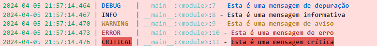

# Funções em Python - ETL com Pandas, JSON e Parquet

Para realizar uma ETL (Extract, Transform, Load) simples utilizando Python e a biblioteca Pandas, vamos seguir os seguintes passos:

Extract: Ler os dados de um arquivo JSON.

Transform: Concatenar os dados extraídos em um único DataFrame e aplicar uma transformação. A transformação específica dependerá dos dados, mas vamos assumir uma operação simples como um exemplo.

Load: Salvar o DataFrame resultante em um arquivo CSV ou PARQUET.

## Selecionando a raiz do projeto:


```python
import os
os.getcwd()
os.chdir('/home/jcnok/bootcamps/bootcamp-jornada-de-dados_2024/aula_08')
os.getcwd()
```


    '/home/jcnok/bootcamps/bootcamp-jornada-de-dados_2024/aula_08'


## Loguru: Simplificando o Registro em Python


O Loguru é uma biblioteca de registro (logging) para Python que simplifica bastante o processo de registro de mensagens de registro (logs) em aplicativos Python. Ele oferece uma API fácil de usar e poderosa para configurar e gerenciar logs em seus projetos.

### Principais Características

1. **API Simples**: O Loguru oferece uma API muito simples e intuitiva para registro de mensagens. Você pode facilmente configurar o registro com apenas algumas linhas de código.

2. **Níveis de Log Personalizáveis**: Ele fornece vários níveis de log predefinidos (por exemplo, DEBUG, INFO, WARNING, ERROR, etc.) e também permite a definição de níveis de log personalizados conforme necessário.

3. **Formatação Flexível**: Você pode personalizar facilmente o formato das mensagens de log de acordo com suas necessidades. O Loguru oferece suporte a formatação de mensagem flexível e extensível.

4. **Suporte a Threads e Processos**: Loguru lida automaticamente com problemas de concorrência em aplicativos que usam várias threads ou processos, garantindo que as mensagens de log sejam registradas corretamente e sem conflitos.

5. **Integração com Outras Ferramentas**: Ele se integra facilmente com outras ferramentas e bibliotecas, como Flask, Django, e outras ferramentas populares de registro em Python.

### Conclusão

O Loguru simplifica o processo de registro de mensagens de log em aplicativos Python, oferecendo uma API fácil de usar, flexibilidade na formatação de mensagens e uma série de recursos úteis para gerenciamento eficaz de logs. É uma escolha popular entre os desenvolvedores Python devido à sua simplicidade e poder.


### O que é Logging?

Logging é o processo de gravar mensagens que documentam os eventos que ocorrem durante a execução de um software. Essas mensagens podem indicar progresso da execução, falhas, erros, ou outras informações úteis. O logging é crucial para desenvolvimento e manutenção de software, pois permite aos desenvolvedores e administradores de sistema entender o que o aplicativo está fazendo, diagnosticar problemas e monitorar o desempenho em produção.


### Instalação:


```python
!poetry add loguru -q
```

### Como usar:

* **Configuração Básica e Registro de Mensagens Simples:**


```python
from loguru import logger

# Configuração básica
logger.add("log/app.log", rotation="5 MB", level="WARNING")

# Exemplos de registro de mensagens
logger.debug("Esta é uma mensagem de depuração")
logger.info("Esta é uma mensagem informativa")
logger.warning("Esta é uma mensagem de aviso")
logger.error("Esta é uma mensagem de erro")
logger.critical("Esta é uma mensagem crítica")

```



* **Agora vamos acessar o arquivo app.log e conferir que ele só salvou os logs de level "WARNING".**


```python
# %load log/app.log
2024-04-09 01:16:32.796 | WARNING  | __main__:<module>:9 - Esta é uma mensagem de aviso
2024-04-09 01:16:32.801 | ERROR    | __main__:<module>:10 - Esta é uma mensagem de erro
2024-04-09 01:16:32.805 | CRITICAL | __main__:<module>:11 - Esta é uma mensagem crítica

```

* **Veja que o level "WARNING" não salva os logs do tipo 'INFO' e 'DEBUB'.**
* **Assim podemos configurar os níveis de logs conforme a necessidade.**

### Personalização dos logs.

* **Personalizando o formato das mensagens:**


```python
from loguru import logger

# Configuração com formato personalizado
logger.add("log/app.log", format="{time} - {level} - {message}", level="INFO")

# Exemplo de registro de mensagem com contexto
logger.info("Usuário {user} fez login", user="Julio Okuda")
```


* **Acessando o conteúdo do arquivo app.log:**


```python
# %load log/app.log
2024-04-09 01:16:32.796 | WARNING  | __main__:<module>:9 - Esta é uma mensagem de aviso
2024-04-09 01:16:32.801 | ERROR    | __main__:<module>:10 - Esta é uma mensagem de erro
2024-04-09 01:16:32.805 | CRITICAL | __main__:<module>:11 - Esta é uma mensagem crítica
2024-04-09T01:20:43.014364-0300 - INFO - Usuário Julio Okuda fez login

```

* **Tratamento de exceções**


```python
from loguru import logger

try:
    # Algum código que pode gerar uma exceção
    resultado = 1 / 0
except Exception as e:
    # Registro da exceção com o método exception()
    logger.exception("Ocorreu um erro inesperado: {exception}", exception=str(e))

```


Usando logger.exception(), Loguru automaticamente captura e loga o traceback da exceção, o que é extremamente útil para diagnóstico de erros.

* **Vamos criar um decorador utilizando o Loguru para adicionar automaticamente logs a qualquer função Python. Isso nos permite registrar automaticamente quando uma função é chamada e quando ela termina, junto com qualquer informação relevante, como argumentos da função e o resultado retornado (ou exceção lançada).**

* **Agora, vamos ao código do decorador:**


```python
%%writefile src/utils/log_decorator.py
# decorator para registro de logs
from loguru import logger

def log_decorator(func):
    """
    Decorador para registro de chamadas de função com o Loguru.

    Args:
        func (callable): Função a ser decorada.

    Returns:
        callable: Função decorada.
    """
    def wrapper(*args, **kwargs):
        """
        Função interna que envolve a função original e realiza o registro.

        Args:
            *args: Argumentos posicionais passados para a função.
            **kwargs: Argumentos de palavras-chave passados para a função.

        Returns:
            Qualquer: Resultado da função original.

        Raises:
            Exception: Se a função original lançar uma exceção.
        """
        # Registra a chamada da função com os argumentos e palavras-chave
        logger.info(f"Chamando '{func.__name__}' com {args} e {kwargs}")

        try:
            # Chama a função original e captura o resultado
            result = func(*args, **kwargs)
            # Registra o retorno da função
            logger.info(f"'{func.__name__}' retornou {result}")
            return result
        except Exception as e:
            # Registra a exceção se a função original lançar uma exceção
            logger.exception(f"'{func.__name__}' lançou uma exceção: {e}")
            # Propaga a exceção para cima na cadeia de chamadas
            raise

    return wrapper

```

    Writing src/utils/log_decorator.py


### Uso e Execução do Decorador de Registro com Loguru

O decorador `log_decorator` é uma ferramenta útil para registrar chamadas de função em aplicativos Python usando a biblioteca Loguru. Este decorador pode ser aplicado a qualquer função para automatizar o registro de suas chamadas e resultados.

#### Como Usar o Decorador

Para usar o decorador `log_decorator`, siga estas etapas:

1. **Importe o Decorador**: Importe o decorador `log_decorator` de onde ele estiver definido no seu código.

2. **Aplique o Decorador**: Aplique o decorador `log_decorator` à função que deseja registrar. Por exemplo:

    ```python
    @log_decorator
    def minha_funcao(parametro):
        # Corpo da função
        pass
    ```

    Isso irá decorar a função `minha_funcao` com o decorador de registro, permitindo que todas as suas chamadas sejam registradas automaticamente.

#### Execução do Decorador

Quando uma função decorada com `log_decorator` é chamada, o decorador entra em ação:

1. **Registro de Chamada**: O decorador registra a chamada da função, incluindo os argumentos passados.

2. **Execução da Função Original**: O decorador chama a função original com os argumentos fornecidos.

3. **Registro de Resultado**: Se a função for executada com sucesso, o decorador registra o resultado retornado.

4. **Gestão de Exceções**: Se a função lançar uma exceção durante a execução, o decorador registra a exceção e a propaga para cima na cadeia de chamadas.


### Como Utilizar o Decorador

Agora, veja como aplicar o `log_decorator` a uma função:


```python
#primeir devemos imporar o decorador
from src.utils.log_decorator import log_decorator
@log_decorator
def soma(a, b):
    return a + b
```

* **Veja um exemplo de uma função bem simples usando o decorador que acabamos de criar**:


```python
# Execução da função soma
soma(5,3)
```


* **O decorator encapsulou a função e já imprimiu os logs do tipo INFO.**
* **Será que o log foi registrado no app.log?**
  * Como havia configurado o level para "INFO" esse log, deve estar registrado no arquivo vamos conferir.


```python
# %load log/app.log
2024-04-09 01:16:32.796 | WARNING  | __main__:<module>:9 - Esta é uma mensagem de aviso
2024-04-09 01:16:32.801 | ERROR    | __main__:<module>:10 - Esta é uma mensagem de erro
2024-04-09 01:16:32.805 | CRITICAL | __main__:<module>:11 - Esta é uma mensagem crítica
2024-04-09T01:20:43.014364-0300 - INFO - Usuário Julio Okuda fez login
2024-04-09T01:54:01.939913-0300 - INFO - Chamando 'soma' com (5, 3) e {}
2024-04-09T01:54:01.946493-0300 - INFO - 'soma' retornou 8

```

* **Realizando um teste de falha**:


```python
# realizando uma soma que irá falhar
soma(3, "3")
```

* **Vamos acessar o arquivo de log**:


```python
# %load log/app.log
2024-04-09 01:16:32.796 | WARNING  | __main__:<module>:9 - Esta é uma mensagem de aviso
2024-04-09 01:16:32.801 | ERROR    | __main__:<module>:10 - Esta é uma mensagem de erro
2024-04-09 01:16:32.805 | CRITICAL | __main__:<module>:11 - Esta é uma mensagem crítica
2024-04-09T01:20:43.014364-0300 - INFO - Usuário Julio Okuda fez login
2024-04-09T01:54:01.939913-0300 - INFO - Chamando 'soma' com (5, 3) e {}
2024-04-09T01:54:01.946493-0300 - INFO - 'soma' retornou 8
2024-04-09T02:04:21.395570-0300 - INFO - Chamando 'soma' com (3, '3') e {}
2024-04-09 02:04:21.402 | ERROR    | src.utils.log_decorator:wrapper:39 - 'soma' lançou uma exceção: unsupported operand type(s) for +: 'int' and 'str'
Traceback (most recent call last):

  File "/home/jcnok/.pyenv/versions/3.10.13/lib/python3.10/runpy.py", line 196, in _run_module_as_main
    return _run_code(code, main_globals, None,
           │         │     └ {'__name__': '__main__', '__doc__': 'Entry point for launching an IPython kernel.\n\nThis is separate from the ipykernel pack...
           │         └ <code object <module> at 0x7f795a3533c0, file "/home/jcnok/bootcamps/bootcamp-jornada-de-dados_2024/.venv/lib/python3.10/site...
           └ <function _run_code at 0x7f795a35fac0>
  File "/home/jcnok/.pyenv/versions/3.10.13/lib/python3.10/runpy.py", line 86, in _run_code
    exec(code, run_globals)
         │     └ {'__name__': '__main__', '__doc__': 'Entry point for launching an IPython kernel.\n\nThis is separate from the ipykernel pack...
         └ <code object <module> at 0x7f795a3533c0, file "/home/jcnok/bootcamps/bootcamp-jornada-de-dados_2024/.venv/lib/python3.10/site...
  File "/home/jcnok/bootcamps/bootcamp-jornada-de-dados_2024/.venv/lib/python3.10/site-packages/ipykernel_launcher.py", line 18, in <module>
    app.launch_new_instance()
    │   └ <bound method Application.launch_instance of <class 'ipykernel.kernelapp.IPKernelApp'>>
    └ <module 'ipykernel.kernelapp' from '/home/jcnok/bootcamps/bootcamp-jornada-de-dados_2024/.venv/lib/python3.10/site-packages/i...
  File "/home/jcnok/bootcamps/bootcamp-jornada-de-dados_2024/.venv/lib/python3.10/site-packages/traitlets/config/application.py", line 1075, in launch_instance
    app.start()
    │   └ <function IPKernelApp.start at 0x7f79576943a0>
    └ <ipykernel.kernelapp.IPKernelApp object at 0x7f795a2f9030>
  File "/home/jcnok/bootcamps/bootcamp-jornada-de-dados_2024/.venv/lib/python3.10/site-packages/ipykernel/kernelapp.py", line 739, in start
    self.io_loop.start()
    │    │       └ <function BaseAsyncIOLoop.start at 0x7f7957694ee0>
    │    └ <tornado.platform.asyncio.AsyncIOMainLoop object at 0x7f79574f4220>
    └ <ipykernel.kernelapp.IPKernelApp object at 0x7f795a2f9030>
  File "/home/jcnok/bootcamps/bootcamp-jornada-de-dados_2024/.venv/lib/python3.10/site-packages/tornado/platform/asyncio.py", line 205, in start
    self.asyncio_loop.run_forever()
    │    │            └ <function BaseEventLoop.run_forever at 0x7f7959232f80>
    │    └ <_UnixSelectorEventLoop running=True closed=False debug=False>
    └ <tornado.platform.asyncio.AsyncIOMainLoop object at 0x7f79574f4220>
  .
  .
  .
  .

  File "/home/jcnok/bootcamps/bootcamp-jornada-de-dados_2024/.venv/lib/python3.10/site-packages/IPython/core/interactiveshell.py", line 3577, in run_code
    exec(code_obj, self.user_global_ns, self.user_ns)
         │         │    │               │    └ {'__name__': '__main__', '__doc__': 'Automatically created module for IPython interactive environment', '__package__': None, ...
         │         │    │               └ <ipykernel.zmqshell.ZMQInteractiveShell object at 0x7f79574f4d00>
         │         │    └ <property object at 0x7f7958603b00>
         │         └ <ipykernel.zmqshell.ZMQInteractiveShell object at 0x7f79574f4d00>
         └ <code object <module> at 0x7f79442ccc90, file "/tmp/ipykernel_15051/3086203311.py", line 1>

  File "/tmp/ipykernel_15051/3086203311.py", line 2, in <module>
    soma(3, "3")
    └ <function log_decorator.<locals>.wrapper at 0x7f7944922830>

> File "/home/jcnok/bootcamps/bootcamp-jornada-de-dados_2024/aula_08/src/utils/log_decorator.py", line 33, in wrapper
    result = func(*args, **kwargs)
             │     │       └ {}
             │     └ (3, '3')
             └ <function soma at 0x7f7944921750>

  File "/tmp/ipykernel_15051/1321141747.py", line 5, in soma
    return a + b
           │   └ '3'
           └ 3

TypeError: unsupported operand type(s) for +: 'int' and 'str'

```

* **Veja que ele salvou o erro com todos os detalhes, por isso determinar o nível de log de acordo com a necessidade é importante, pois não seria interessante salvar todo tipo de log, só iria poluir o registro dificultando a resolução do problema.**


```python
# teste em caso de falha
```

Ao decorar as funções `soma` e `falha` com `@log_decorator`, automaticamente logamos a entrada e saída (ou exceção) dessas funções sem alterar o corpo delas. Isso é especialmente útil para debugar, monitorar a performance de aplicações ou simplesmente manter um registro de quais funções estão sendo chamadas e com quais argumentos.


#### Benefícios do Uso de Decoradores com Loguru


O uso de decoradores em conjunto com o Loguru fornece uma abordagem elegante e poderosa para adicionar logs a aplicações Python. Sem a necessidade de modificar o corpo da função, podemos facilmente adicionar funcionalidades de logging, o que torna o código mais limpo, mantém a separação de preocupações e facilita a manutenção e o debugging.

Além disso, ao centralizar a lógica de logging no decorador, promovemos a reutilização de código e garantimos uma forma consistente de logar informações através de diferentes partes de uma aplicação.


### Conclusão


O Loguru oferece uma abordagem moderna e conveniente para logging em Python, simplificando muitos aspectos que requerem configuração manual detalhada com o módulo de logging padrão do Python. Seja para desenvolvimento, depuração ou produção, adicionar logging ao seu aplicativo com Loguru pode melhorar significativamente a visibilidade e a capacidade de diagnóstico do seu código.


### Desafio


```python
%%writefile src/etl.py
# Desafio ETL
import os
from typing import List
import pandas as pd
import glob

def ler_arquivos_json(path_origin: str) -> pd.DataFrame:
    caminho_arquivos = os.path.join(path_origin, '*.json')
    arquivos_json = glob.glob(caminho_arquivos)
    if not arquivos_json:
        raise ValueError("Nenhum arquivo JSON encontrado na pasta especificada.")
    dfs = [pd.read_json(arquivo) for arquivo in arquivos_json]
    return pd.concat(dfs, ignore_index=True)

def transformar_dataframe(df: pd.DataFrame) -> pd.DataFrame:
    df['Receita'] = df['Quantidade'] * df['Venda']
    return df

def carregar_dataframe(df: pd.DataFrame, path_to_save: str, format_to_save: List[str]) -> None:
    for formato in format_to_save:
        if formato.lower() == 'csv':
            caminho_salvar_csv = path_to_save + '.csv'
            df.to_csv(caminho_salvar_csv, index=False)
            print(f"DataFrame salvo em '{caminho_salvar_csv}'")
        elif formato.lower() == 'parquet':
            caminho_salvar_parquet = path_to_save + '.parquet'
            df.to_parquet(caminho_salvar_parquet, index=False)
            print(f"DataFrame salvo em '{caminho_salvar_parquet}'")
        else:
            raise ValueError("Formato especificado não suportado. Use 'csv' ou 'parquet'.")

def pipeline(path_origin: str, path_to_save: str, format_to_save: List[str]) -> None:
    df = ler_arquivos_json(path_origin)
    df = transformar_dataframe(df)
    carregar_dataframe(df, path_to_save, format_to_save)

if __name__ == "__main__":
    path_to_save = 'data/process/dados_processados'
    path_origin = 'data/'
    format_to_save = ['csv','parquet']  # ou 'parquet'

    pipeline(path_origin, path_to_save, format_to_save)

```

    Writing src/etl.py


```python
!python src/etl.py
```

    DataFrame salvo em 'data/process/dados_processados.csv'
    DataFrame salvo em 'data/process/dados_processados.parquet'
