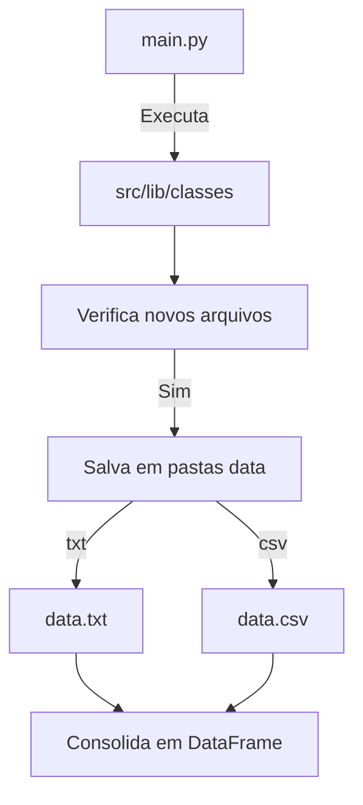

# Aula 12 - classes abstratas e polimorfismo:

**Classes Abstratas:**

Imagine que você está construindo uma casa e precisa de um modelo padrão para todas as casas que serão construídas. Uma classe abstrata em Python é como um modelo para outras classes. Ela define métodos que devem ser implementados por suas subclasses, mas não fornece uma implementação real desses métodos.

Por exemplo, em nosso modelo de casa, podemos ter um método abstrato chamado `construir()` que todas as subclasses devem implementar. Cada tipo de casa (como Casa de Madeira, Casa de Tijolos, etc.) deve ter sua própria implementação desse método de construção, mas todas devem seguir o mesmo modelo básico.

**Polimorfismo:**

Agora, suponha que temos diferentes tipos de veículos, como carro, bicicleta e avião. Todos eles têm a capacidade de se locomover, mas cada um se move de maneira diferente. Aqui é onde entra o polimorfismo.

O polimorfismo em Python nos permite tratar objetos de diferentes classes de maneira uniforme. Por exemplo, podemos ter uma função `mover(veiculo)` que aceita qualquer tipo de veículo e chama seu método `mover()` correspondente. Mesmo que cada veículo tenha sua própria maneira única de se mover, podemos chamar o mesmo método `mover()` para todos eles.

Então, para resumir:
- Classes Abstratas definem métodos que devem ser implementados por suas subclasses.
- O Polimorfismo nos permite tratar objetos de diferentes classes de maneira uniforme, chamando os mesmos métodos em cada um deles.

## Desafio:

* **Imagine esta situação:** você está liderando um projeto em uma empresa de tecnologia. Todos os dias, sua equipe é bombardeada com uma grande quantidade de arquivos de dados, alguns em formato CSV e outros em TXT, todos cheios de informações preciosas. Sua missão? Juntar todos esses dados dispersos em um só lugar para desbloquear insights valiosos.

* **Aqui está o desafio:** duas pastas, dois tipos de arquivo, e a necessidade urgente de consolidar tudo isso em um único DataFrame. Essa é a realidade enfrentada por muitos profissionais, desde iniciantes até os mais experientes.

* Então, como podemos resolver esse desafio de maneira simples e eficaz, usando classes para garantir que, à medida que o projeto evolui e novos formatos de arquivo são introduzidos, não seja necessário recomeçar do zero? Como podemos unir esses dados dispersos em um único DataFrame, pronto para análise e exploração?


## Possível escopo do projeto:




```python
# Selecionando a raiz do projeto:
import os
os.chdir('/home/jcnok/bootcamps/bootcamp-jornada-de-dados_2024/aula_12')
os.getcwd()
```


    '/home/jcnok/bootcamps/bootcamp-jornada-de-dados_2024/aula_12'


```python
# Conferindo se o kernel está usando o ambiente virtual:
import site
print(site.getsitepackages())
```

    ['/home/jcnok/bootcamps/bootcamp-jornada-de-dados_2024/.venv/lib/python3.10/site-packages']


## Desenvolvendo as classes:

### Criando classes abstratada com a lib [abs(Abstract Base Classes)](https://docs.python.org/pt-br/3/library/abc.html#module-abc)

* **Código:**


```python
%%writefile src/lib/classes/AbstractDataSource.py
#script para utilizar classes abstratas.
from abc import ABC, abstractmethod

class AbstractDataSource(ABC):
    """Abstract class for defining data source operations."""

    @abstractmethod
    def start(self):
        """Method to start the data source."""
        raise NotImplementedError("Method not implemented")

    @abstractmethod
    def get_data(self):
        """Method to retrieve data from the source."""
        raise NotImplementedError("Method not implemented")

    @abstractmethod
    def transform_data_to_df(self):
        """Method to transform data to a DataFrame."""
        raise NotImplementedError("Method not implemented")

    @abstractmethod
    def save_data(self):
        """Method to save data."""
        raise NotImplementedError("Method not implemented")

    def hello_world(self):
        """Simple method to print 'Hello World'."""
        print('Hello World')

```

    Writing src/lib/classes/AbstractDataSource.py


A lib abc do Python (Abstract Base Classes) fornece uma estrutura para criar classes abstratas em Python. Classes abstratas são aquelas que não podem ser instanciadas diretamente, mas são usadas como modelos para outras classes que as herdam.

O ABC é uma classe base que indica que a classe derivada é uma classe abstrata. Já o abstractmethod é um decorador usado para indicar que um método em uma classe abstrata é obrigatório em suas subclasses concretas. Em outras palavras, quando uma classe herda de uma classe abstrata e não implementa um método decorado com @abstractmethod, uma exceção será lançada. Isso garante que as subclasses implementem métodos específicos definidos na classe abstrata.

Esta é uma classe abstrata destinada a definir as operações básicas de uma fonte de dados. Ela fornece métodos abstratos para iniciar a fonte de dados, obter os dados, transformá-los em um DataFrame e salvar os dados.

Métodos abstratos:

* start(): Método para iniciar a fonte de dados.
* get_data(): Método para recuperar os dados da fonte.
* transform_data_to_df(): Método para transformar os dados em um DataFrame.
* save_data(): Método para salvar os dados.

* **vantagens:**

Usar classes abstratas e herança em Python, em vez de apenas funções simples, oferece algumas vantagens importantes:

1. **Organização e Estruturação do Código**: Ao usar classes e herança, você pode organizar seu código de maneira mais estruturada e intuitiva. Isso facilita a compreensão do código e a manutenção futura.

2. **Reutilização de Código**: A herança permite que você reutilize facilmente o código em várias partes do seu programa. Você pode definir comportamentos comuns em uma classe base e depois estender essa classe para adicionar funcionalidades específicas em subclasses.

3. **Polimorfismo**: O polimorfismo, uma característica da herança, permite que objetos de diferentes classes sejam tratados de maneira uniforme. Isso significa que você pode usar uma classe base para manipular objetos de suas subclasses, sem precisar se preocupar com os detalhes específicos de cada uma.

4. **Encapsulamento**: Classes abstratas e herança também facilitam a implementação do conceito de encapsulamento, permitindo que você agrupe dados e comportamentos relacionados em um único objeto.

Portanto, embora você possa alcançar resultados semelhantes usando funções simples, o uso de classes abstratas e herança em Python oferece uma abordagem mais estruturada, modular e flexível para lidar com problemas complexos e cenários em que a hierarquia e a composição de objetos são importantes.

### Criação do arquivo __init__.py:

Quando você coloca um arquivo chamado __init__.py em uma pasta, você está dizendo ao Python que essa pasta é especial e contém código Python que pode ser importado como um pacote. É como colocar uma etiqueta na caixa de brinquedos para dizer "Esta caixa é importante e contém coisas legais dentro".

* **Código**:


```python
%%writefile src/lib/classes/__init__py
# Este arquivo inicializa o pacote da pasta classes, fornecendo acesso às classes do sistema.

```

    Writing src/lib/classes/__init__py


```python
%%writefile src/lib/__init__py
# Este arquivo inicializa o pacote da pasta lib, fornecendo acesso às classes do sistema.
```

    Writing src/lib/__init__py


### Criando a classe FilesSources:

* **Código:**


```python
%%writefile src/lib/classes/FilesSources.py
# Class FilesSources
import os
from src.lib.classes.AbstractDataSource import AbstractDataSource

class FilesSources(AbstractDataSource):
    """
    A class to represent a data source for files.

    Attributes
    ----------
    previous_files : list
        A list to store the names of the previously processed files.
    folder_path : str
        The path to the folder containing the files.

    Methods
    -------
    create_path()
        Creates the folder path if it does not exist.
    check_for_new_files()
        Checks for new files in the folder.
    get_data()
        Placeholder method to get data from files.
    transform_data_to_df()
        Placeholder method to transform data to DataFrame.
    save_data()
        Placeholder method to save data.
    show_files()
        Prints the list of previously processed files.
    start()
        Initializes the data source.
    """

    def __init__(self):
        """Initialize the FilesSources class."""
        self.previous_files = []
        self.start()

    def create_path(self):
        """Create the folder path if it does not exist."""
        current_directory = os.getcwd()
        self.folder_path = os.path.join(current_directory, 'data', 'extension_files')
        if not os.path.exists(self.folder_path):
            os.makedirs(self.folder_path)

    def check_for_new_files(self):
        """Check for new files in the folder."""
        current_files = os.listdir(self.folder_path)
        new_files = [file for file in current_files if file not in self.previous_files]

        if new_files:
            print("New files detected:", new_files)
            # Update the list of previous files
            self.previous_files = current_files
        else:
            print("No new files detected.")

    def get_data(self):
        """Placeholder method to get data from files."""
        pass

    def transform_data_to_df(self):
        """Placeholder method to transform data to DataFrame."""
        pass

    def save_data(self):
        """Placeholder method to save data."""
        pass

    def show_files(self):
        """Print the list of previously processed files."""
        print(self.previous_files)

    def start(self):
        """Initialize the data source."""
        self.create_path()

```

    Overwriting src/lib/classes/FilesSources.py


### Documentação: FilesSources Class

A classe `FilesSources` é responsável por gerenciar uma fonte de dados para arquivos. Ela fornece métodos para criar, verificar e manipular arquivos em uma determinada pasta.

#### Attributes

- **previous_files** (`list`): Uma lista para armazenar os nomes dos arquivos previamente processados.
- **folder_path** (`str`): O caminho para a pasta contendo os arquivos.

#### Methods

##### `create_path()`

Este método cria o caminho da pasta se ela não existir.

##### `check_for_new_files()`

Este método verifica se há novos arquivos na pasta.

##### `get_data()`

Este método é um espaço reservado para obter dados dos arquivos.

##### `transform_data_to_df()`

Este método é um espaço reservado para transformar os dados em um DataFrame.

##### `save_data()`

Este método é um espaço reservado para salvar os dados.

##### `show_files()`

Este método imprime a lista de arquivos previamente processados.

##### `start()`

Este método inicializa a fonte de dados.

#### Example Usage

```python
from lib.classes.FilesSources import FilesSources

# Initialize FilesSources object
file_source = FilesSources()

# Check for new files
file_source.check_for_new_files()

# Show previously processed files
file_source.show_files()
```

Este exemplo demonstra como usar a classe `FilesSources` para gerenciar arquivos em uma determinada pasta. Ao instanciar o objeto `FilesSources`, o método `start()` é chamado automaticamente para inicializar a fonte de dados. Em seguida, o método `check_for_new_files()` é usado para verificar se há novos arquivos na pasta. Por fim, o método `show_files()` é usado para exibir os arquivos previamente processados.


```python
from src.lib.classes.FilesSources import FilesSources

# Initialize FilesSources object
file_source = FilesSources()

# Check for new files
file_source.check_for_new_files()

# Show previously processed files
file_source.show_files()
```

    No new files detected.
    []


### Criando a classe CsvSource:

* **Código**:


```python
%%writefile src/lib/classes/CsvSource.py
#Classe CsvSource
import os
import pandas as pd
from src.lib.classes.FilesSources import FilesSources

class CsvSource(FilesSources):
    """
    A class to represent a CSV data source.

    Attributes:
    -----------
    folder_path : str
        The path to the folder containing CSV files.
    previous_files : list
        A list of previously detected CSV files in the folder.

    Methods:
    --------
    create_path():
        Creates the folder path to store CSV files if it does not exist.
    check_for_new_files():
        Checks for new CSV files in the folder and updates the list of previous files.
    get_data():
        Retrieves data from CSV files in the specified folder.
    transform_data_to_df():
        Transforms the retrieved data into a DataFrame.
    """

    def create_path(self):
        """
        Create the folder path to store CSV files if it does not exist.
        """
        current_directory = os.getcwd()
        self.folder_path = os.path.join(current_directory, 'data', 'csv_files')
        if not os.path.exists(self.folder_path):
            os.makedirs(self.folder_path)

    def check_for_new_files(self):
        """
        Check for new CSV files in the folder and update the list of previous files.
        """
        current_files = os.listdir(self.folder_path)
        new_files = [file for file in current_files if file not in self.previous_files and file.endswith('.csv')]

        if new_files:
            print("New files detected:", new_files)
            # Update the list of previous files
            self.previous_files = current_files
        else:
            print("No new CSV files detected.")
            self.get_data()

    def get_data(self):
        """
        Retrieve data from CSV files in the specified folder.
        """
        # Implement getting data from CSV files in the specified folder
        data_frames = []
        for file_path in self.previous_files:
            try:
                path = f'{self.folder_path}/{file_path}'
                data = pd.read_csv(path)
                data_frames.append(data)
            except Exception as e:
                print("An error occurred while reading the CSV file:", e)
        if data_frames:
            self.combined_data = pd.concat(data_frames, ignore_index=True)
            print(self.combined_data)
            return self.combined_data
        else:
            return None

    def transform_data_to_df(self):
        """
        Transform the retrieved data into a DataFrame.
        """
        return super().transform_data_to_df()

```

    Overwriting src/lib/classes/CsvSource.py


### Documentação da Classe CsvSource

A classe `CsvSource` é responsável por lidar com fontes de dados no formato CSV.

#### Atributos

- **folder_path** (str): O caminho para a pasta que contém os arquivos CSV.
- **previous_files** (list): Uma lista dos arquivos CSV previamente detectados na pasta.

#### Métodos

##### `create_path()`

Este método cria o caminho da pasta para armazenar os arquivos CSV, caso ela não exista.

##### `check_for_new_files()`

Este método verifica se existem novos arquivos CSV na pasta e atualiza a lista de arquivos previamente detectados.

##### `get_data()`

Este método recupera os dados dos arquivos CSV na pasta especificada.

##### `transform_data_to_df()`

Este método transforma os dados recuperados em um DataFrame.

#### Observações

- Certifique-se de que os arquivos CSV estejam na pasta especificada antes de usar os métodos `check_for_new_files()` e `get_data()`.
- Os arquivos CSV devem estar em formato correto para garantir uma leitura adequada.

#### Exemplo de uso:


```python
from src.lib.classes.CsvSource import CsvSource
# Criar uma instância de CsvSource
csv_source = CsvSource()

# Criar o caminho da pasta para armazenar arquivos CSV
csv_source.create_path()

# Verificar se há novos arquivos na pasta
csv_source.check_for_new_files()

# Recuperar os dados dos arquivos CSV
dados = csv_source.get_data()

# Transformar os dados em um DataFrame
df = csv_source.transform_data_to_df()
```

    No new CSV files detected.


### Criando a Classe TxtSource:

* **Código:**


```python
%%writefile src/lib/classes/TxtSource.py
#Class TxtSource
import os
import pandas as pd
from src.lib.classes.FilesSources import FilesSources


class TxtSource(FilesSources):
    """
    A class to represent a TXT data source.

    Attributes:
    -----------
    folder_path : str
        The path to the folder containing TXT files.
    previous_files : list
        A list of previously detected TXT files in the folder.

    Methods:
    --------
    create_path():
        Create the folder path to store TXT files if it does not exist.
    check_for_new_files():
        Check for new TXT files in the folder and update the list of previous files.
    get_data():
        Retrieve data from TXT files in the specified folder.
    transform_data_to_df():
        Transform the retrieved data into a DataFrame.
    """

    def create_path(self):
        """
        Create the folder path to store TXT files if it does not exist.
        """
        current_directory = os.getcwd()
        self.folder_path = os.path.join(current_directory, 'data', 'txt_files')
        if not os.path.exists(self.folder_path):
            os.makedirs(self.folder_path)

    def check_for_new_files(self):
        """
        Check for new TXT files in the folder and update the list of previous files.
        """
        current_files = os.listdir(self.folder_path)
        new_files = [file for file in current_files if file not in self.previous_files and file.endswith('.txt')]

        if new_files:
            print("New TXT files detected:", new_files)
            # Update the list of previous files
            self.previous_files = current_files
        else:
            print("No new TXT files detected.")
            self.get_data()

    def get_data(self):
        """
        Retrieve data from TXT files in the specified folder.
        """
        # Implement getting data from TXT files in the specified folder
        data_frames = []
        for file_path in self.previous_files:
            try:
                path = os.path.join(self.folder_path, file_path)
                data = pd.read_csv(path, sep='\t')  # Assume that the TXT files are tab-separated
                data_frames.append(data)
            except Exception as e:
                print("An error occurred while reading the TXT file:", e)
        if data_frames:
            self.combined_data = pd.concat(data_frames, ignore_index=True)
            print(self.combined_data)
            return self.combined_data
        else:
            return None

```

    Overwriting src/lib/classes/TxtSource.py


### Classe TxtSource

A classe `TxtSource` é responsável por lidar com fontes de dados no formato TXT.

#### Métodos

##### `create_path()`

Este método cria o caminho para a pasta que armazena os arquivos TXT.

##### `check_for_new_files()`

Este método verifica se existem novos arquivos TXT na pasta especificada. Se houver novos arquivos, atualiza a lista de arquivos anteriores. Caso contrário, chama o método `get_data()`.

##### `get_data()`

Este método recupera os dados dos arquivos TXT na pasta especificada. Os arquivos devem estar tabulados para garantir uma leitura adequada.

#### Observações

- Certifique-se de que os arquivos TXT estão tabulados para garantir uma leitura correta dos dados.


#### Exemplo de uso:


```python
# Importe a classe TxtSource
from src.lib.classes.TxtSource import TxtSource

# Crie uma instância da classe TxtSource
txt_source = TxtSource()

# Crie o caminho para a pasta que contém os arquivos TXT
txt_source.create_path()

# Verifique se existem novos arquivos TXT na pasta especificada
txt_source.check_for_new_files()

# Obtenha os dados dos arquivos TXT
data = txt_source.get_data()

# Exiba os dados combinados
print(data)
```

    No new TXT files detected.
    None


### Criando o Script Main.py:

* **Código:**


```python
# instalando a lib schedule
!poetry add schedule -q
```


```python
%%writefile src/__main__.py
# main
import schedule
import time
from src.lib.classes.CsvSource import CsvSource
from src.lib.classes.TxtSource import TxtSource

csv_source = CsvSource()
txt_source = TxtSource()

def check_for_new_files():
    """
    Check for new files in different data sources.

    This function checks for new CSV, TXT, and JSON files in their respective data sources.
    """
    csv_source.check_for_new_files()
    txt_source.check_for_new_files()

# Scheduling the execution of the check_for_new_files function every 10 seconds
schedule.every(10).seconds.do(check_for_new_files)

# Main loop
while True:
    schedule.run_pending()
    time.sleep(1)  # Waits for 1 second to prevent the loop from consuming too much processing power

```

    Writing src/__main__.py


### Script de Verificação de Novos Arquivos

Este script tem como objetivo verificar novos arquivos em diferentes fontes de dados, como arquivos CSV, TXT. Ele utiliza a biblioteca `schedule` para agendar a verificação periódica e a biblioteca `time` para controlar o tempo de espera entre as execuções.

#### Funcionamento

O script é composto por duas partes principais:

1. **Definição das Fontes de Dados:**
   - `CsvSource`: Classe responsável por verificar novos arquivos CSV.
   - `TxtSource`: Classe responsável por verificar novos arquivos TXT.

2. **Verificação de Novos Arquivos:**
   - A função `check_for_new_files()` é responsável por chamar os métodos de verificação de novos arquivos de cada fonte de dados.
   - Essa função é agendada para ser executada a cada 10 segundos utilizando a biblioteca `schedule`.

#### Utilização

1. **Instalação das Dependências:**
   - Certifique-se de ter as bibliotecas `schedule` e `pandas` instaladas no seu ambiente Python.

2. **Execução do Script:**
   - Execute o script em um ambiente Python compatível.

3. **Verificação de Novos Arquivos:**
   - O script irá verificar periodicamente as pastas de dados especificadas para novos arquivos.
   - Se novos arquivos forem detectados, uma mensagem será exibida informando os arquivos detectados.

#### Requisitos do Sistema

- Python 3.x
- Bibliotecas: `schedule`, `pandas`

#### Exemplo de Uso

```bash
python check_files.py
```

### Criando alguns arquivos de exemplo para testes:


```python
%%writefile data/txt_files/exemplo1.txt
id,name
1,João
2,Maria
3,Carlos
4,Ana
5,Pedro
```

    Writing data/txt_files/exemplo1.txt


```python
%%writefile data/csv_files/exemplo1.csv
id,name
1,João
2,Maria
3,Carlos
4,Ana
5,Pedro
```

    Writing data/csv_files/exemplo1.csv


```python
%%writefile data/txt_files/exemplo2.txt
id,name
6,Luiza
7,Rafael
8,Laura
9,Marcos
10,Juliana
```

    Overwriting data/txt_files/exemplo2.txt


```python
%%writefile data/csv_files/exemplo2.csv
id,name
6,Luiza
7,Rafael
8,Laura
9,Marcos
10,Juliana
```

    Writing data/csv_files/exemplo2.csv


#### Agora podemos executar a Main e verificar que está funcionando corretamente:


```python
!python src/__main__.py
```

    New files detected: ['exemplo1.csv', 'exemplo2.csv']
    New TXT files detected: ['exemplo2.txt', 'exemplo1.txt']
    No new CSV files detected.
       id     name
    0   1     João
    1   2    Maria
    2   3   Carlos
    3   4      Ana
    4   5    Pedro
    5   6    Luiza
    6   7   Rafael
    7   8    Laura
    8   9   Marcos
    9  10  Juliana
    No new TXT files detected.
          id,name
    0     6,Luiza
    1    7,Rafael
    2     8,Laura
    3    9,Marcos
    4  10,Juliana
    5      1,João
    6     2,Maria
    7    3,Carlos
    8       4,Ana
    9     5,Pedro
    No new CSV files detected.
       id     name
    0   1     João
    1   2    Maria
    2   3   Carlos
    3   4      Ana
    4   5    Pedro
    5   6    Luiza
    6   7   Rafael
    7   8    Laura
    8   9   Marcos
    9  10  Juliana
    No new TXT files detected.
          id,name
    0     6,Luiza
    1    7,Rafael
    2     8,Laura
    3    9,Marcos
    4  10,Juliana
    5      1,João
    6     2,Maria
    7    3,Carlos
    8       4,Ana
    9     5,Pedro
    No new CSV files detected.
       id     name
    0   1     João
    1   2    Maria
    2   3   Carlos
    3   4      Ana
    4   5    Pedro
    5   6    Luiza
    6   7   Rafael
    7   8    Laura
    8   9   Marcos
    9  10  Juliana
    No new TXT files detected.
          id,name
    0     6,Luiza
    1    7,Rafael
    2     8,Laura
    3    9,Marcos
    4  10,Juliana
    5      1,João
    6     2,Maria
    7    3,Carlos
    8       4,Ana
    9     5,Pedro
    ^C
    Traceback (most recent call last):
      File "/home/jcnok/bootcamps/bootcamp-jornada-de-dados_2024/aula_12/src/__main__.py", line 31, in <module>
        time.sleep(
    KeyboardInterrupt


```python

```
