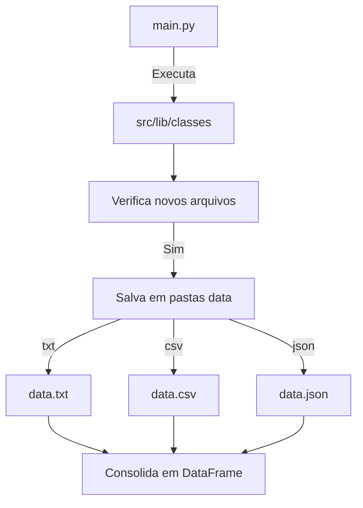

# Aula 13


```python

```


```python
import os
os.getcwd()
os.chdir('/home/jcnok/bootcamps/bootcamp-jornada-de-dados_2024/aula_13')
```

## Desafio

* **Situação**: Você deseja implementar um novo método além dos formatos csv e txt, uma api está fornecedo novos dados diariamente e deseja juntar esses arquivos que estão no formato json.

* **Aqui está o desafio:** adicionar uma nova pasta para os formatos .json, onde será necessário de consolidar tudo isso em um único DataFrame. Essa é a realidade enfrentada por muitos profissionais, desde iniciantes até os mais experientes.

* Então, como podemos resolver esse desafio de maneira simples e eficaz, como já usamos classes para garantir que, à medida que o projeto evolui e novos formatos de arquivo são introduzidos, não será necessário começar o projeto do zero.

**Possível escopo do projeto:**



### Criar a classe JsonSource.py


```python
%%writefile src/lib/classes/JsonSource.py
import os
import pandas as pd
from lib.classes.FilesSources import FilesSources

class JsonSource(FilesSources):
    """
    Classe para lidar com fontes de dados em formato JSON.

    Attributes:
    -----------
    folder_path : str
        O caminho para a pasta que contém os arquivos JSON.
    previous_files : list
        Uma lista dos arquivos JSON previamente detectados na pasta.
    """

    def create_path(self):
        """
        Cria o caminho da pasta para armazenar os arquivos JSON, se não existir.
        """
        current_directory = os.getcwd()
        self.folder_path = os.path.join(current_directory, 'data', 'json_files')
        if not os.path.exists(self.folder_path):
            os.makedirs(self.folder_path)

    def check_for_new_files(self):
        """
        Verifica se há novos arquivos JSON na pasta e atualiza a lista de arquivos anteriores.
        """
        current_files = os.listdir(self.folder_path)
        new_files = [file for file in current_files if file not in self.previous_files and file.endswith('.json')]

        if new_files:
            print("Novos arquivos JSON detectados:", new_files)
            # Atualiza a lista de arquivos anteriores
            self.previous_files = current_files
        else:
            print("Nenhum novo arquivo JSON detectado.")
            self.get_data()

    def read_json_file(self, file_path):
        """
        Lê um arquivo JSON e retorna os dados.

        Parameters:
        -----------
        file_path : str
            O caminho para o arquivo JSON.

        Returns:
        --------
        dict or None
            Os dados do arquivo JSON ou None se ocorrer um erro ao acessar o arquivo.
        """
        try:
            with open(file_path, 'r') as f:
                data = pd.read_json(f)
            return data
        except Exception as e:
            print("Erro ao acessar o JSON:", e)
            return None

    def get_data(self):
        """
        Obtém os dados dos arquivos JSON na pasta especificada.

        Returns:
        --------
        pandas.DataFrame
            Um DataFrame contendo os dados de todos os arquivos JSON.
        """
        data_frames = []
        for file_path in self.previous_files:
            if file_path.endswith('.json'):
                path = os.path.join(self.folder_path, file_path)
                json_data = self.read_json_file(path)
                if json_data is not None:
                    data_frames.append(json_data)
        if data_frames:
            combined_data = pd.concat(data_frames, ignore_index=True)
            print(combined_data)
            return combined_data
        else:
            return None

```

    Overwriting src/lib/classes/JsonSource.py


### Documentação do Script JSON Source

#### Introdução

Este script Python faz parte de um sistema projetado para lidar com diferentes fontes de dados, especificamente arquivos no formato JSON. Ele verifica regularmente uma pasta especificada em busca de novos arquivos JSON, lê esses arquivos e os armazena em uma estrutura de dados adequada para processamento posterior.

#### Estrutura do Script

O script consiste em uma classe `JsonSource` que herda de uma classe base `FilesSources`. Ele contém métodos para criar o caminho da pasta de origem, verificar a presença de novos arquivos JSON, ler os arquivos JSON e obter os dados desses arquivos.

#### Uso

Para utilizar o script, você precisa seguir estas etapas:

1. Certifique-se de ter o Python instalado em seu sistema.
2. Clone o repositório contendo o código-fonte do projeto.
3. Instale as dependências necessárias, caso haja alguma.
4. Execute o script Python `JsonSource.py`.

Ao ser executado, o script verificará regularmente a pasta especificada em busca de novos arquivos JSON. Se novos arquivos forem encontrados, eles serão lidos e seus dados serão armazenados para processamento adicional.

#### Estrutura de Arquivos

O script está estruturado da seguinte forma:

- `JsonSource.py`: O arquivo principal contendo a implementação da classe `JsonSource`.
- `FilesSources.py`: O arquivo contendo a classe base `FilesSources`.
- `lib/`: Uma pasta contendo outros arquivos e classes relacionados ao sistema.

#### Dependências

O script depende das seguintes bibliotecas Python:

- `os`: Biblioteca padrão do Python para interação com o sistema operacional.
- `json`: Biblioteca padrão do Python para trabalhar com dados JSON.
- `FilesSources`: Uma classe base fornecida pelo projeto para lidar com diferentes fontes de dados.


## Criando dois exemplos de arquivos do tipo json


```python
%%writefile data/json_files/exemplo01.json
[
    {"id": 1, "name": "João"},
    {"id": 2, "name": "Maria"},
    {"id": 3, "name": "Pedro"},
    {"id": 4, "name": "Ana"},
    {"id": 5, "name": "Carlos"}
]

```

    Writing data/json_files/exemplo01.json


```python
%%writefile data/json_files/exemplo02.json
[
    {"id": 11, "name": "Mariana"},
    {"id": 12, "name": "José"},
    {"id": 13, "name": "Carla"},
    {"id": 14, "name": "Lucas"},
    {"id": 15, "name": "Camila"}
]

```

    Writing data/json_files/exemplo02.json


## Executando a pipeline para conferir:


```python
!python src/__main__.py
```

    Novos arquivos CSV detectados: ['exemplo1.csv', 'exemplo2.csv']
    Novos arquivos TXT detectados: ['exemplo2.txt', 'exemplo1.txt']
    Novos arquivos JSON detectados: ['exemplo01.json', 'exemplo02.json']
    Nenhum novo arquivo CSV detectado.
       id     name
    0   1     João
    1   2    Maria
    2   3   Carlos
    3   4      Ana
    4   5    Pedro
    5   6    Luiza
    6   7   Rafael
    7   8    Laura
    8   9   Marcos
    9  10  Juliana
    Nenhum novo arquivo TXT detectado.
    Nenhum novo arquivo JSON detectado.
       id     name
    0   1     João
    1   2    Maria
    2   3    Pedro
    3   4      Ana
    4   5   Carlos
    5  11  Mariana
    6  12     José
    7  13    Carla
    8  14    Lucas
    9  15   Camila
    Nenhum novo arquivo CSV detectado.
       id     name
    0   1     João
    1   2    Maria
    2   3   Carlos
    3   4      Ana
    4   5    Pedro
    5   6    Luiza
    6   7   Rafael
    7   8    Laura
    8   9   Marcos
    9  10  Juliana
    Nenhum novo arquivo TXT detectado.
    Nenhum novo arquivo JSON detectado.
       id     name
    0   1     João
    1   2    Maria
    2   3    Pedro
    3   4      Ana
    4   5   Carlos
    5  11  Mariana
    6  12     José
    7  13    Carla
    8  14    Lucas
    9  15   Camila
    Nenhum novo arquivo CSV detectado.
       id     name
    0   1     João
    1   2    Maria
    2   3   Carlos
    3   4      Ana
    4   5    Pedro
    5   6    Luiza
    6   7   Rafael
    7   8    Laura
    8   9   Marcos
    9  10  Juliana
    Nenhum novo arquivo TXT detectado.
    Nenhum novo arquivo JSON detectado.
       id     name
    0   1     João
    1   2    Maria
    2   3    Pedro
    3   4      Ana
    4   5   Carlos
    5  11  Mariana
    6  12     José
    7  13    Carla
    8  14    Lucas
    9  15   Camila
    Nenhum novo arquivo CSV detectado.
       id     name
    0   1     João
    1   2    Maria
    2   3   Carlos
    3   4      Ana
    4   5    Pedro
    5   6    Luiza
    6   7   Rafael
    7   8    Laura
    8   9   Marcos
    9  10  Juliana
    Nenhum novo arquivo TXT detectado.
    Nenhum novo arquivo JSON detectado.
       id     name
    0   1     João
    1   2    Maria
    2   3    Pedro
    3   4      Ana
    4   5   Carlos
    5  11  Mariana
    6  12     José
    7  13    Carla
    8  14    Lucas
    9  15   Camila
    ^C
    Traceback (most recent call last):
      File "/home/jcnok/bootcamps/bootcamp-jornada-de-dados_2024/aula_13/src/__main__.py", line 31, in <module>
        time.sleep(
    KeyboardInterrupt


### Conclusão:

* Com classes podemos facilmente implementar novos métodos, como neste caso onde foi adicionando uma nova funcionalidade para arquivos do tipo .json, onde agora a pipeline é capaz de verificar 3 pastas, para arquivos do tipo txt, csv e json, onde é feito uma verificação a cada 10 segundos, caso seja adicionado algum novo arquivo de qualquer um dos 3 formatos o script se encarrega de realizar a combinação em um único dataframe para cada tipo de formato garantindo assim que os dados sejam sempre atualizados para tomada de decisão.


```python

```
