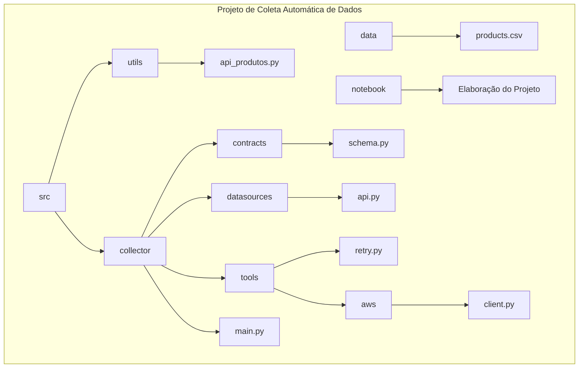

# Aula 14&15

## Desafio de Engenharia de Dados - Coleta Automática de Dados

### Desafio Proposto
**O desafio proposto consiste em criar um sistema de coleta automática de dados de uma API a intervalos regulares e armazená-los em um serviço de armazenamento em nuvem. O sistema deve ser capaz de lidar com falhas de rede e garantir a integridade e consistência dos dados coletados.**



## Estrutura do Projeto

O projeto é organizado em pastas e arquivos que desempenham funções específicas na coleta automática de dados e seu armazenamento no serviço AWS S3. Abaixo está uma visão geral da estrutura do projeto:

### 1. Pasta `data`
- Esta pasta contém o arquivo `products.csv`, que é utilizado como fonte de dados para a coleta automática.

### 2. Pasta `notebook`
- Aqui está localizado o notebook `Elaboração do Projeto`, que documenta todo o processo de desenvolvimento do projeto.

### 3. Pasta `src`
- Esta é a pasta principal do projeto.

#### 3.1. Pasta `collector`
- Responsável pela implementação da coleta automática de dados.

    - **`main.py`**: Arquivo principal que implementa a coleta automática dos dados em intervalos regulares e os envia para o serviço AWS S3.

    - **`contracts`**: Pasta que contém o arquivo `schema.py`, utilizado para validar e estruturar os dados coletados.

    - **`datasources`**: Pasta que contém o arquivo `api.py`, responsável por coletar, transformar, converter e fazer upload dos dados coletados.

    - **`tools`**: Pasta que contém utilitários necessários para o funcionamento do coletor.
        - **`retry.py`**: Decorador que permite retentar a função várias vezes para lidar com possíveis falhas de rede.

        - **`aws`**: Pasta que contém a interface para interagir com o serviço S3 da Amazon.
            - **`client.py`**: Interface para interagir com o serviço S3 da Amazon.

#### 3.2. Pasta `utils`
- Esta pasta contém utilitários gerais.

    - **`api_produtos.py`**: Arquivo que implementa a API construída com a biblioteca FastAPI para as consultas que serão utilizadas.


## Solução Criada

Para resolver o desafio, foram desenvolvidos os seguintes componentes:

1. **Classe `APICollector`**: Uma classe responsável por coletar dados de uma API, transformá-los em um formato tabular (DataFrame), convertê-los para o formato Parquet e, em seguida, fazer upload dos dados para um serviço de armazenamento AWS S3.

2. **Script de Coleta Automática**: Um script Python que utiliza a biblioteca `schedule` para agendar a coleta automática de dados em intervalos regulares. Este script usa a classe `APICollector` para realizar a coleta e o envio dos dados.

3. **Decorador `retry`**: Um decorador que permite retentar uma função várias vezes em caso de exceção. Este decorador é aplicado à função de coleta da API para lidar com falhas de rede.

4. **Esquema de Dados `CompraSchema`**: Um esquema que define a estrutura dos dados relacionados a uma compra, utilizado para validar e estruturar os dados coletados da API.

## Como Usar

1. Clone o repositório para o seu ambiente local.
2. Instale as dependências necessárias (consulte os requisitos do projeto).
3. Configure as credenciais do AWS S3 em um arquivo .env na raiz do projeto.
4. Execute o script de coleta automática para iniciar a coleta de dados.

## Principais Aprendizados

Durante a resolução deste desafio, foram adquiridos os seguintes aprendizados e conhecimentos:

- Como utilizar bibliotecas Python para agendar tarefas em intervalos regulares.
- Estratégias para lidar com falhas de rede e garantir a integridade dos dados coletados.
- Utilização de esquemas de dados para validar e estruturar os dados coletados.
- Implementação de classes, métodos e decoradores em Python para construir sistemas de engenharia de dados robustos e automatizados.


## Conclusão

O desafio de criar um sistema de coleta automática de dados foi uma excelente oportunidade para aplicar e aprimorar habilidades de engenharia de dados, bem como aprender novos conceitos e técnicas. A solução desenvolvida demonstra a capacidade de construir sistemas eficientes e escaláveis para lidar com grandes volumes de dados em ambientes de produção.

# Passo a passo do desenvolvimento do projeto:


## Setando a pasta raiz do projeto.


```python
import os
os.getcwd()
os.chdir('/home/jcnok/bootcamps/bootcamp-jornada-de-dados_2024/aula_14_15')
```

## Criar uma api com fastapi e faker.


```python

```


```python
%%writefile src/utils/api_produtos.py
from fastapi import FastAPI
from faker import Faker
import pandas as pd
import random

app = FastAPI(debug=True)
fake = Faker()

# Carregar o arquivo CSV de produtos
file_name = 'data/products.csv'
df = pd.read_csv(file_name)
df['indice'] = range(1, len(df) + 1)
df.set_index('indice', inplace=True)

loja_padrao_online = 11

@app.get("/")
async def hello_world():
    """Rota para retornar uma mensagem de saudação."""
    return 'Coca-Cola me patrocina!'

@app.get("/gerar_compra")
async def gerar_compra():
    """Rota para gerar uma compra aleatória."""
    index = random.randint(1, len(df) - 1)
    row = df.iloc[index]
    return [{
        "client": fake.name(),
        "creditcard": fake.credit_card_provider(),
        "product": row["Product Name"],
        "ean": int(row["EAN"]),
        "price": round(float(row["Price"]) * 1.2, 2),
        "clientPosition": fake.location_on_land(),
        "store": loja_padrao_online,
        "dateTime": fake.iso8601()
    }]

@app.get("/gerar_compras/{numero_registro}")
async def gerar_compras(numero_registro: int):
    """Rota para gerar várias compras."""
    if numero_registro < 1:
        return {"error": "O número deve ser maior que 1"}

    respostas = []
    for _ in range(numero_registro):
        try:
            index = random.randint(1, len(df) - 1)
            row = df.iloc[index]
            compra = {
                "client": fake.name(),
                "creditcard": fake.credit_card_provider(),
                "product": row["Product Name"],
                "ean": int(row["EAN"]),
                "price": round(float(row["Price"]) * 1.2, 2),
                "clientPosition": fake.location_on_land(),
                "store": loja_padrao_online,
                "dateTime": fake.iso8601()
            }
            respostas.append(compra)
        except Exception as e:
            print(f"Erro inesperado: {e}")
            # Se ocorrer um erro, adiciona uma compra com dados de erro
            compra = {
                "client": fake.name(),
                "creditcard": fake.credit_card_provider(),
                "product": "error",
                "ean": 0,
                "price": 0.0,
                "clientPosition": fake.location_on_land(),
                "store": loja_padrao_online,
                "dateTime": fake.iso8601()
            }
            respostas.append(compra)
    return respostas

```

    Writing src/utils/api_produtos.py


# Documentação API de Geração de Compras

Esta API gera compras aleatórias com base em um conjunto de dados de produtos.

## Rotas Disponíveis

### Rota Principal
- **Descrição**: Retorna uma mensagem de saudação.
- **Endpoint**: `/`
- **Método HTTP**: GET

### Rota de Geração de Compra
- **Descrição**: Gera uma única compra aleatória.
- **Endpoint**: `/gerar_compra`
- **Método HTTP**: GET

### Rota de Geração de Compras
- **Descrição**: Gera um número específico de compras aleatórias.
- **Endpoint**: `/gerar_compras/{numero_registro}`
- **Parâmetro de Path**: `numero_registro` (int) - Número de compras a serem geradas.
- **Método HTTP**: GET

## Detalhes das Respostas

### Resposta da Rota de Geração de Compra

- **Formato JSON**:

```json
{
    "client": "Nome do Cliente",
    "creditcard": "Provedor do Cartão de Crédito",
    "product": "Nome do Produto",
    "ean": "Código EAN",
    "price": "Preço",
    "clientPosition": "Localização do Cliente",
    "store": "ID da Loja",
    "dateTime": "Data e Hora da Compra"
}


## Criando uma lista de 200 produtos com faker.


```python
from faker import Faker
import pandas as pd

# Criar um objeto Faker com localização em português brasileiro
fake = Faker('pt_BR')

# Lista de palavras-chave para produtos eletrônicos
keywords = ['smartphone', 'tablet', 'notebook', 'smartwatch', 'câmera', 'fones de ouvido', 'TV', 'console de videogame', 'impressora']

# Lista de produtos eletrônicos em português brasileiro
electronic_products = [f'{fake.random.choice(keywords)}' for _ in range(200)]

# Lista de códigos EAN (European Article Number)
eans = [fake.ean() for _ in range(200)]

# Lista de preços
prices = [round(fake.pyfloat(min_value=1, max_value=100), 2) for _ in range(200)]

# Criar DataFrame
data = {
    "Product Name": electronic_products,
    "EAN": eans,
    "Price": prices
}
df = pd.DataFrame(data)

# Salvar DataFrame como arquivo CSV
df.to_csv("data/products.csv", index=False)

```

### Executando a api:


```python
!uvicorn src.utils.api_produtos:app --reload
```

    INFO:     Will watch for changes in these directories: ['/home/jcnok/bootcamps/bootcamp-jornada-de-dados_2024/aula_14_15']
    INFO:     Uvicorn running on http://127.0.0.1:8000 (Press CTRL+C to quit)
    INFO:     Started reloader process [67910] using WatchFiles
    INFO:     Started server process [67913]
    INFO:     Waiting for application startup.
    INFO:     Application startup complete.
    INFO:     127.0.0.1:40904 - "GET / HTTP/1.1" 200 OK
    INFO:     127.0.0.1:40904 - "GET /github-markdown-css HTTP/1.1" 404 Not Found
    INFO:     127.0.0.1:40916 - "GET /docs HTTP/1.1" 200 OK
    INFO:     127.0.0.1:40916 - "GET /openapi.json HTTP/1.1" 200 OK
    INFO:     127.0.0.1:40916 - "GET /github-markdown-css HTTP/1.1" 404 Not Found
    INFO:     127.0.0.1:57188 - "GET /gerar_compras/20 HTTP/1.1" 200 OK
    INFO:     127.0.0.1:48016 - "GET / HTTP/1.1" 200 OK
    INFO:     127.0.0.1:48016 - "GET /github-markdown-css HTTP/1.1" 404 Not Found
    INFO:     127.0.0.1:48016 - "GET /gerar_compra HTTP/1.1" 200 OK
    INFO:     127.0.0.1:48016 - "GET /github-markdown-css HTTP/1.1" 404 Not Found
    ^C
    INFO:     Shutting down
    INFO:     Waiting for application shutdown.
    INFO:     Application shutdown complete.
    INFO:     Finished server process [67913]
    INFO:     Stopping reloader process [67910]


* **Parte do desafio já está concluído, temos a api funcional com dados usando um arquivo em conjunto com o faker.**
* **O Fastapi já cria uma documentação das principais funcionalidades em http://127.0.0.1:8000/docs**.
* **A próxima etapa será criar um schemma para garantir a qualidade dos dados.**
* **Criar uma conexão com a cloud, pode ser qualquer uma, azure, aws, google, google drive etc...**
* **Criar um script para validação da conexão, do schemma para salvar os dados da api em formato de parquet.**

### Criando o Schemma, para ean, price, store e dateTime:

* **Nesse primeiro momento, de acordo com a regra de negócio, vamos precisar apenas dos atributos ean, price, store e dateTime.**


```python
%%writefile src/collector/contracts/schema.py
#Schemma
from typing import Union, Dict


GenericSchema = Dict[str, Union[str, float, int]]


CompraSchema: GenericSchema = {
    "ean" : int,
    "price" : float,
    "store" : int,
    "dateTime" : str
}
```

    Writing src/collector/contracts/schema.py


# Documentação do Esquema de Compra

O esquema `CompraSchema` define a estrutura dos dados relacionados a uma compra. Ele mapeia os campos de uma compra para os tipos de dados esperados.

## Estrutura do Esquema

- O esquema é representado por um dicionário onde as chaves são os nomes dos campos da compra e os valores são os tipos de dados esperados para cada campo.

  ```python
  CompraSchema: GenericSchema = {
      "ean": int,
      "price": float,
      "store": int,
      "dateTime": str
  }
  ```

  Aqui está a descrição de cada campo do esquema:

  - `ean`: Código EAN (European Article Number) da compra (tipo: `int`).
  - `price`: Preço da compra (tipo: `float`).
  - `store`: ID da loja onde a compra foi realizada (tipo: `int`).
  - `dateTime`: Data e hora da compra no formato ISO 8601 (tipo: `str`).

## Uso

- O esquema `CompraSchema` pode ser usado para validar ou estruturar os dados relacionados a uma compra.

  ```python
  compra = {
      "ean": 1234567890123,
      "price": 10.99,
      "store": 101,
      "dateTime": "2024-04-30T12:00:00Z"
  }

  # Verificar se os dados da compra seguem o esquema
  if all(isinstance(compra.get(field), CompraSchema[field]) for field in CompraSchema):
      print("Os dados da compra estão corretos.")
  else:
      print("Os dados da compra estão incorretos.")
  ```

  Neste exemplo, os dados da compra são verificados em relação ao esquema `CompraSchema`.

## Observações

- Certifique-se de que os dados de cada compra correspondem ao esquema especificado.
- O esquema pode ser estendido ou modificado conforme necessário para atender aos requisitos específicos do sistema.
- Este esquema é útil para garantir a consistência e integridade dos dados relacionados a compras em um sistema.


### Criando a conexão com o S3 usando boto3:


```python
%%writefile src/collector/tools/aws/client.py
#criando a classe para conexão com s3 da aws
import boto3
from botocore.exceptions import NoCredentialsError
import sys
import os

# Suponha que você tenha uma variável de ambiente chamada "MINHA_VARIAVEL"
# Você pode acessar seu valor usando a função os.environ.get()


class S3Client:

    def __init__(self):

        self._envs = {
            "aws_access_key_id": os.environ.get("AWS_ACCESS_KEY_ID"),
            "aws_secret_access_key": os.environ.get("AWS_SECRET_ACCESS_KEY"),
            "region_name": os.environ.get("AWS_REGION", "us-west-1"),  # Usando um valor padrão se a variável não estiver definida
            "s3_bucket": os.environ.get("S3_BUCKET_NAME"),
            "datalake" : os.environ.get("DELTA_LAKE_S3_PATH")
        }

        for var in self._envs:
            if self._envs[var] is None:
                print(f"A variável de ambiente {var} não está definida.")
                sys.exit(1)

        self.s3 = boto3.client('s3', aws_access_key_id=self._envs["aws_access_key_id"], aws_secret_access_key=self._envs["aws_secret_access_key"], region_name=self._envs["region_name"])

    def upload_file(self, data, s3_key):
        try:
            self.s3.put_object(Body=data.getvalue(), Bucket=self._envs["s3_bucket"], Key=s3_key)
        except NoCredentialsError:
            print("Credenciais não encontradas. Certifique-se de configurar suas credenciais AWS corretamente.")

    def download_file(self, s3_key):
        try:
            file = self.s3.get_object(Bucket=self._envs["s3_bucket"], Key=s3_key)
            print(f"Download bem-sucedido para {s3_key}")
            return file
        except NoCredentialsError:
            print("Credenciais não encontradas. Certifique-se de configurar suas credenciais AWS corretamente.")
        except FileNotFoundError:
            print(f"Arquivo {s3_key} não encontrado no bucket {self._envs['s3_bucket']}.")
        except Exception as e:
            print(f"Ocorreu um erro durante o download: {e}")

    def list_object(self, prefix):
        return self.s3.list_objects(Bucket=self._envs["s3_bucket"], Prefix=prefix)['Contents']
```

    Writing src/collector/tools/aws/client.py


# Documentação S3Client

A classe `S3Client` é uma interface para interagir com o serviço de armazenamento de objetos da Amazon Web Services (AWS), o Amazon S3.

## Métodos Disponíveis

### Método `__init__`

- **Descrição**: Construtor da classe `S3Client`.
- **Inicializa**:
  - `self._envs`: Um dicionário contendo as variáveis de ambiente necessárias para autenticação e configuração do cliente S3.
- **Parâmetros**:
  - Nenhum.
- **Uso**:
  ```python
  s3_client = S3Client()
  ```

### Método `upload_file`

- **Descrição**: Faz o upload de um arquivo para o Amazon S3.
- **Parâmetros**:
  - `data`: Os dados do arquivo a serem enviados.
  - `s3_key`: O caminho (chave) no bucket do S3 onde o arquivo será armazenado.
- **Uso**:
  ```python
  s3_client.upload_file(data, 'caminho/do/arquivo')
  ```

### Método `download_file`

- **Descrição**: Faz o download de um arquivo do Amazon S3.
- **Parâmetros**:
  - `s3_key`: O caminho (chave) no bucket do S3 onde o arquivo está armazenado.
- **Retorno**:
  - O arquivo baixado.
- **Uso**:
  ```python
  file = s3_client.download_file('caminho/do/arquivo')
  ```

### Método `list_object`

- **Descrição**: Lista objetos no Amazon S3 com base em um prefixo específico.
- **Parâmetros**:
  - `prefix`: O prefixo do caminho (chave) no bucket do S3 onde os objetos serão listados.
- **Retorno**:
  - Uma lista de objetos correspondentes ao prefixo especificado.
- **Uso**:
  ```python
  objects = s3_client.list_object('prefixo/do/caminho/')
  ```

## Observações

- Antes de usar a classe `S3Client`, certifique-se de que as variáveis de ambiente `AWS_ACCESS_KEY_ID`, `AWS_SECRET_ACCESS_KEY`, `S3_BUCKET_NAME` e `DELTA_LAKE_S3_PATH` estão configuradas corretamente.
- Este cliente suporta operações básicas de upload, download e listagem de objetos no Amazon S3.
- Caso ocorram erros durante as operações, mensagens apropriadas serão exibidas para orientação.
```

Esta documentação fornece uma visão geral dos métodos disponíveis na classe `S3Client`, seus parâmetros, retornos e algumas observações importantes sobre o uso da classe.

### Criando um decorador retry:


```python
%%writefile src/collector/tools/retry.py
import time
from functools import wraps

def retry(exception_to_check, tries=3, delay=1, backoff=2):
    """
    Decorator que retenta a função várias vezes em caso de exceção.

    :param exception_to_check: A exceção (ou tuple de exceções) que deve ser capturada.
    :param tries: O número máximo de tentativas.
    :param delay: O tempo de espera inicial entre as tentativas.
    :param backoff: O fator pelo qual o atraso deve aumentar após cada tentativa.
    """
    def decorator_retry(func):
        @wraps(func)
        def wrapper_retry(*args, **kwargs):
            _tries, _delay = tries, delay
            while _tries > 1:
                try:
                    return func(*args, **kwargs)
                except exception_to_check as e:
                    print(f"{func.__name__} falhou, tentando novamente em {_delay} segundos. Tentativas restantes: {_tries - 1}")
                    time.sleep(_delay)
                    _tries -= 1
                    _delay *= backoff
            return func(*args, **kwargs)
        return wrapper_retry
    return decorator_retry
```

    Writing src/collector/tools/retry.py


# Documentação do Decorador de Retentativas

O decorador `retry` permite que uma função seja chamada várias vezes em caso de exceção, com um atraso entre as tentativas.

## Parâmetros

- `exception_to_check`: A exceção (ou tupla de exceções) que deve ser capturada para retentativa.
- `tries`: O número máximo de tentativas.
- `delay`: O tempo de espera inicial entre as tentativas (em segundos).
- `backoff`: O fator pelo qual o atraso deve aumentar após cada tentativa.

## Uso

### Decorador

- A função `retry` é um decorador que pode ser aplicado a outras funções para permitir retentativas.

  ```python
  @retry(Exception, tries=3, delay=1, backoff=2)
  def minha_funcao():
      # Corpo da função
  ```

### Função Decorada

- A função decorada será retentada se a exceção especificada for levantada.

  ```python
  @retry(ZeroDivisionError, tries=5)
  def dividir(a, b):
      return a / b
  ```

### Exemplo de Uso

- No exemplo a seguir, a função `dividir` será retentada até 5 vezes em caso de `ZeroDivisionError`, com um atraso de 1 segundo entre as tentativas e um aumento exponencial do atraso após cada tentativa.

  ```python
  resultado = dividir(10, 0)
  ```

## Observações

- Certifique-se de que a função decorada possa lidar com as retentativas e tenha um comportamento adequado em caso de falha.
- Ajuste os parâmetros `tries`, `delay` e `backoff` de acordo com as necessidades de retentativa da função.
- Este decorador é útil para lidar com operações de rede, chamadas de API e outras situações em que retentativas são necessárias para lidar com falhas transitórias.
```

Esta documentação fornece uma visão geral detalhada do decorador `retry`, descrevendo seus parâmetros, uso e exemplos de aplicação.

### Criando o script da classe APICollector:


```python
%%writefile src/collector/datasources/api.py
import requests
import pandas as pd
import datetime
from io import BytesIO
from contracts.schema import GenericSchema
from typing import List
from tools.retry import retry

class APICollector:
        def __init__ (self, schema, aws):
            self._schema = schema
            self._aws = aws
            self._buffer = None
            return

        def start(self, param):
            response = self.getData(param)
            response = self.extractData(response)
            response = self.transformDf(response)
            response = self.convertToParquet(response)

            if self._buffer is not None:
                 file_name = self.fileName()
                 print(file_name)
                 self._aws.upload_file(response, file_name)
                 return True

            return False

        @retry(requests.exceptions.RequestException, tries=5, delay=1, backoff=2)
        def getData(self, param):
            response = None
            if param > 1:
                  response = requests.get(f'http://127.0.0.1:8000/gerar_compras/{param}').json()
            else:
                 response = requests.get('http://127.0.0.1:8000/gerar_compra').json()
            return response

        def extractData(self, response):
            result: List[GenericSchema] = []
            for item in response:
                index = {}
                for key, value in self._schema.items():
                    if type(item.get(key)) == value:
                        index[key] = item[key]
                    else:
                        index[key] = None
                result.append(index)
            return result

        def transformDf(self, response):
              result = pd.DataFrame(response)
              return result

        def convertToParquet(self, response):
            self._buffer = BytesIO()
            try:
                with self._buffer as buffer:
                    response.to_parquet(buffer)
                    return buffer
            except Exception as e:
                    print(f"Error converting DataFrame to Parquet: {e}")
                    self._buffer = None

        def fileName(self):
             data_atual = datetime.datetime.now().isoformat()
             match = data_atual.split(".")
             return f"api/api-reponse-compra{match[0]}.parquet"
```

    Writing src/collector/datasources/api.py


# Documentação da Classe APICollector

A classe `APICollector` é responsável por coletar dados de uma API, transformá-los em um formato tabular (DataFrame), convertê-los para o formato Parquet e, em seguida, fazer upload dos dados para um serviço de armazenamento AWS. Ele também implementa uma política de tentativas automáticas de repetição em caso de falha de solicitação de rede.

## Construtor

### Método `__init__`

- **Descrição**: Construtor da classe `APICollector`.
- **Parâmetros**:
  - `schema`: Um dicionário que mapeia os campos do objeto JSON retornado pela API para os tipos de dados esperados. Exemplo: `{"client": str, "price": float, ...}`.
  - `aws`: Uma instância de um objeto AWS para fazer upload dos dados convertidos.
- **Uso**:
  ```python
  collector = APICollector(schema, aws)
  ```

## Métodos Principais

### Método `start`

- **Descrição**: Inicia o processo de coleta de dados da API, transformação em DataFrame, conversão para Parquet e upload para o AWS.
- **Parâmetros**:
  - `param`: Um parâmetro que pode ser passado para a API. Se for maior que 1, chama `gerar_compras/{param}`, senão, chama `gerar_compra`.
- **Retorno**:
  - `True` se a operação for bem-sucedida, `False` caso contrário.
- **Uso**:
  ```python
  success = collector.start(param)
  ```

### Método `getData`

- **Descrição**: Faz uma solicitação para a API e retorna os dados obtidos.
- **Parâmetros**:
  - `param`: Um parâmetro que pode ser passado para a API.
- **Retorno**:
  - Os dados obtidos da API.
- **Uso**:
  ```python
  data = collector.getData(param)
  ```

### Método `extractData`

- **Descrição**: Extrai os dados obtidos da API com base no esquema fornecido.
- **Parâmetros**:
  - `response`: Os dados obtidos da API.
- **Retorno**:
  - Uma lista de objetos `GenericSchema`.
- **Uso**:
  ```python
  extracted_data = collector.extractData(response)
  ```

### Método `transformDf`

- **Descrição**: Transforma os dados extraídos em um DataFrame.
- **Parâmetros**:
  - `response`: Os dados extraídos da API.
- **Retorno**:
  - Um DataFrame contendo os dados transformados.
- **Uso**:
  ```python
  df = collector.transformDf(response)
  ```

### Método `convertToParquet`

- **Descrição**: Converte o DataFrame para o formato Parquet.
- **Parâmetros**:
  - `response`: O DataFrame a ser convertido.
- **Retorno**:
  - Um buffer contendo os dados no formato Parquet.
- **Uso**:
  ```python
  buffer = collector.convertToParquet(df)
  ```

### Método `fileName`

- **Descrição**: Gera o nome do arquivo para o upload.
- **Retorno**:
  - O nome do arquivo no formato `api/api-reponse-compra{timestamp}.parquet`.
- **Uso**:
  ```python
  file_name = collector.fileName()
  ```

### Método Decorado `retry`

- **Descrição**: Decora o método `getData` para repetir automaticamente as solicitações em caso de falha de rede.
- **Parâmetros**:
  - `requests.exceptions.RequestException`: A exceção a ser capturada para repetição automática.
  - `tries`: O número máximo de tentativas.
  - `delay`: O tempo de espera inicial entre as tentativas.
  - `backoff`: O fator de aumento do tempo de espera entre as tentativas subsequentes.
- **Uso**:
  ```python
  @retry(requests.exceptions.RequestException, tries=5, delay=1, backoff=2)
  def getData(self, param):
      ...
  ```

### Script main.py:


```python
%%writefile src/collector/main.py
from datasource.api import APICollector
from contracts.schema import CompraSchema
from tools.aws.client import S3Client

import time
import schedule

schema = CompraSchema
aws = S3Client()


def apiCollector(schema, aws, repeat):
    reponse = APICollector(schema, aws).start(repeat)
    print('Executei')
    return

schedule.every(1).minutes.do(apiCollector,schema, aws, 50)


while True:
    schedule.run_pending()
    time.sleep(1)
```

    Writing src/collector/main.py


# Documentação do Script de Coleta Automática de Dados

Este script implementa uma coleta automática de dados de uma API em intervalos regulares e os envia para um serviço de armazenamento AWS.

## Dependências

- `datasource.api.APICollector`: Uma classe para coletar dados de uma API e fazer upload para o AWS.
- `contracts.schema.CompraSchema`: Um esquema que define a estrutura dos dados coletados da API.
- `tools.aws.client.S3Client`: Um cliente para interagir com o serviço de armazenamento AWS S3.
- `time`: Um módulo para manipulação de tempo.
- `schedule`: Uma biblioteca para agendar tarefas em intervalos regulares.

## Funções e Métodos

### Função `apiCollector`

- **Descrição**: Função que realiza a coleta de dados da API e envio para o AWS.
- **Parâmetros**:
  - `schema`: O esquema de dados a ser usado para a coleta.
  - `aws`: O cliente AWS para fazer upload dos dados.
  - `repeat`: O número de repetições da coleta.
- **Retorno**:
  - Nenhum.
- **Uso**:
  ```python
  apiCollector(schema, aws, repeat)
  ```

### Agendamento de Tarefas

- O script usa a biblioteca `schedule` para agendar a função `apiCollector` para ser executada em intervalos regulares.

  ```python
  schedule.every(1).minutes.do(apiCollector, schema, aws, 50)
  ```

  Aqui, a função `apiCollector` será executada a cada minuto, repetindo a coleta 50 vezes.

### Loop Principal

- O script entra em um loop infinito e executa `schedule.run_pending()` a cada segundo para verificar se há tarefas agendadas a serem executadas.

  ```python
  while True:
      schedule.run_pending()
      time.sleep(1)
  ```

  Isso garante que o script permaneça em execução e continue a coleta de dados conforme agendado.

## Observações

- Certifique-se de que a classe `APICollector`, o esquema `CompraSchema` e o cliente `S3Client` estejam corretamente implementados e acessíveis a partir deste script.
- Certifique-se de que a função `apiCollector` esteja corretamente definida e possa lidar com os dados de entrada conforme esperado.
- Ajuste os parâmetros de agendamento de acordo com as necessidades de coleta de dados.
- Este script é útil para coletar automaticamente dados de uma API em intervalos regulares e pode ser usado em cenários de coleta de dados automatizada.
```
