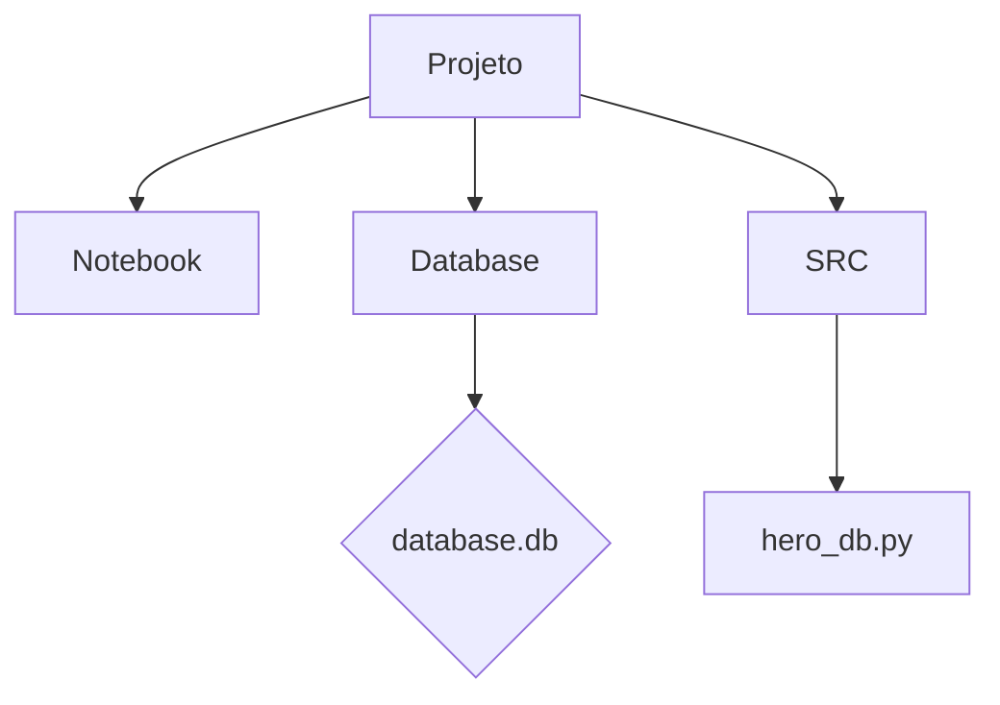

# Aula_16



### Neste diagrama:

- `Projeto` é o nó principal que contém todas as partes do projeto.
- `Notebook`, `Database` e `SRC` são subpastas do projeto.
- `Notebook` contém o notebook de todo o projeto.
- `Database` contém a pasta onde o arquivo `database.db` será armazenado.
- `SRC` contém o arquivo `hero_db.py`, que é responsável por criar o banco de dados SQLite para armazenar informações sobre heróis.

# Desafio: Criação de Banco de Dados de Heróis

## Descrição do Desafio

O desafio consiste em criar um banco de dados SQLite para armazenar informações sobre heróis. O banco de dados deve incluir uma tabela para os heróis, com campos para o ID, nome, nome secreto e idade de cada herói. Além disso, é necessário criar instâncias de heróis e adicioná-las ao banco de dados.

## Explicação do Projeto

O projeto utiliza Python juntamente com a biblioteca SQLModel para criar o banco de dados e interagir com ele. O código consiste em:

- Definição do modelo de dados `Hero` com os atributos necessários.
- Criação do banco de dados SQLite na pasta `database/`.
- Criação das tabelas no banco de dados.
- Adição de instâncias de heróis ao banco de dados.

O script Python é executado para criar o banco de dados e adicionar alguns exemplos de heróis, demonstrando assim o funcionamento básico do projeto.

## Como Executar

1. Clone este repositório em sua máquina local:

2. Navegue até o diretório do projeto:

```
cd aula_16/src
```
3. Execute o script `hero_db.py`:

```
python hero.py
```

Isso criará o banco de dados na pasta `database/` e adicionará alguns exemplos de heróis.

## Conclusão

O projeto demonstra como criar um banco de dados SQLite e interagir com ele usando Python e SQLModel. Ele fornece uma base sólida para expandir e desenvolver um sistema mais completo de gerenciamento de heróis ou qualquer outra aplicação que exija armazenamento de dados estruturados.


# Passo a passo:

### Setando a pasta raiz do projeto:


```python
import os
os.getcwd()
os.chdir("/home/jcnok/bootcamps/bootcamp-jornada-de-dados_2024/aula_16")
```

### Instalação das libs:


```python
!poetry add sqlmodel -q
```


```python
%%writefile src/hero_bd.py
from typing import Optional
import os

from sqlmodel import Field, Session, SQLModel, create_engine

class Hero(SQLModel, table=True):
    """
    Modelo para representar um herói.

    Atributos:
        id (int, optional): O ID único do herói.
        name (str): O nome do herói.
        secret_name (str): O nome secreto do herói.
        age (int, optional): A idade do herói.
    """
    id: Optional[int] = Field(default=None, primary_key=True)
    name: str
    secret_name: str
    age: Optional[int] = None

# Obtém o diretório atual
current_directory = os.path.dirname(os.path.abspath(__file__))

# Define o caminho para a pasta 'database/'
database_directory = os.path.join(current_directory, "..", "database")

# Garante que o diretório exista, caso contrário, cria-o
os.makedirs(database_directory, exist_ok=True)

# Define o caminho completo para o banco de dados
database_path = os.path.join(database_directory, "database.db")

# Cria um mecanismo de banco de dados SQLite no caminho especificado
engine = create_engine(f"sqlite:///{database_path}", echo=True)

# Cria as tabelas no banco de dados
SQLModel.metadata.create_all(engine)

# Cria instâncias de heróis
hero_1 = Hero(name="Spider-Boy", secret_name="Pedro Parqueador")
hero_2 = Hero(name="Rusty-Man", secret_name="Tommy Sharp", age=48)

# Inicia uma sessão com o banco de dados
with Session(engine) as session:
    # Adiciona os heróis à sessão
    session.add(hero_1)
    session.add(hero_2)
    # Commit das alterações
    session.commit()

```

    Writing src/hero_bd.py


# Documentação do Código

Este script Python cria um banco de dados SQLite para armazenar informações sobre heróis. Ele utiliza a biblioteca SQLModel para definir o esquema do banco de dados e interagir com ele.

## Funcionalidades

1. **Definição do Modelo de Dados**: Define a classe `Hero` que representa um herói, com atributos para o ID, nome, nome secreto e idade.

2. **Criação do Banco de Dados**: Cria um banco de dados SQLite na pasta `database/`.

3. **Criação das Tabelas**: Define e cria a tabela correspondente ao modelo `Hero` no banco de dados.

4. **Adição de Dados**: Cria instâncias de heróis e as adiciona ao banco de dados.

## Detalhes do Código

- **`Hero` Class**: Classe que representa um herói, definindo seus atributos como campos da tabela no banco de dados.

- **Obtenção do Diretório Atual**: Usa a biblioteca `os` para obter o diretório atual do script.

- **Criação do Diretório do Banco de Dados**: Cria a pasta `database/` se ela não existir.

- **Criação do Caminho do Banco de Dados**: Define o caminho completo para o arquivo do banco de dados na pasta `database/`.

- **Criação do Mecanismo do Banco de Dados**: Cria um mecanismo de banco de dados SQLite no caminho especificado.

- **Criação das Tabelas**: Cria todas as tabelas definidas no modelo de dados.

- **Criação das Instâncias de Heróis**: Cria instâncias de heróis com dados específicos.

- **Gerenciamento da Sessão do Banco de Dados**: Inicia uma sessão com o banco de dados, adiciona os heróis à sessão e efetua o commit das alterações.

## Estrutura do Projeto

- `src/`: Contém o script Python `hero_db.py` para criar o banco de dados.
- `database/`: Pasta onde o banco de dados SQLite será criado.

## Dependências

- `sqlmodel`: Uma biblioteca de mapeamento objeto-relacional (ORM) para Python.

### Execução do script:


```python
!python src/hero_bd.py
```

    2024-04-30 18:21:40,869 INFO sqlalchemy.engine.Engine BEGIN (implicit)
    2024-04-30 18:21:40,869 INFO sqlalchemy.engine.Engine PRAGMA main.table_info("hero")
    2024-04-30 18:21:40,869 INFO sqlalchemy.engine.Engine [raw sql] ()
    2024-04-30 18:21:40,870 INFO sqlalchemy.engine.Engine PRAGMA temp.table_info("hero")
    2024-04-30 18:21:40,870 INFO sqlalchemy.engine.Engine [raw sql] ()
    2024-04-30 18:21:40,871 INFO sqlalchemy.engine.Engine
    CREATE TABLE hero (
    	id INTEGER NOT NULL,
    	name VARCHAR NOT NULL,
    	secret_name VARCHAR NOT NULL,
    	age INTEGER,
    	PRIMARY KEY (id)
    )


    2024-04-30 18:21:40,871 INFO sqlalchemy.engine.Engine [no key 0.00037s] ()
    2024-04-30 18:21:40,885 INFO sqlalchemy.engine.Engine COMMIT
    2024-04-30 18:21:40,887 INFO sqlalchemy.engine.Engine BEGIN (implicit)
    2024-04-30 18:21:40,890 INFO sqlalchemy.engine.Engine INSERT INTO hero (name, secret_name, age) VALUES (?, ?, ?) RETURNING id
    2024-04-30 18:21:40,890 INFO sqlalchemy.engine.Engine [generated in 0.00021s (insertmanyvalues) 1/2 (ordered; batch not supported)] ('Spider-Boy', 'Pedro Parqueador', None)
    2024-04-30 18:21:40,891 INFO sqlalchemy.engine.Engine INSERT INTO hero (name, secret_name, age) VALUES (?, ?, ?) RETURNING id
    2024-04-30 18:21:40,891 INFO sqlalchemy.engine.Engine [insertmanyvalues 2/2 (ordered; batch not supported)] ('Rusty-Man', 'Tommy Sharp', 48)
    2024-04-30 18:21:40,891 INFO sqlalchemy.engine.Engine COMMIT


## Criando uma consulta ao banco de dados criado:


```python
from sqlmodel import SQLModel, create_engine, Session
from sqlalchemy import text

engine = create_engine("sqlite:///database/database.db")
with Session(engine) as session:
    statement = text("SELECT * FROM hero;")
    results = session.exec(statement)
    heroes = results.fetchall()
    for hero in heroes:
        print(hero)
```

    (1, 'Spider-Boy', 'Pedro Parqueador', None)
    (2, 'Rusty-Man', 'Tommy Sharp', 48)


```python

```
