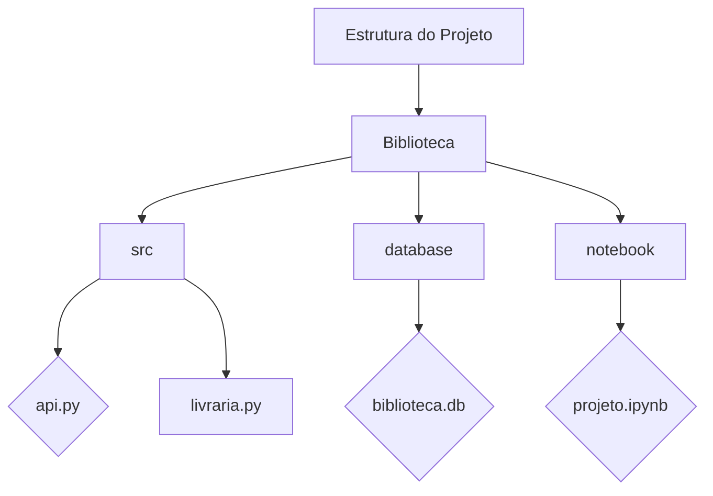

# Desafio do Projeto: Sistema de Biblioteca com FastAPI

Este projeto visa implementar um sistema de gerenciamento de uma biblioteca, permitindo adicionar, buscar, atualizar e remover livros do banco de dados. Inicialmente, o sistema foi desenvolvido como um script Python utilizando a biblioteca SQLModel para interagir com o banco de dados SQLite. Posteriormente, foi adicionada uma API utilizando o framework FastAPI, permitindo que as operações CRUD fossem realizadas de forma mais acessível e escalável.

## Desafio Original

No desafio original, o objetivo era criar um banco de dados SQLite para armazenar informações sobre livros, com a capacidade de adicionar, buscar, atualizar e remover livros do banco. O código original utilizava a biblioteca SQLModel para definir o esquema do banco de dados e interagir com ele. Foram implementadas funções para adicionar livros, buscar livros por autor, atualizar a disponibilidade de um livro e remover um livro do banco de dados.

## Adição da API FastAPI

Para tornar o sistema mais acessível e interativo, foi adicionada uma API utilizando o framework FastAPI. A API oferece endpoints para realizar as operações CRUD (Create, Read, Update, Delete) sobre os livros da biblioteca. Cada endpoint corresponde a uma função do sistema original, permitindo que os usuários realizem operações sobre os livros por meio de solicitações HTTP.

### Funcionalidades da API

- **Adicionar Livro**: Permite adicionar um novo livro ao banco de dados.
- **Buscar Livros por Autor**: Permite buscar livros por autor.
- **Atualizar Disponibilidade do Livro**: Permite atualizar a disponibilidade de um livro.
- **Remover Livro**: Permite remover um livro do banco de dados.

## Como Utilizar

Para utilizar o sistema de biblioteca com a API FastAPI, siga estas etapas:

1. Clone o repositório em sua máquina local:

2. acesse a pasta src que contém o arquivo ´main.py´:

```
cd src
```

3. Execute o arquivo `main.py` para iniciar o servidor da API:

```
python main.py
```

4. Acesse a documentação da API em seu navegador:

```
http://localhost:8000/docs
```

5. Utilize as rotas disponíveis na documentação para interagir com o sistema de biblioteca.

## Conclusão

A adição da API FastAPI ao sistema de biblioteca proporciona uma experiência mais moderna e interativa para os usuários, permitindo que eles realizem operações sobre os livros da biblioteca de forma simples e eficiente. A combinação das funcionalidades do SQLModel para interagir com o banco de dados e do FastAPI para criar a API resulta em um sistema poderoso e flexível, capaz de atender às necessidades de gerenciamento de bibliotecas de forma completa e profissional.


# Passo a Passo:



# Documentação do Projeto: Biblioteca

## Estrutura do Projeto

O projeto "Biblioteca" é um sistema de gerenciamento de uma biblioteca, projetado para armazenar informações sobre livros, permitindo operações de adição, busca, atualização e remoção de livros do banco de dados. A seguir, será apresentada a estrutura do projeto, incluindo suas principais pastas e arquivos.

### Pasta src

A pasta `src` contém o código-fonte do projeto, onde são implementadas as funcionalidades do sistema de gerenciamento da biblioteca.

- **api.py**: Este arquivo contém a implementação da API FastAPI para permitir a interação com o sistema por meio de solicitações HTTP. A API oferece endpoints para realizar operações CRUD sobre os livros da biblioteca.

- **livraria.py**: Este arquivo contém o script principal do sistema de gerenciamento da biblioteca. Aqui são definidas as classes e funções para interagir com o banco de dados, utilizando a biblioteca SQLModel.

### Pasta database

A pasta `database` contém o arquivo do banco de dados SQLite utilizado pelo projeto.

- **biblioteca.db**: Este arquivo é o banco de dados SQLite que armazena as informações sobre os livros da biblioteca. Ele é criado e atualizado pelo sistema conforme necessário.

### Pasta notebook

A pasta `notebook` contém o notebook do projeto, onde são realizadas análises e experimentos relacionados ao sistema de gerenciamento da biblioteca.

- **projeto.ipynb**: Este arquivo é o notebook do projeto, onde são realizadas análises exploratórias de dados, testes de funcionalidades e demonstrações de uso do sistema de gerenciamento da biblioteca.

## Considerações Finais

A estrutura do projeto "Biblioteca" é organizada de forma a facilitar o desenvolvimento, manutenção e utilização do sistema de gerenciamento da biblioteca. A separação de responsabilidades entre as pastas `src`, `database` e `notebook` permite uma abordagem modular e escalável para o projeto, facilitando a adição de novas funcionalidades e a realização de experimentos e análises de dados.

Este documento fornece uma visão geral da estrutura do projeto "Biblioteca", destacando as principais pastas e arquivos, e sua organização para facilitar o desenvolvimento e utilização do sistema de gerenciamento da biblioteca.


## Setando a raiz do projeto:


```python
import os
os.getcwd()
os.chdir("/home/jcnok/bootcamps/bootcamp-jornada-de-dados_2024/aula_16")
```

## Criando o Schema:


```python
%%writefile src/models.py
#schemma livro
from sqlmodel import SQLModel, Field
from typing import Optional

class Livro(SQLModel, table=True):
    id: Optional[int] = Field(default=None, primary_key=True)
    titulo: str
    autor: str
    ano_publicacao: int
    disponivel: bool = True

```

    Writing src/models.py


Este script define a classe `Livro` que herda da classe `SQLModel`, indicando que ela representa uma tabela no banco de dados. Os campos da tabela são definidos como atributos da classe, usando a classe `Field` do SQLModel. A classe `Livro` possui os seguintes campos:

- `id`: O ID único do livro.
- `titulo`: O título do livro.
- `autor`: O autor do livro.
- `ano_publicacao`: O ano de publicação do livro.
- `disponivel`: Um booleano indicando se o livro está disponível ou não. O valor padrão é `True`.


```python
%%writefile src/main.py
from fastapi import FastAPI, HTTPException
from sqlmodel import SQLModel,Session, create_engine, select
from models import Livro

app = FastAPI()

# Conexão com o banco de dados (SQLite para simplicidade)
DATABASE_URL = "sqlite:///database/biblioteca.db"
engine = create_engine(DATABASE_URL, echo=True)

# Cria as tabelas no banco de dados
SQLModel.metadata.create_all(engine)

@app.post("/livros/")
def adicionar_livro(livro: Livro):
    with Session(engine) as session:
        session.add(livro)
        session.commit()
    return livro

@app.get("/livros/{autor}")
def buscar_livros_por_autor(autor: str):
    with Session(engine) as session:
        livros = session.exec(select(Livro).where(Livro.autor == autor)).all()
        if not livros:
            raise HTTPException(status_code=404, detail="Livros não encontrados")
        return livros

@app.put("/livros/{id_livro}")
def atualizar_disponibilidade_livro(id_livro: int, disponivel: bool):
    with Session(engine) as session:
        livro = session.get(Livro, id_livro)
        if livro is None:
            raise HTTPException(status_code=404, detail="Livro não encontrado")
        livro.disponivel = disponivel
        session.add(livro)
        session.commit()
    return livro

@app.delete("/livros/{id_livro}")
def remover_livro(id_livro: int):
    with Session(engine) as session:
        livro = session.get(Livro, id_livro)
        if livro is None:
            raise HTTPException(status_code=404, detail="Livro não encontrado")
        session.delete(livro)
        session.commit()
    return {"mensagem": "Livro removido com sucesso"}

# Executar o servidor com Uvicorn
if __name__ == "__main__":
    import uvicorn
    uvicorn.run(app, host="127.0.0.1", port=8000)

```

    Overwriting src/main.py


Este código implementa uma API usando o framework FastAPI para realizar operações CRUD (Create, Read, Update, Delete) em um banco de dados SQLite. Vou explicar cada parte do código em detalhes:

1. **Importações de Módulos**:
   - `from fastapi import FastAPI, HTTPException`: Importa a classe `FastAPI` e a exceção `HTTPException` do módulo `fastapi`, que são usadas para criar a API e para lidar com erros HTTP, respectivamente.
   - `from sqlmodel import Session, create_engine, select`: Importa as classes `Session`, `create_engine` e `select` do módulo `sqlmodel`, que são usadas para interagir com o banco de dados SQLite.
   - `from models import Livro`: Importa a classe `Livro` do módulo `models`, que contém a definição do modelo de dados para os livros.

2. **Inicialização da Aplicação FastAPI**:
   - `app = FastAPI()`: Cria uma instância da classe `FastAPI`, que será usada para definir as rotas da API e iniciar o servidor.

3. **Conexão com o Banco de Dados**:
   - `DATABASE_URL = "sqlite:///database/biblioteca.db"`: Define a URL de conexão com o banco de dados SQLite.
   - `engine = create_engine(DATABASE_URL)`: Cria o mecanismo de banco de dados usando a URL especificada.

4. **Definição das Rotas da API**:
   - `@app.post("/livros/")`: Define uma rota para adicionar um novo livro ao banco de dados. O método POST é usado para criar um novo recurso.
   - `@app.get("/livros/{autor}")`: Define uma rota para buscar livros por autor. O método GET é usado para recuperar recursos.
   - `@app.put("/livros/{id_livro}")`: Define uma rota para atualizar a disponibilidade de um livro com base no seu ID. O método PUT é usado para atualizar recursos existentes.
   - `@app.delete("/livros/{id_livro}")`: Define uma rota para remover um livro do banco de dados com base no seu ID. O método DELETE é usado para excluir recursos existentes.

5. **Implementação das Funções de Manipulação de Dados**:
   - `def adicionar_livro(livro: Livro)`: Adiciona um novo livro ao banco de dados.
   - `def buscar_livros_por_autor(autor: str)`: Busca livros por autor no banco de dados.
   - `def atualizar_disponibilidade_livro(id_livro: int, disponivel: bool)`: Atualiza a disponibilidade de um livro no banco de dados com base no seu ID.
   - `def remover_livro(id_livro: int)`: Remove um livro do banco de dados com base no seu ID.

6. **Execução do Servidor FastAPI**:
   - `if __name__ == "__main__":`: Verifica se o script está sendo executado como o programa principal.
   - `uvicorn.run(app, host="127.0.0.1", port=8000)`: Inicia o servidor FastAPI usando o Uvicorn, definindo o host e a porta.


## Execução:

### Acesse a pastas cd aula_16 e execute o código no terminal:
```bash
$ python src/main.py
```

### Realizando testes CRUD


```python
%%writefile src/exemplo_crud.py
import requests

# Definindo a URL base da API
base_url = "http://localhost:8000"

# Função para imprimir a resposta de uma requisição
def print_response(response):
    print("Status code:", response.status_code)
    print("Response body:", response.json())
    print()

# Exemplo de adição de livro (CREATE)
livro_data = {
    "titulo": "Dom Casmurro",
    "autor": "Machado de Assis",
    "ano_publicacao": 1899,
    "disponivel": True
}
response = requests.post(f"{base_url}/livros/", json=livro_data)
print("Adicionar livro:")
print_response(response)

# Exemplo de consulta de livro por autor (READ)
autor = "Machado de Assis"
response = requests.get(f"{base_url}/livros/{autor}")
print("Consultar livro por autor:")
print_response(response)

# Exemplo de atualização de disponibilidade de livro (UPDATE)
livro_id = 1  # Supondo que o ID do livro a ser atualizado seja 1
response = requests.put(f"{base_url}/livros/{livro_id}?disponivel=false")
print("Atualizar disponibilidade do livro:")
print_response(response)

# Exemplo de remoção de livro (DELETE)
response = requests.delete(f"{base_url}/livros/{livro_id}")
print("Remover livro:")
print_response(response)

```

    Overwriting src/exemplo_crud.py


```python
response
```

## Executando o exemplo de crud:


```python
!python src/exemplo_crud.py
```

    Adicionar livro:
    Status code: 200
    Response body: {}

    Consultar livro por autor:
    Status code: 200
    Response body: [{'ano_publicacao': 1899, 'id': 1, 'titulo': 'Dom Casmurro', 'autor': 'Machado de Assis', 'disponivel': True}]

    Atualizar disponibilidade do livro:
    Status code: 200
    Response body: {}

    Remover livro:
    Status code: 200
    Response body: {'mensagem': 'Livro removido com sucesso'}


## Conclusão:

Conforme verificado, o CRUD via API está funcionando corretamente, agora conseguimos criar um banco de dados e realizar os testes de create, read, update e delete com sucesso.


```python

```
