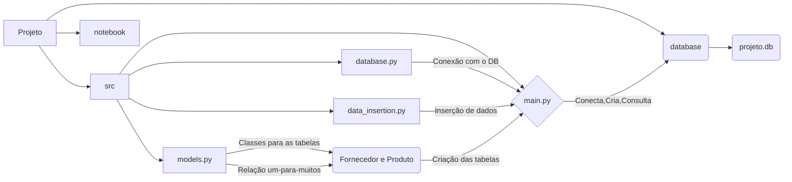

# Desafio Intermediário de SQLAlchemy: Tabelas de Produto e Fornecedor
Este desafio focará na criação de duas tabelas relacionadas, Produto e Fornecedor, utilizando SQLAlchemy. Cada produto terá um fornecedor associado, demonstrando o uso de chaves estrangeiras para estabelecer relações entre tabelas. Além disso, você realizará inserções nessas tabelas para praticar a manipulação de dados.

## Setando a Raiz do projeto:


```python
import os
os.getcwd()
os.chdir("/home/jcnok/bootcamps/bootcamp-jornada-de-dados_2024/aula_17")
```

# Estrutura do Projeto:



### Documentação do Projeto

#### Nome do Projeto: SQLAlchemy Fornecedor-Produto

#### Descrição:
Este projeto implementa um sistema básico de gerenciamento de produtos e fornecedores utilizando SQLAlchemy, um ORM (Object-Relational Mapper) para Python. Ele cria duas tabelas, `Fornecedor` e `Produto`, e estabelece uma relação de um-para-muitos entre elas, onde um fornecedor pode ter vários produtos, mas um produto só pode ter um fornecedor.

#### Estrutura do Projeto:
O projeto é dividido em quatro módulos principais:

1. `models.py`: Define as classes de modelo para as tabelas `Fornecedor` e `Produto`, e cria as relações entre elas.
2. `database.py`: Contém a configuração da conexão com o banco de dados.
3. `data_insertion.py`: Realiza as operações de inserção de dados nas tabelas.
4. `main.py`: importa os módulos para conectar, criar as tabelas e realizar consultas no banco de dados.

#### Uso:
1. Execute o script `main.py` para realizar as operações no banco de dados.

#### Exemplo de Uso:
```bash
python main.py
```


```python
!python src/main.py
```

    2024-05-02 18:23:18,796 INFO sqlalchemy.engine.Engine BEGIN (implicit)
    2024-05-02 18:23:18,796 INFO sqlalchemy.engine.Engine PRAGMA main.table_info("fornecedores")
    2024-05-02 18:23:18,797 INFO sqlalchemy.engine.Engine [raw sql] ()
    2024-05-02 18:23:18,797 INFO sqlalchemy.engine.Engine PRAGMA temp.table_info("fornecedores")
    2024-05-02 18:23:18,797 INFO sqlalchemy.engine.Engine [raw sql] ()
    2024-05-02 18:23:18,798 INFO sqlalchemy.engine.Engine PRAGMA main.table_info("produtos")
    2024-05-02 18:23:18,798 INFO sqlalchemy.engine.Engine [raw sql] ()
    2024-05-02 18:23:18,798 INFO sqlalchemy.engine.Engine PRAGMA temp.table_info("produtos")
    2024-05-02 18:23:18,798 INFO sqlalchemy.engine.Engine [raw sql] ()
    2024-05-02 18:23:18,799 INFO sqlalchemy.engine.Engine
    CREATE TABLE fornecedores (
    	id INTEGER NOT NULL,
    	nome VARCHAR(50) NOT NULL,
    	telefone VARCHAR(20),
    	email VARCHAR(50),
    	endereco VARCHAR(100),
    	PRIMARY KEY (id)
    )


    2024-05-02 18:23:18,799 INFO sqlalchemy.engine.Engine [no key 0.00017s] ()
    2024-05-02 18:23:18,811 INFO sqlalchemy.engine.Engine
    CREATE TABLE produtos (
    	id INTEGER NOT NULL,
    	nome VARCHAR(50) NOT NULL,
    	descricao VARCHAR(200),
    	preco INTEGER,
    	fornecedor_id INTEGER,
    	PRIMARY KEY (id),
    	FOREIGN KEY(fornecedor_id) REFERENCES fornecedores (id)
    )


    2024-05-02 18:23:18,812 INFO sqlalchemy.engine.Engine [no key 0.00036s] ()
    2024-05-02 18:23:18,822 INFO sqlalchemy.engine.Engine COMMIT
    2024-05-02 18:23:18,824 INFO sqlalchemy.engine.Engine BEGIN (implicit)
    2024-05-02 18:23:18,825 INFO sqlalchemy.engine.Engine PRAGMA main.table_info("fornecedores")
    2024-05-02 18:23:18,825 INFO sqlalchemy.engine.Engine [raw sql] ()
    2024-05-02 18:23:18,826 INFO sqlalchemy.engine.Engine PRAGMA main.table_info("produtos")
    2024-05-02 18:23:18,826 INFO sqlalchemy.engine.Engine [raw sql] ()
    2024-05-02 18:23:18,827 INFO sqlalchemy.engine.Engine COMMIT
    /home/jcnok/bootcamps/bootcamp-jornada-de-dados_2024/aula_17/src/data_insertion.py:12: SAWarning: relationship 'Produto.fornecedor' will copy column fornecedores.id to column produtos.fornecedor_id, which conflicts with relationship(s): 'Fornecedor.produtos' (copies fornecedores.id to produtos.fornecedor_id). If this is not the intention, consider if these relationships should be linked with back_populates, or if viewonly=True should be applied to one or more if they are read-only. For the less common case that foreign key constraints are partially overlapping, the orm.foreign() annotation can be used to isolate the columns that should be written towards.   To silence this warning, add the parameter 'overlaps="produtos"' to the 'Produto.fornecedor' relationship. (Background on this warning at: https://sqlalche.me/e/20/qzyx) (This warning originated from the `configure_mappers()` process, which was invoked automatically in response to a user-initiated operation.)
      Fornecedor(nome="Fornecedor A", telefone="12345678", email="contato@a.com", endereco="Endereço A"),
    2024-05-02 18:23:18,836 INFO sqlalchemy.engine.Engine BEGIN (implicit)
    2024-05-02 18:23:18,839 INFO sqlalchemy.engine.Engine INSERT INTO fornecedores (nome, telefone, email, endereco) VALUES (?, ?, ?, ?) RETURNING id
    2024-05-02 18:23:18,839 INFO sqlalchemy.engine.Engine [generated in 0.00020s (insertmanyvalues) 1/5 (ordered; batch not supported)] ('Fornecedor A', '12345678', 'contato@a.com', 'Endereço A')
    2024-05-02 18:23:18,840 INFO sqlalchemy.engine.Engine INSERT INTO fornecedores (nome, telefone, email, endereco) VALUES (?, ?, ?, ?) RETURNING id
    2024-05-02 18:23:18,840 INFO sqlalchemy.engine.Engine [insertmanyvalues 2/5 (ordered; batch not supported)] ('Fornecedor B', '87654321', 'contato@b.com', 'Endereço B')
    2024-05-02 18:23:18,840 INFO sqlalchemy.engine.Engine INSERT INTO fornecedores (nome, telefone, email, endereco) VALUES (?, ?, ?, ?) RETURNING id
    2024-05-02 18:23:18,841 INFO sqlalchemy.engine.Engine [insertmanyvalues 3/5 (ordered; batch not supported)] ('Fornecedor C', '12348765', 'contato@c.com', 'Endereço C')
    2024-05-02 18:23:18,841 INFO sqlalchemy.engine.Engine INSERT INTO fornecedores (nome, telefone, email, endereco) VALUES (?, ?, ?, ?) RETURNING id
    2024-05-02 18:23:18,841 INFO sqlalchemy.engine.Engine [insertmanyvalues 4/5 (ordered; batch not supported)] ('Fornecedor D', '56781234', 'contato@d.com', 'Endereço D')
    2024-05-02 18:23:18,841 INFO sqlalchemy.engine.Engine INSERT INTO fornecedores (nome, telefone, email, endereco) VALUES (?, ?, ?, ?) RETURNING id
    2024-05-02 18:23:18,841 INFO sqlalchemy.engine.Engine [insertmanyvalues 5/5 (ordered; batch not supported)] ('Fornecedor E', '43217865', 'contato@e.com', 'Endereço E')
    2024-05-02 18:23:18,842 INFO sqlalchemy.engine.Engine COMMIT
    2024-05-02 18:23:18,850 INFO sqlalchemy.engine.Engine BEGIN (implicit)
    2024-05-02 18:23:18,852 INFO sqlalchemy.engine.Engine INSERT INTO produtos (nome, descricao, preco, fornecedor_id) VALUES (?, ?, ?, ?) RETURNING id
    2024-05-02 18:23:18,852 INFO sqlalchemy.engine.Engine [generated in 0.00018s (insertmanyvalues) 1/5 (ordered; batch not supported)] ('Produto 1', 'Descrição do Produto 1', 100, 1)
    2024-05-02 18:23:18,852 INFO sqlalchemy.engine.Engine INSERT INTO produtos (nome, descricao, preco, fornecedor_id) VALUES (?, ?, ?, ?) RETURNING id
    2024-05-02 18:23:18,852 INFO sqlalchemy.engine.Engine [insertmanyvalues 2/5 (ordered; batch not supported)] ('Produto 2', 'Descrição do Produto 2', 200, 2)
    2024-05-02 18:23:18,853 INFO sqlalchemy.engine.Engine INSERT INTO produtos (nome, descricao, preco, fornecedor_id) VALUES (?, ?, ?, ?) RETURNING id
    2024-05-02 18:23:18,853 INFO sqlalchemy.engine.Engine [insertmanyvalues 3/5 (ordered; batch not supported)] ('Produto 3', 'Descrição do Produto 3', 300, 3)
    2024-05-02 18:23:18,853 INFO sqlalchemy.engine.Engine INSERT INTO produtos (nome, descricao, preco, fornecedor_id) VALUES (?, ?, ?, ?) RETURNING id
    2024-05-02 18:23:18,853 INFO sqlalchemy.engine.Engine [insertmanyvalues 4/5 (ordered; batch not supported)] ('Produto 4', 'Descrição do Produto 4', 400, 4)
    2024-05-02 18:23:18,853 INFO sqlalchemy.engine.Engine INSERT INTO produtos (nome, descricao, preco, fornecedor_id) VALUES (?, ?, ?, ?) RETURNING id
    2024-05-02 18:23:18,854 INFO sqlalchemy.engine.Engine [insertmanyvalues 5/5 (ordered; batch not supported)] ('Produto 5', 'Descrição do Produto 5', 500, 5)
    2024-05-02 18:23:18,854 INFO sqlalchemy.engine.Engine COMMIT
    2024-05-02 18:23:18,863 INFO sqlalchemy.engine.Engine BEGIN (implicit)
    2024-05-02 18:23:18,867 INFO sqlalchemy.engine.Engine SELECT fornecedores.nome AS fornecedores_nome, sum(produtos.preco) AS total_preco
    FROM fornecedores JOIN produtos ON fornecedores.id = produtos.fornecedor_id GROUP BY fornecedores.nome
    2024-05-02 18:23:18,868 INFO sqlalchemy.engine.Engine [generated in 0.00026s] ()
    Fornecedor: Fornecedor A, Total Preço: 100
    Fornecedor: Fornecedor B, Total Preço: 200
    Fornecedor: Fornecedor C, Total Preço: 300
    Fornecedor: Fornecedor D, Total Preço: 400
    Fornecedor: Fornecedor E, Total Preço: 500


## Scripts:

### `models.py`


```python
%%writefile src/models.py
from sqlalchemy import Column, Integer, String, ForeignKey
from sqlalchemy.orm import relationship
from sqlalchemy.ext.declarative import declarative_base

Base = declarative_base()

class Fornecedor(Base):
    """
    Classe que representa a tabela de Fornecedor.

    Atributos:
        id (int): Identificador único do fornecedor.
        nome (str): Nome do fornecedor.
        telefone (str): Número de telefone do fornecedor.
        email (str): Endereço de e-mail do fornecedor.
        endereco (str): Endereço físico do fornecedor.
        produtos (list): Lista dos produtos associados ao fornecedor.
    """
    __tablename__ = 'fornecedores'
    id = Column(Integer, primary_key=True)
    nome = Column(String(50), nullable=False)
    telefone = Column(String(20))
    email = Column(String(50))
    endereco = Column(String(100))
    produtos = relationship("Produto")

class Produto(Base):
    """
    Classe que representa a tabela de Produto.

    Atributos:
        id (int): Identificador único do produto.
        nome (str): Nome do produto.
        descricao (str): Descrição do produto.
        preco (int): Preço do produto.
        fornecedor_id (int): Chave estrangeira referenciando o fornecedor associado ao produto.
        fornecedor (Fornecedor): Relação com o fornecedor associado.
    """
    __tablename__ = 'produtos'
    id = Column(Integer, primary_key=True)
    nome = Column(String(50), nullable=False)
    descricao = Column(String(200))
    preco = Column(Integer)
    fornecedor_id = Column(Integer, ForeignKey('fornecedores.id'))
    fornecedor = relationship("Fornecedor")
```

    Writing src/models.py


### `database.py`


```python
%%writefile src/database.py
from sqlalchemy import create_engine
from sqlalchemy.orm import sessionmaker
from models import Base

def create_session():
    """
    Função para criar uma sessão do banco de dados.

    Retorna:
        Session: Objeto de sessão para interagir com o banco de dados.
    """
    engine = create_engine('sqlite:///database/projeto.db', echo=True)
    Base.metadata.create_all(engine)
    Session = sessionmaker(bind=engine)
    return Session()
```

    Writing src/database.py


### `data_insertion.py`


```python
%%writefile src/data_insertion.py
from sqlalchemy.orm import sessionmaker
from models import Fornecedor, Produto
from database import create_session

def insert_data():
    """
    Função para inserir dados nas tabelas de fornecedor e produto.
    """
    session = create_session()

    fornecedores = [
        Fornecedor(nome="Fornecedor A", telefone="12345678", email="contato@a.com", endereco="Endereço A"),
        Fornecedor(nome="Fornecedor B", telefone="87654321", email="contato@b.com", endereco="Endereço B"),
        Fornecedor(nome="Fornecedor C", telefone="12348765", email="contato@c.com", endereco="Endereço C"),
        Fornecedor(nome="Fornecedor D", telefone="56781234", email="contato@d.com", endereco="Endereço D"),
        Fornecedor(nome="Fornecedor E", telefone="43217865", email="contato@e.com", endereco="Endereço E")
    ]

    session.add_all(fornecedores)
    session.commit()

    produtos = [
        Produto(nome="Produto 1", descricao="Descrição do Produto 1", preco=100, fornecedor_id=1),
        Produto(nome="Produto 2", descricao="Descrição do Produto 2", preco=200, fornecedor_id=2),
        Produto(nome="Produto 3", descricao="Descrição do Produto 3", preco=300, fornecedor_id=3),
        Produto(nome="Produto 4", descricao="Descrição do Produto 4", preco=400, fornecedor_id=4),
        Produto(nome="Produto 5", descricao="Descrição do Produto 5", preco=500, fornecedor_id=5)
    ]

    session.add_all(produtos)
    session.commit()
```

    Writing src/data_insertion.py


### `main.py`


```python
%%writefile src/main.py
from sqlalchemy import func
from sqlalchemy.orm import sessionmaker
from models import Fornecedor, Produto
from database import create_session
from data_insertion import insert_data

def main():
    # Criando uma sessão para interagir com o banco de dados
    session = create_session()

    # Inserindo dados de exemplo
    insert_data()

    # Consulta para calcular o total de preço de produtos para cada fornecedor
    resultado = session.query(
        Fornecedor.nome,
        func.sum(Produto.preco).label('total_preco')
    ).join(Produto, Fornecedor.id == Produto.fornecedor_id
    ).group_by(Fornecedor.nome).all()

    # Imprimindo os resultados
    for nome, total_preco in resultado:
        print(f"Fornecedor: {nome}, Total Preço: {total_preco}")

if __name__ == "__main__":
    main()
```

    Overwriting src/main.py


### Conclusão:

O conhecimento adquirido neste projeto, especialmente sobre o uso do SQLAlchemy para interagir com bancos de dados relacionais em Python, é fundamental e altamente relevante para profissionais da área de Engenharia de Dados e Ciência de Dados.

#### Importância do Conteúdo Aprendido:

1. **Integração de Dados:** Em projetos de Engenharia de Dados e Ciência de Dados, é crucial ser capaz de acessar, extrair e manipular dados de diversas fontes. O SQLAlchemy oferece uma maneira eficiente e flexível de trabalhar com bancos de dados relacionais, facilitando a integração de dados em pipelines de processamento.

2. **Modelagem de Dados:** Modelar e estruturar os dados de forma adequada é essencial para garantir a qualidade e a eficácia das análises de dados. Com o SQLAlchemy, é possível definir modelos de dados complexos e estabelecer relações entre eles, proporcionando uma base sólida para análises subsequentes.

3. **Análise e Visualização de Dados:** Uma vez que os dados estão armazenados e modelados corretamente, é possível realizar análises estatísticas, construir modelos preditivos e criar visualizações informativas para extrair insights valiosos. O SQLAlchemy desempenha um papel fundamental nesse processo, garantindo acesso rápido e eficiente aos dados necessários.

#### Impacto Positivo:

Dominar o SQLAlchemy e suas práticas recomendadas é essencial para profissionais que desejam causar um impacto positivo na área de Engenharia de Dados e Ciência de Dados. Com essa habilidade, é possível contribuir para o desenvolvimento de soluções mais eficientes, precisas e escaláveis, que impulsionam a tomada de decisões baseada em dados e promovem a inovação em diversos setores da indústria.

Portanto, investir no aprendizado e na aplicação do SQLAlchemy é uma escolha estratégica para profissionais que buscam se destacar na área de Engenharia de Dados e Ciência de Dados, e contribuir para o avanço da análise e interpretação de dados em organizações de todo o mundo.
