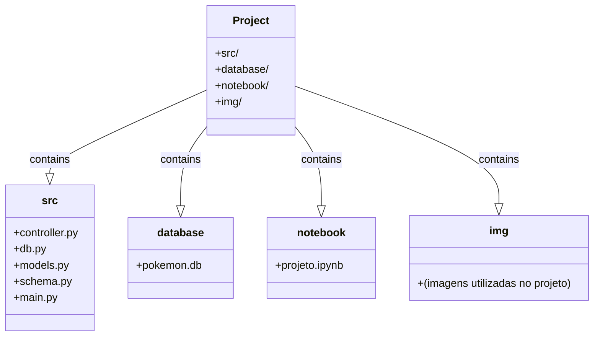

# Aula 18


## **Desafio: Construção de um Sistema de Coleta de Dados de Pokémons**

**Descrição do Desafio:**

Você foi contratado por uma empresa de análise de dados para desenvolver um sistema de coleta de dados de Pokémons. O sistema deve ser capaz de coletar informações sobre Pokémons da API PokeAPI e armazená-las em um banco de dados para análise posterior.

O sistema deve atender aos seguintes requisitos:

1. **Coleta de Dados**: O sistema deve ser capaz de fazer requisições à API PokeAPI para obter informações sobre Pokémons. As informações a serem coletadas incluem nome, tipo e outras características relevantes.

2. **Armazenamento de Dados**: Os dados coletados devem ser armazenados em um banco de dados para posterior análise. O banco de dados deve ser capaz de armazenar informações sobre múltiplos Pokémons e deve ser fácil de consultar e atualizar.

3. **Execução Automática**: O sistema deve ser capaz de executar automaticamente a coleta de dados em intervalos regulares, garantindo que as informações estejam sempre atualizadas.

4. **Validação de Dados**: O sistema deve validar os dados coletados para garantir que estão completos e consistentes antes de armazená-los no banco de dados.

5. **Documentação**: Todo o código desenvolvido deve ser acompanhado de uma documentação clara e detalhada, explicando o funcionamento do sistema, a estrutura do código e como configurar e executar o projeto.

**Tecnologias Requeridas:**

- Python
- SQLAlchemy (para o banco de dados)
- Pydantic (para validação de dados)
- Requests (para fazer requisições HTTP à API PokeAPI)

**Entrega do Desafio:**

Você deve desenvolver o sistema de acordo com os requisitos acima e entregá-lo em um repositório Git público. Certifique-se de incluir todas as instruções necessárias para configurar e executar o projeto, bem como a documentação exigida.



### Aqui está uma breve descrição de cada componente:

- `src/`: Contém os arquivos de código-fonte do projeto.
  - `controller.py`: Implementa a lógica de controle do sistema.
  - `db.py`: Gerencia a conexão com o banco de dados e fornece funcionalidades relacionadas ao banco de dados.
  - `models.py`: Define os modelos de dados usados no projeto.
  - `schema.py`: Define os esquemas de validação para os dados manipulados no projeto.
  - `main.py`: Arquivo principal que inicia a execução do projeto.

- `database/`: Contém o arquivo do banco de dados SQLite utilizado pelo projeto.

- `notebook/`: Contém um Jupyter Notebook que documenta o projeto completo.

- `img/`: Contém imagens utilizadas no projeto, se aplicável.

## Uso

Para executar o projeto, basta rodar o arquivo `main.py` na pasta `src/`.


```python
!python src/main.py
```

    Adicionando treecko ao banco de dados.
    Adicionando persian ao banco de dados.
    Adicionando pidgeot ao banco de dados.
    Adicionando spinda ao banco de dados.
    Adicionando arcanine ao banco de dados.
    Adicionando shuckle ao banco de dados.
    Adicionando tauros ao banco de dados.
    Adicionando milotic ao banco de dados.
    Adicionando chinchou ao banco de dados.
    Adicionando tentacruel ao banco de dados.
    Adicionando poliwhirl ao banco de dados.
    Adicionando quilava ao banco de dados.
    Adicionando igglybuff ao banco de dados.
    Adicionando dodrio ao banco de dados.
    Adicionando cloyster ao banco de dados.
    Adicionando ledyba ao banco de dados.
    Adicionando teddiursa ao banco de dados.
    Adicionando starmie ao banco de dados.
    Adicionando lotad ao banco de dados.
    Adicionando taillow ao banco de dados.
    Adicionando spinarak ao banco de dados.
    Adicionando metapod ao banco de dados.
    Adicionando golduck ao banco de dados.
    KeyboardInterrupt


## Conclusão

O desenvolvimento deste projeto proporcionou uma experiência valiosa no mundo do desenvolvimento de software, especialmente no contexto de projetos de coleta e armazenamento de dados. Ao longo do processo, aprendemos a trabalhar com diversas tecnologias e conceitos importantes, incluindo a integração com APIs externas, o uso de bancos de dados relacionais, a definição de modelos de dados e esquemas de validação, entre outros.

Essas habilidades são essenciais para a construção de projetos reais, onde a coleta, processamento e armazenamento de dados são componentes críticos. Por exemplo, em aplicações de análise de dados, sistemas de recomendação, aplicações web e muitos outros cenários, é comum a necessidade de integrar-se com APIs externas para obter dados atualizados e relevantes.

Além disso, a capacidade de estruturar e organizar um projeto de forma eficiente, seguindo padrões de arquitetura como o MVC, é fundamental para garantir a manutenibilidade, escalabilidade e extensibilidade do código ao longo do tempo. A modularidade e a clareza do código resultantes da aplicação desses padrões facilitam a colaboração em equipe e o desenvolvimento de novas funcionalidades.

Portanto, o conteúdo aprendido neste projeto é de extrema importância para projetos reais, pois proporciona as habilidades e o conhecimento necessários para enfrentar os desafios do desenvolvimento de software de forma eficaz e profissional. Ao dominar esses conceitos e tecnologias, estamos preparados para enfrentar uma ampla gama de projetos e contribuir para o sucesso de equipes e organizações em diversos contextos.

## Passo a Passo do desenvolvimento:

## Setando a raiz do projeto:


```python
import os
os.getcwd()
os.chdir("/home/jcnok/bootcamps/bootcamp-jornada-de-dados_2024/aula_18")
```

## Scripts:

### `models.py`


```python
%%writefile src/models.py
from sqlalchemy import Column, Integer, String, DateTime
from sqlalchemy.sql import func
from db import Base

class Pokemon(Base):
    """Modelo para representar os dados de um Pokémon."""
    __tablename__ = 'pokemons'

    id = Column(Integer, primary_key=True, index=True)
    name = Column(String, doc="O nome do Pokémon.")
    type = Column(String, doc="O tipo do Pokémon.")
    created_at = Column(DateTime, default=func.now(), doc="O timestamp de quando o registro foi criado.")

```

    Writing src/models.py


### `db.py`:


```python
%%writefile src/db.py
from sqlalchemy import create_engine
from sqlalchemy.ext.declarative import declarative_base
from sqlalchemy.orm import sessionmaker

# URL do banco de dados SQLite
SQLALCHEMY_DATABASE_URL = "sqlite:///database/pokemon.db"

# Cria o engine para o banco de dados
engine = create_engine(SQLALCHEMY_DATABASE_URL)

# Cria uma sessão local para interagir com o banco de dados
SessionLocal = sessionmaker(autocommit=False, autoflush=False, bind=engine)

# Cria a base declarativa para definir os modelos de dados
Base = declarative_base()
```

    Writing src/db.py


### `schema.py`:


```python
%%writefile src/schema.py
from pydantic import BaseModel

class PokemonSchema(BaseModel):
    """Esquema Pydantic para representar os dados de um Pokémon."""
    name: str
    type: str

    class Config:
        """Configuração do esquema Pydantic."""
        from_attributes = True
```

    Overwriting src/schema.py


### `controler.py`:


```python
%%writefile src/controler.py
import requests
from db import SessionLocal, engine, Base
from models import Pokemon
from schema import PokemonSchema

# Cria as tabelas no banco de dados, se ainda não existirem
Base.metadata.create_all(bind=engine)

def fetch_pokemon_data(pokemon_id: int):
    """Função para buscar os dados de um Pokémon da API."""
    response = requests.get(f"https://pokeapi.co/api/v2/pokemon/{pokemon_id}")
    if response.status_code == 200:
        data = response.json()
        types = ', '.join(type['type']['name'] for type in data['types'])
        return PokemonSchema(name=data['name'], type=types)
    else:
        return None

def add_pokemon_to_db(pokemon_schema: PokemonSchema) -> Pokemon:
    """Função para adicionar os dados de um Pokémon ao banco de dados."""
    with SessionLocal() as db:
        db_pokemon = Pokemon(name=pokemon_schema.name, type=pokemon_schema.type)
        db.add(db_pokemon)
        db.commit()
        db.refresh(db_pokemon)
    return db_pokemon
```

    Overwriting src/controler.py


### `main.py`:


```python
%%writefile src/main.py
import time
import random
from controler import fetch_pokemon_data, add_pokemon_to_db

def main():
    """Função principal para iniciar a coleta de dados dos Pokémon."""
    while True:
        pokemon_id = random.randint(1, 350)  # Gera um ID aleatório entre 1 e 350
        pokemon_schema = fetch_pokemon_data(pokemon_id)
        if pokemon_schema:
            print(f"Adicionando {pokemon_schema.name} ao banco de dados.")
            add_pokemon_to_db(pokemon_schema)
        else:
            print(f"Não foi possível obter dados para o Pokémon com ID {pokemon_id}.")
        time.sleep(10)

if __name__ == "__main__":
    main()
```

    Overwriting src/main.py


```python

```
