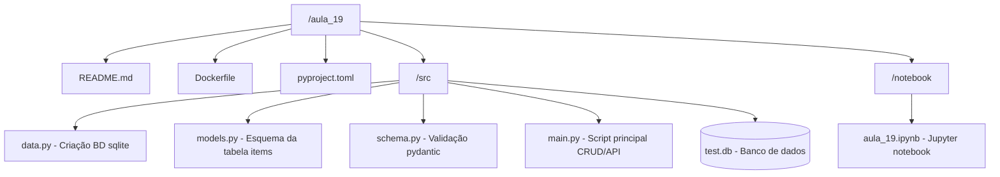

# Desafio - Criando um CRUD com FastApi.

## Estrutura do Projeto:




## Como Executar o Projeto Usando o Docker.

Este guia fornecerá instruções detalhadas sobre como clonar e executar o repositório da Aula 19, além de demonstrar como acessar a documentação da API e utilizar os métodos do CRUD. Certifique-se de seguir cada passo cuidadosamente para garantir uma experiência bem-sucedida.

### Pré-requisitos
Antes de começar, certifique-se de ter o Docker instalado em seu sistema. Se você ainda não tiver o Docker instalado, siga as instruções de instalação específicas para o seu sistema operacional:
- [Instalação do Docker no Windows](https://docs.docker.com/desktop/install/windows-install/)
- [Instalação do Docker no macOS](https://docs.docker.com/desktop/install/mac-install/)
- [Instalação do Docker no Linux](https://docs.docker.com/desktop/install/linux-install/)

### Passos para Clonar e Executar o Repositório

1. **Clone o repositório:**
   ```bash
   git clone https://github.com/Jcnok/bootcamp-jornada-de-dados_2024.git
   ```

2. **Acesse o diretório clonado:**
   ```bash
   cd aula_19
   ```

3. **Construa a imagem Docker:**
   ```bash
   docker build -t aula_19 .
   ```

4. **Execute o contêiner Docker:**
   ```bash
   docker run -p 8501:8501 aula_19
   ```
## Como Executar o Projeto sem o Docker.

Para executar o projeto sem o Docker, você pode seguir estas etapas:

1. **Clone o repositório:**
   ```bash
   git clone https://github.com/Jcnok/bootcamp-jornada-de-dados_2024.git
   ```

2. **Acesse o diretório clonado:**
   ```bash
   cd aula_19
   ```

3. **Instale as dependências do projeto:**
   ```bash
   pip install poetry
   poetry install
   ```

4. **Execute a aplicação:**
   ```bash
   uvicorn main:app --host 0.0.0.0 --port 8501
   ```

### Acessando a Documentação da API
Após executar o contêiner, você pode acessar a documentação da API em seu navegador da web utilizando o seguinte endereço:
- [http://localhost:8501/docs](http://localhost:8501/docs)

### Utilizando os Métodos do CRUD
A documentação da API fornecerá uma interface interativa para testar os métodos do CRUD. Aqui está um exemplo de como usar os métodos CRUD via interface web:

1. **GET (Read)**:
   - Acesse [http://localhost:8501/docs](http://localhost:8501/docs) em seu navegador.
   - Na seção da rota desejada, clique no método GET.
   - Clique em "Try it out".
   - Insira os parâmetros necessários, se houver.
   - Clique em execute.

2. **POST (Create)**:
   - Na seção da rota desejada, clique no método POST.
   - Clique em "Try it out".
   - Insira os parâmetros necessários, se houver.
   - Clique em execute.

3. **PUT (Update)**:
   - Na seção da rota desejada, clique no método PUT.
   - Clique em "Try it out".
   - Insira os parâmetros necessários, se houver.
   - Clique em execute.

4. **DELETE (Delete)**:
   - Na seção da rota desejada, clique no método DELETE.
   - Clique em "Try it out".
   - Insira os parâmetros necessários, se houver.
   - Clique em execute.

### Conclusão
Com as operações POST, GET, PUT e DELETE, conseguimos criar, recuperar, atualizar e excluir itens de forma eficiente e segura. Cada operação é claramente definida, especificando o verbo HTTP, o endpoint correspondente e a ação realizada.

Essa API é fundamental para qualquer sistema que necessite interagir com um banco de dados, permitindo uma manipulação completa e flexível dos dados. Ao implementar essa API, é importante garantir que as operações estejam alinhadas com os requisitos do projeto e que todas as medidas de segurança e consistência dos dados sejam observadas.
