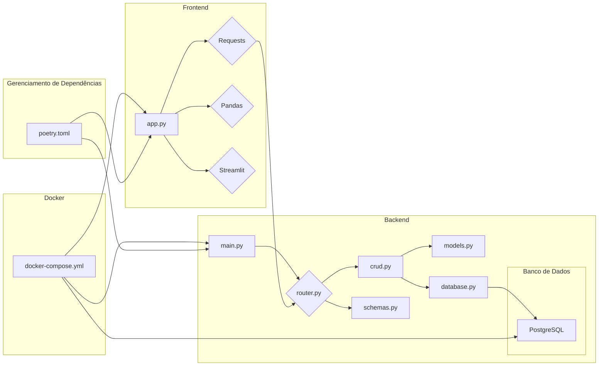

## CRUD FastAPI com PostgreSQL e Frontend Streamlit



Este projeto demonstra a implementação de uma API RESTful utilizando FastAPI, com persistência de dados em um banco de dados PostgreSQL, e um frontend construído com Streamlit para interagir com a API.

### Estrutura do Projeto

A estrutura do projeto é organizada da seguinte forma:
```
Projeto CRUD FastAPI com PostgreSQL e Streamlit
├── README.md
├── backend
│ ├── Dockerfile
│ ├── crud.py
│ ├── database.py
│ ├── main.py
│ ├── models.py
│ ├── requirements.txt
│ ├── router.py
│ └── schemas.py
├── frontend
│ ├── app.py
│ ├── requirements.txt
│ └── Dockerfile
├── docker-compose.yml
├── poetry.lock
└── pyproject.toml
```

**backend**: Pasta contendo o código da API FastAPI.

**frontend**: Pasta contendo o código da aplicação Streamlit.

**docker-compose.yml**: Arquivo de configuração do Docker Compose para orquestrar a execução dos containers backend e frontend.

**poetry.lock**: Arquivo de gerenciamento de dependências do Poetry.

**pyproject.toml**: Arquivo de configuração do Poetry.

### Backend

**FastAPI:** Framework Python utilizado para construção da API. Oferece recursos como:

* Roteamento de requisições HTTP.
* Validação de dados através do Pydantic.
* Documentação automática da API através do Swagger e Redoc.

**Uvicorn:** Servidor ASGI para execução da API FastAPI.

**SQLAlchemy:** ORM (Object Relational Mapper) utilizado para interagir com o banco de dados PostgreSQL. Permite a criação de modelos de dados que refletem a estrutura das tabelas do banco de dados.

**Pydantic:** Biblioteca utilizada para validação de dados e definição de schemas para a API.

**database.py:** Arquivo responsável por configurar a conexão com o banco de dados PostgreSQL.

**models.py:** Arquivo contendo os modelos SQLAlchemy, que representam as tabelas do banco de dados.

**schemas.py:** Arquivo contendo os schemas Pydantic, utilizados para validar os dados recebidos pela API e para definir os dados retornados pela API.

**crud.py:** Arquivo contendo as funções CRUD (Create, Read, Update, Delete) para interagir com o banco de dados através do SQLAlchemy.

**router.py:** Arquivo contendo as rotas da API definidas através do FastAPI.

**main.py:** Arquivo principal da API FastAPI, que inicia a aplicação e inclui as rotas.

### Frontend

**Streamlit:** Biblioteca Python para desenvolvimento de interfaces web interativas. Permite criar rapidamente dashboards e aplicações web sem conhecimento de HTML, CSS ou Javascript.

**Requests:** Biblioteca Python utilizada para realizar requisições HTTP, utilizada para interagir com a API.

**Pandas:** Biblioteca Python para análise de dados. Permite manipular, limpar e analisar dados.

**app.py:** Arquivo principal da aplicação Streamlit.

### Docker Compose

**docker-compose.yml:** Arquivo que define a configuração para a criação e execução dos containers Docker para o banco de dados, backend e frontend.

**postgres**: Serviço que define o container do banco de dados PostgreSQL.

**backend**: Serviço que define o container da API FastAPI.

**frontend**: Serviço que define o container da aplicação Streamlit.

**mynetwork**: Rede Docker personalizada para que os containers possam se comunicar entre si.

### Instalação e Execução

**Instalação:**

1. Certifique-se de ter o Python e o Poetry instalados.
2. Clone o repositório do projeto.
3. Navegue até o diretório do projeto.
4. Execute o comando `poetry install` para instalar as dependências.

**Execução:**

1. Execute o comando `poetry run taskipy run` para iniciar a aplicação.
2. Acesse a API através do endereço `http://localhost:8000/docs` para visualizar a documentação da API.
3. Acesse o frontend através do endereço `http://localhost:8501` para interagir com a aplicação Streamlit.

### Considerações

* O projeto utiliza o Poetry para gerenciar as dependências.
* O Docker Compose é utilizado para orquestrar a execução dos containers.
* As credenciais do banco de dados PostgreSQL estão definidas no arquivo `docker-compose.yml`.
* A aplicação Streamlit utiliza o `requests` para fazer requisições HTTP para a API.
* A documentação da API FastAPI pode ser acessada através do endereço `http://localhost:8000/docs`.


### Documentação Detalhada

#### Backend

**Database.py**

O arquivo **database.py** define a configuração da conexão com o banco de dados PostgreSQL. O arquivo contém as seguintes definições:

* **SQLALCHEMY_DATABASE_URL:** string de conexão com o banco de dados.
* **engine:** objeto `create_engine` do SQLAlchemy, que cria a conexão com o banco de dados.
* **SessionLocal:** fábrica de sessões SQLAlchemy, utilizada para executar queries.
* **Base:** classe base declarativa do SQLAlchemy, utilizada para criar os modelos.
* **get_db():** função que retorna uma sessão do banco de dados.

**Models.py**

O arquivo **models.py** define os modelos SQLAlchemy para a tabela **products**.  

* **ProductModel:** Classe que representa a tabela **products**.
    * **id:** coluna de chave primária do tipo inteiro.
    * **name:** coluna de texto para o nome do produto.
    * **description:** coluna de texto para a descrição do produto.
    * **price:** coluna de número de ponto flutuante para o preço do produto.
    * **categoria:** coluna de texto para a categoria do produto.
    * **email_fornecedor:** coluna de texto para o email do fornecedor.
    * **created_at:** coluna de data e hora para a data de criação do produto.

**Schemas.py**

O arquivo **schemas.py** define os schemas Pydantic para a API.

* **CategoriaBase:** Enum para definir as categorias possíveis do produto.
* **ProductBase:** Schema base para o modelo de produto.
* **ProductCreate:** Schema para criação de novos produtos.
* **ProductResponse:** Schema para a resposta da API quando um produto é criado ou retornado.
* **ProductUpdate:** Schema para atualizar um produto existente.

**CRUD.py**

O arquivo **crud.py** define as funções CRUD para interagir com o banco de dados.

* **get_product(db: Session, product_id: int):** Função para recuperar um produto específico.
* **get_products(db: Session):** Função para recuperar todos os produtos.
* **create_product(db: Session, product: ProductCreate):** Função para criar um novo produto.
* **delete_product(db: Session, product_id: int):** Função para deletar um produto.
* **update_product(db: Session, product_id: int, product: ProductUpdate):** Função para atualizar um produto.

**Router.py**

O arquivo **router.py** define as rotas da API.

* **router**: objeto `APIRouter` do FastAPI, que define as rotas.
* **create_product_route(product: ProductCreate, db: Session = Depends(get_db)):** Rota para criar um novo produto.
* **read_all_products_route(db: Session = Depends(get_db)):** Rota para recuperar todos os produtos.
* **read_product_route(product_id: int, db: Session = Depends(get_db)):** Rota para recuperar um produto específico.
* **detele_product_route(product_id: int, db: Session = Depends(get_db)):** Rota para deletar um produto.
* **update_product_route(product_id: int, product: ProductUpdate, db: Session = Depends(get_db)):** Rota para atualizar um produto.

**Main.py**

O arquivo **main.py** é o ponto de entrada da API FastAPI.

* **app**: objeto `FastAPI` do FastAPI, que define a aplicação.
* **app.include_router(router):** Inclui as rotas definidas no arquivo **router.py** na aplicação.

#### Frontend

**App.py**

O arquivo **app.py** define a aplicação Streamlit.

* **st.set_page_config(layout="wide"):** Define a configuração da página Streamlit para ocupar toda a tela.
* **st.image("logo.png", width=200):** Exibe uma imagem na página.
* **st.title("Gerenciamento de Produtos"):** Define o título da página.
* **show_response_message(response):** Função auxiliar para exibir mensagens de erro detalhadas.
* **Adicionar Produto:** Expander para adicionar novos produtos.
* **Visualizar Produtos:** Expander para visualizar todos os produtos.
* **Obter Detalhes de um Produto:** Expander para obter detalhes de um produto específico.
* **Deletar Produto:** Expander para deletar um produto.
* **Atualizar Produto:** Expander para atualizar um produto.

O código utiliza o **requests** para fazer requisições HTTP para a API FastAPI e o **pandas** para manipular e exibir os dados em formato de tabela.

#### Docker Compose

O arquivo **docker-compose.yml** define a configuração dos containers Docker.

* **version:** versão do Docker Compose.
* **services:** define os serviços que serão executados nos containers.
    * **postgres:** serviço para o banco de dados PostgreSQL.
        * **image:** imagem do Docker do PostgreSQL.
        * **volumes:** monta um volume persistente para os dados do banco de dados.
        * **environment:** define as variáveis de ambiente para o banco de dados.
        * **networks:** conecta o container à rede **mynetwork**.
    * **backend:** serviço para a API FastAPI.
        * **build:** constrói a imagem do Docker para o backend.
        * **volumes:** monta o diretório do backend no container.
        * **environment:** define as variáveis de ambiente para o backend.
        * **ports:** mapeia a porta 8000 do container para a porta 8000 do host.
        * **depends_on:** define que o serviço backend depende do serviço postgres.
        * **networks:** conecta o container à rede **mynetwork**.
    * **frontend:** serviço para a aplicação Streamlit.
        * **build:** constrói a imagem do Docker para o frontend.
        * **volumes:** monta o diretório do frontend no container.
        * **ports:** mapeia a porta 8501 do container para a porta 8501 do host.
        * **networks:** conecta o container à rede **mynetwork**.
* **networks:** define a rede **mynetwork** para a comunicação entre os containers.
* **volumes:** define o volume persistente **postgres_data** para os dados do banco de dados.


### Conclusão

Este projeto demonstra uma implementação simples de uma API RESTful com FastAPI, um frontend interativo com Streamlit, e persistência de dados em um banco de dados PostgreSQL.  O uso do Docker Compose facilita a orquestração dos containers, enquanto o Poetry gerencia as dependências do projeto. Esta estrutura pode ser expandida para atender a necessidades mais complexas e servir como base para o desenvolvimento de aplicações web robustas.
