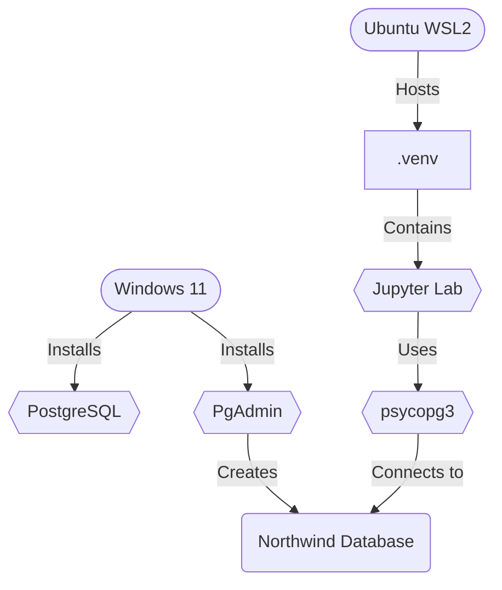
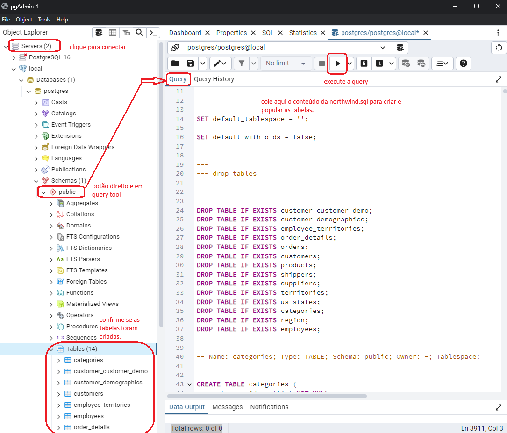

# Aula 01 - Visão Geral e Preparação do ambiente SQL

## Índice

**1. Visão Geral e Preparação do Ambiente SQL**
<a name="ancora"></a>
* [1.1 Introdução](#ancora1.1)
* [1.2 Por que Postgres?](#ancora1.2)
* [1.3 Informações Adicionais](#ancora1.3)
* [1.4 Instalação](#ancora1.4)
* [1.5 Fundamentos da Arquitetura](#ancora1.5)
* [1.6 Criando um Banco de Dados](#ancora1.6)
* [1.7 Criando nosso Schema](#ancora1.7)
* [1.8 Primeiros comandos](#ancora1.8)

**2. Desafio:**
* [2.0 Fluxograma do Desafio](#ancora2.0)
* [2.1 Instalar o Postgres](#ancora2.1)
* [2.2 Criar o projeto Northwind local](#ancora2.2)
* [2.3 Executar as Queries:](#ancora2.3)
* [2.4 Sobre Psycopg3 em Python](#ancora2.4)
* [2.5 Importante](#ancora2.5)*
* [2.6 Configuração Inicial](#ancora2.6)
* [2.7 Exemplo de Seleção Completa](#ancora2.7)
* [2.8 Usando o pandas para melhorar a visualização](#ancora2.8)
* [2.9 Seleção de Colunas Específicas](#ancora2.9)
* [2.10 Utilizando DISTINCT](#ancora2.10)
* [2.11 Cláusula WHERE](#ancora2.11)
* [2.12 ORDER BY](#ancora2.12)
* [2.13 Utilizando ILIKE e IN](#ancora2.13)
* [2.14 Encerrando da Conexão](#ancora2.14)

**3. Conclusão:**

* [3.1 Conclusão](#ancora3.1)

## Links Úteis

* [Instalação do PostgreSQL](https://www.enterprisedb.com/downloads/postgres-postgresql-downloads)
* [Documentação do PostgreSQL](https://www.postgresql.org/docs/current/index.html)
* [Documentação do psycopg3](https://www.psycopg.org/psycopg3/docs/)


<a id="ancora1.1"></a>
[voltar](#ancora).

## Introdução

Bem-vindos ao nosso workshop sobre SQL e PostgreSQL. Hoje, vamos mergulhar nos conceitos básicos de bancos de dados e como o PostgreSQL pode ser utilizado para gerenciar dados de forma eficiente. Nosso objetivo é garantir que todos vocês tenham uma boa base para explorar mais sobre SQL e operações de banco de dados nos próximos dias.

<a id="ancora1.2"></a>
[voltar](#ancora).

## Por que Postgres?

PostgreSQL é um sistema de gerenciamento de banco de dados relacional (RDBMS) desenvolvido no Departamento de Ciência da Computação da Universidade da Califórnia em Berkeley. POSTGRES foi pioneiro em muitos conceitos que só se tornaram disponíveis em alguns sistemas de banco de dados comerciais muito mais tarde:

* complex queries
* foreign keys
* triggers
* updatable views
* transactional integrity

Além disso, o PostgreSQL pode ser estendido pelo usuário de várias maneiras, por exemplo, adicionando novos

* data types
* functions
* operators
* aggregate functions
* index methods
* procedural languages

<a id="ancora1.3"></a>
[voltar](#ancora).

## Informações Adicionais

Além do conteúdo do curso, recomendo alguns outros lugares para estudo.

[Documentação](https://www.postgresql.org/docs/current/index.html) Documentação oficial do Postgres, todas as features estão aqui.


[Wiki](https://wiki.postgresql.org/wiki/Main_Page) A wiki do PostgreSQL contém a lista de Perguntas Frequentes (FAQ), lista de tarefas pendentes (TODO) e informações detalhadas sobre muitos outros tópicos.

[Site](https://www.postgresql.org/) na Web O site do PostgreSQL fornece detalhes sobre a última versão e outras informações para tornar seu trabalho ou lazer com o PostgreSQL mais produtivo.

[Comunidade](https://github.com/postgres/postgres) O código O PostgreSQL é um projeto de código aberto. Como tal, depende da comunidade de usuários para suporte contínuo. À medida que você começa a usar o PostgreSQL, dependerá de outros para obter ajuda, seja através da documentação ou através das listas de discussão. Considere devolver o seu conhecimento. Leia as listas de discussão e responda às perguntas. Se você aprender algo que não está na documentação, escreva e contribua com isso. Se você adicionar recursos ao código, contribua com eles.

<a id="ancora1.4"></a>
[voltar](#ancora).

## Instalação

Antes de poder usar o PostgreSQL, você precisa instalá-lo, é claro. É possível que o PostgreSQL já esteja instalado em seu local, seja porque foi incluído na distribuição do seu sistema operacional ou porque o administrador do sistema já o instalou.

Se você não tem certeza se o PostgreSQL já está disponível ou se você pode usá-lo para suas experimentações, então você pode instalá-lo por conta própria. Fazer isso não é difícil e pode ser um bom exercício.

- Instalando o postgres Local

<a id="ancora1.5"></a>
[voltar](#ancora).

## Fundamentos da Arquitetura

Antes de prosseguirmos, é importante que você entenda a arquitetura básica do sistema PostgreSQL. Compreender como as partes do PostgreSQL interagem tornará tudo mais fácil.

No jargão de tecnologia, o PostgreSQL utiliza um modelo cliente/servidor.

Um processo servidor, que gerencia os arquivos de banco de dados, aceita conexões com o banco de dados de aplicações cliente e executa ações no banco de dados em nome dos clientes. O programa do servidor de banco de dados é chamado de postgres.

A aplicação cliente do usuário (frontend) que deseja realizar operações de banco de dados. As aplicações cliente podem ser muito diversas em natureza: um cliente pode ser uma ferramenta orientada a texto, uma aplicação gráfica, um servidor web que acessa o banco de dados para exibir páginas web ou uma ferramenta especializada de manutenção de banco de dados. Algumas aplicações cliente são fornecidas com a distribuição do PostgreSQL; a maioria é desenvolvida pelos usuários.

Como é típico em aplicações cliente/servidor, o cliente e o servidor podem estar em hosts diferentes. Nesse caso, eles se comunicam por uma conexão de rede TCP/IP. Você deve ter isso em mente, porque os arquivos que podem ser acessados em uma máquina cliente podem não ser acessíveis (ou podem ser acessíveis apenas com um nome de arquivo diferente) na máquina do servidor de banco de dados.

O servidor PostgreSQL pode lidar com múltiplas conexões simultâneas de clientes. Para alcançar isso, ele inicia (“forks”) um novo processo para cada conexão. A partir desse ponto, o cliente e o novo processo servidor se comunicam sem intervenção do processo postgres original. Assim, o processo servidor supervisor está sempre em execução, aguardando conexões de clientes, enquanto os processos de clientes e servidores associados vêm e vão. (Tudo isso, é claro, é invisível para o usuário. Só mencionamos isso aqui para completude.)

<a id="ancora1.6"></a>
[voltar](#ancora).

## Criando um Banco de Dados

O primeiro teste para verificar se você pode acessar o servidor de banco de dados é tentar criar um banco de dados. Um servidor PostgreSQL em execução pode gerenciar vários bancos de dados. Tipicamente, um banco de dados separado é usado para cada projeto ou usuário.

Para isso vamos entrar dentro do nosso cliente `pgAdmin 4`

Também podemos nos conectar em servidores remoto, ex: `Render`

<a id="ancora1.7"></a>
[voltar](#ancora).

## Criando nosso Schema


Para este projeto, vamos utilizar um script SQL simples que preencherá um banco de dados com o famoso exemplo [Northwind](https://github.com/pthom/northwind_psql), adaptado para o PostgreSQL. Esse script configurará o banco de dados Northwind no PostgreSQL, criando todas as tabelas necessárias e inserindo dados de exemplo para que você possa começar a trabalhar imediatamente com consultas e análises SQL em um contexto prático. Este banco de dados de exemplo é uma ótima ferramenta para aprender e praticar as operações e técnicas de SQL, especialmente útil para entender como manipular dados relacionais em um ambiente realista.

<a id="ancora1.8"></a>
[voltar](#ancora).

## Primeiros comandos

Vamos agora para um guia introdutório para operações básicas de SQL utilizando o banco de dados Northwind. Cada comando SQL será explicado com uma breve introdução para ajudar no entendimento e aplicação prática.

#### Exemplo de Seleção Completa

Para selecionar todos os dados de uma tabela:

```sql
-- Exibe todos os registros da tabela Customers
SELECT * FROM customers;
```

#### Seleção de Colunas Específicas

Para selecionar colunas específicas:

```sql
-- Exibe o nome de contato e a cidade dos clientes
SELECT contact_name, city FROM customers;
```

#### Utilizando DISTINCT

Para selecionar valores distintos:

```sql
-- Lista todos os países dos clientes
SELECT country FROM customers;
-- Lista os países sem repetição
SELECT DISTINCT country FROM customers;
-- Conta quantos países únicos existem
SELECT COUNT(DISTINCT country) FROM customers;
```

#### Cláusula WHERE

Para filtrar registros:

```sql
-- Seleciona todos os clientes do México
SELECT * FROM customers WHERE country='Mexico';
-- Seleciona clientes com ID específico
SELECT * FROM customers WHERE customer_id='ANATR';
-- Utiliza AND para múltiplos critérios
SELECT * FROM customers WHERE country='Germany' AND city='Berlin';
-- Utiliza OR para mais de uma cidade
SELECT * FROM customers WHERE city='Berlin' OR city='Aachen';
-- Utiliza NOT para excluir a Alemanha
SELECT * FROM customers WHERE country<>'Germany';
-- Combina AND, OR e NOT
SELECT * FROM customers WHERE country='Germany' AND (city='Berlin' OR city='Aachen');
-- Exclui clientes da Alemanha e EUA
SELECT * FROM customers WHERE country<>'Germany' AND country<>'USA';
```

#### ORDER BY

Para ordenar os resultados:

```sql
-- Ordena clientes pelo país
SELECT * FROM customers ORDER BY country;
-- Ordena por país em ordem descendente
SELECT * FROM customers ORDER BY country DESC;
-- Ordena por país e nome do contato
SELECT * FROM customers ORDER BY country, contact_name;
-- Ordena por país em ordem ascendente e nome em ordem descendente
SELECT * FROM customers ORDER BY country ASC, contact_name DESC;
```

#### Utilizando LIKE e IN
Para busca por padrões e listas de valores:

```sql
-- Clientes com nome de contato começando por "a"
SELECT * FROM customers WHERE contact_name LIKE 'a%';
-- Clientes com nome de contato não começando por "a"
SELECT * FROM customers WHERE contact_name NOT LIKE 'a%';
-- Clientes de países específicos
SELECT * FROM customers WHERE country IN ('Germany', 'France', 'UK');
-- Clientes não localizados em 'Germany', 'France', 'UK'
SELECT * FROM customers WHERE country NOT IN ('Germany', 'France', 'UK');
```


# Desafio:

* [x] Instalar o Postgres
* [x] Criar o projeto Northwind local
* [x] Realizar todos os comandos acima

<a id="ancora2.0"></a>
[voltar](#ancora).

# Fluxo do desafio:



<a id="ancora2.1"></a>
[voltar](#ancora).

## Instalar o postgres:

[Link para instalação](https://www.enterprisedb.com/downloads/postgres-postgresql-downloads)

<a id="ancora2.2"></a>
[voltar](#ancora).

## Criar o projeto Northwind local

- Após a instalação acessar o **pgAdmin**: É uma ferramenta de administração que permite interagir com o PostgreSQL através de uma interface gráfica.
- No pgAdmin clique em `Servers` digite a senha, depois em `public` com o botão direito e `QueryTool`, Basta colar o conteúdo do arquivo src/norhwind.sql e depois em executar para criar as tabelas.



<a id="ancora2.3"></a>
[voltar](#ancora).

## Executar as Queries:

#### Embora seja possível realizar queries diretamente no pgAdmin, assim como foi feito para a criação das tabelas, optar por utilizar psycopg3 em JupyterLab oferece diversas vantagens. Aqui estão os principais motivos para essa escolha:

1. **Praticidade e Documentação:**
   - Utilizar JupyterLab permite documentar o processo e os resultados de forma clara e organizada.
2. **Reprodutibilidade:**
   - Scripts escritos em JupyterLab podem ser executados repetidamente, garantindo que as consultas e análises possam ser replicadas com facilidade.
3. **Integração com Python:**
   - JupyterLab oferece a capacidade de integrar as queries SQL com análises e manipulações de dados em Python.
4. **Automatização:**
   - Com psycopg3 no JupyterLab, é possível automatizar a execução de queries e o processamento dos resultados.
5. **Ambiente Interativo:**
   - JupyterLab oferece um ambiente interativo onde você pode testar e ajustar suas queries em tempo real.


<a id="ancora2.4"></a>
[voltar](#ancora).

## Um pouco Sobre a Biblioteca:

### psycopg3: Biblioteca para Conexão com PostgreSQL em Python

O `psycopg3` é a nova geração da biblioteca `psycopg` para conexão com PostgreSQL em Python. Ele traz várias melhorias em relação ao `psycopg2`, como uma melhor performance, suporte a programação assíncrona e uma API mais moderna.

#### Principais Características:

1. **Assíncrono**: Suporte a operações assíncronas usando `asyncio`.
2. **Performance**: Melhorias significativas em desempenho.
3. **API Moderna**: Interface atualizada e mais intuitiva.

#### Documentação

Para mais detalhes sobre o `psycopg3`, incluindo instalação, exemplos avançados e configurações, consulte a [documentação oficial do psycopg3](https://www.psycopg.org/psycopg3/docs/).

---


### Algumas verificações e instalações antes de iniciar:


```python
# Verificando se o ambiente virtual está setado corretamente.
import site
site.getsitepackages()
```


    ['/home/jcnok/bootcamps/bootcamp-jornada-de-dados_2024/bootcamp-SQL-e-analytics/aula_01/.venv/lib/python3.10/site-packages']


```python
# Verificando e setando a raiz do projeto
import os
os.getcwd()
os.chdir("/home/jcnok/bootcamps/bootcamp-jornada-de-dados_2024/bootcamp-SQL-e-analytics/aula_01")
```


```python
#Atualizando o pip
!pip install --upgrade pip
```

    Requirement already satisfied: pip in ./.venv/lib/python3.10/site-packages (24.0)


```python
#instalando o psycopg3
!poetry add "psycopg[binary]"
```

    Using version ^3.1.19 for psycopg

    Updating dependencies
    Resolving dependencies... (0.8s)

    No dependencies to install or update

    Writing lock file


```python
#instalando o pandas
!poetry add pandas -q
```

<a id="ancora2.5"></a>
[voltar](#ancora).

## Importante:
* Foi necessário, acessar o windows firewall em configuração avançada e criar uma regra de entrada para a porta 5432
* Adicionar em C:\Program Files\PostgreSQL\16\postgresql.conf as informações: listen_addresses = '*'   # aceitar conexões de qualquer endereço IP
* Adicionar em C:\Program Files\PostgreSQL\16\pg_hba.conf as informações no final do arquivo: host    all     all     0.0.0.0/0          md5
* Pelo pronpt do windows digite: `ipconfig /all` e localize o ip da conexão WSL que será usado para o host do postgres, geralmente aparece como  'Adaptador Ethernet vEthernet (WSL (Hyper-V firewall))'

* obs: O postgresql foi instalado na pasta default do windows.

## Agora sim é possível realizar as queries:

## Abaixo estão os scripts para todas as consultas utilizando psycopg3 em Python.

<a id="ancora2.6"></a>
[voltar](#ancora).

### Configuração Inicial

Primeiro, vamos configurar a conexão com o banco de dados PostgreSQL:


```python
import psycopg
import pandas as pd
import warnings
warnings.filterwarnings('ignore')

# Conectar ao banco de dados PostgreSQL
conn = psycopg.connect("dbname=postgres user=postgres password=password host=172.25.224.1 port=5432")
cursor = conn.cursor()
```

<a id="ancora2.7"></a>
[voltar](#ancora).

### Exemplo de Seleção Completa

Para selecionar todos os dados de uma tabela:


```python
# Exibe todos os registros da tabela Customers
cursor.execute("SELECT * FROM customers LIMIT 10;")
results = cursor.fetchall()
# Exibe os resultados
for result in results:
    print(result)
```

    ('ALFKI', 'Alfreds Futterkiste', 'Maria Anders', 'Sales Representative', 'Obere Str. 57', 'Berlin', None, '12209', 'Germany', '030-0074321', '030-0076545')
    ('ANATR', 'Ana Trujillo Emparedados y helados', 'Ana Trujillo', 'Owner', 'Avda. de la Constitución 2222', 'México D.F.', None, '05021', 'Mexico', '(5) 555-4729', '(5) 555-3745')
    ('ANTON', 'Antonio Moreno Taquería', 'Antonio Moreno', 'Owner', 'Mataderos  2312', 'México D.F.', None, '05023', 'Mexico', '(5) 555-3932', None)
    ('AROUT', 'Around the Horn', 'Thomas Hardy', 'Sales Representative', '120 Hanover Sq.', 'London', None, 'WA1 1DP', 'UK', '(171) 555-7788', '(171) 555-6750')
    ('BERGS', 'Berglunds snabbköp', 'Christina Berglund', 'Order Administrator', 'Berguvsvägen  8', 'Luleå', None, 'S-958 22', 'Sweden', '0921-12 34 65', '0921-12 34 67')
    ('BLAUS', 'Blauer See Delikatessen', 'Hanna Moos', 'Sales Representative', 'Forsterstr. 57', 'Mannheim', None, '68306', 'Germany', '0621-08460', '0621-08924')
    ('BLONP', 'Blondesddsl père et fils', 'Frédérique Citeaux', 'Marketing Manager', '24, place Kléber', 'Strasbourg', None, '67000', 'France', '88.60.15.31', '88.60.15.32')
    ('BOLID', 'Bólido Comidas preparadas', 'Martín Sommer', 'Owner', 'C/ Araquil, 67', 'Madrid', None, '28023', 'Spain', '(91) 555 22 82', '(91) 555 91 99')
    ('BONAP', "Bon app'", 'Laurence Lebihan', 'Owner', '12, rue des Bouchers', 'Marseille', None, '13008', 'France', '91.24.45.40', '91.24.45.41')
    ('BOTTM', 'Bottom-Dollar Markets', 'Elizabeth Lincoln', 'Accounting Manager', '23 Tsawassen Blvd.', 'Tsawassen', 'BC', 'T2F 8M4', 'Canada', '(604) 555-4729', '(604) 555-3745')


<a id="ancora2.8"></a>
[voltar](#ancora).

## Usando o pandas para melhorar a visualização:


```python
pd.read_sql("SELECT * FROM customers LIMIT 10;", conn)
```


<div>


</style>
<table border="1" class="dataframe">
  <thead>
    <tr style="text-align: right;">
      <th></th>
      <th>customer_id</th>
      <th>company_name</th>
      <th>contact_name</th>
      <th>contact_title</th>
      <th>address</th>
      <th>city</th>
      <th>region</th>
      <th>postal_code</th>
      <th>country</th>
      <th>phone</th>
      <th>fax</th>
    </tr>
  </thead>
  <tbody>
    <tr>
      <th>0</th>
      <td>ALFKI</td>
      <td>Alfreds Futterkiste</td>
      <td>Maria Anders</td>
      <td>Sales Representative</td>
      <td>Obere Str. 57</td>
      <td>Berlin</td>
      <td>None</td>
      <td>12209</td>
      <td>Germany</td>
      <td>030-0074321</td>
      <td>030-0076545</td>
    </tr>
    <tr>
      <th>1</th>
      <td>ANATR</td>
      <td>Ana Trujillo Emparedados y helados</td>
      <td>Ana Trujillo</td>
      <td>Owner</td>
      <td>Avda. de la Constitución 2222</td>
      <td>México D.F.</td>
      <td>None</td>
      <td>05021</td>
      <td>Mexico</td>
      <td>(5) 555-4729</td>
      <td>(5) 555-3745</td>
    </tr>
    <tr>
      <th>2</th>
      <td>ANTON</td>
      <td>Antonio Moreno Taquería</td>
      <td>Antonio Moreno</td>
      <td>Owner</td>
      <td>Mataderos  2312</td>
      <td>México D.F.</td>
      <td>None</td>
      <td>05023</td>
      <td>Mexico</td>
      <td>(5) 555-3932</td>
      <td>None</td>
    </tr>
    <tr>
      <th>3</th>
      <td>AROUT</td>
      <td>Around the Horn</td>
      <td>Thomas Hardy</td>
      <td>Sales Representative</td>
      <td>120 Hanover Sq.</td>
      <td>London</td>
      <td>None</td>
      <td>WA1 1DP</td>
      <td>UK</td>
      <td>(171) 555-7788</td>
      <td>(171) 555-6750</td>
    </tr>
    <tr>
      <th>4</th>
      <td>BERGS</td>
      <td>Berglunds snabbköp</td>
      <td>Christina Berglund</td>
      <td>Order Administrator</td>
      <td>Berguvsvägen  8</td>
      <td>Luleå</td>
      <td>None</td>
      <td>S-958 22</td>
      <td>Sweden</td>
      <td>0921-12 34 65</td>
      <td>0921-12 34 67</td>
    </tr>
    <tr>
      <th>5</th>
      <td>BLAUS</td>
      <td>Blauer See Delikatessen</td>
      <td>Hanna Moos</td>
      <td>Sales Representative</td>
      <td>Forsterstr. 57</td>
      <td>Mannheim</td>
      <td>None</td>
      <td>68306</td>
      <td>Germany</td>
      <td>0621-08460</td>
      <td>0621-08924</td>
    </tr>
    <tr>
      <th>6</th>
      <td>BLONP</td>
      <td>Blondesddsl père et fils</td>
      <td>Frédérique Citeaux</td>
      <td>Marketing Manager</td>
      <td>24, place Kléber</td>
      <td>Strasbourg</td>
      <td>None</td>
      <td>67000</td>
      <td>France</td>
      <td>88.60.15.31</td>
      <td>88.60.15.32</td>
    </tr>
    <tr>
      <th>7</th>
      <td>BOLID</td>
      <td>Bólido Comidas preparadas</td>
      <td>Martín Sommer</td>
      <td>Owner</td>
      <td>C/ Araquil, 67</td>
      <td>Madrid</td>
      <td>None</td>
      <td>28023</td>
      <td>Spain</td>
      <td>(91) 555 22 82</td>
      <td>(91) 555 91 99</td>
    </tr>
    <tr>
      <th>8</th>
      <td>BONAP</td>
      <td>Bon app'</td>
      <td>Laurence Lebihan</td>
      <td>Owner</td>
      <td>12, rue des Bouchers</td>
      <td>Marseille</td>
      <td>None</td>
      <td>13008</td>
      <td>France</td>
      <td>91.24.45.40</td>
      <td>91.24.45.41</td>
    </tr>
    <tr>
      <th>9</th>
      <td>BOTTM</td>
      <td>Bottom-Dollar Markets</td>
      <td>Elizabeth Lincoln</td>
      <td>Accounting Manager</td>
      <td>23 Tsawassen Blvd.</td>
      <td>Tsawassen</td>
      <td>BC</td>
      <td>T2F 8M4</td>
      <td>Canada</td>
      <td>(604) 555-4729</td>
      <td>(604) 555-3745</td>
    </tr>
  </tbody>
</table>
</div>


<a id="ancora2.9"></a>
[voltar](#ancora).

### Seleção de Colunas Específicas

Para selecionar colunas específicas:


```python
# Exibe o nome de contato e a cidade dos clientes
cursor.execute("SELECT contact_name, city FROM customers;")
results = cursor.fetchall()
```

Outra forma de exibir o resultado em um dataframe tipo pandas:


```python
#Exibe as colunas do resultado
[desc[0] for desc in cursor.description]
```


    ['contact_name', 'city']


```python
#Exibindo o resultado:
pd.DataFrame(results, columns=[desc[0] for desc in cursor.description])
```


<div>


</style>
<table border="1" class="dataframe">
  <thead>
    <tr style="text-align: right;">
      <th></th>
      <th>contact_name</th>
      <th>city</th>
    </tr>
  </thead>
  <tbody>
    <tr>
      <th>0</th>
      <td>Maria Anders</td>
      <td>Berlin</td>
    </tr>
    <tr>
      <th>1</th>
      <td>Ana Trujillo</td>
      <td>México D.F.</td>
    </tr>
    <tr>
      <th>2</th>
      <td>Antonio Moreno</td>
      <td>México D.F.</td>
    </tr>
    <tr>
      <th>3</th>
      <td>Thomas Hardy</td>
      <td>London</td>
    </tr>
    <tr>
      <th>4</th>
      <td>Christina Berglund</td>
      <td>Luleå</td>
    </tr>
    <tr>
      <th>...</th>
      <td>...</td>
      <td>...</td>
    </tr>
    <tr>
      <th>86</th>
      <td>Pirkko Koskitalo</td>
      <td>Oulu</td>
    </tr>
    <tr>
      <th>87</th>
      <td>Paula Parente</td>
      <td>Resende</td>
    </tr>
    <tr>
      <th>88</th>
      <td>Karl Jablonski</td>
      <td>Seattle</td>
    </tr>
    <tr>
      <th>89</th>
      <td>Matti Karttunen</td>
      <td>Helsinki</td>
    </tr>
    <tr>
      <th>90</th>
      <td>Zbyszek Piestrzeniewicz</td>
      <td>Warszawa</td>
    </tr>
  </tbody>
</table>
<p>91 rows × 2 columns</p>
</div>


<a id="ancora2.10"></a>
[voltar](#ancora).

### Utilizando DISTINCT
Para selecionar valores distintos:


```python
# Lista todos os países dos clientes
cursor.execute("SELECT country FROM customers;")
results = cursor.fetchall()
pd.DataFrame(results, columns=[desc[0] for desc in cursor.description])
```


<div>


</style>
<table border="1" class="dataframe">
  <thead>
    <tr style="text-align: right;">
      <th></th>
      <th>country</th>
    </tr>
  </thead>
  <tbody>
    <tr>
      <th>0</th>
      <td>Germany</td>
    </tr>
    <tr>
      <th>1</th>
      <td>Mexico</td>
    </tr>
    <tr>
      <th>2</th>
      <td>Mexico</td>
    </tr>
    <tr>
      <th>3</th>
      <td>UK</td>
    </tr>
    <tr>
      <th>4</th>
      <td>Sweden</td>
    </tr>
    <tr>
      <th>...</th>
      <td>...</td>
    </tr>
    <tr>
      <th>86</th>
      <td>Finland</td>
    </tr>
    <tr>
      <th>87</th>
      <td>Brazil</td>
    </tr>
    <tr>
      <th>88</th>
      <td>USA</td>
    </tr>
    <tr>
      <th>89</th>
      <td>Finland</td>
    </tr>
    <tr>
      <th>90</th>
      <td>Poland</td>
    </tr>
  </tbody>
</table>
<p>91 rows × 1 columns</p>
</div>


* Veja que ele trouxe países repetidos, com o distinct é possível trazer valores únicos.


```python
# Lista os países sem repetição
cursor.execute("SELECT DISTINCT country FROM customers;")
results = cursor.fetchall()
pd.DataFrame(results, columns=[desc[0] for desc in cursor.description])

```


<div>


</style>
<table border="1" class="dataframe">
  <thead>
    <tr style="text-align: right;">
      <th></th>
      <th>country</th>
    </tr>
  </thead>
  <tbody>
    <tr>
      <th>0</th>
      <td>Argentina</td>
    </tr>
    <tr>
      <th>1</th>
      <td>Spain</td>
    </tr>
    <tr>
      <th>2</th>
      <td>Switzerland</td>
    </tr>
    <tr>
      <th>3</th>
      <td>Italy</td>
    </tr>
    <tr>
      <th>4</th>
      <td>Venezuela</td>
    </tr>
    <tr>
      <th>5</th>
      <td>Belgium</td>
    </tr>
    <tr>
      <th>6</th>
      <td>Norway</td>
    </tr>
    <tr>
      <th>7</th>
      <td>Sweden</td>
    </tr>
    <tr>
      <th>8</th>
      <td>USA</td>
    </tr>
    <tr>
      <th>9</th>
      <td>France</td>
    </tr>
    <tr>
      <th>10</th>
      <td>Mexico</td>
    </tr>
    <tr>
      <th>11</th>
      <td>Brazil</td>
    </tr>
    <tr>
      <th>12</th>
      <td>Austria</td>
    </tr>
    <tr>
      <th>13</th>
      <td>Poland</td>
    </tr>
    <tr>
      <th>14</th>
      <td>UK</td>
    </tr>
    <tr>
      <th>15</th>
      <td>Ireland</td>
    </tr>
    <tr>
      <th>16</th>
      <td>Germany</td>
    </tr>
    <tr>
      <th>17</th>
      <td>Denmark</td>
    </tr>
    <tr>
      <th>18</th>
      <td>Canada</td>
    </tr>
    <tr>
      <th>19</th>
      <td>Finland</td>
    </tr>
    <tr>
      <th>20</th>
      <td>Portugal</td>
    </tr>
  </tbody>
</table>
</div>


```python
# Conta quantos países únicos existem
cursor.execute("SELECT COUNT(DISTINCT country) FROM customers;")
result = cursor.fetchone()
print(f"Quantidade de países únicos: {result[0]}")
```

    Quantidade de países únicos: 21


<a id="ancora2.11"></a>
[voltar](#ancora).

### Cláusula WHERE

Para filtrar registros:


```python
# Seleciona todos os clientes do México
cursor.execute("SELECT * FROM customers WHERE country='Mexico';")
results = cursor.fetchall()
pd.DataFrame(results, columns=[desc[0] for desc in cursor.description])
```


<div>


</style>
<table border="1" class="dataframe">
  <thead>
    <tr style="text-align: right;">
      <th></th>
      <th>customer_id</th>
      <th>company_name</th>
      <th>contact_name</th>
      <th>contact_title</th>
      <th>address</th>
      <th>city</th>
      <th>region</th>
      <th>postal_code</th>
      <th>country</th>
      <th>phone</th>
      <th>fax</th>
    </tr>
  </thead>
  <tbody>
    <tr>
      <th>0</th>
      <td>ANATR</td>
      <td>Ana Trujillo Emparedados y helados</td>
      <td>Ana Trujillo</td>
      <td>Owner</td>
      <td>Avda. de la Constitución 2222</td>
      <td>México D.F.</td>
      <td>None</td>
      <td>05021</td>
      <td>Mexico</td>
      <td>(5) 555-4729</td>
      <td>(5) 555-3745</td>
    </tr>
    <tr>
      <th>1</th>
      <td>ANTON</td>
      <td>Antonio Moreno Taquería</td>
      <td>Antonio Moreno</td>
      <td>Owner</td>
      <td>Mataderos  2312</td>
      <td>México D.F.</td>
      <td>None</td>
      <td>05023</td>
      <td>Mexico</td>
      <td>(5) 555-3932</td>
      <td>None</td>
    </tr>
    <tr>
      <th>2</th>
      <td>CENTC</td>
      <td>Centro comercial Moctezuma</td>
      <td>Francisco Chang</td>
      <td>Marketing Manager</td>
      <td>Sierras de Granada 9993</td>
      <td>México D.F.</td>
      <td>None</td>
      <td>05022</td>
      <td>Mexico</td>
      <td>(5) 555-3392</td>
      <td>(5) 555-7293</td>
    </tr>
    <tr>
      <th>3</th>
      <td>PERIC</td>
      <td>Pericles Comidas clásicas</td>
      <td>Guillermo Fernández</td>
      <td>Sales Representative</td>
      <td>Calle Dr. Jorge Cash 321</td>
      <td>México D.F.</td>
      <td>None</td>
      <td>05033</td>
      <td>Mexico</td>
      <td>(5) 552-3745</td>
      <td>(5) 545-3745</td>
    </tr>
    <tr>
      <th>4</th>
      <td>TORTU</td>
      <td>Tortuga Restaurante</td>
      <td>Miguel Angel Paolino</td>
      <td>Owner</td>
      <td>Avda. Azteca 123</td>
      <td>México D.F.</td>
      <td>None</td>
      <td>05033</td>
      <td>Mexico</td>
      <td>(5) 555-2933</td>
      <td>None</td>
    </tr>
  </tbody>
</table>
</div>


```python
# Seleciona clientes com ID específico
cursor.execute("SELECT * FROM customers WHERE customer_id='ANATR';")
results = cursor.fetchall()
pd.DataFrame(results, columns=[desc[0] for desc in cursor.description])
```


<div>


</style>
<table border="1" class="dataframe">
  <thead>
    <tr style="text-align: right;">
      <th></th>
      <th>customer_id</th>
      <th>company_name</th>
      <th>contact_name</th>
      <th>contact_title</th>
      <th>address</th>
      <th>city</th>
      <th>region</th>
      <th>postal_code</th>
      <th>country</th>
      <th>phone</th>
      <th>fax</th>
    </tr>
  </thead>
  <tbody>
    <tr>
      <th>0</th>
      <td>ANATR</td>
      <td>Ana Trujillo Emparedados y helados</td>
      <td>Ana Trujillo</td>
      <td>Owner</td>
      <td>Avda. de la Constitución 2222</td>
      <td>México D.F.</td>
      <td>None</td>
      <td>05021</td>
      <td>Mexico</td>
      <td>(5) 555-4729</td>
      <td>(5) 555-3745</td>
    </tr>
  </tbody>
</table>
</div>


```python
# Utiliza AND para múltiplos critérios
cursor.execute("SELECT * FROM customers WHERE country='Germany' AND city='Berlin';")
results = cursor.fetchall()
pd.DataFrame(results, columns=[desc[0] for desc in cursor.description])
```


<div>


</style>
<table border="1" class="dataframe">
  <thead>
    <tr style="text-align: right;">
      <th></th>
      <th>customer_id</th>
      <th>company_name</th>
      <th>contact_name</th>
      <th>contact_title</th>
      <th>address</th>
      <th>city</th>
      <th>region</th>
      <th>postal_code</th>
      <th>country</th>
      <th>phone</th>
      <th>fax</th>
    </tr>
  </thead>
  <tbody>
    <tr>
      <th>0</th>
      <td>ALFKI</td>
      <td>Alfreds Futterkiste</td>
      <td>Maria Anders</td>
      <td>Sales Representative</td>
      <td>Obere Str. 57</td>
      <td>Berlin</td>
      <td>None</td>
      <td>12209</td>
      <td>Germany</td>
      <td>030-0074321</td>
      <td>030-0076545</td>
    </tr>
  </tbody>
</table>
</div>


```python
# Utiliza OR para mais de uma cidade
cursor.execute("SELECT * FROM customers WHERE city='Berlin' OR city='Aachen';")
results = cursor.fetchall()
pd.DataFrame(results, columns=[desc[0] for desc in cursor.description])
```


<div>


</style>
<table border="1" class="dataframe">
  <thead>
    <tr style="text-align: right;">
      <th></th>
      <th>customer_id</th>
      <th>company_name</th>
      <th>contact_name</th>
      <th>contact_title</th>
      <th>address</th>
      <th>city</th>
      <th>region</th>
      <th>postal_code</th>
      <th>country</th>
      <th>phone</th>
      <th>fax</th>
    </tr>
  </thead>
  <tbody>
    <tr>
      <th>0</th>
      <td>ALFKI</td>
      <td>Alfreds Futterkiste</td>
      <td>Maria Anders</td>
      <td>Sales Representative</td>
      <td>Obere Str. 57</td>
      <td>Berlin</td>
      <td>None</td>
      <td>12209</td>
      <td>Germany</td>
      <td>030-0074321</td>
      <td>030-0076545</td>
    </tr>
    <tr>
      <th>1</th>
      <td>DRACD</td>
      <td>Drachenblut Delikatessen</td>
      <td>Sven Ottlieb</td>
      <td>Order Administrator</td>
      <td>Walserweg 21</td>
      <td>Aachen</td>
      <td>None</td>
      <td>52066</td>
      <td>Germany</td>
      <td>0241-039123</td>
      <td>0241-059428</td>
    </tr>
  </tbody>
</table>
</div>


```python
# Utiliza NOT para excluir a Alemanha
cursor.execute("SELECT * FROM customers WHERE country<>'Germany';")
results = cursor.fetchall()
pd.DataFrame(results, columns=[desc[0] for desc in cursor.description])
```


<div>


</style>
<table border="1" class="dataframe">
  <thead>
    <tr style="text-align: right;">
      <th></th>
      <th>customer_id</th>
      <th>company_name</th>
      <th>contact_name</th>
      <th>contact_title</th>
      <th>address</th>
      <th>city</th>
      <th>region</th>
      <th>postal_code</th>
      <th>country</th>
      <th>phone</th>
      <th>fax</th>
    </tr>
  </thead>
  <tbody>
    <tr>
      <th>0</th>
      <td>ANATR</td>
      <td>Ana Trujillo Emparedados y helados</td>
      <td>Ana Trujillo</td>
      <td>Owner</td>
      <td>Avda. de la Constitución 2222</td>
      <td>México D.F.</td>
      <td>None</td>
      <td>05021</td>
      <td>Mexico</td>
      <td>(5) 555-4729</td>
      <td>(5) 555-3745</td>
    </tr>
    <tr>
      <th>1</th>
      <td>ANTON</td>
      <td>Antonio Moreno Taquería</td>
      <td>Antonio Moreno</td>
      <td>Owner</td>
      <td>Mataderos  2312</td>
      <td>México D.F.</td>
      <td>None</td>
      <td>05023</td>
      <td>Mexico</td>
      <td>(5) 555-3932</td>
      <td>None</td>
    </tr>
    <tr>
      <th>2</th>
      <td>AROUT</td>
      <td>Around the Horn</td>
      <td>Thomas Hardy</td>
      <td>Sales Representative</td>
      <td>120 Hanover Sq.</td>
      <td>London</td>
      <td>None</td>
      <td>WA1 1DP</td>
      <td>UK</td>
      <td>(171) 555-7788</td>
      <td>(171) 555-6750</td>
    </tr>
    <tr>
      <th>3</th>
      <td>BERGS</td>
      <td>Berglunds snabbköp</td>
      <td>Christina Berglund</td>
      <td>Order Administrator</td>
      <td>Berguvsvägen  8</td>
      <td>Luleå</td>
      <td>None</td>
      <td>S-958 22</td>
      <td>Sweden</td>
      <td>0921-12 34 65</td>
      <td>0921-12 34 67</td>
    </tr>
    <tr>
      <th>4</th>
      <td>BLONP</td>
      <td>Blondesddsl père et fils</td>
      <td>Frédérique Citeaux</td>
      <td>Marketing Manager</td>
      <td>24, place Kléber</td>
      <td>Strasbourg</td>
      <td>None</td>
      <td>67000</td>
      <td>France</td>
      <td>88.60.15.31</td>
      <td>88.60.15.32</td>
    </tr>
    <tr>
      <th>...</th>
      <td>...</td>
      <td>...</td>
      <td>...</td>
      <td>...</td>
      <td>...</td>
      <td>...</td>
      <td>...</td>
      <td>...</td>
      <td>...</td>
      <td>...</td>
      <td>...</td>
    </tr>
    <tr>
      <th>75</th>
      <td>WARTH</td>
      <td>Wartian Herkku</td>
      <td>Pirkko Koskitalo</td>
      <td>Accounting Manager</td>
      <td>Torikatu 38</td>
      <td>Oulu</td>
      <td>None</td>
      <td>90110</td>
      <td>Finland</td>
      <td>981-443655</td>
      <td>981-443655</td>
    </tr>
    <tr>
      <th>76</th>
      <td>WELLI</td>
      <td>Wellington Importadora</td>
      <td>Paula Parente</td>
      <td>Sales Manager</td>
      <td>Rua do Mercado, 12</td>
      <td>Resende</td>
      <td>SP</td>
      <td>08737-363</td>
      <td>Brazil</td>
      <td>(14) 555-8122</td>
      <td>None</td>
    </tr>
    <tr>
      <th>77</th>
      <td>WHITC</td>
      <td>White Clover Markets</td>
      <td>Karl Jablonski</td>
      <td>Owner</td>
      <td>305 - 14th Ave. S. Suite 3B</td>
      <td>Seattle</td>
      <td>WA</td>
      <td>98128</td>
      <td>USA</td>
      <td>(206) 555-4112</td>
      <td>(206) 555-4115</td>
    </tr>
    <tr>
      <th>78</th>
      <td>WILMK</td>
      <td>Wilman Kala</td>
      <td>Matti Karttunen</td>
      <td>Owner/Marketing Assistant</td>
      <td>Keskuskatu 45</td>
      <td>Helsinki</td>
      <td>None</td>
      <td>21240</td>
      <td>Finland</td>
      <td>90-224 8858</td>
      <td>90-224 8858</td>
    </tr>
    <tr>
      <th>79</th>
      <td>WOLZA</td>
      <td>Wolski  Zajazd</td>
      <td>Zbyszek Piestrzeniewicz</td>
      <td>Owner</td>
      <td>ul. Filtrowa 68</td>
      <td>Warszawa</td>
      <td>None</td>
      <td>01-012</td>
      <td>Poland</td>
      <td>(26) 642-7012</td>
      <td>(26) 642-7012</td>
    </tr>
  </tbody>
</table>
<p>80 rows × 11 columns</p>
</div>


```python
# Combina AND, OR e NOT
cursor.execute("SELECT * FROM customers WHERE country='Germany' AND (city='Berlin' OR city='Aachen');")
results = cursor.fetchall()
pd.DataFrame(results, columns=[desc[0] for desc in cursor.description])
```


<div>


</style>
<table border="1" class="dataframe">
  <thead>
    <tr style="text-align: right;">
      <th></th>
      <th>customer_id</th>
      <th>company_name</th>
      <th>contact_name</th>
      <th>contact_title</th>
      <th>address</th>
      <th>city</th>
      <th>region</th>
      <th>postal_code</th>
      <th>country</th>
      <th>phone</th>
      <th>fax</th>
    </tr>
  </thead>
  <tbody>
    <tr>
      <th>0</th>
      <td>ALFKI</td>
      <td>Alfreds Futterkiste</td>
      <td>Maria Anders</td>
      <td>Sales Representative</td>
      <td>Obere Str. 57</td>
      <td>Berlin</td>
      <td>None</td>
      <td>12209</td>
      <td>Germany</td>
      <td>030-0074321</td>
      <td>030-0076545</td>
    </tr>
    <tr>
      <th>1</th>
      <td>DRACD</td>
      <td>Drachenblut Delikatessen</td>
      <td>Sven Ottlieb</td>
      <td>Order Administrator</td>
      <td>Walserweg 21</td>
      <td>Aachen</td>
      <td>None</td>
      <td>52066</td>
      <td>Germany</td>
      <td>0241-039123</td>
      <td>0241-059428</td>
    </tr>
  </tbody>
</table>
</div>


```python
# Todos os clientes menos da Alemanha e EUA
cursor.execute("SELECT * FROM customers WHERE country<>'Germany' AND country<>'USA';")
results = cursor.fetchall()
pd.DataFrame(results, columns=[desc[0] for desc in cursor.description])
```


<div>


</style>
<table border="1" class="dataframe">
  <thead>
    <tr style="text-align: right;">
      <th></th>
      <th>customer_id</th>
      <th>company_name</th>
      <th>contact_name</th>
      <th>contact_title</th>
      <th>address</th>
      <th>city</th>
      <th>region</th>
      <th>postal_code</th>
      <th>country</th>
      <th>phone</th>
      <th>fax</th>
    </tr>
  </thead>
  <tbody>
    <tr>
      <th>0</th>
      <td>ANATR</td>
      <td>Ana Trujillo Emparedados y helados</td>
      <td>Ana Trujillo</td>
      <td>Owner</td>
      <td>Avda. de la Constitución 2222</td>
      <td>México D.F.</td>
      <td>None</td>
      <td>05021</td>
      <td>Mexico</td>
      <td>(5) 555-4729</td>
      <td>(5) 555-3745</td>
    </tr>
    <tr>
      <th>1</th>
      <td>ANTON</td>
      <td>Antonio Moreno Taquería</td>
      <td>Antonio Moreno</td>
      <td>Owner</td>
      <td>Mataderos  2312</td>
      <td>México D.F.</td>
      <td>None</td>
      <td>05023</td>
      <td>Mexico</td>
      <td>(5) 555-3932</td>
      <td>None</td>
    </tr>
    <tr>
      <th>2</th>
      <td>AROUT</td>
      <td>Around the Horn</td>
      <td>Thomas Hardy</td>
      <td>Sales Representative</td>
      <td>120 Hanover Sq.</td>
      <td>London</td>
      <td>None</td>
      <td>WA1 1DP</td>
      <td>UK</td>
      <td>(171) 555-7788</td>
      <td>(171) 555-6750</td>
    </tr>
    <tr>
      <th>3</th>
      <td>BERGS</td>
      <td>Berglunds snabbköp</td>
      <td>Christina Berglund</td>
      <td>Order Administrator</td>
      <td>Berguvsvägen  8</td>
      <td>Luleå</td>
      <td>None</td>
      <td>S-958 22</td>
      <td>Sweden</td>
      <td>0921-12 34 65</td>
      <td>0921-12 34 67</td>
    </tr>
    <tr>
      <th>4</th>
      <td>BLONP</td>
      <td>Blondesddsl père et fils</td>
      <td>Frédérique Citeaux</td>
      <td>Marketing Manager</td>
      <td>24, place Kléber</td>
      <td>Strasbourg</td>
      <td>None</td>
      <td>67000</td>
      <td>France</td>
      <td>88.60.15.31</td>
      <td>88.60.15.32</td>
    </tr>
    <tr>
      <th>...</th>
      <td>...</td>
      <td>...</td>
      <td>...</td>
      <td>...</td>
      <td>...</td>
      <td>...</td>
      <td>...</td>
      <td>...</td>
      <td>...</td>
      <td>...</td>
      <td>...</td>
    </tr>
    <tr>
      <th>62</th>
      <td>VINET</td>
      <td>Vins et alcools Chevalier</td>
      <td>Paul Henriot</td>
      <td>Accounting Manager</td>
      <td>59 rue de l'Abbaye</td>
      <td>Reims</td>
      <td>None</td>
      <td>51100</td>
      <td>France</td>
      <td>26.47.15.10</td>
      <td>26.47.15.11</td>
    </tr>
    <tr>
      <th>63</th>
      <td>WARTH</td>
      <td>Wartian Herkku</td>
      <td>Pirkko Koskitalo</td>
      <td>Accounting Manager</td>
      <td>Torikatu 38</td>
      <td>Oulu</td>
      <td>None</td>
      <td>90110</td>
      <td>Finland</td>
      <td>981-443655</td>
      <td>981-443655</td>
    </tr>
    <tr>
      <th>64</th>
      <td>WELLI</td>
      <td>Wellington Importadora</td>
      <td>Paula Parente</td>
      <td>Sales Manager</td>
      <td>Rua do Mercado, 12</td>
      <td>Resende</td>
      <td>SP</td>
      <td>08737-363</td>
      <td>Brazil</td>
      <td>(14) 555-8122</td>
      <td>None</td>
    </tr>
    <tr>
      <th>65</th>
      <td>WILMK</td>
      <td>Wilman Kala</td>
      <td>Matti Karttunen</td>
      <td>Owner/Marketing Assistant</td>
      <td>Keskuskatu 45</td>
      <td>Helsinki</td>
      <td>None</td>
      <td>21240</td>
      <td>Finland</td>
      <td>90-224 8858</td>
      <td>90-224 8858</td>
    </tr>
    <tr>
      <th>66</th>
      <td>WOLZA</td>
      <td>Wolski  Zajazd</td>
      <td>Zbyszek Piestrzeniewicz</td>
      <td>Owner</td>
      <td>ul. Filtrowa 68</td>
      <td>Warszawa</td>
      <td>None</td>
      <td>01-012</td>
      <td>Poland</td>
      <td>(26) 642-7012</td>
      <td>(26) 642-7012</td>
    </tr>
  </tbody>
</table>
<p>67 rows × 11 columns</p>
</div>


<a id="ancora2.12"></a>
[voltar](#ancora).

### ORDER BY

Para ordenar os resultados:


```python
# Ordena clientes pelo país
cursor.execute("SELECT * FROM customers ORDER BY country;")
results = cursor.fetchall()
pd.DataFrame(results, columns=[desc[0] for desc in cursor.description])
```


<div>


</style>
<table border="1" class="dataframe">
  <thead>
    <tr style="text-align: right;">
      <th></th>
      <th>customer_id</th>
      <th>company_name</th>
      <th>contact_name</th>
      <th>contact_title</th>
      <th>address</th>
      <th>city</th>
      <th>region</th>
      <th>postal_code</th>
      <th>country</th>
      <th>phone</th>
      <th>fax</th>
    </tr>
  </thead>
  <tbody>
    <tr>
      <th>0</th>
      <td>OCEAN</td>
      <td>Océano Atlántico Ltda.</td>
      <td>Yvonne Moncada</td>
      <td>Sales Agent</td>
      <td>Ing. Gustavo Moncada 8585 Piso 20-A</td>
      <td>Buenos Aires</td>
      <td>None</td>
      <td>1010</td>
      <td>Argentina</td>
      <td>(1) 135-5333</td>
      <td>(1) 135-5535</td>
    </tr>
    <tr>
      <th>1</th>
      <td>CACTU</td>
      <td>Cactus Comidas para llevar</td>
      <td>Patricio Simpson</td>
      <td>Sales Agent</td>
      <td>Cerrito 333</td>
      <td>Buenos Aires</td>
      <td>None</td>
      <td>1010</td>
      <td>Argentina</td>
      <td>(1) 135-5555</td>
      <td>(1) 135-4892</td>
    </tr>
    <tr>
      <th>2</th>
      <td>RANCH</td>
      <td>Rancho grande</td>
      <td>Sergio Gutiérrez</td>
      <td>Sales Representative</td>
      <td>Av. del Libertador 900</td>
      <td>Buenos Aires</td>
      <td>None</td>
      <td>1010</td>
      <td>Argentina</td>
      <td>(1) 123-5555</td>
      <td>(1) 123-5556</td>
    </tr>
    <tr>
      <th>3</th>
      <td>ERNSH</td>
      <td>Ernst Handel</td>
      <td>Roland Mendel</td>
      <td>Sales Manager</td>
      <td>Kirchgasse 6</td>
      <td>Graz</td>
      <td>None</td>
      <td>8010</td>
      <td>Austria</td>
      <td>7675-3425</td>
      <td>7675-3426</td>
    </tr>
    <tr>
      <th>4</th>
      <td>PICCO</td>
      <td>Piccolo und mehr</td>
      <td>Georg Pipps</td>
      <td>Sales Manager</td>
      <td>Geislweg 14</td>
      <td>Salzburg</td>
      <td>None</td>
      <td>5020</td>
      <td>Austria</td>
      <td>6562-9722</td>
      <td>6562-9723</td>
    </tr>
    <tr>
      <th>...</th>
      <td>...</td>
      <td>...</td>
      <td>...</td>
      <td>...</td>
      <td>...</td>
      <td>...</td>
      <td>...</td>
      <td>...</td>
      <td>...</td>
      <td>...</td>
      <td>...</td>
    </tr>
    <tr>
      <th>86</th>
      <td>WHITC</td>
      <td>White Clover Markets</td>
      <td>Karl Jablonski</td>
      <td>Owner</td>
      <td>305 - 14th Ave. S. Suite 3B</td>
      <td>Seattle</td>
      <td>WA</td>
      <td>98128</td>
      <td>USA</td>
      <td>(206) 555-4112</td>
      <td>(206) 555-4115</td>
    </tr>
    <tr>
      <th>87</th>
      <td>HILAA</td>
      <td>HILARION-Abastos</td>
      <td>Carlos Hernández</td>
      <td>Sales Representative</td>
      <td>Carrera 22 con Ave. Carlos Soublette #8-35</td>
      <td>San Cristóbal</td>
      <td>Táchira</td>
      <td>5022</td>
      <td>Venezuela</td>
      <td>(5) 555-1340</td>
      <td>(5) 555-1948</td>
    </tr>
    <tr>
      <th>88</th>
      <td>LINOD</td>
      <td>LINO-Delicateses</td>
      <td>Felipe Izquierdo</td>
      <td>Owner</td>
      <td>Ave. 5 de Mayo Porlamar</td>
      <td>I. de Margarita</td>
      <td>Nueva Esparta</td>
      <td>4980</td>
      <td>Venezuela</td>
      <td>(8) 34-56-12</td>
      <td>(8) 34-93-93</td>
    </tr>
    <tr>
      <th>89</th>
      <td>LILAS</td>
      <td>LILA-Supermercado</td>
      <td>Carlos González</td>
      <td>Accounting Manager</td>
      <td>Carrera 52 con Ave. Bolívar #65-98 Llano Largo</td>
      <td>Barquisimeto</td>
      <td>Lara</td>
      <td>3508</td>
      <td>Venezuela</td>
      <td>(9) 331-6954</td>
      <td>(9) 331-7256</td>
    </tr>
    <tr>
      <th>90</th>
      <td>GROSR</td>
      <td>GROSELLA-Restaurante</td>
      <td>Manuel Pereira</td>
      <td>Owner</td>
      <td>5ª Ave. Los Palos Grandes</td>
      <td>Caracas</td>
      <td>DF</td>
      <td>1081</td>
      <td>Venezuela</td>
      <td>(2) 283-2951</td>
      <td>(2) 283-3397</td>
    </tr>
  </tbody>
</table>
<p>91 rows × 11 columns</p>
</div>


```python
# Ordena por país em ordem descendente
cursor.execute("SELECT * FROM customers ORDER BY country DESC;")
results = cursor.fetchall()
pd.DataFrame(results, columns=[desc[0] for desc in cursor.description])
```


<div>


</style>
<table border="1" class="dataframe">
  <thead>
    <tr style="text-align: right;">
      <th></th>
      <th>customer_id</th>
      <th>company_name</th>
      <th>contact_name</th>
      <th>contact_title</th>
      <th>address</th>
      <th>city</th>
      <th>region</th>
      <th>postal_code</th>
      <th>country</th>
      <th>phone</th>
      <th>fax</th>
    </tr>
  </thead>
  <tbody>
    <tr>
      <th>0</th>
      <td>GROSR</td>
      <td>GROSELLA-Restaurante</td>
      <td>Manuel Pereira</td>
      <td>Owner</td>
      <td>5ª Ave. Los Palos Grandes</td>
      <td>Caracas</td>
      <td>DF</td>
      <td>1081</td>
      <td>Venezuela</td>
      <td>(2) 283-2951</td>
      <td>(2) 283-3397</td>
    </tr>
    <tr>
      <th>1</th>
      <td>LILAS</td>
      <td>LILA-Supermercado</td>
      <td>Carlos González</td>
      <td>Accounting Manager</td>
      <td>Carrera 52 con Ave. Bolívar #65-98 Llano Largo</td>
      <td>Barquisimeto</td>
      <td>Lara</td>
      <td>3508</td>
      <td>Venezuela</td>
      <td>(9) 331-6954</td>
      <td>(9) 331-7256</td>
    </tr>
    <tr>
      <th>2</th>
      <td>HILAA</td>
      <td>HILARION-Abastos</td>
      <td>Carlos Hernández</td>
      <td>Sales Representative</td>
      <td>Carrera 22 con Ave. Carlos Soublette #8-35</td>
      <td>San Cristóbal</td>
      <td>Táchira</td>
      <td>5022</td>
      <td>Venezuela</td>
      <td>(5) 555-1340</td>
      <td>(5) 555-1948</td>
    </tr>
    <tr>
      <th>3</th>
      <td>LINOD</td>
      <td>LINO-Delicateses</td>
      <td>Felipe Izquierdo</td>
      <td>Owner</td>
      <td>Ave. 5 de Mayo Porlamar</td>
      <td>I. de Margarita</td>
      <td>Nueva Esparta</td>
      <td>4980</td>
      <td>Venezuela</td>
      <td>(8) 34-56-12</td>
      <td>(8) 34-93-93</td>
    </tr>
    <tr>
      <th>4</th>
      <td>THEBI</td>
      <td>The Big Cheese</td>
      <td>Liz Nixon</td>
      <td>Marketing Manager</td>
      <td>89 Jefferson Way Suite 2</td>
      <td>Portland</td>
      <td>OR</td>
      <td>97201</td>
      <td>USA</td>
      <td>(503) 555-3612</td>
      <td>None</td>
    </tr>
    <tr>
      <th>...</th>
      <td>...</td>
      <td>...</td>
      <td>...</td>
      <td>...</td>
      <td>...</td>
      <td>...</td>
      <td>...</td>
      <td>...</td>
      <td>...</td>
      <td>...</td>
      <td>...</td>
    </tr>
    <tr>
      <th>86</th>
      <td>PICCO</td>
      <td>Piccolo und mehr</td>
      <td>Georg Pipps</td>
      <td>Sales Manager</td>
      <td>Geislweg 14</td>
      <td>Salzburg</td>
      <td>None</td>
      <td>5020</td>
      <td>Austria</td>
      <td>6562-9722</td>
      <td>6562-9723</td>
    </tr>
    <tr>
      <th>87</th>
      <td>ERNSH</td>
      <td>Ernst Handel</td>
      <td>Roland Mendel</td>
      <td>Sales Manager</td>
      <td>Kirchgasse 6</td>
      <td>Graz</td>
      <td>None</td>
      <td>8010</td>
      <td>Austria</td>
      <td>7675-3425</td>
      <td>7675-3426</td>
    </tr>
    <tr>
      <th>88</th>
      <td>RANCH</td>
      <td>Rancho grande</td>
      <td>Sergio Gutiérrez</td>
      <td>Sales Representative</td>
      <td>Av. del Libertador 900</td>
      <td>Buenos Aires</td>
      <td>None</td>
      <td>1010</td>
      <td>Argentina</td>
      <td>(1) 123-5555</td>
      <td>(1) 123-5556</td>
    </tr>
    <tr>
      <th>89</th>
      <td>OCEAN</td>
      <td>Océano Atlántico Ltda.</td>
      <td>Yvonne Moncada</td>
      <td>Sales Agent</td>
      <td>Ing. Gustavo Moncada 8585 Piso 20-A</td>
      <td>Buenos Aires</td>
      <td>None</td>
      <td>1010</td>
      <td>Argentina</td>
      <td>(1) 135-5333</td>
      <td>(1) 135-5535</td>
    </tr>
    <tr>
      <th>90</th>
      <td>CACTU</td>
      <td>Cactus Comidas para llevar</td>
      <td>Patricio Simpson</td>
      <td>Sales Agent</td>
      <td>Cerrito 333</td>
      <td>Buenos Aires</td>
      <td>None</td>
      <td>1010</td>
      <td>Argentina</td>
      <td>(1) 135-5555</td>
      <td>(1) 135-4892</td>
    </tr>
  </tbody>
</table>
<p>91 rows × 11 columns</p>
</div>


```python
# Ordena por país e nome do contato
cursor.execute("SELECT * FROM customers ORDER BY country, contact_name;")
results = cursor.fetchall()
pd.DataFrame(results, columns=[desc[0] for desc in cursor.description])
```


<div>


</style>
<table border="1" class="dataframe">
  <thead>
    <tr style="text-align: right;">
      <th></th>
      <th>customer_id</th>
      <th>company_name</th>
      <th>contact_name</th>
      <th>contact_title</th>
      <th>address</th>
      <th>city</th>
      <th>region</th>
      <th>postal_code</th>
      <th>country</th>
      <th>phone</th>
      <th>fax</th>
    </tr>
  </thead>
  <tbody>
    <tr>
      <th>0</th>
      <td>CACTU</td>
      <td>Cactus Comidas para llevar</td>
      <td>Patricio Simpson</td>
      <td>Sales Agent</td>
      <td>Cerrito 333</td>
      <td>Buenos Aires</td>
      <td>None</td>
      <td>1010</td>
      <td>Argentina</td>
      <td>(1) 135-5555</td>
      <td>(1) 135-4892</td>
    </tr>
    <tr>
      <th>1</th>
      <td>RANCH</td>
      <td>Rancho grande</td>
      <td>Sergio Gutiérrez</td>
      <td>Sales Representative</td>
      <td>Av. del Libertador 900</td>
      <td>Buenos Aires</td>
      <td>None</td>
      <td>1010</td>
      <td>Argentina</td>
      <td>(1) 123-5555</td>
      <td>(1) 123-5556</td>
    </tr>
    <tr>
      <th>2</th>
      <td>OCEAN</td>
      <td>Océano Atlántico Ltda.</td>
      <td>Yvonne Moncada</td>
      <td>Sales Agent</td>
      <td>Ing. Gustavo Moncada 8585 Piso 20-A</td>
      <td>Buenos Aires</td>
      <td>None</td>
      <td>1010</td>
      <td>Argentina</td>
      <td>(1) 135-5333</td>
      <td>(1) 135-5535</td>
    </tr>
    <tr>
      <th>3</th>
      <td>PICCO</td>
      <td>Piccolo und mehr</td>
      <td>Georg Pipps</td>
      <td>Sales Manager</td>
      <td>Geislweg 14</td>
      <td>Salzburg</td>
      <td>None</td>
      <td>5020</td>
      <td>Austria</td>
      <td>6562-9722</td>
      <td>6562-9723</td>
    </tr>
    <tr>
      <th>4</th>
      <td>ERNSH</td>
      <td>Ernst Handel</td>
      <td>Roland Mendel</td>
      <td>Sales Manager</td>
      <td>Kirchgasse 6</td>
      <td>Graz</td>
      <td>None</td>
      <td>8010</td>
      <td>Austria</td>
      <td>7675-3425</td>
      <td>7675-3426</td>
    </tr>
    <tr>
      <th>...</th>
      <td>...</td>
      <td>...</td>
      <td>...</td>
      <td>...</td>
      <td>...</td>
      <td>...</td>
      <td>...</td>
      <td>...</td>
      <td>...</td>
      <td>...</td>
      <td>...</td>
    </tr>
    <tr>
      <th>86</th>
      <td>HUNGC</td>
      <td>Hungry Coyote Import Store</td>
      <td>Yoshi Latimer</td>
      <td>Sales Representative</td>
      <td>City Center Plaza 516 Main St.</td>
      <td>Elgin</td>
      <td>OR</td>
      <td>97827</td>
      <td>USA</td>
      <td>(503) 555-6874</td>
      <td>(503) 555-2376</td>
    </tr>
    <tr>
      <th>87</th>
      <td>LILAS</td>
      <td>LILA-Supermercado</td>
      <td>Carlos González</td>
      <td>Accounting Manager</td>
      <td>Carrera 52 con Ave. Bolívar #65-98 Llano Largo</td>
      <td>Barquisimeto</td>
      <td>Lara</td>
      <td>3508</td>
      <td>Venezuela</td>
      <td>(9) 331-6954</td>
      <td>(9) 331-7256</td>
    </tr>
    <tr>
      <th>88</th>
      <td>HILAA</td>
      <td>HILARION-Abastos</td>
      <td>Carlos Hernández</td>
      <td>Sales Representative</td>
      <td>Carrera 22 con Ave. Carlos Soublette #8-35</td>
      <td>San Cristóbal</td>
      <td>Táchira</td>
      <td>5022</td>
      <td>Venezuela</td>
      <td>(5) 555-1340</td>
      <td>(5) 555-1948</td>
    </tr>
    <tr>
      <th>89</th>
      <td>LINOD</td>
      <td>LINO-Delicateses</td>
      <td>Felipe Izquierdo</td>
      <td>Owner</td>
      <td>Ave. 5 de Mayo Porlamar</td>
      <td>I. de Margarita</td>
      <td>Nueva Esparta</td>
      <td>4980</td>
      <td>Venezuela</td>
      <td>(8) 34-56-12</td>
      <td>(8) 34-93-93</td>
    </tr>
    <tr>
      <th>90</th>
      <td>GROSR</td>
      <td>GROSELLA-Restaurante</td>
      <td>Manuel Pereira</td>
      <td>Owner</td>
      <td>5ª Ave. Los Palos Grandes</td>
      <td>Caracas</td>
      <td>DF</td>
      <td>1081</td>
      <td>Venezuela</td>
      <td>(2) 283-2951</td>
      <td>(2) 283-3397</td>
    </tr>
  </tbody>
</table>
<p>91 rows × 11 columns</p>
</div>


```python
# Ordena por país em ordem ascendente e nome em ordem descendente
cursor.execute("SELECT * FROM customers ORDER BY country ASC, contact_name DESC;")
results = cursor.fetchall()
pd.DataFrame(results, columns=[desc[0] for desc in cursor.description])
```


<div>


</style>
<table border="1" class="dataframe">
  <thead>
    <tr style="text-align: right;">
      <th></th>
      <th>customer_id</th>
      <th>company_name</th>
      <th>contact_name</th>
      <th>contact_title</th>
      <th>address</th>
      <th>city</th>
      <th>region</th>
      <th>postal_code</th>
      <th>country</th>
      <th>phone</th>
      <th>fax</th>
    </tr>
  </thead>
  <tbody>
    <tr>
      <th>0</th>
      <td>OCEAN</td>
      <td>Océano Atlántico Ltda.</td>
      <td>Yvonne Moncada</td>
      <td>Sales Agent</td>
      <td>Ing. Gustavo Moncada 8585 Piso 20-A</td>
      <td>Buenos Aires</td>
      <td>None</td>
      <td>1010</td>
      <td>Argentina</td>
      <td>(1) 135-5333</td>
      <td>(1) 135-5535</td>
    </tr>
    <tr>
      <th>1</th>
      <td>RANCH</td>
      <td>Rancho grande</td>
      <td>Sergio Gutiérrez</td>
      <td>Sales Representative</td>
      <td>Av. del Libertador 900</td>
      <td>Buenos Aires</td>
      <td>None</td>
      <td>1010</td>
      <td>Argentina</td>
      <td>(1) 123-5555</td>
      <td>(1) 123-5556</td>
    </tr>
    <tr>
      <th>2</th>
      <td>CACTU</td>
      <td>Cactus Comidas para llevar</td>
      <td>Patricio Simpson</td>
      <td>Sales Agent</td>
      <td>Cerrito 333</td>
      <td>Buenos Aires</td>
      <td>None</td>
      <td>1010</td>
      <td>Argentina</td>
      <td>(1) 135-5555</td>
      <td>(1) 135-4892</td>
    </tr>
    <tr>
      <th>3</th>
      <td>ERNSH</td>
      <td>Ernst Handel</td>
      <td>Roland Mendel</td>
      <td>Sales Manager</td>
      <td>Kirchgasse 6</td>
      <td>Graz</td>
      <td>None</td>
      <td>8010</td>
      <td>Austria</td>
      <td>7675-3425</td>
      <td>7675-3426</td>
    </tr>
    <tr>
      <th>4</th>
      <td>PICCO</td>
      <td>Piccolo und mehr</td>
      <td>Georg Pipps</td>
      <td>Sales Manager</td>
      <td>Geislweg 14</td>
      <td>Salzburg</td>
      <td>None</td>
      <td>5020</td>
      <td>Austria</td>
      <td>6562-9722</td>
      <td>6562-9723</td>
    </tr>
    <tr>
      <th>...</th>
      <td>...</td>
      <td>...</td>
      <td>...</td>
      <td>...</td>
      <td>...</td>
      <td>...</td>
      <td>...</td>
      <td>...</td>
      <td>...</td>
      <td>...</td>
      <td>...</td>
    </tr>
    <tr>
      <th>86</th>
      <td>SPLIR</td>
      <td>Split Rail Beer &amp; Ale</td>
      <td>Art Braunschweiger</td>
      <td>Sales Manager</td>
      <td>P.O. Box 555</td>
      <td>Lander</td>
      <td>WY</td>
      <td>82520</td>
      <td>USA</td>
      <td>(307) 555-4680</td>
      <td>(307) 555-6525</td>
    </tr>
    <tr>
      <th>87</th>
      <td>GROSR</td>
      <td>GROSELLA-Restaurante</td>
      <td>Manuel Pereira</td>
      <td>Owner</td>
      <td>5ª Ave. Los Palos Grandes</td>
      <td>Caracas</td>
      <td>DF</td>
      <td>1081</td>
      <td>Venezuela</td>
      <td>(2) 283-2951</td>
      <td>(2) 283-3397</td>
    </tr>
    <tr>
      <th>88</th>
      <td>LINOD</td>
      <td>LINO-Delicateses</td>
      <td>Felipe Izquierdo</td>
      <td>Owner</td>
      <td>Ave. 5 de Mayo Porlamar</td>
      <td>I. de Margarita</td>
      <td>Nueva Esparta</td>
      <td>4980</td>
      <td>Venezuela</td>
      <td>(8) 34-56-12</td>
      <td>(8) 34-93-93</td>
    </tr>
    <tr>
      <th>89</th>
      <td>HILAA</td>
      <td>HILARION-Abastos</td>
      <td>Carlos Hernández</td>
      <td>Sales Representative</td>
      <td>Carrera 22 con Ave. Carlos Soublette #8-35</td>
      <td>San Cristóbal</td>
      <td>Táchira</td>
      <td>5022</td>
      <td>Venezuela</td>
      <td>(5) 555-1340</td>
      <td>(5) 555-1948</td>
    </tr>
    <tr>
      <th>90</th>
      <td>LILAS</td>
      <td>LILA-Supermercado</td>
      <td>Carlos González</td>
      <td>Accounting Manager</td>
      <td>Carrera 52 con Ave. Bolívar #65-98 Llano Largo</td>
      <td>Barquisimeto</td>
      <td>Lara</td>
      <td>3508</td>
      <td>Venezuela</td>
      <td>(9) 331-6954</td>
      <td>(9) 331-7256</td>
    </tr>
  </tbody>
</table>
<p>91 rows × 11 columns</p>
</div>


<a id="ancora2.13"></a>
[voltar](#ancora).

### Utilizando ILIKE e IN

Para busca por padrões e listas de valores:


```python
# Clientes com nome de contato começando por "a"
cursor.execute("SELECT * FROM customers WHERE contact_name ILIKE 'a%';")
results = cursor.fetchall()
pd.DataFrame(results, columns=[desc[0] for desc in cursor.description])
```


<div>


</style>
<table border="1" class="dataframe">
  <thead>
    <tr style="text-align: right;">
      <th></th>
      <th>customer_id</th>
      <th>company_name</th>
      <th>contact_name</th>
      <th>contact_title</th>
      <th>address</th>
      <th>city</th>
      <th>region</th>
      <th>postal_code</th>
      <th>country</th>
      <th>phone</th>
      <th>fax</th>
    </tr>
  </thead>
  <tbody>
    <tr>
      <th>0</th>
      <td>ANATR</td>
      <td>Ana Trujillo Emparedados y helados</td>
      <td>Ana Trujillo</td>
      <td>Owner</td>
      <td>Avda. de la Constitución 2222</td>
      <td>México D.F.</td>
      <td>None</td>
      <td>05021</td>
      <td>Mexico</td>
      <td>(5) 555-4729</td>
      <td>(5) 555-3745</td>
    </tr>
    <tr>
      <th>1</th>
      <td>ANTON</td>
      <td>Antonio Moreno Taquería</td>
      <td>Antonio Moreno</td>
      <td>Owner</td>
      <td>Mataderos  2312</td>
      <td>México D.F.</td>
      <td>None</td>
      <td>05023</td>
      <td>Mexico</td>
      <td>(5) 555-3932</td>
      <td>None</td>
    </tr>
    <tr>
      <th>2</th>
      <td>EASTC</td>
      <td>Eastern Connection</td>
      <td>Ann Devon</td>
      <td>Sales Agent</td>
      <td>35 King George</td>
      <td>London</td>
      <td>None</td>
      <td>WX3 6FW</td>
      <td>UK</td>
      <td>(171) 555-0297</td>
      <td>(171) 555-3373</td>
    </tr>
    <tr>
      <th>3</th>
      <td>FAMIA</td>
      <td>Familia Arquibaldo</td>
      <td>Aria Cruz</td>
      <td>Marketing Assistant</td>
      <td>Rua Orós, 92</td>
      <td>Sao Paulo</td>
      <td>SP</td>
      <td>05442-030</td>
      <td>Brazil</td>
      <td>(11) 555-9857</td>
      <td>None</td>
    </tr>
    <tr>
      <th>4</th>
      <td>GOURL</td>
      <td>Gourmet Lanchonetes</td>
      <td>André Fonseca</td>
      <td>Sales Associate</td>
      <td>Av. Brasil, 442</td>
      <td>Campinas</td>
      <td>SP</td>
      <td>04876-786</td>
      <td>Brazil</td>
      <td>(11) 555-9482</td>
      <td>None</td>
    </tr>
    <tr>
      <th>5</th>
      <td>LAMAI</td>
      <td>La maison d'Asie</td>
      <td>Annette Roulet</td>
      <td>Sales Manager</td>
      <td>1 rue Alsace-Lorraine</td>
      <td>Toulouse</td>
      <td>None</td>
      <td>31000</td>
      <td>France</td>
      <td>61.77.61.10</td>
      <td>61.77.61.11</td>
    </tr>
    <tr>
      <th>6</th>
      <td>MORGK</td>
      <td>Morgenstern Gesundkost</td>
      <td>Alexander Feuer</td>
      <td>Marketing Assistant</td>
      <td>Heerstr. 22</td>
      <td>Leipzig</td>
      <td>None</td>
      <td>04179</td>
      <td>Germany</td>
      <td>0342-023176</td>
      <td>None</td>
    </tr>
    <tr>
      <th>7</th>
      <td>ROMEY</td>
      <td>Romero y tomillo</td>
      <td>Alejandra Camino</td>
      <td>Accounting Manager</td>
      <td>Gran Vía, 1</td>
      <td>Madrid</td>
      <td>None</td>
      <td>28001</td>
      <td>Spain</td>
      <td>(91) 745 6200</td>
      <td>(91) 745 6210</td>
    </tr>
    <tr>
      <th>8</th>
      <td>SPLIR</td>
      <td>Split Rail Beer &amp; Ale</td>
      <td>Art Braunschweiger</td>
      <td>Sales Manager</td>
      <td>P.O. Box 555</td>
      <td>Lander</td>
      <td>WY</td>
      <td>82520</td>
      <td>USA</td>
      <td>(307) 555-4680</td>
      <td>(307) 555-6525</td>
    </tr>
    <tr>
      <th>9</th>
      <td>TRADH</td>
      <td>Tradição Hipermercados</td>
      <td>Anabela Domingues</td>
      <td>Sales Representative</td>
      <td>Av. Inês de Castro, 414</td>
      <td>Sao Paulo</td>
      <td>SP</td>
      <td>05634-030</td>
      <td>Brazil</td>
      <td>(11) 555-2167</td>
      <td>(11) 555-2168</td>
    </tr>
  </tbody>
</table>
</div>


```python
# Clientes com nome de contato não começando por "a"
cursor.execute("SELECT * FROM customers WHERE contact_name NOT ILIKE 'a%';")
results = cursor.fetchall()
pd.DataFrame(results, columns=[desc[0] for desc in cursor.description])
```


<div>


</style>
<table border="1" class="dataframe">
  <thead>
    <tr style="text-align: right;">
      <th></th>
      <th>customer_id</th>
      <th>company_name</th>
      <th>contact_name</th>
      <th>contact_title</th>
      <th>address</th>
      <th>city</th>
      <th>region</th>
      <th>postal_code</th>
      <th>country</th>
      <th>phone</th>
      <th>fax</th>
    </tr>
  </thead>
  <tbody>
    <tr>
      <th>0</th>
      <td>ALFKI</td>
      <td>Alfreds Futterkiste</td>
      <td>Maria Anders</td>
      <td>Sales Representative</td>
      <td>Obere Str. 57</td>
      <td>Berlin</td>
      <td>None</td>
      <td>12209</td>
      <td>Germany</td>
      <td>030-0074321</td>
      <td>030-0076545</td>
    </tr>
    <tr>
      <th>1</th>
      <td>AROUT</td>
      <td>Around the Horn</td>
      <td>Thomas Hardy</td>
      <td>Sales Representative</td>
      <td>120 Hanover Sq.</td>
      <td>London</td>
      <td>None</td>
      <td>WA1 1DP</td>
      <td>UK</td>
      <td>(171) 555-7788</td>
      <td>(171) 555-6750</td>
    </tr>
    <tr>
      <th>2</th>
      <td>BERGS</td>
      <td>Berglunds snabbköp</td>
      <td>Christina Berglund</td>
      <td>Order Administrator</td>
      <td>Berguvsvägen  8</td>
      <td>Luleå</td>
      <td>None</td>
      <td>S-958 22</td>
      <td>Sweden</td>
      <td>0921-12 34 65</td>
      <td>0921-12 34 67</td>
    </tr>
    <tr>
      <th>3</th>
      <td>BLAUS</td>
      <td>Blauer See Delikatessen</td>
      <td>Hanna Moos</td>
      <td>Sales Representative</td>
      <td>Forsterstr. 57</td>
      <td>Mannheim</td>
      <td>None</td>
      <td>68306</td>
      <td>Germany</td>
      <td>0621-08460</td>
      <td>0621-08924</td>
    </tr>
    <tr>
      <th>4</th>
      <td>BLONP</td>
      <td>Blondesddsl père et fils</td>
      <td>Frédérique Citeaux</td>
      <td>Marketing Manager</td>
      <td>24, place Kléber</td>
      <td>Strasbourg</td>
      <td>None</td>
      <td>67000</td>
      <td>France</td>
      <td>88.60.15.31</td>
      <td>88.60.15.32</td>
    </tr>
    <tr>
      <th>...</th>
      <td>...</td>
      <td>...</td>
      <td>...</td>
      <td>...</td>
      <td>...</td>
      <td>...</td>
      <td>...</td>
      <td>...</td>
      <td>...</td>
      <td>...</td>
      <td>...</td>
    </tr>
    <tr>
      <th>76</th>
      <td>WARTH</td>
      <td>Wartian Herkku</td>
      <td>Pirkko Koskitalo</td>
      <td>Accounting Manager</td>
      <td>Torikatu 38</td>
      <td>Oulu</td>
      <td>None</td>
      <td>90110</td>
      <td>Finland</td>
      <td>981-443655</td>
      <td>981-443655</td>
    </tr>
    <tr>
      <th>77</th>
      <td>WELLI</td>
      <td>Wellington Importadora</td>
      <td>Paula Parente</td>
      <td>Sales Manager</td>
      <td>Rua do Mercado, 12</td>
      <td>Resende</td>
      <td>SP</td>
      <td>08737-363</td>
      <td>Brazil</td>
      <td>(14) 555-8122</td>
      <td>None</td>
    </tr>
    <tr>
      <th>78</th>
      <td>WHITC</td>
      <td>White Clover Markets</td>
      <td>Karl Jablonski</td>
      <td>Owner</td>
      <td>305 - 14th Ave. S. Suite 3B</td>
      <td>Seattle</td>
      <td>WA</td>
      <td>98128</td>
      <td>USA</td>
      <td>(206) 555-4112</td>
      <td>(206) 555-4115</td>
    </tr>
    <tr>
      <th>79</th>
      <td>WILMK</td>
      <td>Wilman Kala</td>
      <td>Matti Karttunen</td>
      <td>Owner/Marketing Assistant</td>
      <td>Keskuskatu 45</td>
      <td>Helsinki</td>
      <td>None</td>
      <td>21240</td>
      <td>Finland</td>
      <td>90-224 8858</td>
      <td>90-224 8858</td>
    </tr>
    <tr>
      <th>80</th>
      <td>WOLZA</td>
      <td>Wolski  Zajazd</td>
      <td>Zbyszek Piestrzeniewicz</td>
      <td>Owner</td>
      <td>ul. Filtrowa 68</td>
      <td>Warszawa</td>
      <td>None</td>
      <td>01-012</td>
      <td>Poland</td>
      <td>(26) 642-7012</td>
      <td>(26) 642-7012</td>
    </tr>
  </tbody>
</table>
<p>81 rows × 11 columns</p>
</div>


```python
# Clientes de países específicos
cursor.execute("SELECT * FROM customers WHERE country IN ('Germany', 'France', 'UK');")
results = cursor.fetchall()
pd.DataFrame(results, columns=[desc[0] for desc in cursor.description])
```


<div>


</style>
<table border="1" class="dataframe">
  <thead>
    <tr style="text-align: right;">
      <th></th>
      <th>customer_id</th>
      <th>company_name</th>
      <th>contact_name</th>
      <th>contact_title</th>
      <th>address</th>
      <th>city</th>
      <th>region</th>
      <th>postal_code</th>
      <th>country</th>
      <th>phone</th>
      <th>fax</th>
    </tr>
  </thead>
  <tbody>
    <tr>
      <th>0</th>
      <td>ALFKI</td>
      <td>Alfreds Futterkiste</td>
      <td>Maria Anders</td>
      <td>Sales Representative</td>
      <td>Obere Str. 57</td>
      <td>Berlin</td>
      <td>None</td>
      <td>12209</td>
      <td>Germany</td>
      <td>030-0074321</td>
      <td>030-0076545</td>
    </tr>
    <tr>
      <th>1</th>
      <td>AROUT</td>
      <td>Around the Horn</td>
      <td>Thomas Hardy</td>
      <td>Sales Representative</td>
      <td>120 Hanover Sq.</td>
      <td>London</td>
      <td>None</td>
      <td>WA1 1DP</td>
      <td>UK</td>
      <td>(171) 555-7788</td>
      <td>(171) 555-6750</td>
    </tr>
    <tr>
      <th>2</th>
      <td>BLAUS</td>
      <td>Blauer See Delikatessen</td>
      <td>Hanna Moos</td>
      <td>Sales Representative</td>
      <td>Forsterstr. 57</td>
      <td>Mannheim</td>
      <td>None</td>
      <td>68306</td>
      <td>Germany</td>
      <td>0621-08460</td>
      <td>0621-08924</td>
    </tr>
    <tr>
      <th>3</th>
      <td>BLONP</td>
      <td>Blondesddsl père et fils</td>
      <td>Frédérique Citeaux</td>
      <td>Marketing Manager</td>
      <td>24, place Kléber</td>
      <td>Strasbourg</td>
      <td>None</td>
      <td>67000</td>
      <td>France</td>
      <td>88.60.15.31</td>
      <td>88.60.15.32</td>
    </tr>
    <tr>
      <th>4</th>
      <td>BONAP</td>
      <td>Bon app'</td>
      <td>Laurence Lebihan</td>
      <td>Owner</td>
      <td>12, rue des Bouchers</td>
      <td>Marseille</td>
      <td>None</td>
      <td>13008</td>
      <td>France</td>
      <td>91.24.45.40</td>
      <td>91.24.45.41</td>
    </tr>
    <tr>
      <th>5</th>
      <td>BSBEV</td>
      <td>B's Beverages</td>
      <td>Victoria Ashworth</td>
      <td>Sales Representative</td>
      <td>Fauntleroy Circus</td>
      <td>London</td>
      <td>None</td>
      <td>EC2 5NT</td>
      <td>UK</td>
      <td>(171) 555-1212</td>
      <td>None</td>
    </tr>
    <tr>
      <th>6</th>
      <td>CONSH</td>
      <td>Consolidated Holdings</td>
      <td>Elizabeth Brown</td>
      <td>Sales Representative</td>
      <td>Berkeley Gardens 12  Brewery</td>
      <td>London</td>
      <td>None</td>
      <td>WX1 6LT</td>
      <td>UK</td>
      <td>(171) 555-2282</td>
      <td>(171) 555-9199</td>
    </tr>
    <tr>
      <th>7</th>
      <td>DRACD</td>
      <td>Drachenblut Delikatessen</td>
      <td>Sven Ottlieb</td>
      <td>Order Administrator</td>
      <td>Walserweg 21</td>
      <td>Aachen</td>
      <td>None</td>
      <td>52066</td>
      <td>Germany</td>
      <td>0241-039123</td>
      <td>0241-059428</td>
    </tr>
    <tr>
      <th>8</th>
      <td>DUMON</td>
      <td>Du monde entier</td>
      <td>Janine Labrune</td>
      <td>Owner</td>
      <td>67, rue des Cinquante Otages</td>
      <td>Nantes</td>
      <td>None</td>
      <td>44000</td>
      <td>France</td>
      <td>40.67.88.88</td>
      <td>40.67.89.89</td>
    </tr>
    <tr>
      <th>9</th>
      <td>EASTC</td>
      <td>Eastern Connection</td>
      <td>Ann Devon</td>
      <td>Sales Agent</td>
      <td>35 King George</td>
      <td>London</td>
      <td>None</td>
      <td>WX3 6FW</td>
      <td>UK</td>
      <td>(171) 555-0297</td>
      <td>(171) 555-3373</td>
    </tr>
    <tr>
      <th>10</th>
      <td>FOLIG</td>
      <td>Folies gourmandes</td>
      <td>Martine Rancé</td>
      <td>Assistant Sales Agent</td>
      <td>184, chaussée de Tournai</td>
      <td>Lille</td>
      <td>None</td>
      <td>59000</td>
      <td>France</td>
      <td>20.16.10.16</td>
      <td>20.16.10.17</td>
    </tr>
    <tr>
      <th>11</th>
      <td>FRANK</td>
      <td>Frankenversand</td>
      <td>Peter Franken</td>
      <td>Marketing Manager</td>
      <td>Berliner Platz 43</td>
      <td>München</td>
      <td>None</td>
      <td>80805</td>
      <td>Germany</td>
      <td>089-0877310</td>
      <td>089-0877451</td>
    </tr>
    <tr>
      <th>12</th>
      <td>FRANR</td>
      <td>France restauration</td>
      <td>Carine Schmitt</td>
      <td>Marketing Manager</td>
      <td>54, rue Royale</td>
      <td>Nantes</td>
      <td>None</td>
      <td>44000</td>
      <td>France</td>
      <td>40.32.21.21</td>
      <td>40.32.21.20</td>
    </tr>
    <tr>
      <th>13</th>
      <td>ISLAT</td>
      <td>Island Trading</td>
      <td>Helen Bennett</td>
      <td>Marketing Manager</td>
      <td>Garden House Crowther Way</td>
      <td>Cowes</td>
      <td>Isle of Wight</td>
      <td>PO31 7PJ</td>
      <td>UK</td>
      <td>(198) 555-8888</td>
      <td>None</td>
    </tr>
    <tr>
      <th>14</th>
      <td>KOENE</td>
      <td>Königlich Essen</td>
      <td>Philip Cramer</td>
      <td>Sales Associate</td>
      <td>Maubelstr. 90</td>
      <td>Brandenburg</td>
      <td>None</td>
      <td>14776</td>
      <td>Germany</td>
      <td>0555-09876</td>
      <td>None</td>
    </tr>
    <tr>
      <th>15</th>
      <td>LACOR</td>
      <td>La corne d'abondance</td>
      <td>Daniel Tonini</td>
      <td>Sales Representative</td>
      <td>67, avenue de l'Europe</td>
      <td>Versailles</td>
      <td>None</td>
      <td>78000</td>
      <td>France</td>
      <td>30.59.84.10</td>
      <td>30.59.85.11</td>
    </tr>
    <tr>
      <th>16</th>
      <td>LAMAI</td>
      <td>La maison d'Asie</td>
      <td>Annette Roulet</td>
      <td>Sales Manager</td>
      <td>1 rue Alsace-Lorraine</td>
      <td>Toulouse</td>
      <td>None</td>
      <td>31000</td>
      <td>France</td>
      <td>61.77.61.10</td>
      <td>61.77.61.11</td>
    </tr>
    <tr>
      <th>17</th>
      <td>LEHMS</td>
      <td>Lehmanns Marktstand</td>
      <td>Renate Messner</td>
      <td>Sales Representative</td>
      <td>Magazinweg 7</td>
      <td>Frankfurt a.M.</td>
      <td>None</td>
      <td>60528</td>
      <td>Germany</td>
      <td>069-0245984</td>
      <td>069-0245874</td>
    </tr>
    <tr>
      <th>18</th>
      <td>MORGK</td>
      <td>Morgenstern Gesundkost</td>
      <td>Alexander Feuer</td>
      <td>Marketing Assistant</td>
      <td>Heerstr. 22</td>
      <td>Leipzig</td>
      <td>None</td>
      <td>04179</td>
      <td>Germany</td>
      <td>0342-023176</td>
      <td>None</td>
    </tr>
    <tr>
      <th>19</th>
      <td>NORTS</td>
      <td>North/South</td>
      <td>Simon Crowther</td>
      <td>Sales Associate</td>
      <td>South House 300 Queensbridge</td>
      <td>London</td>
      <td>None</td>
      <td>SW7 1RZ</td>
      <td>UK</td>
      <td>(171) 555-7733</td>
      <td>(171) 555-2530</td>
    </tr>
    <tr>
      <th>20</th>
      <td>OTTIK</td>
      <td>Ottilies Käseladen</td>
      <td>Henriette Pfalzheim</td>
      <td>Owner</td>
      <td>Mehrheimerstr. 369</td>
      <td>Köln</td>
      <td>None</td>
      <td>50739</td>
      <td>Germany</td>
      <td>0221-0644327</td>
      <td>0221-0765721</td>
    </tr>
    <tr>
      <th>21</th>
      <td>PARIS</td>
      <td>Paris spécialités</td>
      <td>Marie Bertrand</td>
      <td>Owner</td>
      <td>265, boulevard Charonne</td>
      <td>Paris</td>
      <td>None</td>
      <td>75012</td>
      <td>France</td>
      <td>(1) 42.34.22.66</td>
      <td>(1) 42.34.22.77</td>
    </tr>
    <tr>
      <th>22</th>
      <td>QUICK</td>
      <td>QUICK-Stop</td>
      <td>Horst Kloss</td>
      <td>Accounting Manager</td>
      <td>Taucherstraße 10</td>
      <td>Cunewalde</td>
      <td>None</td>
      <td>01307</td>
      <td>Germany</td>
      <td>0372-035188</td>
      <td>None</td>
    </tr>
    <tr>
      <th>23</th>
      <td>SEVES</td>
      <td>Seven Seas Imports</td>
      <td>Hari Kumar</td>
      <td>Sales Manager</td>
      <td>90 Wadhurst Rd.</td>
      <td>London</td>
      <td>None</td>
      <td>OX15 4NB</td>
      <td>UK</td>
      <td>(171) 555-1717</td>
      <td>(171) 555-5646</td>
    </tr>
    <tr>
      <th>24</th>
      <td>SPECD</td>
      <td>Spécialités du monde</td>
      <td>Dominique Perrier</td>
      <td>Marketing Manager</td>
      <td>25, rue Lauriston</td>
      <td>Paris</td>
      <td>None</td>
      <td>75016</td>
      <td>France</td>
      <td>(1) 47.55.60.10</td>
      <td>(1) 47.55.60.20</td>
    </tr>
    <tr>
      <th>25</th>
      <td>TOMSP</td>
      <td>Toms Spezialitäten</td>
      <td>Karin Josephs</td>
      <td>Marketing Manager</td>
      <td>Luisenstr. 48</td>
      <td>Münster</td>
      <td>None</td>
      <td>44087</td>
      <td>Germany</td>
      <td>0251-031259</td>
      <td>0251-035695</td>
    </tr>
    <tr>
      <th>26</th>
      <td>VICTE</td>
      <td>Victuailles en stock</td>
      <td>Mary Saveley</td>
      <td>Sales Agent</td>
      <td>2, rue du Commerce</td>
      <td>Lyon</td>
      <td>None</td>
      <td>69004</td>
      <td>France</td>
      <td>78.32.54.86</td>
      <td>78.32.54.87</td>
    </tr>
    <tr>
      <th>27</th>
      <td>VINET</td>
      <td>Vins et alcools Chevalier</td>
      <td>Paul Henriot</td>
      <td>Accounting Manager</td>
      <td>59 rue de l'Abbaye</td>
      <td>Reims</td>
      <td>None</td>
      <td>51100</td>
      <td>France</td>
      <td>26.47.15.10</td>
      <td>26.47.15.11</td>
    </tr>
    <tr>
      <th>28</th>
      <td>WANDK</td>
      <td>Die Wandernde Kuh</td>
      <td>Rita Müller</td>
      <td>Sales Representative</td>
      <td>Adenauerallee 900</td>
      <td>Stuttgart</td>
      <td>None</td>
      <td>70563</td>
      <td>Germany</td>
      <td>0711-020361</td>
      <td>0711-035428</td>
    </tr>
  </tbody>
</table>
</div>


```python
# Clientes não localizados em 'Germany', 'France', 'UK'
cursor.execute("SELECT * FROM customers WHERE country NOT IN ('Germany', 'France', 'UK');")
results = cursor.fetchall()
pd.DataFrame(results, columns=[desc[0] for desc in cursor.description])
```


<div>

</style>
<table border="1" class="dataframe">
  <thead>
    <tr style="text-align: right;">
      <th></th>
      <th>customer_id</th>
      <th>company_name</th>
      <th>contact_name</th>
      <th>contact_title</th>
      <th>address</th>
      <th>city</th>
      <th>region</th>
      <th>postal_code</th>
      <th>country</th>
      <th>phone</th>
      <th>fax</th>
    </tr>
  </thead>
  <tbody>
    <tr>
      <th>0</th>
      <td>ANATR</td>
      <td>Ana Trujillo Emparedados y helados</td>
      <td>Ana Trujillo</td>
      <td>Owner</td>
      <td>Avda. de la Constitución 2222</td>
      <td>México D.F.</td>
      <td>None</td>
      <td>05021</td>
      <td>Mexico</td>
      <td>(5) 555-4729</td>
      <td>(5) 555-3745</td>
    </tr>
    <tr>
      <th>1</th>
      <td>ANTON</td>
      <td>Antonio Moreno Taquería</td>
      <td>Antonio Moreno</td>
      <td>Owner</td>
      <td>Mataderos  2312</td>
      <td>México D.F.</td>
      <td>None</td>
      <td>05023</td>
      <td>Mexico</td>
      <td>(5) 555-3932</td>
      <td>None</td>
    </tr>
    <tr>
      <th>2</th>
      <td>BERGS</td>
      <td>Berglunds snabbköp</td>
      <td>Christina Berglund</td>
      <td>Order Administrator</td>
      <td>Berguvsvägen  8</td>
      <td>Luleå</td>
      <td>None</td>
      <td>S-958 22</td>
      <td>Sweden</td>
      <td>0921-12 34 65</td>
      <td>0921-12 34 67</td>
    </tr>
    <tr>
      <th>3</th>
      <td>BOLID</td>
      <td>Bólido Comidas preparadas</td>
      <td>Martín Sommer</td>
      <td>Owner</td>
      <td>C/ Araquil, 67</td>
      <td>Madrid</td>
      <td>None</td>
      <td>28023</td>
      <td>Spain</td>
      <td>(91) 555 22 82</td>
      <td>(91) 555 91 99</td>
    </tr>
    <tr>
      <th>4</th>
      <td>BOTTM</td>
      <td>Bottom-Dollar Markets</td>
      <td>Elizabeth Lincoln</td>
      <td>Accounting Manager</td>
      <td>23 Tsawassen Blvd.</td>
      <td>Tsawassen</td>
      <td>BC</td>
      <td>T2F 8M4</td>
      <td>Canada</td>
      <td>(604) 555-4729</td>
      <td>(604) 555-3745</td>
    </tr>
    <tr>
      <th>...</th>
      <td>...</td>
      <td>...</td>
      <td>...</td>
      <td>...</td>
      <td>...</td>
      <td>...</td>
      <td>...</td>
      <td>...</td>
      <td>...</td>
      <td>...</td>
      <td>...</td>
    </tr>
    <tr>
      <th>57</th>
      <td>WARTH</td>
      <td>Wartian Herkku</td>
      <td>Pirkko Koskitalo</td>
      <td>Accounting Manager</td>
      <td>Torikatu 38</td>
      <td>Oulu</td>
      <td>None</td>
      <td>90110</td>
      <td>Finland</td>
      <td>981-443655</td>
      <td>981-443655</td>
    </tr>
    <tr>
      <th>58</th>
      <td>WELLI</td>
      <td>Wellington Importadora</td>
      <td>Paula Parente</td>
      <td>Sales Manager</td>
      <td>Rua do Mercado, 12</td>
      <td>Resende</td>
      <td>SP</td>
      <td>08737-363</td>
      <td>Brazil</td>
      <td>(14) 555-8122</td>
      <td>None</td>
    </tr>
    <tr>
      <th>59</th>
      <td>WHITC</td>
      <td>White Clover Markets</td>
      <td>Karl Jablonski</td>
      <td>Owner</td>
      <td>305 - 14th Ave. S. Suite 3B</td>
      <td>Seattle</td>
      <td>WA</td>
      <td>98128</td>
      <td>USA</td>
      <td>(206) 555-4112</td>
      <td>(206) 555-4115</td>
    </tr>
    <tr>
      <th>60</th>
      <td>WILMK</td>
      <td>Wilman Kala</td>
      <td>Matti Karttunen</td>
      <td>Owner/Marketing Assistant</td>
      <td>Keskuskatu 45</td>
      <td>Helsinki</td>
      <td>None</td>
      <td>21240</td>
      <td>Finland</td>
      <td>90-224 8858</td>
      <td>90-224 8858</td>
    </tr>
    <tr>
      <th>61</th>
      <td>WOLZA</td>
      <td>Wolski  Zajazd</td>
      <td>Zbyszek Piestrzeniewicz</td>
      <td>Owner</td>
      <td>ul. Filtrowa 68</td>
      <td>Warszawa</td>
      <td>None</td>
      <td>01-012</td>
      <td>Poland</td>
      <td>(26) 642-7012</td>
      <td>(26) 642-7012</td>
    </tr>
  </tbody>
</table>
<p>62 rows × 11 columns</p>
</div>


<a id="ancora2.14"></a>
[voltar](#ancora).

### Encerrando da Conexão

Por fim, feche o cursor e a conexão:


```python
# Fecha o cursor e a conexão
cursor.close()
conn.close()

```

<a id="ancora3.1"></a>
[voltar](#ancora).

## Conclusão
Neste trabalho, demonstrei a utilização do psycopg3 para executar consultas SQL em um banco de dados PostgreSQL a partir de um ambiente JupyterLab. Ao optar por essa abordagem, além de simplesmente executar queries diretamente no pgAdmin, consegui documentar e organizar minhas consultas de forma mais estruturada e acessível.

Utilizar JupyterLab para este propósito proporciona diversas vantagens, como a capacidade de documentar o processo, garantir a reprodutibilidade das consultas, integrar facilmente com bibliotecas de análise de dados como pandas e automatizar tarefas repetitivas. Essas vantagens são essenciais para um fluxo de trabalho eficiente, especialmente em projetos de ciência de dados e desenvolvimento de software.

A configuração inicial da conexão com o banco de dados foi crucial para garantir a comunicação adequada entre o JupyterLab e o PostgreSQL. As várias consultas abordadas, desde seleções completas até filtros complexos com cláusulas WHERE, ORDER BY, LIKE e IN, ilustraram a flexibilidade e o poder do SQL para manipulação e análise de dados.


```python

```
