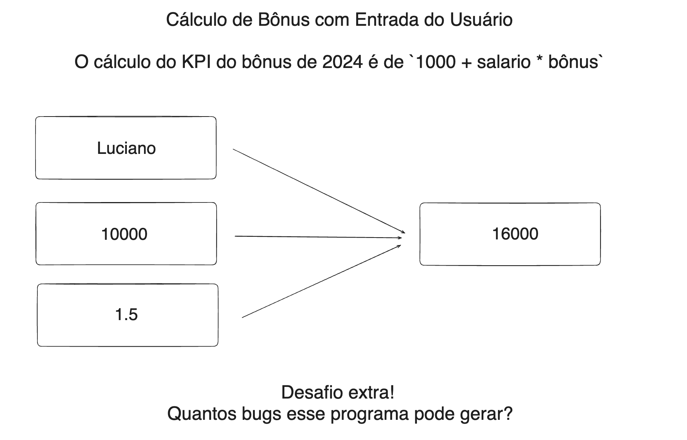

```python
!python --version
```

    Python 3.11.3


# Aula 01:

##  Cálculo de Bônus com Entrada do Usuário

### Escreva um programa em Python que solicita ao usuário para digitar seu nome, o valor do seu salário mensal e o valor do bônus que recebeu. O programa deve, então, imprimir uma mensagem saudando o usuário pelo nome e informando o valor do salário em comparação com o bônus recebido.





```python
# 1) Solicita ao usuário que digite seu nome
nome = str(input("Digite seu Nome:"))
# 2) Solicita ao usuário que digite o valor do seu salário
# Converte a entrada para um número de ponto flutuante
salary = float(input("Digite o valor do salario mensal:"))
# 3) Solicita ao usuário que digite o valor do bônus recebido
# Converte a entrada para um número de ponto flutuante
bonus = float(input("Digite o valor do seu Bônus:"))
# 4) Calcule o valor do bônus final
kpi_bonus = 1000 + salary * bonus
# 5) Imprima cálculo do KPI para o usuário
print(f"O cálculo do bônus: 1000 + salario + bonus = R$ {kpi_bonus:,.2f}.\n")
# 6) Imprime a mensagem personalizada incluindo o nome do usuário, salário e bônus
print(f"Olá {nome}, considerando seu salário de: R$ {salary:,.2f}, o total com bônus é de R$ {kpi_bonus:,.2f}.\n")
# Bônus: Quantos bugs e riscos você consegue identificar nesse programa?
'''
1. Não existe nenhuma excecão para incluir qualquer valor na variável nome.
2. Salário e Bônus aceitam valores negativos.
3. Bug detectado ao inserir um valor tipo string nos campos salário e bônus.
'''
```

    Digite seu Nome: Julio Okuda
    Digite o valor do salario mensal: 5000
    Digite o valor do seu Bônus: 1.5


    O cálculo do bônus: 1000 + salario + bonus = R$ 8,500.00.
    
    Olá Julio Okuda, considerando seu salário de: R$ 5,000.00, o total com bônus é de R$ 8,500.00.
    


### Bônus: Quantos bugs e riscos você consegue identificar nesse programa?

#### Criando uma função para facilitar as verificações.


```python
def calcula_kpi_bonus():
    # 1) Solicita ao usuário que digite seu nome
    nome = str(input("Digite seu Nome:"))
    # 2) Solicita ao usuário que digite o valor do seu salário
    # Converte a entrada para um número de ponto flutuante
    salary = float(input("Digite o valor do salario mensal:"))
    # 3) Solicita ao usuário que digite o valor do bônus recebido
    # Converte a entrada para um número de ponto flutuante
    bonus = float(input("Digite o valor do seu Bônus:"))
    # 4) Calcule o valor do bônus final
    kpi_bonus = 1000 + salary * bonus
    # 5) Imprima cálculo do KPI para o usuário
    msg_kpi = print(f"O cálculo do bônus: 1000 + salario + bonus = R$ {kpi_bonus:,.2f}.\n")
    # 6) Imprime a mensagem personalizada incluindo o nome do usuário, salário e bônus
    msg= print(f"Olá {nome}, considerando seu salário de: R$ {salary:,.2f}, o total com bônus é de R$ {kpi_bonus:,.2f}.\n")
    return msg_kpi, msg
```

#### Realizando alguns testes para encontrar possíveis falhas:


```python
count_error = 0
erro = []
while True:
    sair = input("Digite 'sair' para terminar os testes ou tecle enter para continuar: ")
    if sair.lower() == 'sair':
            break
    try:
        calcula_kpi_bonus()
    except Exception as e:
        erro.append(e)
        count_error +=1
        continue
print(f"Total de bugs encontrados: {count_error}")
print(f"erros encontrados: {erro}")
        
```

    Digite 'sair' para terminar os testes ou tecle enter para continuar:  
    Digite seu Nome: Julio
    Digite o valor do salario mensal: 
    Digite 'sair' para terminar os testes ou tecle enter para continuar:  
    Digite seu Nome: Julio
    Digite o valor do salario mensal: .
    Digite 'sair' para terminar os testes ou tecle enter para continuar:  
    Digite seu Nome: 
    Digite o valor do salario mensal: -100
    Digite o valor do seu Bônus: -1.5


    O cálculo do bônus: 1000 + salario + bonus = R$ 1,150.00.
    
    Olá , considerando seu salário de: R$ -100.00, o total com bônus é de R$ 1,150.00.
    


    Digite 'sair' para terminar os testes ou tecle enter para continuar:  Julio
    Digite seu Nome: Julio
    Digite o valor do salario mensal: 10000
    Digite o valor do seu Bônus: .
    Digite 'sair' para terminar os testes ou tecle enter para continuar:  sair


    Total de bugs encontrados: 3
    erros encontrados: [ValueError("could not convert string to float: ''"), ValueError("could not convert string to float: '.'"), ValueError("could not convert string to float: '.'")]


### Alguns erros encontrados:
* **Não existe nenhuma excecão para incluir qualquer valor na variável nome.**
* **Salário e Bônus aceitam valores negativos.**
* **Bug detectado ao inserir um valor tipo string nos campos salário e bônus.**
    

#### 6) Salve esse script python como kpi.py


```python
# Criando o diretório para salvar o código.
!mkdir aula_01/src
```

* **Salvando o código no arquivo kpi.py**


```python
%%writefile -a aula_01/src/kpi.py
# 1) Solicita ao usuário que digite seu nome
nome = str(input("Digite seu Nome:"))
# 2) Solicita ao usuário que digite o valor do seu salário
# Converte a entrada para um número de ponto flutuante
salary = float(input("Digite o valor do salario mensal:"))
# 3) Solicita ao usuário que digite o valor do bônus recebido
# Converte a entrada para um número de ponto flutuante
bonus = float(input("Digite o valor do seu Bônus:"))
# 4) Calcule o valor do bônus final
kpi_bonus = 1000 + salary * bonus
# 5) Imprima cálculo do KPI para o usuário
print(f"O cálculo do bônus: 1000 + salario + bonus = R$ {kpi_bonus:,.2f}.\n")
# 6) Imprime a mensagem personalizada incluindo o nome do usuário, salário e bônus
print(f"Olá {nome}, considerando seu salário de: R$ {salary:,.2f}, o total com bônus é de R$ {kpi_bonus:,.2f}.\n")
# Bônus: Quantos bugs e riscos você consegue identificar nesse programa?
'''
1. Não existe nenhuma excecão para incluir qualquer valor na variável nome.
2. Salário e Bônus aceitam valores negativos.
3. Bug detectado ao inserir um valor tipo string nos campos salário e bônus.
'''
```

    Writing aula_01/src/kpi.py


#### 7) Faça uma documentação simples de como executar esse programa, utilize o README

* **Salvando o código markdown no arquivo README.md.**


```python
%%writefile -a aula_01/README.md
#  Cálculo de Bônus com Entrada do Usuário

## Escreva um programa em Python que solicita ao usuário para digitar seu nome, o valor do seu salário mensal e o valor do bônus que recebeu. O programa deve, então, imprimir uma mensagem saudando o usuário pelo nome e informando o valor do salário em comparação com o bônus recebido.


## Execução do Programa KPI

*
Este programa calcula o bônus total de um usuário com base em seu salário percentual de bônus recebidos
#
## Como Executar

1. Certifique-se de ter o Python instalado em sua máq
* Este projeto utilizar a versão 3.11.3 do python.
* uina. Você pode baixar e instalar a v3cente do Python em [python.org](https://www.python.org/).

2. Clone ou baixe este repositório em sua máquin

`git clone https://github.com/Jcnok/bootcamp-jornada-de-dados_2024.git`a local.

3. Navegue até o diretório onde o arquivo 'kpi.py' está localizado. O arquivo 'kpi.py' está localizado em 'aula_01/s./
kpi.py'.

4. Abra um terminal no diretór

`$ cd aula_01/src`io 'kpi.py'.

5. Execute o seguintem$ python kpi.pya

6. Siga as instruções exibidas no terminal:
* Digite seu nome: exemplo -> Julio
* Digite o valor do seu salário: exemplo -> 5000
* Digite o percentual do seu bônus: exemplo -> 1.2

* Após inserir os valores, o programa calculará o bônus total e imprimirá uma mensagem personalizada para o usuário, incluindo o nome, salário e bônus.*
   

   ```bash
`

## Alguns erros encontrados:
* **Não existe nenhuma excecão para incluir qualquer valor na variável nome.**
* **Salário e Bônus aceitam valores negativos.**
* **Bug detectado ao inserir um valor tipo string nos campos salá python kpi.py

```

    Writing aula_01/README.md


#### 8) Salve no Git e no Github


```python
!git status
```

    On branch main
    Your branch is up to date with 'origin/main'.
    
    Untracked files:
      (use "git add <file>..." to include in what will be committed)
    	.python-version
    	aula01.ipynb
    	aula_01/
    	pyproject.toml
    
    nothing added to commit but untracked files present (use "git add" to track)


```python
!git add . 
```


```python
!git commit -m "desafios aula 01 concluído!"
```

    [main cb9e446] desafios aula 01 concluído!
     9 files changed, 498 insertions(+)
     create mode 100644 .python-version
     create mode 100644 aula01.ipynb
     create mode 100644 aula_01/README.md
     create mode 100644 aula_01/img/pic.png
     create mode 100644 aula_01/img/pic.png:Zone.Identifier
     create mode 100644 aula_01/img/pic2.png
     create mode 100644 aula_01/img/pic2.png:Zone.Identifier
     create mode 100644 aula_01/src/kpi.py
     create mode 100644 pyproject.toml


```python
!git push
```

    Enumerating objects: 14, done.
    Counting objects: 100% (14/14), done.
    Delta compression using up to 24 threads
    Compressing objects: 100% (10/10), done.
    Writing objects: 100% (13/13), 192.39 KiB | 10.69 MiB/s, done.
    Total 13 (delta 1), reused 0 (delta 0), pack-reused 0
    remote: Resolving deltas: 100% (1/1), done.
    To https://github.com/Jcnok/bootcamp-jornada-de-dados_2024.git
       15110c7..cb9e446  main -> main


# Aula 02: TypeError, Type Check, Type Conversion, try-except e if

### Exercícios

#### Inteiros (`int`)

1. Escreva um programa que soma dois números inteiros inseridos pelo usuário.
2. Crie um programa que receba um número do usuário e calcule o resto da divisão desse número por 5.
3. Desenvolva um programa que multiplique dois números fornecidos pelo usuário e mostre o resultado.
4. Faça um programa que peça dois números inteiros e imprima a divisão inteira do primeiro pelo segundo.
5. Escreva um programa que calcule o quadrado de um número fornecido pelo usuário.

#### Números de Ponto Flutuante (`float`)

6. Escreva um programa que receba dois números flutuantes e realize sua adição.
7. Crie um programa que calcule a média de dois números flutuantes fornecidos pelo usuário.
8. Desenvolva um programa que calcule a potência de um número (base e expoente fornecidos pelo usuário).
9. Faça um programa que converta a temperatura de Celsius para Fahrenheit.
10. Escreva um programa que calcule a área de um círculo, recebendo o raio como entrada.

#### Strings (`str`)

11. Escreva um programa que receba uma string do usuário e a converta para maiúsculas.
12. Crie um programa que receba o nome completo do usuário e imprima o nome com todas as letras minúsculas.
13. Desenvolva um programa que peça ao usuário para inserir uma frase e, em seguida, imprima esta frase sem espaços em branco no início e no final.
14. Faça um programa que peça ao usuário para digitar uma data no formato "dd/mm/aaaa" e, em seguida, imprima o dia, o mês e o ano separadamente.
15. Escreva um programa que concatene duas strings fornecidas pelo usuário.

#### Booleanos (`bool`)

16. Escreva um programa que avalie duas expressões booleanas inseridas pelo usuário e retorne o resultado da operação AND entre elas.
17. Crie um programa que receba dois valores booleanos do usuário e retorne o resultado da operação OR.
18. Desenvolva um programa que peça ao usuário para inserir um valor booleano e, em seguida, inverta esse valor.
19. Faça um programa que compare se dois números fornecidos pelo usuário são iguais.
20. Escreva um programa que verifique se dois números forneci
21. Escreva um programa que converta a temperatura de Celsius para Fahrenheit. O programa deve solicitar ao usuário a temperatura em Celsius e, utilizando try-except, garantir que a entrada seja numérica, tratando qualquer ValueError. Imprima o resultado em Fahrenheit ou uma mensagem de erro se a entrada não for válida.
22. Crie um programa que verifica se uma palavra ou frase é um palíndromo (lê-se igualmente de trás para frente, desconsiderando espaços e pontuações). Utilize try-except para garantir que a entrada seja uma string. Dica: Utilize a função isinstance() para verificar o tipo da entrada.
23. Desenvolva uma calculadora simples que aceite duas entradas numéricas e um operador (+, -, *, /) do usuário. Use try-except para lidar com divisões por zero e entradas não numéricas. Utilize if-elif-else para realizar a operação matemática baseada no operador fornecido. Imprima o resultado ou uma mensagem de erro apropriada.
24. Escreva um programa que solicite ao usuário para digitar um número. Utilize try-except para assegurar que a entrada seja numérica e utilize if-elif-else para classificar o número como "positivo", "negativo" ou "zero". Adicionalmente, identifique se o número é "par" ou "ímpar".
25. Crie um script que solicite ao usuário uma lista de números separados por vírgula. O programa deve converter a string de entrada em uma lista de números inteiros. Utilize try-except para tratar a conversão de cada número e validar que cada elemento da lista convertida é um inteiro. Se a conversão falhar ou um elemento não for um inteiro, imprima uma mensagem de erro. Se a conversão for bem-sucedida para todos os elementos, imprima a lista de inteiros.dos pelo usuário são diferentes.

### Exercícios Resolução


1. Escreva um programa que soma dois números inteiros inseridos pelo usuário.


```python
print("="*5,"Cálculo da soma de dois números inteiros","="*5)
n1 = int(input("digite um número inteiro:"))
n2 = int(input("digito um segundo número inteiro:"))
soma = n1 + n2
print(f"A soma dos dois números é: {soma}")
```

    ===== Cálculo da soma de dois números inteiros =====


    digite um número inteiro: 10
    digito um segundo número inteiro: 14


    A soma dos dois números é: 24


2. Crie um programa que receba um número do usuário e calcule o resto da divisão desse número por 5.


```python
print("="*5,"Cálculo do resto da divisão de um número por 5","="*5)
n1 = int(input("digite um número inteiro:"))
divisor = 5 
resto = n1 % divisor
print(f"O resto da divisão do número por 5 é:{resto}")
```

    ===== Cálculo do resto da divisão de um número por 5 =====


    digite um número inteiro: 6


    O resto da divisão do número por 5 é:1


3. Desenvolva um programa que multiplique dois números fornecidos pelo usuário e mostre o resultado.


```python
print("="*5,"Cálculo o produto de dois números inteiros","="*5)
n1 = int(input("digite um número inteiro:"))
n2 = int(input("digito um segundo número inteiro:"))
soma = n1 * n2
print(f"O produto dos dois números é: {soma}")
```

    ===== Cálculo o produto de dois números inteiros =====


    digite um número inteiro: 4
    digito um segundo número inteiro: 2


    O produto dos dois números é: 8


4. Faça um programa que peça dois números inteiros e imprima a divisão inteira do primeiro pelo segundo.
   


```python
print("="*5,"Cálculo o quociente de dois números inteiros","="*5)
dividendo = int(input("digite um número inteiro para o dividendo:"))
divisor = int(input("digito um número inteiro para o divisor:"))
quociente = n1 // n2
print(f"O quociente é: {quociente}")
```

    ===== Cálculo o quociente de dois números inteiros =====


    digite um número inteiro para o dividendo: 9
    digito um número inteiro para o divisor: 2


    O quociente é: 2


5. Escreva um programa que calcule o quadrado de um número fornecido pelo usuário.
   


```python
print("="*5,"Cálculo do quadrado de um número","="*5)
num = int(input("digite um número inteiro para calcular quadrado:"))
quadrado = num ** 2
print(f"O quadrado do número é: {quadrado}")
```

    ===== Cálculo do quadrado de um número =====


    digite um número inteiro para calcular quadrado: 3


    O quadrado do número é: 9


6. Escreva um programa que receba dois números flutuantes e realize sua adição.


```python
print("="*5,"Cálculo da soma de dois números floats","="*5)
n1 = float(input("digite um número floats:"))
n2 = float(input("digito um segundo número floats:"))
soma = n1 + n2
print(f"A soma dos dois números é: {soma}")
```

    ===== Cálculo da soma de dois números floats =====


    digite um número floats: 4.5
    digito um segundo número floats: 5.7


    A soma dos dois números é: 10.2


7. Crie um programa que calcule a média de dois números flutuantes fornecidos pelo usuário.


```python
print("="*5,"Cálculo da média de dois números floats","="*5)
n1 = float(input("digite um número floats:"))
n2 = float(input("digito um segundo número floats:"))
media = (n1 + n2) / 2
print(f"A média dos dois números é: {media}")
```

    ===== Cálculo da média de dois números floats =====


    digite um número floats: 5.5
    digito um segundo número floats: 6.6


    A média dos dois números é: 6.05


8. Desenvolva um programa que calcule a potência de um número (base e expoente fornecidos pelo usuário).


```python
print("="*5,"Cálculo da potência de um número","="*5)
base = int(input("digite um número inteiro para base:"))
expoente = int(input("digite um número inteiro para o expoente:"))
potencia = base ** expoente
print(f"O resultado da potência é: {potencia}")
```

    ===== Cálculo da potência de um número =====


    digite um número inteiro para base: 10
    digite um número inteiro para o expoente: 6


    O resultado da potência é: 1000000


9. Faça um programa que converta a temperatura de Celsius para Fahrenheit.


```python
print("="*5,"Cálculo da conversão de Celsius para fahrenheit","="*5)
celsius = float(input("digite um número em graus ceusius:"))
fahrenheit = celsius * 1.8 + 32
print(f"{celsius} Graus Celsius equivale a: {round(fahrenheit,2)} graus fahrenheit")
```

    ===== Cálculo da conversão de Celsius para fahrenheit =====


    digite um número em graus ceusius: 37


    37.0 Graus Celsius equivale a: 98.6 graus fahrenheit


10. Escreva um programa que calcule a área de um círculo, recebendo o raio como entrada.


```python
print("="*5,"Cálculo da área de um círculo","="*5)
raio = float(input("digite o valor do raio do círculo:"))
pi = 3.14
area = pi * raio ** 2
print(f"a área do circulo é:{round(area,2)}")
```

    ===== Cálculo da área de um círculo =====


    digite o valor do raio do círculo: 3


    a área do circulo é:28.26


11. Escreva um programa que receba uma string do usuário e a converta para maiúsculas.


```python
print("="*5,"Converte em Maipuscula","="*5)
string = str(input("digite um nome qualquer:"))
string_maiuscula = string.upper()
print(f"resultado:{string_maiuscula}")
```

    ===== Converte uma string em Maipuscula =====


    digite um nome qualquer: julio


    resultado:JULIO


12. Crie um programa que receba o nome completo do usuário e imprima o nome com todas as letras minúsculas.


```python
print("="*5,"Converte em minúscula","="*5)
string = str(input("digite seu nome completo:"))
string_minuscula = string.lower()
print(f"resultado:{string_minuscula}")
```

    ===== Converte em minúscula =====


    digite seu nome completo: Julio César Okuda


    resultado:julio césar okuda


13. Desenvolva um programa que peça ao usuário para inserir uma frase e, em seguida, imprima esta frase sem espaços em branco no início e no final.


```python
print("-"*5,"Remove espaços no início e final de uma frase.", "-"*5)
frase = str(input("Insira uma frase com espaço no início e final:"))
frase_sem_espaco = frase.strip()
print(frase_sem_espaco)
```

    ----- Remove espaços no início e final de uma frase. -----


    Insira uma frase com espaço no início e final:  Hoje está um dia chuvoso 


    Hoje está um dia chuvoso


14. Faça um programa que peça ao usuário para digitar uma data no formato "dd/mm/aaaa" e, em seguida, imprima o dia, o mês e o ano separadamente.


```python
print("-"*5,"Imprime o dia, mês e ano separadamente","-"*5)
data = str(input("digite uma data no formato 'dd/mm/aaaa':"))
dia, mes, ano = data.split("/")
print(f"dia:{dia}\nmês:{mes}\nano:{ano}")

```

    ----- Imprime o dia, mês e ano separadamente -----


    digite uma data no formato 'dd/mm/aaaa': 11/06/1979


    dia:11
    mês:06
    ano:1979


15. Escreva um programa que concatene duas strings fornecidas pelo usuário.
    


```python
print("-"*5,"Concatena duas strings.","-"*5) 
str1 = str(input("digite uma palavra qualquer:"))
str2 = str(input("digite uma segunda palavra:")) 
concatena = " ".join([str1,str2])
print(f"As duas palavras foram concatenadas:{concatena}")
```

    ----- Concatena duas strings. -----


    digite uma palavra qualquer: learning
    digite uma segunda palavra: python


    As duas palavras foram concatenadas:learning python


16. Escreva um programa que avalie duas expressões booleanas inseridas pelo usuário e retorne o resultado da operação AND entre elas.


```python
print("-"*5,"compara boleanos com AND","-"*5) 
bool1 = input("insira 'True' ou 'False':").lower()
bool2 = input("insira um segundo 'True' ou 'False' para comparação:").lower()
resultado = bool1 and bool2
print(f"O resultado de {bool1} and {bool2} é: {resultado}!")
```

    ----- compara boleanos com AND -----


    insira 'True' ou 'False': true
    insira um segundo 'True' ou 'False' para comparação: false


    O resultado de true and false é: false!


17. Crie um programa que receba dois valores booleanos do usuário e retorne o resultado da operação OR.


```python
print("-"*5,"compara boleanos com OR","-"*5) 
bool1 = input("insira 'True' ou 'False':").lower()
bool2 = input("insira um segundo 'True' ou 'False' para comparação:").lower()
resultado = bool1 or bool2
print(f"O resultado de {bool1} or {bool2} é: {resultado}!")
```

    ----- compara boleanos com OR -----


    insira 'True' ou 'False': TRUE
    insira um segundo 'True' ou 'False' para comparação: False


    O resultado de true or false é: true!


18. Desenvolva um programa que peça ao usuário para inserir um valor booleano e, em seguida, inverta esse valor.


```python
print("-"*5,"inverte boleano","-"*5) 
valor = input("insira 'True' ou 'False':").lower()
if valor == 'true':
    booleano = True
else:
    booleano = False

booleano_invertido = not booleano
print(f"O resultado de {booleano} invertido é: {booleano_invertido}!")
```

    ----- inverte boleano -----


    insira 'True' ou 'False': false


    O resultado de False invertido é: True!


19. Faça um programa que compare se dois números fornecidos pelo usuário são iguais.


```python
print("-"*5,"compara se 2 números são iguais","-"*5) 
val1 = int(input("insira o primeiro valor':"))
val2 = int(input("insira um segundo valor para comparação:"))
resultado = val1 == val2 
print(f" O resultado da comparação da igualdade entre {val1} e {val2} é:{resultado}")
```

    ----- compara se 2 números são iguaisR -----


    insira o primeiro valor': 123
    insira um segundo valor para comparação: 213


     O resultado da comparação entre 123 e 213 é:False


20. Escreva um programa que verifique se dois números fornecidos pelo usuário são diferentes.


```python
print("-"*5,"compara se 2 números são diferentes","-"*5) 
val1 = int(input("insira o primeiro valor':"))
val2 = int(input("insira um segundo valor para comparação:"))
resultado = val1 != val2 
print(f" O resultado da comparação da diferença entre {val1} e {val2} é:{resultado}")
```

    ----- compara se 2 números são diferentes -----


    insira o primeiro valor': 123
    insira um segundo valor para comparação: 321


     O resultado da comparação da diferença entre 123 e 321 é:True


21. Escreva um programa que converta a temperatura de Celsius para Fahrenheit. O programa deve solicitar ao usuário a temperatura em Celsius e, utilizando try-except, garantir que a entrada seja numérica, tratando qualquer ValueError. Imprima o resultado em Fahrenheit ou uma mensagem de erro se a entrada não for válida.


```python
print("="*5,"Cálculo da conversão de Celsius para fahrenheit","="*5)
try:
    celsius = float(input("digite um número em graus celsius:"))
    fahrenheit = celsius * 1.8 + 32
    print(f"{celsius} Graus Celsius equivale a: {round(fahrenheit,2)} graus fahrenheit")
except ValueError:
    print("Digite um número válido para temperatura!")
```

    ===== Cálculo da conversão de Celsius para fahrenheit =====


    digite um número em graus celsius: 20 graus


    Digite um número válido para temperatura!


22. Crie um programa que verifica se uma palavra ou frase é um palíndromo (lê-se igualmente de trás para frente, desconsiderando espaços e pontuações). Utilize try-except para garantir que a entrada seja uma string. Dica: Utilize a função isinstance() para verificar o tipo da entrada.


```python
print("="*5,"Verifica se uma palavra ou frase é um palíndromo","="*5)
try:
    texto = input("insira uma frase ou palavra':")     
    #convertendo todo o texto em minúsculo
    texto = texto.lower()
    #Iterando sobre o texto para remover pontuações e espaços
    texto = ''.join([x for x in texto if x.isalnum()])
    #Verifica se a frase é um palíndromo
    resposta = texto == texto[::-1]   
    if resposta:
        print("o texto é um palíndromo!")
    else:
        print("o textto não é um palíndromo!")
except ValueError:
    print("entrada inválida")
    
    
```

    ===== Verifica se uma palavra ou frase é um palíndromo =====


    insira uma frase ou palavra': Anotaram a data da maratona?


    o texto é um palíndromo!


23. Desenvolva uma calculadora simples que aceite duas entradas numéricas e um operador (+, -, *, /) do usuário. Use try-except para lidar com divisões por zero e entradas não numéricas. Utilize if-elif-else para realizar a operação matemática baseada no operador fornecido. Imprima o resultado ou uma mensagem de erro apropriada.


```python
print("="*5,"Calculadora Simples","="*5)
while True:
    try:
        num1 = float(input("Digite o primeiro número: "))
        operador = input("Digite o operador (+, -, *, /): ")
        num2 = float(input("Digite o segundo número: "))
                
        if operador == '+':
             resultado = num1 + num2
        elif operador == '-':
             resultado = num1 - num2
        elif operador == '*':
             resultado = num1 * num2
        elif operador == '/':
             resultado = num1 / num2
        else:
            raise ValueError("Operador inválido.")
            
        print("Resultado:", resultado)
        break
        
    except ValueError as ve:
        print("Erro:", ve)
        print("Certifique-se de que os números são válidos e o operador é válido.")
    except ZeroDivisionError as zde:
        print("Erro:", zde)
        print("Não é possível dividir por zero. Tente novamente.")


```

    ===== Calculadora Simples =====


    Digite o primeiro número:  2
    Digite o operador (+, -, *, /):  -2
    Digite o segundo número:  2


    Erro: Operador inválido.
    Certifique-se de que os números são válidos e o operador é válido.


    Digite o primeiro número:  2
    Digite o operador (+, -, *, /):  0
    Digite o segundo número:  2


    Erro: Operador inválido.
    Certifique-se de que os números são válidos e o operador é válido.


    Digite o primeiro número:  2
    Digite o operador (+, -, *, /):  -
    Digite o segundo número:  2


    Resultado: 0.0


24. Escreva um programa que solicite ao usuário para digitar um número. Utilize try-except para assegurar que a entrada seja numérica e utilize if-elif-else para classificar o número como "positivo", "negativo" ou "zero". Adicionalmente, identifique se o número é "par" ou "ímpar".


```python
try:
    numero = int(input("digite um número inteiro:"))
    if numero == 0:
        print("o número é zero")
    elif numero < 0: 
        print("o número é negativo")
    else:
        print("o número é positivo")
    resto = numero % 2
    if resto == 0:
        print(f"o número é par")
    else:
        print(f"o número é impar")    

except ValueError as e:
    print(e)
    print("Certifique-se de que o número inserido é do tipo inteiro.")
```

    digite um número inteiro: 5


    o número é positivo
    o número é impar


25. Crie um script que solicite ao usuário uma lista de números separados por vírgula. O programa deve converter a string de entrada em uma lista de números inteiros. Utilize try-except para tratar a conversão de cada número e validar que cada elemento da lista convertida é um inteiro. Se a conversão falhar ou um elemento não for um inteiro, imprima uma mensagem de erro. Se a conversão for bem-sucedida para todos os elementos, imprima a lista de inteiros.


```python
try:

    lista = input("digite uma sequência de números separado por vírgula:")
    lista_ok = [int(x) for x in lista.split(',')]
    print(f"lista dos números inteiros: {lista_ok}")

except ValueError as e:
    print(e)
    print("Digite uma sequência de números inteiros válidos separado por vírgula")
```

    digite uma sequência de números separado por vírgula: 2, 3  , 4,  5


    lista dos números inteiros: [2, 3, 4, 5]


```python
import os
```


```python
os.getcwd()
```


    '/home/jcnok/bootcamps/bootcamp-jornada-de-dados_2024'


```python
!mkdir aula_02
!mkdir aula_02/src
```

    mkdir: cannot create directory ‘aula_02’: File exists


```python

```

## Aula 03:

# Aula 03: DEBUG, IF, FOR, While, Listas e Dicionários em Python


```python

```
